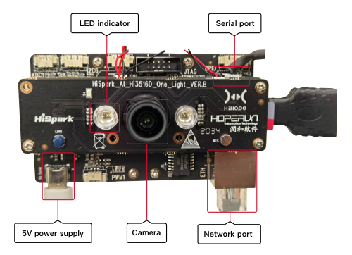

# Introduction to the Hi3516 Development Board

## Hi3516

Hi3516DV300 is a next-generation SoC \(System on Chip\) designed for the industry-dedicated smart HD IP camera. It introduces a next-generation ISP, the latest H.265 video compression encoder, and a high-performance NNIE engine, leading the industry in terms of low bit rate, high image quality, intelligent processing and analysis, and low power consumption.

**Figure  1**  Front view of the Hi3516 board  

## Development Board Specifications

**Table  1**  Specifications of the Hi3516 development board

<table><thead align="left"><tr id="row10171198194310"><th class="cellrowborder" valign="top" width="14.77%" id="mcps1.2.3.1.1">
Type

</th>
<th class="cellrowborder" valign="top" width="85.22999999999999%" id="mcps1.2.3.1.2">
Specification

</th>
</tr>
</thead>
<tbody><tr id="row0171168114311"><td class="cellrowborder" valign="top" width="14.77%" headers="mcps1.2.3.1.1 ">
Processor and internal memory

</td>
<td class="cellrowborder" valign="top" width="85.22999999999999%" headers="mcps1.2.3.1.2 "><ul id="ul1147113537186"><li>Hi3516DV300</li><li>DDR3 1GB</li><li>8 GB eMMC4.5</li></ul>
</td>
</tr>
<tr id="row21721687435"><td class="cellrowborder" valign="top" width="14.77%" headers="mcps1.2.3.1.1 ">
External components

</td>
<td class="cellrowborder" valign="top" width="85.22999999999999%" headers="mcps1.2.3.1.2 "><ul id="ul179543016208"><li>Ethernet port</li><li>Audio and video<ul id="ul5941311869"><li>One voice input</li><li>One mono (AC_L) output, connected to a 3 W power amplifier (LM4871)</li><li>MicroHDMI (one HDMI 1.4)</li></ul>
</li><li>Camera<ul id="ul924263620"><li>Sensor IMX335</li><li>M12 lens with a focal length of 4 mm and an aperture of 1.8</li></ul>
</li><li>Display<ul id="ul101471711667"><li>2.35-inch LCD connector</li><li>5.5-inch LCD connector</li></ul>
</li><li>External components and interfaces<ul id="ul089255556"><li>microSD card interface</li><li>JTAG/I2S interface</li><li>ADC interface</li><li>Steer gear interface</li><li>Grove connector</li><li>USB2.0(Type C)</li><li>Three function keys: two custom keys and one update key</li><li>LED indicator (including green and red)</li></ul>
</li></ul>
</td>
</tr>
</tbody>
</table>

