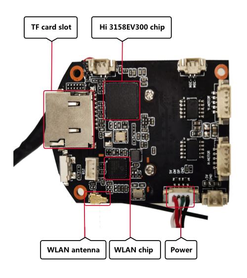

# Introduction to the Hi3518 Development Board

## Hi3518

Hi3518EV300 is a next-generation SoC \(System on Chip\) designed for the industry-dedicated smart HD IP camera. It introduces a next-generation image signal processor ISP, the latest H.265 video compression encoder, and the advanced low-power process and architecture design, leading the industry in terms of low bit rate, high image quality, and low power consumption.

**Figure  1**  Front view of the Hi3518EV300 board  

**Figure  2**  Rear view of the Hi3518EV300 board  

## Development Board Specifications

**Table  1**  Specifications of the Hi3518 development board

<table><thead align="left"><tr id="r7d87cdc7a09d445c824000228ae4a3b0"><th class="cellrowborder" valign="top" width="28.749999999999996%" id="mcps1.2.3.1.1">
<strong id="b18619196194114">Type</strong>

</th>
<th class="cellrowborder" valign="top" width="71.25%" id="mcps1.2.3.1.2">
<strong id="b591334418397">Description</strong>

</th>
</tr>
</thead>
<tbody><tr id="r9c0a0b643fd7495ab799c1eab9fbe1ec"><td class="cellrowborder" valign="top" width="28.749999999999996%" headers="mcps1.2.3.1.1 ">
Processor core

</td>
<td class="cellrowborder" valign="top" width="71.25%" headers="mcps1.2.3.1.2 "><ul id="ul12459548104218"><li>Hi3518EV300</li></ul>
</td>
</tr>
<tr id="row1527851224210"><td class="cellrowborder" valign="top" width="28.749999999999996%" headers="mcps1.2.3.1.1 ">
Imaging device

</td>
<td class="cellrowborder" valign="top" width="71.25%" headers="mcps1.2.3.1.2 "><ul id="ul49841342134210"><li>1/2.9 F23</li></ul>
</td>
</tr>
<tr id="r79097125b7f64c189f67ac280cdacae9"><td class="cellrowborder" valign="top" width="28.749999999999996%" headers="mcps1.2.3.1.1 ">
External interfaces

</td>
<td class="cellrowborder" valign="top" width="71.25%" headers="mcps1.2.3.1.2 "><ul id="u6a04d9aa22f6410f91bbcdaf902d0e5f"><li>External microphone</li><li>External 8 Ω/1.5 W speaker</li></ul>
</td>
</tr>
<tr id="r785d104d71f6426aa9aab25d14a7581b"><td class="cellrowborder" valign="top" width="28.749999999999996%" headers="mcps1.2.3.1.1 ">
External memory interface

</td>
<td class="cellrowborder" valign="top" width="71.25%" headers="mcps1.2.3.1.2 "><ul id="u8f323b7322a14e109e2937b9660af0c4"><li>TF card
A maximum file size of 128 GB is allowed (FAT32 format).

</li></ul>
</td>
</tr>
<tr id="rae3f8ef812894db3951e01b4a1b85438"><td class="cellrowborder" valign="top" width="28.749999999999996%" headers="mcps1.2.3.1.1 ">
WLAN protocol

</td>
<td class="cellrowborder" valign="top" width="71.25%" headers="mcps1.2.3.1.2 "><ul id="ul1311935314215"><li>802.11 b/g/n</li></ul>
</td>
</tr>
</tbody>
</table>

