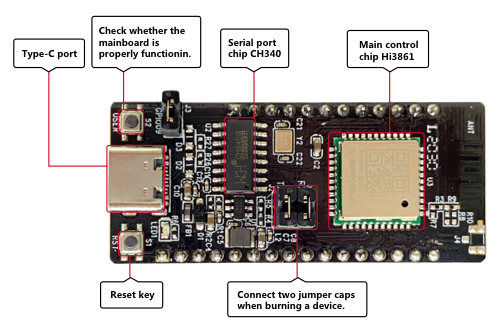
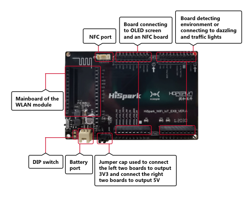

# Introduction to the Hi3861 Development Board

This document describes how to quickly start with the Hi3861 WLAN module, including the development environment setup, version compiling and building, device burning, source code modification, debugging and verification. Following this guide, you can start developing services with the basic understanding of the Hi3861 WLAN module.

## Hi3861

The Hi3861 WLAN module is a development board with 2 x 5 cm form factor. It contains a 2.4 GHz WLAN SoC chip that highly integrates the IEEE 802.11b/g/n baseband and radio frequency \(RF\) circuit. This module provides open and easy-to-use development and debugging environments for running OpenHarmony.

**Figure  1**  Appearance of Hi3861 WLAN module  

The Hi3861 WLAN module can also be connected to the Hi3861 mother board to expand its peripheral capabilities. The following figure shows the Hi3861 mother board.

**Figure  2**  Appearance of the Hi3861 mother board  

-   The RF circuit includes modules such as the power amplifier \(PA\), low noise amplifier \(LNA\), RF Balun, antenna switch, and power management. It supports a standard bandwidth of 20 MHz and a narrow bandwidth of 5 MHz or 10 MHz, and provides a maximum rate of 72.2 Mbit/s at the physical layer.
-   The Hi3861 WLAN baseband supports the orthogonal frequency division multiplexing \(OFDM\) technology and is backward compatible with the direct sequence spread spectrum \(DSSS\) and complementary code keying \(CCK\) technologies. In addition, the Hi3861 WLAN baseband supports various data rates complying with the IEEE 802.11 b/g/n protocol.
-   The Hi3861 chip integrates the high-performance 32-bit microprocessor, hardware security engine, and various peripheral interfaces. The peripheral interfaces include the Synchronous Peripheral Interface \(SPI\), Universal Asynchronous Receiver & Transmitter \(UART\), the Inter Integrated Circuit \(I2C\), Pulse Width Modulation \(PWM\), General Purpose Input/Output \(GPIO\) interface, and Analog to Digital Converter \(ADC\). The Hi3861 chip also supports the high-speed Secure Digital Input/Output \(SDIO\) 2.0 interface, with a maximum clock frequency of 50 MHz. This chip has a built-in static random access memory \(SRAM\) and flash memory, which can run programs independently or run from a flash drive.
-   The Hi3861 chip applies to Internet of Things \(IoT\) devices such as smart home appliances.

    **Figure  3**  Hi3861 functions  
    

    

## Resources and Constraints

As the Hi3861 only offers 2 MB Flash and 352 KB RAM, use them efficiently when compiling code.

## Development Board Specifications

**Table  1**  Hi3861 WLAN module specifications

<table><thead align="left"><tr id="r54b3810e43d24e1887c1d6a41394996b"><th class="cellrowborder" valign="top" width="18.02%" id="mcps1.2.3.1.1">
Type

</th>
<th class="cellrowborder" valign="top" width="81.98%" id="mcps1.2.3.1.2">
Description

</th>
</tr>
</thead>
<tbody><tr id="r71f534ea66af4191b020408df5978f41"><td class="cellrowborder" valign="top" width="18.02%" headers="mcps1.2.3.1.1 ">
General specifications

</td>
<td class="cellrowborder" valign="top" width="81.98%" headers="mcps1.2.3.1.2 "><ul id="u2a0d06f28d454d30818ced9a0432211b"><li>Operates over 1×1 2.4 GHz frequency band (ch1-ch14).</li><li>The physical layer (PHY) complies with the IEEE 802.11b/g/n protocol.</li><li>The media access control (MAC) layer complies with the IEEE802.11 d/e/h/i/k/v/w protocol.</li></ul>
<ul id="ul1452913133017"><li>Includes the built-in public address (PA) and local area network (LAN); integrates transmit-receive (Tx/Rx) switch and Balun. </li><li>Supports the station (STA) and access point (AP) modes. When the Hi3861 WLAN module functions as an AP, a maximum of six STAs are supported.</li><li>Supports WPA and WPA2 from WFA (personal), and WPS 2.0.</li><li>Supports three kinds of packet traffic arbiter (PTA) (2- , 3- , or 4-wire PTA), each of which coexists with the BT or BLE chip.</li><li>The input voltage ranges from 2.3 V to 3.6 V.</li></ul>
<ul id="ul15885141153113"><li>The input/output (I/O) power voltage can be 1.8 V or 3.3 V.</li></ul>
<ul id="ul128863113316"><li>Supports self-calibration for RF hardware.</li><li>Performs with low power consumption:<ul id="ul1588651114317"><li>Ultra deep sleep mode: 5 μA@3.3</li><li>VDTIM1: 1.5mA@3.3V</li><li>DTIM3: 0.8mA@3.3V</li></ul>
</li></ul>
</td>
</tr>
<tr id="rd9b56e759af34950b6887ca1bf5bb7cf"><td class="cellrowborder" valign="top" width="18.02%" headers="mcps1.2.3.1.1 ">
PHY features

</td>
<td class="cellrowborder" valign="top" width="81.98%" headers="mcps1.2.3.1.2 "><ul id="u6568aa052152432aa1f44372445ca634"><li>Supports all data rates of the single antenna required by the IEEE802.11b/g/n protocol.</li><li>Supports a maximum rate of 72.2 Mbit/s@HT20 MCS7.</li><li>Supports the standard bandwidth (20 MHz) and narrow bandwidth (5 MHz or 10 MHz).</li><li>Supports space-time block coding (STBC).</li><li>Supports short guard interval (Short-GI).</li></ul>
</td>
</tr>
<tr id="r3563f9df9759486794952d46c5d2d03f"><td class="cellrowborder" valign="top" width="18.02%" headers="mcps1.2.3.1.1 ">
MAC features

</td>
<td class="cellrowborder" valign="top" width="81.98%" headers="mcps1.2.3.1.2 "><ul id="uca57d799e7814925a5bf1b891335bd79"><li>Supports aggregate MAC service data unit (A-MPDU) and aggregate MAC protocol data unit (A-MSDU). </li><li>Supports block acknowledgment (Blk-ACK).</li><li>Supports quality of service (QoS), meeting customer's service requirements.</li></ul>
</td>
</tr>
<tr id="r3e1c86e5f6cd4df0a1b30a08fb8481a2"><td class="cellrowborder" valign="top" width="18.02%" headers="mcps1.2.3.1.1 ">
CPU subsystem

</td>
<td class="cellrowborder" valign="top" width="81.98%" headers="mcps1.2.3.1.2 "><ul id="u612cc2cd0cfe40229263c4f506c0c69c"><li>Integrates a high-performance 32-bit microprocessor with a maximum operating frequency of 160 MHz.</li><li>Includes built-in 352 KB SRAM and 288 KB ROM.</li><li>Includes a built-in 2 MB flash memory.</li></ul>
</td>
</tr>
<tr id="rae93c5236b084cd2a2c0d5c29027b40e"><td class="cellrowborder" valign="top" width="18.02%" headers="mcps1.2.3.1.1 ">
Peripheral interfaces

</td>
<td class="cellrowborder" valign="top" width="81.98%" headers="mcps1.2.3.1.2 "><ul id="u7c73ebffd89e4092bd65f0d878d59b22"><li>Include one SDIO interface, two SPI interfaces, two I2C interfaces, three UART interfaces, 15 GPIO interfaces, seven ADC inputs, six PWM interfaces, and one I2S interface (Note: These interfaces are all multiplexed.)</li><li>The frequency of the external primary crystal oscillator is 40 MHz or 24 MHz.</li></ul>
</td>
</tr>
<tr id="r18810701aafe42ad8d9a7d882730c210"><td class="cellrowborder" valign="top" width="18.02%" headers="mcps1.2.3.1.1 ">
Other information

</td>
<td class="cellrowborder" valign="top" width="81.98%" headers="mcps1.2.3.1.2 "><ul id="u25f28919a3b044c5af50f9f5f5616083"><li>Package: QFN-32, 5 mm x 5 mm</li><li>Operating temperature: –40&deg;C to +85&deg;C</li></ul>
</td>
</tr>
</tbody>
</table>

## Key Features

OpenHarmony provides a series of available capabilities based on the Hi3861 platform. The following table describes the available key components.

**Table  2**  Key components

<table><thead align="left"><tr id="row1368918486512"><th class="cellrowborder" valign="top" width="22.56%" id="mcps1.2.3.1.1">
Component

</th>
<th class="cellrowborder" valign="top" width="77.44%" id="mcps1.2.3.1.2">
Description

</th>
</tr>
</thead>
<tbody><tr id="row868910487517"><td class="cellrowborder" valign="top" width="22.56%" headers="mcps1.2.3.1.1 ">
wlan

</td>
<td class="cellrowborder" valign="top" width="77.44%" headers="mcps1.2.3.1.2 ">
Provides WLAN service, such as connecting to or disconnecting from a station or hotspot, and querying the state of a station or hotspot.

</td>
</tr>
<tr id="row568964819514"><td class="cellrowborder" valign="top" width="22.56%" headers="mcps1.2.3.1.1 ">
iot controller

</td>
<td class="cellrowborder" valign="top" width="77.44%" headers="mcps1.2.3.1.2 ">
Provides the capability of operating peripherals, including the I2C, I2S, ADC, UART, SPI, SDIO, GPIO, PWM and FLASH.

</td>
</tr>
<tr id="row143420119366"><td class="cellrowborder" valign="top" width="22.56%" headers="mcps1.2.3.1.1 ">
soft bus

</td>
<td class="cellrowborder" valign="top" width="77.44%" headers="mcps1.2.3.1.2 ">
Provides the capabilities of device discovery and data transmission in the distributed network.

</td>
</tr>
<tr id="row1383559163617"><td class="cellrowborder" valign="top" width="22.56%" headers="mcps1.2.3.1.1 ">
hichainsdk

</td>
<td class="cellrowborder" valign="top" width="77.44%" headers="mcps1.2.3.1.2 ">
Provides the capability of securely transferring data between devices when they are interconnected.

</td>
</tr>
<tr id="row54428163612"><td class="cellrowborder" valign="top" width="22.56%" headers="mcps1.2.3.1.1 ">
huks

</td>
<td class="cellrowborder" valign="top" width="77.44%" headers="mcps1.2.3.1.2 ">
Provides capabilities of key management, encryption, and decryption.

</td>
</tr>
<tr id="row12690548135110"><td class="cellrowborder" valign="top" width="22.56%" headers="mcps1.2.3.1.1 ">
system ability manager

</td>
<td class="cellrowborder" valign="top" width="77.44%" headers="mcps1.2.3.1.2 ">
Provides a unified OpenHarmony service development framework based on the service-oriented architecture.

</td>
</tr>
<tr id="row1657310121587"><td class="cellrowborder" valign="top" width="22.56%" headers="mcps1.2.3.1.1 ">
bootstrap

</td>
<td class="cellrowborder" valign="top" width="77.44%" headers="mcps1.2.3.1.2 ">
Provides the entry identifier for starting a system service. When the system service management is started, the function identified by <strong id="b1954132834115">bootstrap</strong> is called to start a system service.

</td>
</tr>
<tr id="row15763812165616"><td class="cellrowborder" valign="top" width="22.56%" headers="mcps1.2.3.1.1 ">
syspara

</td>
<td class="cellrowborder" valign="top" width="77.44%" headers="mcps1.2.3.1.2 ">
Provides capabilities of obtaining and setting system attributes.

</td>
</tr>
<tr id="row121911343566"><td class="cellrowborder" valign="top" width="22.56%" headers="mcps1.2.3.1.1 ">
utils

</td>
<td class="cellrowborder" valign="top" width="77.44%" headers="mcps1.2.3.1.2 ">
Provides basic and public capabilities, such as file operations and key-value (KV) storage management.

</td>
</tr>
<tr id="row144219192579"><td class="cellrowborder" valign="top" width="22.56%" headers="mcps1.2.3.1.1 ">
DFX

</td>
<td class="cellrowborder" valign="top" width="77.44%" headers="mcps1.2.3.1.2 ">
Provides the DFX capabilities, such as logging and printing.

</td>
</tr>
<tr id="row16159522125710"><td class="cellrowborder" valign="top" width="22.56%" headers="mcps1.2.3.1.1 ">
XTS

</td>
<td class="cellrowborder" valign="top" width="77.44%" headers="mcps1.2.3.1.2 ">
Provides a set of OpenHarmony certification test suites.

</td>
</tr>
</tbody>
</table>

