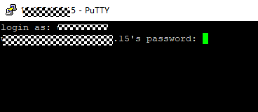

# Setting Up a Development Environment<a name="EN-US_TOPIC_0000001054781998"></a>

## Environment Requirements<a name="section466851916410"></a>

## Hardware<a name="section07318322310"></a>

-   Linux server
-   Windows workstation \(host computer\)
-   Hi3861 WLAN module
-   USB Type-C cable used to connect to Windows workstation and Hi3861 WLAN module

[Figure 1](#fa54d47112b684c65b3dbf1779413545a)  shows the hardware connections.

**Figure  1**  Hardware connections<a name="fig1651211924914"></a>  


## Software<a name="section182305581332"></a>

**Table  1**  Requirements on the development platform

<a name="tc50585b2b3fe43f7835154789b0e25af"></a>
<table><thead align="left"><tr id="ra9df6acc53154b819d5f86d885d994de"><th class="cellrowborder" valign="top" width="12.41%" id="mcps1.2.5.1.1"><p id="a999bb40532eb4f74a7383e1e776bb94a"><a name="a999bb40532eb4f74a7383e1e776bb94a"></a><a name="a999bb40532eb4f74a7383e1e776bb94a"></a>Hardware</p>
</th>
<th class="cellrowborder" valign="top" width="12.389999999999999%" id="mcps1.2.5.1.2"><p id="ae63cf791fbe348d3b907d20fc4927df8"><a name="ae63cf791fbe348d3b907d20fc4927df8"></a><a name="ae63cf791fbe348d3b907d20fc4927df8"></a>Software</p>
</th>
<th class="cellrowborder" valign="top" width="46.21%" id="mcps1.2.5.1.3"><p id="a54c4c80c43c84cb187342865a1d2b51e"><a name="a54c4c80c43c84cb187342865a1d2b51e"></a><a name="a54c4c80c43c84cb187342865a1d2b51e"></a>Description</p>
</th>
<th class="cellrowborder" valign="top" width="28.99%" id="mcps1.2.5.1.4"><p id="a11e8d096fb204378a63d8805cd6d1f88"><a name="a11e8d096fb204378a63d8805cd6d1f88"></a><a name="a11e8d096fb204378a63d8805cd6d1f88"></a>Remarks</p>
</th>
</tr>
</thead>
<tbody><tr id="row117591159175819"><td class="cellrowborder" valign="top" width="12.41%" headers="mcps1.2.5.1.1 "><p id="a0c1290183f2548898dbfc516a4db2c4b"><a name="a0c1290183f2548898dbfc516a4db2c4b"></a><a name="a0c1290183f2548898dbfc516a4db2c4b"></a>Linux compile server</p>
</td>
<td class="cellrowborder" valign="top" width="12.389999999999999%" headers="mcps1.2.5.1.2 "><p id="a687efa8001f140488dc1da9a2ee8f6d1"><a name="a687efa8001f140488dc1da9a2ee8f6d1"></a><a name="a687efa8001f140488dc1da9a2ee8f6d1"></a>Operating system</p>
</td>
<td class="cellrowborder" valign="top" width="46.21%" headers="mcps1.2.5.1.3 "><p id="ace724e00c9094eccb8c600d6ad426ed8"><a name="ace724e00c9094eccb8c600d6ad426ed8"></a><a name="ace724e00c9094eccb8c600d6ad426ed8"></a>Ubuntu 16.04 64-bit server or later (Use bash as the shell.)</p>
</td>
<td class="cellrowborder" rowspan="2" valign="top" width="28.99%" headers="mcps1.2.5.1.4 "><p id="a4d0e2c8444484554ab58949ce322be32"><a name="a4d0e2c8444484554ab58949ce322be32"></a><a name="a4d0e2c8444484554ab58949ce322be32"></a>You can develop programs on the Windows workstation or Linux server via a remote login.</p>
</td>
</tr>
<tr id="r85c4bf56ff3244e48db9d2f5b622b340"><td class="cellrowborder" valign="top" headers="mcps1.2.5.1.1 "><p id="a8e99fd0262cb4489b70cf86c2144c294"><a name="a8e99fd0262cb4489b70cf86c2144c294"></a><a name="a8e99fd0262cb4489b70cf86c2144c294"></a>Windows workstation</p>
</td>
<td class="cellrowborder" valign="top" headers="mcps1.2.5.1.2 "><p id="a44d6164ce2e9421f9ade362f600c2815"><a name="a44d6164ce2e9421f9ade362f600c2815"></a><a name="a44d6164ce2e9421f9ade362f600c2815"></a>Operating system</p>
</td>
<td class="cellrowborder" valign="top" headers="mcps1.2.5.1.3 "><p id="a1c17349e334a44ada5c5f150457fe17d"><a name="a1c17349e334a44ada5c5f150457fe17d"></a><a name="a1c17349e334a44ada5c5f150457fe17d"></a>Windows XP/Windows7/Windows10</p>
</td>
</tr>
</tbody>
</table>

## Build Tools for Linux<a name="section20374218687"></a>

The following table describes the tools required for setting up the general environment for a Linux server and how to obtain these tools.

**Table  2**  Development tools and obtaining methods

<a name="table6299192712513"></a>
<table><thead align="left"><tr id="row122993276512"><th class="cellrowborder" valign="top" width="25.562556255625562%" id="mcps1.2.4.1.1"><p id="p1829914271858"><a name="p1829914271858"></a><a name="p1829914271858"></a>Development Tool</p>
</th>
<th class="cellrowborder" valign="top" width="20.7020702070207%" id="mcps1.2.4.1.2"><p id="p429918274517"><a name="p429918274517"></a><a name="p429918274517"></a>Description</p>
</th>
<th class="cellrowborder" valign="top" width="53.73537353735374%" id="mcps1.2.4.1.3"><p id="p12997271757"><a name="p12997271757"></a><a name="p12997271757"></a>How to Obtain</p>
</th>
</tr>
</thead>
<tbody><tr id="row1829915274517"><td class="cellrowborder" valign="top" width="25.562556255625562%" headers="mcps1.2.4.1.1 "><p id="p1629902717511"><a name="p1629902717511"></a><a name="p1629902717511"></a>gcc_riscv32</p>
</td>
<td class="cellrowborder" valign="top" width="20.7020702070207%" headers="mcps1.2.4.1.2 "><p id="p1219863434519"><a name="p1219863434519"></a><a name="p1219863434519"></a>Executes script cross compilation.</p>
</td>
<td class="cellrowborder" valign="top" width="53.73537353735374%" headers="mcps1.2.4.1.3 "><p id="p165031126103215"><a name="p165031126103215"></a><a name="p165031126103215"></a><a href="http://tools.harmonyos.com/mirrors/gcc_riscv32/7.3.0/linux/gcc_riscv32-linux-7.3.0.tar.gz" target="_blank" rel="noopener noreferrer">http://tools.harmonyos.com/mirrors/gcc_riscv32/7.3.0/linux/gcc_riscv32-linux-7.3.0.tar.gz</a></p>
</td>
</tr>
<tr id="row430016273514"><td class="cellrowborder" valign="top" width="25.562556255625562%" headers="mcps1.2.4.1.1 "><p id="p330015271158"><a name="p330015271158"></a><a name="p330015271158"></a>Python3.7+</p>
</td>
<td class="cellrowborder" valign="top" width="20.7020702070207%" headers="mcps1.2.4.1.2 "><p id="p43003270510"><a name="p43003270510"></a><a name="p43003270510"></a>Executes script compilation.</p>
</td>
<td class="cellrowborder" valign="top" width="53.73537353735374%" headers="mcps1.2.4.1.3 "><p id="p18254155164617"><a name="p18254155164617"></a><a name="p18254155164617"></a><a href="https://www.python.org/ftp/python/3.8.5/Python-3.8.5.tgz" target="_blank" rel="noopener noreferrer">https://www.python.org/ftp/python/3.8.5/Python-3.8.5.tgz</a></p>
</td>
</tr>
<tr id="row1397335913612"><td class="cellrowborder" valign="top" width="25.562556255625562%" headers="mcps1.2.4.1.1 "><p id="p097355911620"><a name="p097355911620"></a><a name="p097355911620"></a>SCons3.0.4+</p>
</td>
<td class="cellrowborder" valign="top" width="20.7020702070207%" headers="mcps1.2.4.1.2 "><p id="p1973195917619"><a name="p1973195917619"></a><a name="p1973195917619"></a>Executes script compilation.</p>
</td>
<td class="cellrowborder" valign="top" width="53.73537353735374%" headers="mcps1.2.4.1.3 "><p id="p1722663441514"><a name="p1722663441514"></a><a name="p1722663441514"></a>Internet</p>
</td>
</tr>
<tr id="row42668197206"><td class="cellrowborder" valign="top" width="25.562556255625562%" headers="mcps1.2.4.1.1 "><p id="p426711912014"><a name="p426711912014"></a><a name="p426711912014"></a>bash</p>
</td>
<td class="cellrowborder" valign="top" width="20.7020702070207%" headers="mcps1.2.4.1.2 "><p id="p14267131962014"><a name="p14267131962014"></a><a name="p14267131962014"></a>Executes commands.</p>
</td>
<td class="cellrowborder" valign="top" width="53.73537353735374%" headers="mcps1.2.4.1.3 "><p id="p14267101962014"><a name="p14267101962014"></a><a name="p14267101962014"></a>Internet</p>
</td>
</tr>
<tr id="row1463517494402"><td class="cellrowborder" valign="top" width="25.562556255625562%" headers="mcps1.2.4.1.1 "><p id="p258814561424"><a name="p258814561424"></a><a name="p258814561424"></a>build-essential</p>
</td>
<td class="cellrowborder" valign="top" width="20.7020702070207%" headers="mcps1.2.4.1.2 "><p id="p1749611716181"><a name="p1749611716181"></a><a name="p1749611716181"></a>Provides basic software package for compilation.</p>
</td>
<td class="cellrowborder" valign="top" width="53.73537353735374%" headers="mcps1.2.4.1.3 "><p id="p8635174916403"><a name="p8635174916403"></a><a name="p8635174916403"></a>Internet</p>
</td>
</tr>
<tr id="row1711946154018"><td class="cellrowborder" valign="top" width="25.562556255625562%" headers="mcps1.2.4.1.1 "><p id="p15588165684216"><a name="p15588165684216"></a><a name="p15588165684216"></a>gn</p>
</td>
<td class="cellrowborder" valign="top" width="20.7020702070207%" headers="mcps1.2.4.1.2 "><p id="p4588135634213"><a name="p4588135634213"></a><a name="p4588135634213"></a>Generates ninja compilation scripts.</p>
</td>
<td class="cellrowborder" valign="top" width="53.73537353735374%" headers="mcps1.2.4.1.3 "><p id="p10572194318318"><a name="p10572194318318"></a><a name="p10572194318318"></a><a href="http://tools.harmonyos.com/mirrors/gn/1523/linux/gn.1523.tar" target="_blank" rel="noopener noreferrer">http://tools.harmonyos.com/mirrors/gn/1523/linux/gn.1523.tar</a></p>
</td>
</tr>
<tr id="row16990164213404"><td class="cellrowborder" valign="top" width="25.562556255625562%" headers="mcps1.2.4.1.1 "><p id="p1858825613428"><a name="p1858825613428"></a><a name="p1858825613428"></a>ninja</p>
</td>
<td class="cellrowborder" valign="top" width="20.7020702070207%" headers="mcps1.2.4.1.2 "><p id="p15844174611816"><a name="p15844174611816"></a><a name="p15844174611816"></a>Executes ninja compilation scripts.</p>
</td>
<td class="cellrowborder" valign="top" width="53.73537353735374%" headers="mcps1.2.4.1.3 "><p id="p377581023312"><a name="p377581023312"></a><a name="p377581023312"></a><a href="http://tools.harmonyos.com/mirrors/ninja/1.9.0/linux/ninja.1.9.0.tar" target="_blank" rel="noopener noreferrer">http://tools.harmonyos.com/mirrors/ninja/1.9.0/linux/ninja.1.9.0.tar</a></p>
</td>
</tr>
</tbody>
</table>

## Development Tools for Windows<a name="section11161833102716"></a>

**Table  3**  Development tools and obtaining methods

<a name="table1313323311274"></a>
<table><thead align="left"><tr id="row3133133312711"><th class="cellrowborder" valign="top" width="16.371637163716375%" id="mcps1.2.4.1.1"><p id="p16132203372716"><a name="p16132203372716"></a><a name="p16132203372716"></a>Development Tool</p>
</th>
<th class="cellrowborder" valign="top" width="50.29502950295029%" id="mcps1.2.4.1.2"><p id="p1413219339278"><a name="p1413219339278"></a><a name="p1413219339278"></a>Description</p>
</th>
<th class="cellrowborder" valign="top" width="33.33333333333333%" id="mcps1.2.4.1.3"><p id="p17133183312711"><a name="p17133183312711"></a><a name="p17133183312711"></a>How to Obtain</p>
</th>
</tr>
</thead>
<tbody><tr id="row138432533451"><td class="cellrowborder" valign="top" width="16.371637163716375%" headers="mcps1.2.4.1.1 "><p id="p163612016916"><a name="p163612016916"></a><a name="p163612016916"></a>Visual Studio Code</p>
</td>
<td class="cellrowborder" valign="top" width="50.29502950295029%" headers="mcps1.2.4.1.2 "><p id="p1563690791"><a name="p1563690791"></a><a name="p1563690791"></a>Edits code.</p>
</td>
<td class="cellrowborder" valign="top" width="33.33333333333333%" headers="mcps1.2.4.1.3 "><p id="p146361701097"><a name="p146361701097"></a><a name="p146361701097"></a><a href="https://code.visualstudio.com/" target="_blank" rel="noopener noreferrer">https://code.visualstudio.com/</a></p>
</td>
</tr>
<tr id="row12133123315277"><td class="cellrowborder" valign="top" width="16.371637163716375%" headers="mcps1.2.4.1.1 "><p id="p613393317271"><a name="p613393317271"></a><a name="p613393317271"></a>HUAWEI DevEco Device Tool</p>
</td>
<td class="cellrowborder" valign="top" width="50.29502950295029%" headers="mcps1.2.4.1.2 "><p id="p10133193310276"><a name="p10133193310276"></a><a name="p10133193310276"></a>Supports code editing, compilation, burning, and debugging.</p>
<div class="note" id="note7133193392718"><a name="note7133193392718"></a><a name="note7133193392718"></a><span class="notetitle"> NOTE: </span><div class="notebody"><p id="p1133183310277"><a name="p1133183310277"></a><a name="p1133183310277"></a>HUAWEI DevEco Device Tool is a one-stop integrated development environment (IDE) provided for developers of <span id="text4133533192719"><a name="text4133533192719"></a><a name="text4133533192719"></a>OpenHarmony</span>-based smart devices. It supports C and C++ languages and is installed in Visual Studio Code as a plug-in.</p>
</div></div>
</td>
<td class="cellrowborder" valign="top" width="33.33333333333333%" headers="mcps1.2.4.1.3 "><p id="p1240954393114"><a name="p1240954393114"></a><a name="p1240954393114"></a><a href="https://device.harmonyos.com/cn/ide" target="_blank" rel="noopener noreferrer">https://device.harmonyos.com/cn/ide</a></p>
</td>
</tr>
<tr id="row18342145821513"><td class="cellrowborder" valign="top" width="16.371637163716375%" headers="mcps1.2.4.1.1 "><p id="p123421958131517"><a name="p123421958131517"></a><a name="p123421958131517"></a>IPOP, PuTTY, or other HyperTerminal</p>
</td>
<td class="cellrowborder" valign="top" width="50.29502950295029%" headers="mcps1.2.4.1.2 "><p id="p18342658131511"><a name="p18342658131511"></a><a name="p18342658131511"></a>Remotely connects to a Linux compile server or a serial port.</p>
</td>
<td class="cellrowborder" valign="top" width="33.33333333333333%" headers="mcps1.2.4.1.3 "><p id="p17342125851518"><a name="p17342125851518"></a><a name="p17342125851518"></a>Internet (for example, <a href="https://www.putty.org/" target="_blank" rel="noopener noreferrer">https://www.putty.org/</a>)</p>
</td>
</tr>
<tr id="row244884215147"><td class="cellrowborder" valign="top" width="16.371637163716375%" headers="mcps1.2.4.1.1 "><p id="p1044974291416"><a name="p1044974291416"></a><a name="p1044974291416"></a>CH341SER.EXE</p>
</td>
<td class="cellrowborder" valign="top" width="50.29502950295029%" headers="mcps1.2.4.1.2 "><p id="p94491342131413"><a name="p94491342131413"></a><a name="p94491342131413"></a>Identifies serial port device to transmit data.</p>
</td>
<td class="cellrowborder" valign="top" width="33.33333333333333%" headers="mcps1.2.4.1.3 "><p id="p6449184214148"><a name="p6449184214148"></a><a name="p6449184214148"></a><a href="http://www.wch.cn/search?q=ch340g&amp;t=downloads" target="_blank" rel="noopener noreferrer">http://www.wch.cn/search?q=ch340g&amp;t=downloads</a></p>
</td>
</tr>
</tbody>
</table>

## Installing Basic Compilation Environment<a name="section497484245614"></a>

## Connecting to a Linux Server<a name="section15541530155711"></a>

Using PuTTY to log in to a Linux server from a PC running Windows

1.  Open  [PuTTY](https://www.putty.org/), enter the IP address of the Linux server, and click  **Open**.

    **Figure  2**  PuTTY configuration<a name="f825e6d7569cc487db9b744e454c7157a"></a>  
    

2.  Click  **Yes**  in the PuTTY  **Security Alert**  dialog box.
3.  Enter the account and password.

    **Figure  3**  Login<a name="fe1428afffbdd45f9b4a39497691ff5ff"></a>  
    

4.  The login is successful.

    **Figure  4**  Successful login<a name="f11bea69483e14bd39fef4a10b1ed1a3a"></a>  
    


## Changing Linux Shell to Bash<a name="section182814544221"></a>

Run the following command to check whether bash is used as the shell:

```
ls -l /bin/sh
```

If  **/bin/sh -\> bash**  is not displayed, do as follows to change the shell to bash.

**Method 1:**  Run the following command on the device and then click  **No**.

```
sudo dpkg-reconfigure dash
```

**Method 2:**  Run the  **rm -rf /bin/sh**  command to delete sh and then run the sudo  **ln -s /bin/bash /bin/sh**  command to create a new soft link.

```
rm -rf /bin/sh
sudo ln -s /bin/bash /bin/sh
```

## Installing a Python Environment<a name="section126831816258"></a>

1.  Start a Linux server.
2.  Run the  **python3 --version**  command to check the Python version. If the Python version is not 3.7 or later, do as follows to install an appropriate Python version, for example, Python 3.8:
    -   If the Ubuntu version is 18, run the  **sudo apt-get install python3.8**  command.
    -   If the Ubuntu version is 16, download the installation package and install Python.

        1. Run the following command to install Python environment dependencies \(gcc, g++, make, zlib, libffi\):

        "sudo apt-get install gcc && sudo apt-get install g++ && sudo apt-get install make && sudo apt-get install zlib\* && sudo apt-get install libffi-dev "

        2. Obtain  [Python 3.8.5 installation package](https://www.python.org/ftp/python/3.8.5/Python-3.8.5.tgz), save it to the Linux server, and run the following command to install it:

        "tar -xvzf Python-3.8.5.tgz && cd Python-3.8.5 && sudo ./configure && make && sudo make install"

        3. After Python-3.8.5 is installed, run  **which python3.8**  to display a path and link it to  **/usr/bin/python**. For example:

        "cd /usr/bin && rm python && ln -s /usr/local/bin/python3.8 python && python --version"


    -   Run the  **sudo apt-get install python3-setuptools python3-pip -y**  command to install the Python package management tool. \(The root/sudo permission is required.\) Run the  **sudo pip3 install --upgrade pip**  command to upgrade  **pip3**.

        Alternatively, install the Python package management tool as instructed by the official website. Specifically, run the  **curl https://bootstrap.pypa.io/get-pip.py -o get-pip.py**  command to download the script  **get-pip.py**  and run the  **python get-pip.py**  command to install this script.


3.  Run the  **pip3 install setuptools**  command to install setuptools module of Python.
4.  Run the  **sudo pip3 install kconfiglib**  command to install  **GUI menuconfig**. The Kconfiglib 13.2.0 or later is recommended. \(The root/sudo permission is required.\)

    Alternatively, you can do as follows to install Kconfiglib 13.2.0 or later:

    1.  Download the .whl file, for example,  **kconfiglib-13.2.0-py2.py3-none-any.whl**, from  [https://pypi.org/project/kconfiglib\#files](https://pypi.org/project/kconfiglib#files).

    1.  Run the  **sudo pip3 install kconfiglib-xxx.whl**  command to install the .whl file, for example,  **sudo pip3 install kconfiglib-13.2.0-py2.py3-none-any.whl**\). \(The root/sudo permission is required.\)
    2.  If you encounter the error  **subprocess.CalledProcessError: Command '\('lsb\_release', '-a'\)' returned non-zero exit status 1.**, run the  **find / -name lsb\_release**  command, for example,  **rm -rf /usr/bin/lsb\_release**  to locate and delete it  **sb\_release**.

5.  Run the  **sudo pip3 install pycryptodome**  command to install pycryptodome or do as follows:

    > **NOTE:** 
    >-   Install the Python component packages on which the file signature depends, including pycryptodome, six, and ecdsa.
    >-   As the installation of ecdsa depends on that of six, install six first.

    1.  Download the .whl file, for example,  **pycryptodome-3.7.3-cp37-cp37m-manylinux1\_x86\_64.whl**  from  [https://pypi.org/project/pycryptodome/\#files](https://pypi.org/project/pycryptodome/#files).

    1.  Run the  **sudo pip3 install pycryptodome-xxx.whl**  command to install the .whl file, for example,  **sudo pip3 install pycryptodome-3.7.3-cp37-cp37m-manylinux1\_x86\_64.whl**.

    After the installation is complete, the message  **Successfully installed pycryptodome-3.7.3**  is displayed.

6.  Run the  **sudo pip3 install six --upgrade --ignore-installed six**  command to install  **six**  or do as follows:

    1.  Download the .whl file, for example,  **six-1.12.0-py2.py3-none-any.whl**  from  [https://pypi.org/project/six/\#files](https://pypi.org/project/six/#files).

    1.  Run the  **sudo pip3 install six-xxx.whl**  command to install the .whl file, for example,  **sudo pip3 install six-1.12.0-py2.py3-none-any.whl**. \(The root/sudo permission is required.\)

    After the installation is complete, the message  **Successfully installed six-1.12.0**  is displayed.

7.  Run the  **sudo pip3 install ecdsa**  command to install  **ecdsa**  or do as follows:

    1.  Download the .whl file, for example,  **ecdsa-0.14.1-py2.py3-none-any.whl**  from  [https://pypi.org/project/ecdsa/\#files](https://pypi.org/project/ecdsa/#files).

    1.  Run the  **sudo pip3 install ecdsa-xxx.whl**  command to install the .whl file, for example,  **sudo pip3 install ecdsa-0.14.1-py2.py3-none-any.whl**. \(The root/sudo permission is required.\)

    After the installation is complete, the message  **Successfully installed ecdsa-0.14.1**  is displayed.


## Installing Scons<a name="section2462246562"></a>

1.  Start a Linux server.
2.  Run the  **sudo apt-get install scons -y**  command to install the SCons package. \(The root/sudo permission is required.\)

    Run the  **sudo apt-get install scons -y**  command. If the installation package cannot be found in the software source, do as follows:

    1.  Download the source code package from  [https://scons.org/pages/download.html](https://scons.org/pages/download.html). The recommended SCons version is 3.0.4 or later.
    2.  Decompress the source code package to any directory.
    3.  Enter the source code directory and run the  **sudo python3 setup.py install**  command to install the source code package. \(The root/sudo permission is required.\)

3.  Run the  **scons -v**  command to check whether the installation is successful.

    **Figure  5**  Successful installation<a name="fig235815252492"></a>  
    


## Installing Compilation Tools<a name="section7227629152013"></a>

> **NOTICE:** 
>-   If you acquire the source code using an HPM component or HPM CLI tool, compilation tools like  **gn**,  **ninja**,  **gcc\_riscv32**  are not required.
>-   \(Recommended\) If you obtain the source code via the mirror site or code repository, install compilation tools such as  **gn**,  **ninja**, and  **gcc\_riscv32**.
>    Ensure that only  **gn**,  **ninja**, and  **gcc\_riscv32**  are used for the compilation environment of Hi3861 WLAN module.

## Installing gn<a name="section2024354014506"></a>

1.  Start a Linux server.
2.  Download  [gn](https://chrome-infra-packages.appspot.com/dl/gn/gn/linux-amd64/+/latest).
3.  Decompress the  **gn**  installation package to the  **tar -xvf gn.1523.tar -C \~/**  in  **\~/gn**  directory.
4.  Open the  **\~/.bashrc**  file in Vim and add a line of  **export PATH=\~/gn:$PATH**  to set an environment variable.
5.  Run  **source \~/.bashrc**  to validate the environment variable.

## Installing ninjah<a name="section182441140185010"></a>

1.  Start a Linux server.
2.  Download  [ninja](https://github.com/ninja-build/ninja/releases/download/v1.10.0/ninja-linux.zip).
3.  Decompress the  **ninja**  installation package to  **tar -xvf ninja.1.9.0.tar -C \~/**  in  **\~/ninja**  directory.
4.  Open the  **\~/.bashrc**  file in Vim and add a line of  **export PATH=\~/ninja:$PATH**  to set an environment variable.
5.  Run  **source \~/.bashrc**  to validate the environment variable.

## Installing gcc\_riscv32 \(Compilation Toolchain for WLAN Module\)<a name="section2014123416523"></a>

> **NOTICE:** 
>The Hi3861 platform supports only the static link of the libgcc library.  **The dynamic link is not recommended because version 3 of the GNU General Public License \(GPLv3\) will be polluted during commercial distribution.**

1.  Start a Linux server.
2.  Download  [gcc\_riscv32](http://tools.harmonyos.com/mirrors/gcc_riscv32/7.3.0/linux/gcc_riscv32-linux-7.3.0.tar.gz).
3.  Decompress the gcc\_riscv32 installation package to  **tar -xvf gcc\_riscv32-linux-7.3.0.tar.gz -C \~/**  in  **/opt/gcc\_riscv32**.
4.  Open the  **\~/.bashrc**  file in Vim and add a line of  **export PATH=\~/gcc\_riscv32/bin:$PATH**  to set an environment variable.
5.  Run  **source \~/.bashrc**  to validate the environment variable.
6.  Enter  **$ riscv32-unknown-elf-gcc -v**  in the shell command line to check whether the compiler is successfully installed. If the compiler version number is correctly displayed, the installation is successful.

