# The First Example Program Running on the Hi3861 Development Board<a name="EN-US_TOPIC_0000001053302600"></a>

This example demonstrates how to use AT commands to complete the network configuration of the Wi-Fi module.

## Source Code Acquisition<a name="section1545225464016"></a>

You need to download a set of source code from the Linux server. For details, see  [Source Code Acquisition](en-us_topic_0000001050769927.md).

## Compiling the Source Code<a name="section1736014117148"></a>

This section describes how to compile the Wi-Fi module version on a Linux server. The entire process includes the following steps:

1.  Use a terminal tool to go to the root directory of the Linux code.
2.  Run the python3 build.py wifiiot command to start compilation.
3.  If "BUILD SUCCESS" is displayed after the compilation is complete, the compilation is successful, as shown in the following figure.

    **Figure  1**  Successful compilation<a name="fig1262101218463"></a>  
    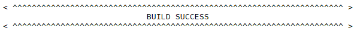

4.  After the build is successful, the following files are generated in the out/wifiiot directory. The compilation and build process is complete.

    **Figure  2**  Directory for storing compilation files<a name="fig38521346164618"></a>  
    

    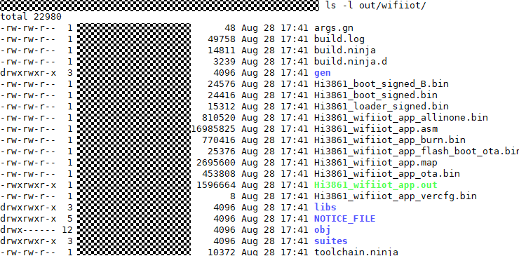


## Image burning<a name="section1610612214150"></a>

The images of the Hi3861 Wi-Fi module can be burnt by using the IDE tool DevEco \(for details about how to use the tool, see the related guide\). The burning procedure is as follows:

1.  Use a USB cable to connect the Windows workbench to the Wi-Fi module. \(You need to install the USB-to-serial driver before the installation. To download the driver, visit http://www.wch.cn/search?q=ch340g&t=downloads.\) Query the COM port on the device manager, for example, CH340 \(COM11\). The serial port integrates the burning, log printing, and Functions such as AT commands.

    **Figure  3**  COM port of the device manager<a name="fig85905394917"></a>  
    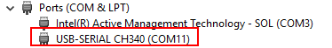

2.  Complete the basic burning configuration in the IDE and specify the path of HiBurn.exe in step 4.

    **Figure  4**  Burning basic configurations<a name="fig16939203111472"></a>  
    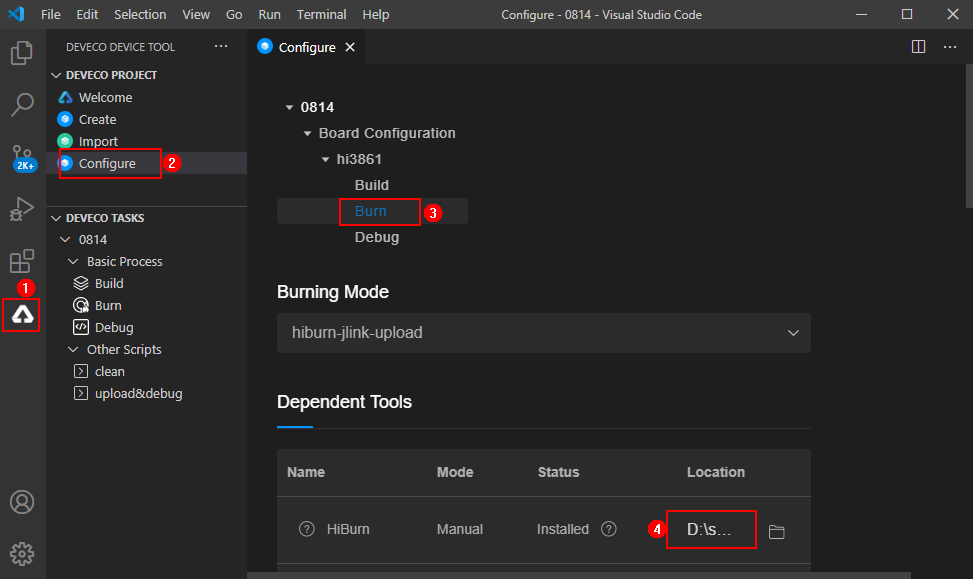

3.  Other Key Configurations

    1.  Set Baud rate to a proper baud rate. A higher baud rate indicates a faster burning speed.
    2.  Select a data bit from Data bit. The default value of Data bit for the Wi-Fi module is 8.
    3.  Select the version package path ./out/wifiiot/Hi3861\_wifiiot\_app\_allinone.bin.
    4.  Click Save.

    **Figure  5**  Baud rate and data bit configuration<a name="fig4315145184815"></a>  
    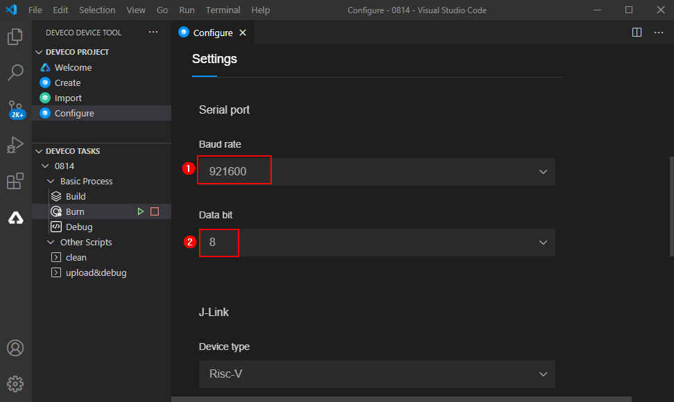

    **Figure  6**  Path of the burning package<a name="fig105491550185115"></a>  
    

    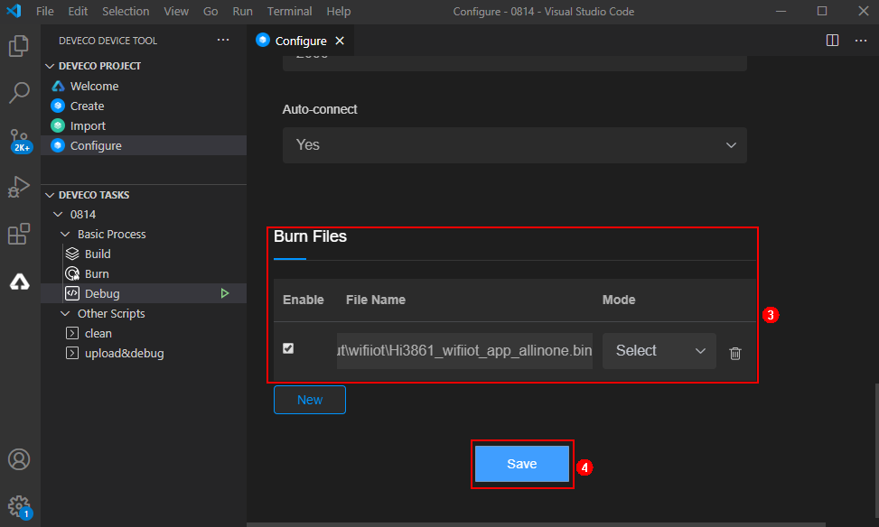

4.  On the DecEco interface, click Burn and select the COM11 serial port.

    **Figure  7**  Burning and starting<a name="fig051518341529"></a>  
    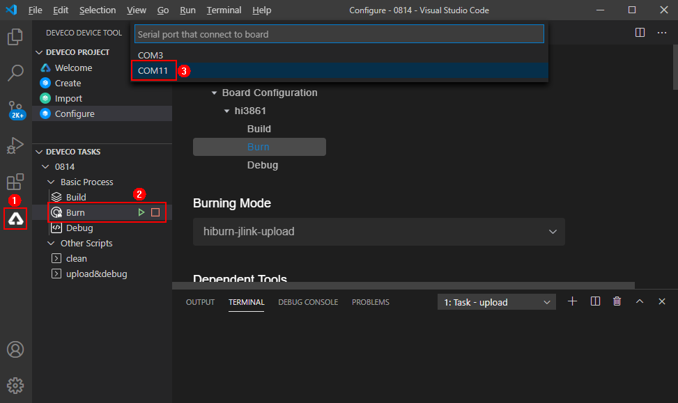

5.  After the serial port is selected, Connecting, please reset device... is displayed in the TERMINAL dialog box of the IDE. The module enters the to-be-burnt state.

    **Figure  8**  Burning process<a name="fig233565715549"></a>  
    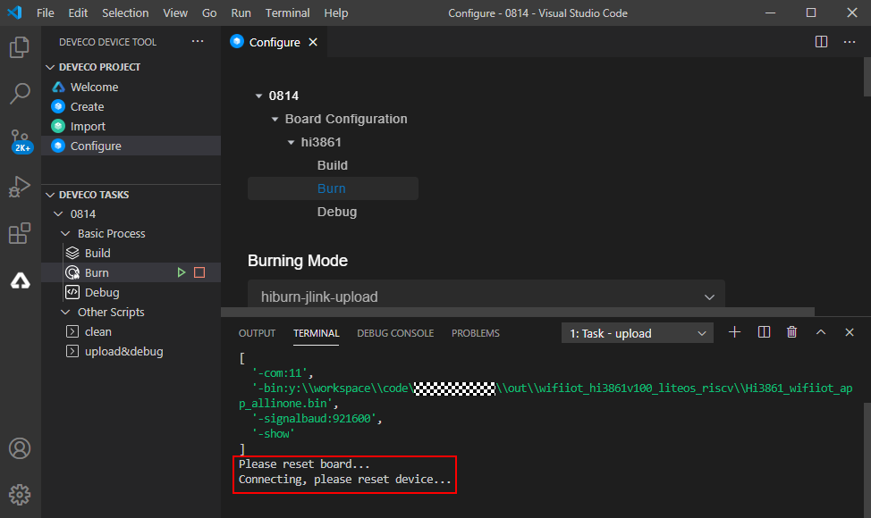

6.  Press the RST button on the module to start burning the version. If "Execution Successful" is displayed in the TERMINAL dialog box, the burning is complete.

    **Figure  9**  Burning completed<a name="fig191921618564"></a>  
    

    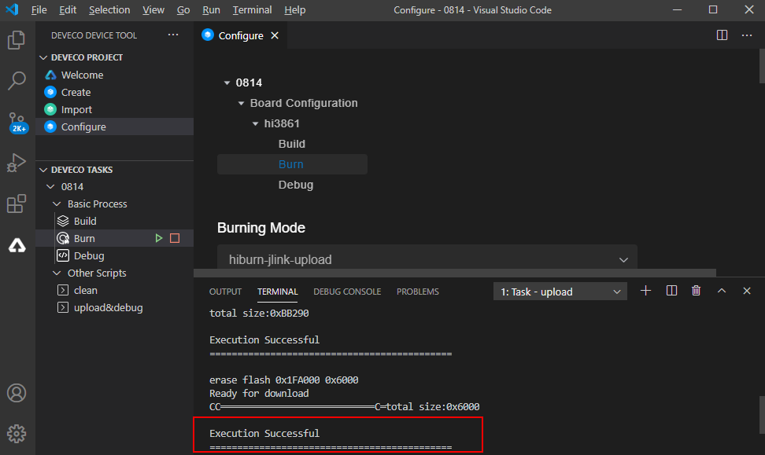


## WLAN module networking<a name="section168257461059"></a>

After version building and burning are complete, the following describes how to run AT commands on the terminal to connect the Wi-Fi module to the network.

1.  Use a USB cable to connect the Windows workbench to the Wi-Fi module. \(You need to install the USB-to-serial driver before the installation. To download the driver, visit http://www.wch.cn/search?q=ch340g&t=downloads.\) Query the COM port on the device manager, for example, CH340 \(COM11\). The serial port integrates the burning, log printing, and Functions such as AT commands.

    **Figure  10**  COM port of the device manager<a name="fig749694135716"></a>  
    

2.  On the Windows workbench, use a serial port terminal tool \(such as IPOP\) to connect to the serial port \(COM11\) of the Wi-Fi module, set the baud rate of the serial port to 115200, and select Newline.

    **Figure  11**  IPOP configuration<a name="fig179371422175815"></a>  
    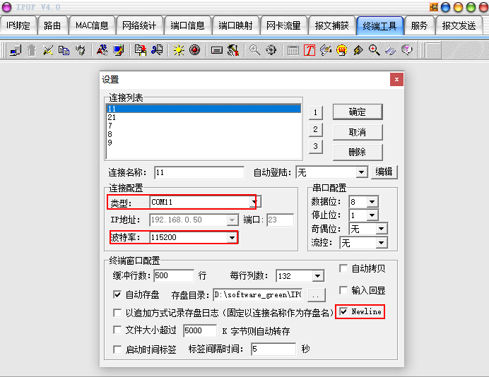

3.  Reset the Wi-Fi module. The message "ready to OS start" is displayed on the UE, indicating that the Wi-Fi module is started successfully.

    **Figure  12**  Resetting the Wi-Fi module<a name="fig227819127594"></a>  
    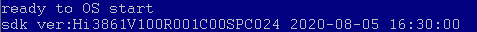

4.  Run the following AT commands in sequence to start the STA, connect to the specified AP, and enable DHCP.

    ```
    AT+STARTSTA - Start the STA mode.
    AT+SCAN - Scan for Neighboring APs
    AT+SCANRESULT - Display the scanning result
    AT+CONN="SSID",2,"PASSWORD" - Connect to the specified AP. SSID and PASSWORD indicate the name and password of the hotspot to be connected.
    AT+STASTAT - View the Connection Result
    AT+DHCP=wlan0,1 - To request the IP address of wlan0 from the AP through DHCP
    ```

5.  An IP address has been assigned to the interface and the interface is properly connected to the gateway.

    **Figure  13**  Successful networking of the Wi-Fi module<a name="fig834919451597"></a>  
    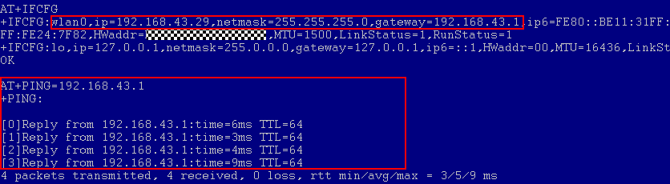


