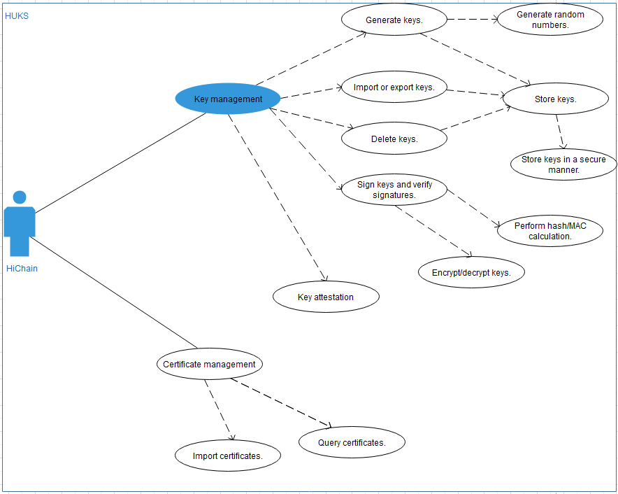

# Data Security

## Mechanism

Huawei Universal Keystore Service \(HUKS\) provides certificate management, key management, secure storage, and key authentication services. For OpenHarmony, it mainly provides key management and secure storage, as well as the basic device certification feature for HiChain \(device certification platform\). The following figure shows the functions of HUKS

**Figure  1**  HUKS functions  

The following algorithms are supported:

Authentication and encryption: AES-128/192/256-GCM

Signature verification: ED25519

Key negotiation: X25519

Message authentication: HMAC-SHA256/512

Data digest: SHA256/512

HUKS has the following restrictions:

-   Secure storage of keys: Keys must be stored in a secure area and cannot be modified. When factory settings are restored, preset keys are not deleted.
-   Key access security: OpenHarmony stores different data of an application separately to implement data isolation in the application, and includes the UID and process ID in the parameter structure to implement data isolation between different applications.
-   Concurrent access is not supported, that is, multiple applications cannot invoke HUKS simultaneously. As HUKS is a single library, resource exclusion is not a concern. If multiple applications want to use HUKS, they need to connect to the HUKS library and pass their respective paths for permanently storing data. In this way, data of these applications is isolated from each other.

## Recommended Practices

To use the device certification function, it is recommended that you use HiChain to interconnect with HUKS. HUKS provides applications such as HiChain with key generation, import, export, encryption/decryption, storage, and destruction, certificate import and query, and secret information storage.

