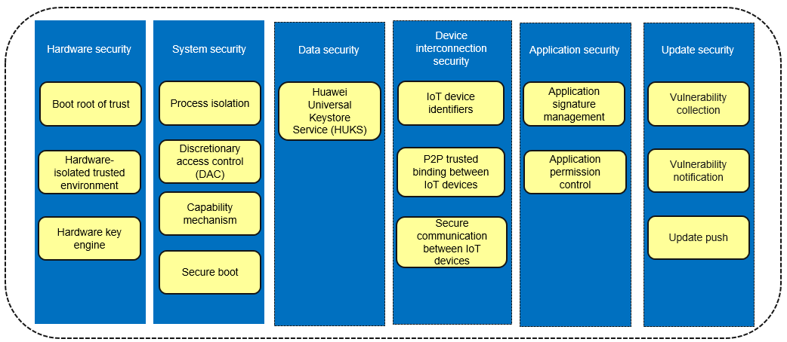

# Overview

OpenHarmony is an open OS that allows you to easily develop services and applications. It provides an execution environment to ensure security of application data and user data.

This environment combines chip security and system security features with upper-layer security services to secure hardware, the system, data, device interconnection, applications, and updates.

**Figure  1**  Security assurance framework  

