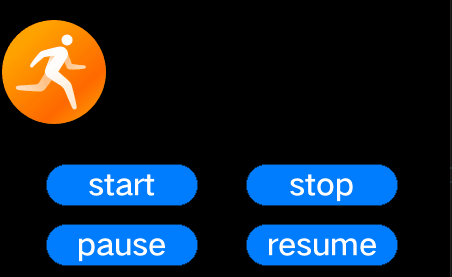

# Development Guidelines on Animators<a name="EN-US_TOPIC_0000001051451654"></a>

## When to Use<a name="section726685714018"></a>

A UI animator is implemented by calling the callback function you set for each tick using the task processing mechanism. The following classes are provided for you to implement an animator:

-   **AnimatorManager**: Manages Animator instances. This is a singleton class, which is registered with the system task callback when the  **Init**  function is executed. The system task mechanism ensures that each tick invokes the callback function of  **AnimatorManager**.
-   **Animator**: Represents animator-related attributes, including the start and end time of an animator. It also provides animator-specific functions, for example, to start and stop an animator, to set the animator state, and to obtain the animator.
-   **AnimatorCallback**: Implements the content of each tick. You need to implement your own logic in this callback class so that the desired operation is executed upon the corresponding callback is invoked.

## Available APIs<a name="section85794718418"></a>

**Table  1**  Available functions for an animator

<a name="table15207105417246"></a>
<table><thead align="left"><tr id="row1389130182514"><th class="cellrowborder" valign="top" width="17.349999999999998%" id="mcps1.2.4.1.1"><p id="p16390130172517"><a name="p16390130172517"></a><a name="p16390130172517"></a>Module</p>
</th>
<th class="cellrowborder" valign="top" width="54.13%" id="mcps1.2.4.1.2"><p id="p239060112519"><a name="p239060112519"></a><a name="p239060112519"></a>Function</p>
</th>
<th class="cellrowborder" valign="top" width="28.52%" id="mcps1.2.4.1.3"><p id="p1839012019257"><a name="p1839012019257"></a><a name="p1839012019257"></a>Description</p>
</th>
</tr>
</thead>
<tbody><tr id="row1533075412415"><td class="cellrowborder" valign="top" width="17.349999999999998%" headers="mcps1.2.4.1.1 "><p id="p633015547249"><a name="p633015547249"></a><a name="p633015547249"></a>Animator</p>
</td>
<td class="cellrowborder" valign="top" width="54.13%" headers="mcps1.2.4.1.2 "><p id="p6330554152411"><a name="p6330554152411"></a><a name="p6330554152411"></a>void  Start ()</p>
</td>
<td class="cellrowborder" valign="top" width="28.52%" headers="mcps1.2.4.1.3 "><p id="p3330155472412"><a name="p3330155472412"></a><a name="p3330155472412"></a>Starts an animator.</p>
</td>
</tr>
<tr id="row18330175410241"><td class="cellrowborder" valign="top" width="17.349999999999998%" headers="mcps1.2.4.1.1 "><p id="p33301454172415"><a name="p33301454172415"></a><a name="p33301454172415"></a>Animator</p>
</td>
<td class="cellrowborder" valign="top" width="54.13%" headers="mcps1.2.4.1.2 "><p id="p12330195419248"><a name="p12330195419248"></a><a name="p12330195419248"></a>void  Stop ()</p>
</td>
<td class="cellrowborder" valign="top" width="28.52%" headers="mcps1.2.4.1.3 "><p id="p23301854162416"><a name="p23301854162416"></a><a name="p23301854162416"></a>Stops the animator.</p>
</td>
</tr>
<tr id="row433045420244"><td class="cellrowborder" valign="top" width="17.349999999999998%" headers="mcps1.2.4.1.1 "><p id="p183301054182410"><a name="p183301054182410"></a><a name="p183301054182410"></a>Animator</p>
</td>
<td class="cellrowborder" valign="top" width="54.13%" headers="mcps1.2.4.1.2 "><p id="p43302054172415"><a name="p43302054172415"></a><a name="p43302054172415"></a>void  Pause ()</p>
</td>
<td class="cellrowborder" valign="top" width="28.52%" headers="mcps1.2.4.1.3 "><p id="p15330854182413"><a name="p15330854182413"></a><a name="p15330854182413"></a>Pauses the animator.</p>
</td>
</tr>
<tr id="row1033085492417"><td class="cellrowborder" valign="top" width="17.349999999999998%" headers="mcps1.2.4.1.1 "><p id="p12331135413244"><a name="p12331135413244"></a><a name="p12331135413244"></a>Animator</p>
</td>
<td class="cellrowborder" valign="top" width="54.13%" headers="mcps1.2.4.1.2 "><p id="p5331165472412"><a name="p5331165472412"></a><a name="p5331165472412"></a>void  Resume ()</p>
</td>
<td class="cellrowborder" valign="top" width="28.52%" headers="mcps1.2.4.1.3 "><p id="p63314543246"><a name="p63314543246"></a><a name="p63314543246"></a>Resumes the animator.</p>
</td>
</tr>
<tr id="row1331175413240"><td class="cellrowborder" valign="top" width="17.349999999999998%" headers="mcps1.2.4.1.1 "><p id="p18331454152418"><a name="p18331454152418"></a><a name="p18331454152418"></a>Animator</p>
</td>
<td class="cellrowborder" valign="top" width="54.13%" headers="mcps1.2.4.1.2 "><p id="p15331155472414"><a name="p15331155472414"></a><a name="p15331155472414"></a>uint8_t  GetState () const</p>
</td>
<td class="cellrowborder" valign="top" width="28.52%" headers="mcps1.2.4.1.3 "><p id="p2033125414243"><a name="p2033125414243"></a><a name="p2033125414243"></a>Obtains the current state of the animator.</p>
</td>
</tr>
<tr id="row43311554182415"><td class="cellrowborder" valign="top" width="17.349999999999998%" headers="mcps1.2.4.1.1 "><p id="p33311854172420"><a name="p33311854172420"></a><a name="p33311854172420"></a>Animator</p>
</td>
<td class="cellrowborder" valign="top" width="54.13%" headers="mcps1.2.4.1.2 "><p id="p433165462418"><a name="p433165462418"></a><a name="p433165462418"></a>void  SetState (uint8_t state)</p>
</td>
<td class="cellrowborder" valign="top" width="28.52%" headers="mcps1.2.4.1.3 "><p id="p23316546242"><a name="p23316546242"></a><a name="p23316546242"></a>Sets the current state for the animator.</p>
</td>
</tr>
<tr id="row17331254192419"><td class="cellrowborder" valign="top" width="17.349999999999998%" headers="mcps1.2.4.1.1 "><p id="p173319547243"><a name="p173319547243"></a><a name="p173319547243"></a>Animator</p>
</td>
<td class="cellrowborder" valign="top" width="54.13%" headers="mcps1.2.4.1.2 "><p id="p18332125416243"><a name="p18332125416243"></a><a name="p18332125416243"></a>uint32_t  GetTime () const</p>
</td>
<td class="cellrowborder" valign="top" width="28.52%" headers="mcps1.2.4.1.3 "><p id="p1633295412414"><a name="p1633295412414"></a><a name="p1633295412414"></a>Obtains the total duration of the animator.</p>
</td>
</tr>
<tr id="row8332195419241"><td class="cellrowborder" valign="top" width="17.349999999999998%" headers="mcps1.2.4.1.1 "><p id="p2033211545243"><a name="p2033211545243"></a><a name="p2033211545243"></a>Animator</p>
</td>
<td class="cellrowborder" valign="top" width="54.13%" headers="mcps1.2.4.1.2 "><p id="p123321054172415"><a name="p123321054172415"></a><a name="p123321054172415"></a>void  SetTime (uint32_t time)</p>
</td>
<td class="cellrowborder" valign="top" width="28.52%" headers="mcps1.2.4.1.3 "><p id="p4332105472411"><a name="p4332105472411"></a><a name="p4332105472411"></a>Sets the total duration for the animator.</p>
</td>
</tr>
<tr id="row13332125412420"><td class="cellrowborder" valign="top" width="17.349999999999998%" headers="mcps1.2.4.1.1 "><p id="p17332165482417"><a name="p17332165482417"></a><a name="p17332165482417"></a>Animator</p>
</td>
<td class="cellrowborder" valign="top" width="54.13%" headers="mcps1.2.4.1.2 "><p id="p3332115417243"><a name="p3332115417243"></a><a name="p3332115417243"></a>uint32_t  GetRunTime () const</p>
</td>
<td class="cellrowborder" valign="top" width="28.52%" headers="mcps1.2.4.1.3 "><p id="p733275442419"><a name="p733275442419"></a><a name="p733275442419"></a>Obtains the running time of the animator.</p>
</td>
</tr>
<tr id="row2033215419249"><td class="cellrowborder" valign="top" width="17.349999999999998%" headers="mcps1.2.4.1.1 "><p id="p113327549245"><a name="p113327549245"></a><a name="p113327549245"></a>Animator</p>
</td>
<td class="cellrowborder" valign="top" width="54.13%" headers="mcps1.2.4.1.2 "><p id="p43321154172417"><a name="p43321154172417"></a><a name="p43321154172417"></a>void  SetRunTime (uint32_t runTime)</p>
</td>
<td class="cellrowborder" valign="top" width="28.52%" headers="mcps1.2.4.1.3 "><p id="p173331354182416"><a name="p173331354182416"></a><a name="p173331354182416"></a>Sets the running time for the animator.</p>
</td>
</tr>
<tr id="row20333115417249"><td class="cellrowborder" valign="top" width="17.349999999999998%" headers="mcps1.2.4.1.1 "><p id="p2333155412240"><a name="p2333155412240"></a><a name="p2333155412240"></a>Animator</p>
</td>
<td class="cellrowborder" valign="top" width="54.13%" headers="mcps1.2.4.1.2 "><p id="p143335549246"><a name="p143335549246"></a><a name="p143335549246"></a>bool  IsRepeat () const</p>
</td>
<td class="cellrowborder" valign="top" width="28.52%" headers="mcps1.2.4.1.3 "><p id="p23336548244"><a name="p23336548244"></a><a name="p23336548244"></a>Checks whether the animator is repeated.</p>
</td>
</tr>
<tr id="row19333754202418"><td class="cellrowborder" valign="top" width="17.349999999999998%" headers="mcps1.2.4.1.1 "><p id="p1833319543247"><a name="p1833319543247"></a><a name="p1833319543247"></a>AnimatorCallback</p>
</td>
<td class="cellrowborder" valign="top" width="54.13%" headers="mcps1.2.4.1.2 "><p id="p6333135402416"><a name="p6333135402416"></a><a name="p6333135402416"></a>virtual void  Callback (UIView *view)=0</p>
</td>
<td class="cellrowborder" valign="top" width="28.52%" headers="mcps1.2.4.1.3 "><p id="p19333854172417"><a name="p19333854172417"></a><a name="p19333854172417"></a>Represents the animator callback. You can implement your own logic in this callback.</p>
</td>
</tr>
<tr id="row193331854112415"><td class="cellrowborder" valign="top" width="17.349999999999998%" headers="mcps1.2.4.1.1 "><p id="p1133325482420"><a name="p1133325482420"></a><a name="p1133325482420"></a>AnimatorCallback</p>
</td>
<td class="cellrowborder" valign="top" width="54.13%" headers="mcps1.2.4.1.2 "><p id="p1433585412411"><a name="p1433585412411"></a><a name="p1433585412411"></a>virtual void OnStop(UIView&amp; view) {}</p>
</td>
<td class="cellrowborder" valign="top" width="28.52%" headers="mcps1.2.4.1.3 "><p id="p933595412249"><a name="p933595412249"></a><a name="p933595412249"></a>Called after the animator stops. You can implement your own logic in this callback.</p>
</td>
</tr>
<tr id="row83351654192415"><td class="cellrowborder" valign="top" width="17.349999999999998%" headers="mcps1.2.4.1.1 "><p id="p633525419244"><a name="p633525419244"></a><a name="p633525419244"></a>AnimatorManager</p>
</td>
<td class="cellrowborder" valign="top" width="54.13%" headers="mcps1.2.4.1.2 "><p id="p203351547242"><a name="p203351547242"></a><a name="p203351547242"></a>static AnimatorManager* GetInstance()</p>
</td>
<td class="cellrowborder" valign="top" width="28.52%" headers="mcps1.2.4.1.3 "><p id="p333545412419"><a name="p333545412419"></a><a name="p333545412419"></a>Obtains an <strong id="b1489919291979"><a name="b1489919291979"></a><a name="b1489919291979"></a>AnimatorManager</strong> instance.</p>
</td>
</tr>
<tr id="row3335954202412"><td class="cellrowborder" valign="top" width="17.349999999999998%" headers="mcps1.2.4.1.1 "><p id="p5335185413247"><a name="p5335185413247"></a><a name="p5335185413247"></a>AnimatorManager</p>
</td>
<td class="cellrowborder" valign="top" width="54.13%" headers="mcps1.2.4.1.2 "><p id="p11336145442417"><a name="p11336145442417"></a><a name="p11336145442417"></a>void  Add (Animator *animator)</p>
</td>
<td class="cellrowborder" valign="top" width="28.52%" headers="mcps1.2.4.1.3 "><p id="p10336175492416"><a name="p10336175492416"></a><a name="p10336175492416"></a>Adds an animator.</p>
</td>
</tr>
<tr id="row18336185422417"><td class="cellrowborder" valign="top" width="17.349999999999998%" headers="mcps1.2.4.1.1 "><p id="p103361554192411"><a name="p103361554192411"></a><a name="p103361554192411"></a>AnimatorManager</p>
</td>
<td class="cellrowborder" valign="top" width="54.13%" headers="mcps1.2.4.1.2 "><p id="p6336195442412"><a name="p6336195442412"></a><a name="p6336195442412"></a>void Remove(const Animator* animator);</p>
</td>
<td class="cellrowborder" valign="top" width="28.52%" headers="mcps1.2.4.1.3 "><p id="p233615442420"><a name="p233615442420"></a><a name="p233615442420"></a>Removes the animator.</p>
</td>
</tr>
</tbody>
</table>

## How to Develop<a name="section14101161317435"></a>

1.  Implement the callback in  **AnimatorCallback**.

    ```
    class AnimatorCallbackDemo : public OHOS::AnimatorCallback {
    public:
        AnimatorCallbackDemo(int16_t startPos, int16_t endPos, uint16_t time)
            : start_(startPos), end_(endPos), time_(time), curTime_(0) {}
     
        virtual void Callback(OHOS::UIView* view)
        {
            curTime_++;
            int16_t pos = EasingEquation::CubicEaseIn(start_, end_, curTime_, time_);
            view->Invalidate();
            view->SetPosition(pos, view->GetY());
            view->Invalidate();
        }
    protected:
        int16_t start_;
        int16_t end_;
        uint16_t time_;
        uint16_t curTime_;
    };
    ```

2.  Register  **AnimatorCallback**  to the animator.

    ```
    UIImageView* image = new UIImageView();
    image->SetSrc("..\\config\\images\\A021_001.bin");
    image->SetPosition(0, 50);
    AnimatorCallbackDemo* callback = new AnimatorCallbackDemo(0, 338, 60);
    Animator* animator = new Animator(callback, image, 0, true);
    ```

3.  Add the animator to  **AnimatorManager**.

    ```
    AnimatorManager::GetInstance()->Add(animator);
    ```

4.  Click the buttons in the lower part of the following figure to verify that the animation effects are as expected.

    **Figure  1**  Animator effect<a name="fig17833181682317"></a>  
    


