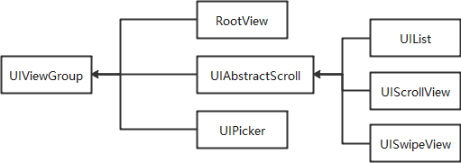
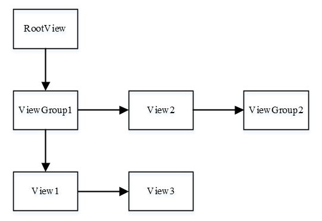
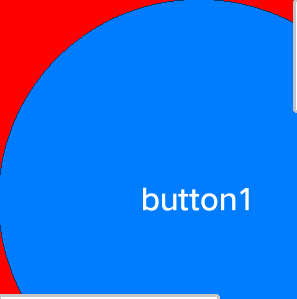

# Development Guidelines on Container Components<a name="EN-US_TOPIC_0000001052810390"></a>

Container components are capable of containing UI components and inherit from  **UIViewGroup**. Components that are commonly used and need to contain child components are placed in the container class inheritance structure. For example, you need to call the  **Add**  function to add information such as time statistics and icons to  **UIAnalogClock**.

**Figure  1**  Structure of a common container component<a name="fig148011033490"></a>  




The  **RootView**,  **UIAbstractScroll**, and  **UIPicker**  components inherit from  **UIViewGroup**, and the  **UIList**,  **UIScrollView**, and  **UISwipeView**  components inherit from  **UIAbstractScroll**.

## UIViewGroup<a name="section145471898812"></a>

## When to Use<a name="section0916112362216"></a>

**UIViewGroup**  is a base class for container components. For example, you can call the functions in this class to add, remove, and insert container components. Also, you can call the  **Add**  function to add child components for a container component. You need to set the position information for child components in a common container component. The position information is the coordinates relative to those of their parent component. The following figure shows the component tree structure.

**Figure  2**  Component tree structure<a name="fig149561323162218"></a>  




As shown in the figure, the container component  **ViewGroup1**  and the component  **View1**  are added to  **rootView**, the component  **View2**  and the container component  **ViewGroup2**  are added to  **ViewGroup1**, and then the component  **View3**  \(as a sibling of  **View1**\) is also added to  **ViewGroup1**.

-   Rendering: During rendering of a container component, you need to call the  **OnDraw**  function on all its child components to update them.
-   Coordinates: As the position information of child components is the coordinates relative to those of their parent components, the system calculates and displays the absolute coordinates of child components during rendering.
-   Tree structure traversing: The  **UIViewGroup**  class provides the functions below to traverse, search for, and manage the component tree.

## Available APIs<a name="section12641756192212"></a>

**Table  1** Available functions  in ViewGroup

<a name="table15959122392211"></a>
<table><thead align="left"><tr id="row14957132342220"><th class="cellrowborder" valign="top" width="64.73%" id="mcps1.2.3.1.1"><p id="p3957182302217"><a name="p3957182302217"></a><a name="p3957182302217"></a>Function</p>
</th>
<th class="cellrowborder" valign="top" width="35.27%" id="mcps1.2.3.1.2"><p id="p1595742312219"><a name="p1595742312219"></a><a name="p1595742312219"></a>Description</p>
</th>
</tr>
</thead>
<tbody><tr id="row14957123162218"><td class="cellrowborder" valign="top" width="64.73%" headers="mcps1.2.3.1.1 "><p id="p89572023102216"><a name="p89572023102216"></a><a name="p89572023102216"></a>virtual void Add(UIView* view)</p>
</td>
<td class="cellrowborder" valign="top" width="35.27%" headers="mcps1.2.3.1.2 "><p id="p1495720236223"><a name="p1495720236223"></a><a name="p1495720236223"></a>Adds a child component.</p>
</td>
</tr>
<tr id="row895892310224"><td class="cellrowborder" valign="top" width="64.73%" headers="mcps1.2.3.1.1 "><p id="p16958192315227"><a name="p16958192315227"></a><a name="p16958192315227"></a>virtual void Insert(UIView* prevView, UIView* insertView)</p>
</td>
<td class="cellrowborder" valign="top" width="35.27%" headers="mcps1.2.3.1.2 "><p id="p1958223152210"><a name="p1958223152210"></a><a name="p1958223152210"></a>Inserts a child component.</p>
</td>
</tr>
<tr id="row395862315229"><td class="cellrowborder" valign="top" width="64.73%" headers="mcps1.2.3.1.1 "><p id="p16958142314223"><a name="p16958142314223"></a><a name="p16958142314223"></a>virtual void Remove(UIView* view)</p>
</td>
<td class="cellrowborder" valign="top" width="35.27%" headers="mcps1.2.3.1.2 "><p id="p2095862319224"><a name="p2095862319224"></a><a name="p2095862319224"></a>Removes a child component.</p>
</td>
</tr>
<tr id="row195832352212"><td class="cellrowborder" valign="top" width="64.73%" headers="mcps1.2.3.1.1 "><p id="p3958152362219"><a name="p3958152362219"></a><a name="p3958152362219"></a>virtual void RemoveAll()</p>
</td>
<td class="cellrowborder" valign="top" width="35.27%" headers="mcps1.2.3.1.2 "><p id="p10958132318225"><a name="p10958132318225"></a><a name="p10958132318225"></a>Removes all child components.</p>
</td>
</tr>
<tr id="row895818232223"><td class="cellrowborder" valign="top" width="64.73%" headers="mcps1.2.3.1.1 "><p id="p9958202322214"><a name="p9958202322214"></a><a name="p9958202322214"></a>virtual void GetTargetView(const Point&amp; point, UIView** last)</p>
</td>
<td class="cellrowborder" valign="top" width="35.27%" headers="mcps1.2.3.1.2 "><p id="p79584234227"><a name="p79584234227"></a><a name="p79584234227"></a>Obtains the target view.</p>
</td>
</tr>
<tr id="row795917235227"><td class="cellrowborder" valign="top" width="64.73%" headers="mcps1.2.3.1.1 "><p id="p5958162362213"><a name="p5958162362213"></a><a name="p5958162362213"></a>virtual void MoveChildByOffset(int16_t x, int16_t y)</p>
</td>
<td class="cellrowborder" valign="top" width="35.27%" headers="mcps1.2.3.1.2 "><p id="p18958142315225"><a name="p18958142315225"></a><a name="p18958142315225"></a>Moves a child component by a specified offset.</p>
</td>
</tr>
<tr id="row1395912314227"><td class="cellrowborder" valign="top" width="64.73%" headers="mcps1.2.3.1.1 "><p id="p209591223172217"><a name="p209591223172217"></a><a name="p209591223172217"></a>UIView* GetChildrenHead() const</p>
</td>
<td class="cellrowborder" valign="top" width="35.27%" headers="mcps1.2.3.1.2 "><p id="p895942313224"><a name="p895942313224"></a><a name="p895942313224"></a>Obtains the first child view in a view group.</p>
</td>
</tr>
<tr id="row7959192317226"><td class="cellrowborder" valign="top" width="64.73%" headers="mcps1.2.3.1.1 "><p id="p89591423122213"><a name="p89591423122213"></a><a name="p89591423122213"></a>UIView* GetChildrenTail() const</p>
</td>
<td class="cellrowborder" valign="top" width="35.27%" headers="mcps1.2.3.1.2 "><p id="p17959132382217"><a name="p17959132382217"></a><a name="p17959132382217"></a>Obtains the last child view in a view group.</p>
</td>
</tr>
<tr id="row39591423142214"><td class="cellrowborder" valign="top" width="64.73%" headers="mcps1.2.3.1.1 "><p id="p6959623182212"><a name="p6959623182212"></a><a name="p6959623182212"></a>virtual UIView* GetChildById(const char* id) const override</p>
</td>
<td class="cellrowborder" valign="top" width="35.27%" headers="mcps1.2.3.1.2 "><p id="p095932319222"><a name="p095932319222"></a><a name="p095932319222"></a>Obtains a child view based on its ID.</p>
</td>
</tr>
</tbody>
</table>

## How to Develop<a name="section5412161692311"></a>

1.  Create  **ULLabelButton**  instances and set their coordinates.

    ```
    UILabelButton* btn1 = new UILabelButton();
    btn1->SetPosition(0, 0, 100, 50);
    btn1->SetText("btn1");
    
    UILabelButton* btn2 = new UILabelButton();
    btn2->SetPosition(50, 50, 100, 50);
    btn2->SetText("btn2");
    
    UILabelButton* btn3 = new UILabelButton();
    btn3->SetPosition(100, 100, 100, 50);
    btn3->SetText("btn3");
    ```

2.  Create a  **UIViewGroup**  instance and set its coordinates.

    ```
    UIViewGroup* group = new UIViewGroup();
    group->SetPosition(0, 0, 300, 300);
    ```

3.  Add the  **ULLabelButton**  instances to  **UIViewGroup**.

    ```
    group->Add(btn1);
    group->Add(btn2);
    group->Add(btn3);
    ```

4.  The following figure shows the effect of adding view instances to a  **ViewGroup**.

    **Figure  3**  Effect of adding view instances to a ViewGroup<a name="fig33041856184219"></a>  
    


## UIScrollView<a name="section174961523161315"></a>

## When to Use<a name="section8937101902413"></a>

**UIScrollView**  provides scrolling container components, which enable child components to scroll upwards, downwards, leftwards, and rightwards upon a touch event. This class also supports horizontal and vertical cursor display.

## Available APIs<a name="section14789133142420"></a>

**Table  2** Available functions  in ScrollView

<a name="table73572052411"></a>
<table><thead align="left"><tr id="row432202014249"><th class="cellrowborder" valign="top" width="50%" id="mcps1.2.3.1.1"><p id="p432142092415"><a name="p432142092415"></a><a name="p432142092415"></a>Function</p>
</th>
<th class="cellrowborder" valign="top" width="50%" id="mcps1.2.3.1.2"><p id="p4323208245"><a name="p4323208245"></a><a name="p4323208245"></a>Description</p>
</th>
</tr>
</thead>
<tbody><tr id="row13392032417"><td class="cellrowborder" valign="top" width="50%" headers="mcps1.2.3.1.1 "><p id="p632182022417"><a name="p632182022417"></a><a name="p632182022417"></a>void ScrollBy(int16_t xDistance, int16_t yDistance)</p>
</td>
<td class="cellrowborder" valign="top" width="50%" headers="mcps1.2.3.1.2 "><p id="p13333208242"><a name="p13333208242"></a><a name="p13333208242"></a>Scrolls a view.</p>
</td>
</tr>
<tr id="row1633132032415"><td class="cellrowborder" valign="top" width="50%" headers="mcps1.2.3.1.1 "><p id="p1533320172413"><a name="p1533320172413"></a><a name="p1533320172413"></a>void SetScrollbarWidth(uint8_t width)</p>
</td>
<td class="cellrowborder" valign="top" width="50%" headers="mcps1.2.3.1.2 "><p id="p173322015241"><a name="p173322015241"></a><a name="p173322015241"></a>Sets the scrollbar width.</p>
</td>
</tr>
<tr id="row033152012416"><td class="cellrowborder" valign="top" width="50%" headers="mcps1.2.3.1.1 "><p id="p173382042417"><a name="p173382042417"></a><a name="p173382042417"></a>void SetHorizontalScrollState(bool state)</p>
</td>
<td class="cellrowborder" valign="top" width="50%" headers="mcps1.2.3.1.2 "><p id="p103362042411"><a name="p103362042411"></a><a name="p103362042411"></a>Sets the horizontal scrolling state.</p>
</td>
</tr>
<tr id="row03362011242"><td class="cellrowborder" valign="top" width="50%" headers="mcps1.2.3.1.1 "><p id="p333152032413"><a name="p333152032413"></a><a name="p333152032413"></a>bool GetHorizontalScrollState() const</p>
</td>
<td class="cellrowborder" valign="top" width="50%" headers="mcps1.2.3.1.2 "><p id="p9331220192418"><a name="p9331220192418"></a><a name="p9331220192418"></a>Checks whether horizontal scrolling is allowed.</p>
</td>
</tr>
<tr id="row1933520142413"><td class="cellrowborder" valign="top" width="50%" headers="mcps1.2.3.1.1 "><p id="p1833520192410"><a name="p1833520192410"></a><a name="p1833520192410"></a>void SetVerticalScrollState(bool state)</p>
</td>
<td class="cellrowborder" valign="top" width="50%" headers="mcps1.2.3.1.2 "><p id="p12331520132415"><a name="p12331520132415"></a><a name="p12331520132415"></a>Sets the vertical scrolling state.</p>
</td>
</tr>
<tr id="row183318200243"><td class="cellrowborder" valign="top" width="50%" headers="mcps1.2.3.1.1 "><p id="p63317207248"><a name="p63317207248"></a><a name="p63317207248"></a>bool GetVerticalScrollState() const</p>
</td>
<td class="cellrowborder" valign="top" width="50%" headers="mcps1.2.3.1.2 "><p id="p1133020112417"><a name="p1133020112417"></a><a name="p1133020112417"></a>Checks whether vertical scrolling is allowed.</p>
</td>
</tr>
<tr id="row43462072418"><td class="cellrowborder" valign="top" width="50%" headers="mcps1.2.3.1.1 "><p id="p193313203245"><a name="p193313203245"></a><a name="p193313203245"></a>void SetXScrollBarVisible(bool state)</p>
</td>
<td class="cellrowborder" valign="top" width="50%" headers="mcps1.2.3.1.2 "><p id="p1833102017242"><a name="p1833102017242"></a><a name="p1833102017242"></a>Sets whether the x-axis scrollbar is visible.</p>
</td>
</tr>
<tr id="row1834720132417"><td class="cellrowborder" valign="top" width="50%" headers="mcps1.2.3.1.1 "><p id="p8341620162410"><a name="p8341620162410"></a><a name="p8341620162410"></a>void SetYScrollBarVisible(bool state)</p>
</td>
<td class="cellrowborder" valign="top" width="50%" headers="mcps1.2.3.1.2 "><p id="p163462092412"><a name="p163462092412"></a><a name="p163462092412"></a>Sets whether the y-axis scrollbar is visible.</p>
</td>
</tr>
<tr id="row13482082411"><td class="cellrowborder" valign="top" width="50%" headers="mcps1.2.3.1.1 "><p id="p33415208244"><a name="p33415208244"></a><a name="p33415208244"></a>void RegisterScrollListener(OnScrollListener* scrollListener)</p>
</td>
<td class="cellrowborder" valign="top" width="50%" headers="mcps1.2.3.1.2 "><p id="p934112002417"><a name="p934112002417"></a><a name="p934112002417"></a>Registers the scrolling callback class.</p>
</td>
</tr>
<tr id="row934192014242"><td class="cellrowborder" valign="top" width="50%" headers="mcps1.2.3.1.1 "><p id="p18341020132410"><a name="p18341020132410"></a><a name="p18341020132410"></a>void RefreshScrollBar()</p>
</td>
<td class="cellrowborder" valign="top" width="50%" headers="mcps1.2.3.1.2 "><p id="p234520192417"><a name="p234520192417"></a><a name="p234520192417"></a>Refreshes the scrollbar.</p>
</td>
</tr>
<tr id="row63422072418"><td class="cellrowborder" valign="top" width="50%" headers="mcps1.2.3.1.1 "><p id="p8341620172411"><a name="p8341620172411"></a><a name="p8341620172411"></a>virtual void OnScrollStart() {}</p>
</td>
<td class="cellrowborder" valign="top" width="50%" headers="mcps1.2.3.1.2 "><p id="p193452052417"><a name="p193452052417"></a><a name="p193452052417"></a>Called when scrolling starts.</p>
</td>
</tr>
<tr id="row93432017244"><td class="cellrowborder" valign="top" width="50%" headers="mcps1.2.3.1.1 "><p id="p143416203242"><a name="p143416203242"></a><a name="p143416203242"></a>virtual void OnScrollEnd() {}</p>
</td>
<td class="cellrowborder" valign="top" width="50%" headers="mcps1.2.3.1.2 "><p id="p534152018243"><a name="p534152018243"></a><a name="p534152018243"></a>Called when scrolling ends.</p>
</td>
</tr>
<tr id="row33532012247"><td class="cellrowborder" valign="top" width="50%" headers="mcps1.2.3.1.1 "><p id="p1834172052419"><a name="p1834172052419"></a><a name="p1834172052419"></a>uint8_t GetScrollState() const</p>
</td>
<td class="cellrowborder" valign="top" width="50%" headers="mcps1.2.3.1.2 "><p id="p1346205242"><a name="p1346205242"></a><a name="p1346205242"></a>Obtains the scrolling state.</p>
</td>
</tr>
<tr id="row1535142022415"><td class="cellrowborder" valign="top" width="50%" headers="mcps1.2.3.1.1 "><p id="p173532082413"><a name="p173532082413"></a><a name="p173532082413"></a>void SetScrollState(uint8_t state)</p>
</td>
<td class="cellrowborder" valign="top" width="50%" headers="mcps1.2.3.1.2 "><p id="p1235102016242"><a name="p1235102016242"></a><a name="p1235102016242"></a>Sets the scrolling state.</p>
</td>
</tr>
</tbody>
</table>

## How to Develop<a name="section1769754422417"></a>

Add two buttons as child components and display horizontal and vertical cursors.

```
scrollView* scroll = new UIScrollView();
scroll->SetStyle(STYLE_BACKGROUND_COLOR, Color::Red().full);
scroll->SetPosition(0,0, 200, 200);
scroll->SetXScrollBarVisible(true);
scroll->SetYScrollBarVisible(true);
UILabelButton* button1 = new UILabelButton();
button1->SetText("button1");
button1->SetPosition(0, 0, 300, 300);
UILabelButton* button2 = new UILabelButton();
button2->SetText("button2");
button2->SetPosition(0, 300, 300, 300);
scroll->Add(button1);
scroll->Add(button2);
```

**Figure  4**  Scrolling effect in both horizontal and vertical directions<a name="fig20957125155214"></a>  


