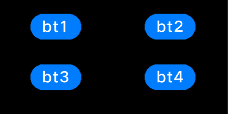

# Development Guidelines on Layout Container Components<a name="EN-US_TOPIC_0000001052661991"></a>

Layout container components consist of basic view classes. You can set the view positions to achieve nested and overlapped layouts, set the layout type and margin to standardize the child components in the layout, and call certain functions to implement layout views based on parent and sibling components.

## UISwipeView<a name="section13631719181717"></a>

## When to Use<a name="section11299120102617"></a>

**UISwipeView**  inherits from  **UIViewGroup**. In addition to the  **Add**,  **Remove**, and  **Insert**  functions,  **UISwipeView**  provides the functions to swipe contents by page and center the current page after swiping. This component can be horizontally or vertically centered. Child components added via the  **Add**  function are automatically horizontally or vertically centered, adaptive to the  **UISwipeView**  direction, in the sequence they were added.

## Available APIs<a name="section767434119261"></a>

**Table  1** Available functions  in SwipeView

<a name="table143378205264"></a>
<table><thead align="left"><tr id="row8336122032615"><th class="cellrowborder" valign="top" width="50%" id="mcps1.2.3.1.1"><p id="p13361520162611"><a name="p13361520162611"></a><a name="p13361520162611"></a>Function</p>
</th>
<th class="cellrowborder" valign="top" width="50%" id="mcps1.2.3.1.2"><p id="p153361920112617"><a name="p153361920112617"></a><a name="p153361920112617"></a>Description</p>
</th>
</tr>
</thead>
<tbody><tr id="row9336720172616"><td class="cellrowborder" valign="top" width="50%" headers="mcps1.2.3.1.1 "><p id="p83365206267"><a name="p83365206267"></a><a name="p83365206267"></a>void SetCurrentPage(uint16_t index);</p>
</td>
<td class="cellrowborder" valign="top" width="50%" headers="mcps1.2.3.1.2 "><p id="p1833612017261"><a name="p1833612017261"></a><a name="p1833612017261"></a>Sets the current page.</p>
</td>
</tr>
<tr id="row15336172002613"><td class="cellrowborder" valign="top" width="50%" headers="mcps1.2.3.1.1 "><p id="p0336162072613"><a name="p0336162072613"></a><a name="p0336162072613"></a>uint16_t GetCurrentPage()</p>
</td>
<td class="cellrowborder" valign="top" width="50%" headers="mcps1.2.3.1.2 "><p id="p433615207262"><a name="p433615207262"></a><a name="p433615207262"></a>Obtains the current page.</p>
</td>
</tr>
<tr id="row9336920102614"><td class="cellrowborder" valign="top" width="50%" headers="mcps1.2.3.1.1 "><p id="p6336520102619"><a name="p6336520102619"></a><a name="p6336520102619"></a>UIView* GetCurrentView() const</p>
</td>
<td class="cellrowborder" valign="top" width="50%" headers="mcps1.2.3.1.2 "><p id="p16336112062612"><a name="p16336112062612"></a><a name="p16336112062612"></a>Obtains the current view.</p>
</td>
</tr>
<tr id="row03371820162616"><td class="cellrowborder" valign="top" width="50%" headers="mcps1.2.3.1.1 "><p id="p7336172082611"><a name="p7336172082611"></a><a name="p7336172082611"></a>void SetOnSwipeListener(OnSwipeListener&amp; onSwipeListener)</p>
</td>
<td class="cellrowborder" valign="top" width="50%" headers="mcps1.2.3.1.2 "><p id="p15336172012269"><a name="p15336172012269"></a><a name="p15336172012269"></a>Sets the swiping callback class.</p>
</td>
</tr>
<tr id="row23371520172613"><td class="cellrowborder" valign="top" width="50%" headers="mcps1.2.3.1.1 "><p id="p733792017267"><a name="p733792017267"></a><a name="p733792017267"></a>void SetAnimatorTime(uint16_t time);</p>
</td>
<td class="cellrowborder" valign="top" width="50%" headers="mcps1.2.3.1.2 "><p id="p16337112012613"><a name="p16337112012613"></a><a name="p16337112012613"></a>Sets the animator event.</p>
</td>
</tr>
<tr id="row12337152011269"><td class="cellrowborder" valign="top" width="50%" headers="mcps1.2.3.1.1 "><p id="p9337220152610"><a name="p9337220152610"></a><a name="p9337220152610"></a>void SetLoopState(bool loop)</p>
</td>
<td class="cellrowborder" valign="top" width="50%" headers="mcps1.2.3.1.2 "><p id="p12337172032612"><a name="p12337172032612"></a><a name="p12337172032612"></a>Sets whether to enable the cyclic state.</p>
</td>
</tr>
<tr id="row1033713201266"><td class="cellrowborder" valign="top" width="50%" headers="mcps1.2.3.1.1 "><p id="p1933792092610"><a name="p1933792092610"></a><a name="p1933792092610"></a>UIView* GetViewByIndex(uint16_t index);</p>
</td>
<td class="cellrowborder" valign="top" width="50%" headers="mcps1.2.3.1.2 "><p id="p033714208263"><a name="p033714208263"></a><a name="p033714208263"></a>Obtains a view based on its index.</p>
</td>
</tr>
</tbody>
</table>

##   Development Procedure \(Non-Cyclic Horizontal Swiping\)<a name="section111911175287"></a>

1.  Create a horizontal swiping  **UISwipeView**.

    ```
    UISwipeView* swipe = new UISwipeView(UISwipeView::HORIZONTAL);
    ```

2.  Add child components to  **UISwipeView**.

    ```
    UILabelButton* button1 = new UILabelButton();
    button1->SetPosition(0, 0, g_ButtonW, g_ButtonH);
    button1->SetText("button1");
    swipe->Add(button1);
    UILabelButton* button2 = new UILabelButton();
    button2->SetPosition(0, 0, g_ButtonW, g_ButtonH);
    button2->SetText("button2");
    swipe->Add(button2);
    UILabelButton* button3 = new UILabelButton();
    button3->SetPosition(0, 0, g_ButtonW, g_ButtonH);
    button3->SetText("button3");
    swipe->Add(button3);
    ```

3.  Verify that the components are swiping horizontally but not cyclically.

    **Figure  1**  Horizontal swiping effect of  **UISwipeView**<a name="fig933862020262"></a>  
    

    


##   Development Procedure \(Cyclic Horizontal Swiping\)<a name="section1976914915282"></a>

1.  Create a horizontal swiping  **UISwipeView**  and add its child components.

    ```
    UISwipeView* swipe = new UISwipeView(UISwipeView::HORIZONTAL);
    UILabelButton* button1 = new UILabelButton();
    button1->SetPosition(0, 0, g_ButtonW, g_ButtonH);
    button1->SetText("button1");
    swipe->Add(button1);
    UILabelButton* button2 = new UILabelButton();
    button2->SetPosition(0, 0, g_ButtonW, g_ButtonH);
    button2->SetText("button2");
    swipe->Add(button2);
    UILabelButton* button3 = new UILabelButton();
    button3->SetPosition(0, 0, g_ButtonW, g_ButtonH);
    button3->SetText("button3");
    swipe->Add(button3);
    ```

2.  Enable cyclic swiping for the  **UISwipeView**.

    ```
    swipe->SetLoopState(true);
    ```

3.  Verify that the components are swiping horizontally and cyclically.

    **Figure  2**  Cyclic horizontal swiping effect of  **UISwipeView**<a name="fig1533902042618"></a>  
    

    


## GridLayout<a name="section46819199173"></a>

## When to Use<a name="section831618247294"></a>

**GridLayout**  provides the basic layout capability to set the number of grid rows and columns. Child components added via the  **Add**  function are automatically arranged after the  **LayoutChildren\(\)**  function is called.

## Available APIs<a name="section597214622912"></a>

**Table  2** Available functions  in GridLayout

<a name="table109971146192913"></a>
<table><thead align="left"><tr id="row9997104632911"><th class="cellrowborder" valign="top" width="50%" id="mcps1.2.3.1.1"><p id="p119971146192917"><a name="p119971146192917"></a><a name="p119971146192917"></a>Function</p>
</th>
<th class="cellrowborder" valign="top" width="50%" id="mcps1.2.3.1.2"><p id="p7997204615291"><a name="p7997204615291"></a><a name="p7997204615291"></a>Description</p>
</th>
</tr>
</thead>
<tbody><tr id="row149976467292"><td class="cellrowborder" valign="top" width="50%" headers="mcps1.2.3.1.1 "><p id="p159971046102912"><a name="p159971046102912"></a><a name="p159971046102912"></a>void SetRows(const uint16_t&amp; rows)</p>
</td>
<td class="cellrowborder" valign="top" width="50%" headers="mcps1.2.3.1.2 "><p id="p14997846132913"><a name="p14997846132913"></a><a name="p14997846132913"></a>Sets the number of grid rows.</p>
</td>
</tr>
<tr id="row299774652915"><td class="cellrowborder" valign="top" width="50%" headers="mcps1.2.3.1.1 "><p id="p099744615296"><a name="p099744615296"></a><a name="p099744615296"></a>void SetCols(const uint16_t&amp; cols)</p>
</td>
<td class="cellrowborder" valign="top" width="50%" headers="mcps1.2.3.1.2 "><p id="p19971646142910"><a name="p19971646142910"></a><a name="p19971646142910"></a>Sets the number of grid columns.</p>
</td>
</tr>
<tr id="row1199724616291"><td class="cellrowborder" valign="top" width="50%" headers="mcps1.2.3.1.1 "><p id="p18997846202912"><a name="p18997846202912"></a><a name="p18997846202912"></a>void LayoutChildren(bool needInvalidate = false)</p>
</td>
<td class="cellrowborder" valign="top" width="50%" headers="mcps1.2.3.1.2 "><p id="p1997174618291"><a name="p1997174618291"></a><a name="p1997174618291"></a>Lays out child components.</p>
</td>
</tr>
</tbody>
</table>

## How to Develop<a name="section1418253410306"></a>

1.  Create a  **GridLayout**  instance and set its position and size.

    ```
    GridLayout* layout_ = new GridLayout();
    layout_->SetPosition(0, g_y, HROIZONTAL_RESOLUTION, 200);
    layout_->SetLayoutDirection(LAYOUT_HOR);
    layout_->SetRows(2);
    layout_->SetCols(2);
    ```

2.  Create  **UILabelButton**  instances.

    ```
    UILabelButton* bt1 = new UILabelButton();
    bt1->SetPosition(0,0,100,50);
    bt1->SetText("bt1");
    UILabelButton* bt2 = new UILabelButton();
    bt2->SetPosition(0, 0, 100, 50);
    bt2->SetText("bt2");
    UILabelButton* bt3 = new UILabelButton();
    bt3->SetPosition(0, 0, 100, 50);
    bt3->SetText("bt3");
    UILabelButton* bt4 = new UILabelButton();
    bt4->SetPosition(0, 0, 100, 50);
    bt4->SetText("bt4");
    ```

3.  Add child components and call the  **LayoutChildren\(\)**  function.

    ```
    layout_->Add(bt1);
    layout_->Add(bt2);
    layout_->Add(bt3);
    layout_->Add(bt4);
    layout_->LayoutChildren();
    ```

4.  Verify the layout of buttons, as shown in the following figure.

    **Figure  3**  Setting a 2x2 grid and adding four buttons in a layout<a name="fig898719135314"></a>  
    


