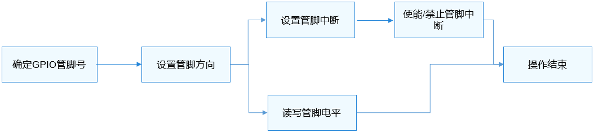

# GPIO使用指导<a name="ZH-CN_TOPIC_0000001052937593"></a>

## 使用流程<a name="section1583613406410"></a>

GPIO标准API通过GPIO管脚号来操作指定管脚，使用GPIO的一般流程如[图1](#fig1399416053717)所示。

**图 1**  GPIO使用流程图<a name="fig1399416053717"></a>  


## 确定GPIO管脚号<a name="section135943361443"></a>

不同SOC芯片由于其GPIO控制器型号、参数、以及控制器驱动的不同，GPIO管脚号的换算方式不一样。

-   Hi3516DV300

    控制器管理12组GPIO管脚，每组8个。

    GPIO号 = GPIO组索引 \(0\~11\) \* 每组GPIO管脚数\(8\) + 组内偏移

    举例：GPIO10\_3的GPIO号 = 10 \* 8 + 3 = 83

-   Hi3518EV300

    控制器管理10组GPIO管脚，每组10个。

    GPIO号 = GPIO组索引 \(0\~9\) \* 每组GPIO管脚数\(10\) + 组内偏移

    举例：GPIO7\_3的GPIO管脚号 = 7 \* 10 + 3 = 73


## 使用API操作GPIO管脚<a name="section69151114115315"></a>

-   设置GPIO管脚方向

    在进行GPIO管脚读写前，需要先通过如下函数设置GPIO管脚方向：

    int32\_t GpioSetDir\(uint16\_t gpio, uint16\_t dir\);

    **表 1**  GpioSetDir参数和返回值描述

    <a name="table63111557616"></a>
    <table><tbody><tr id="row17311165469"><td class="cellrowborder" valign="top" width="48.120000000000005%"><p id="p53110515616"><a name="p53110515616"></a><a name="p53110515616"></a><strong id="b10652133033813"><a name="b10652133033813"></a><a name="b10652133033813"></a>参数</strong></p>
    </td>
    <td class="cellrowborder" valign="top" width="51.88%"><p id="p5311454616"><a name="p5311454616"></a><a name="p5311454616"></a><strong id="b4664103014388"><a name="b4664103014388"></a><a name="b4664103014388"></a>参数描述</strong></p>
    </td>
    </tr>
    <tr id="row0312151666"><td class="cellrowborder" valign="top" width="48.120000000000005%"><p id="p1431265763"><a name="p1431265763"></a><a name="p1431265763"></a>gpio</p>
    </td>
    <td class="cellrowborder" valign="top" width="51.88%"><p id="p83121553613"><a name="p83121553613"></a><a name="p83121553613"></a>待设置的GPIO管脚号</p>
    </td>
    </tr>
    <tr id="row11312151619"><td class="cellrowborder" valign="top" width="48.120000000000005%"><p id="p173121451664"><a name="p173121451664"></a><a name="p173121451664"></a>dir</p>
    </td>
    <td class="cellrowborder" valign="top" width="51.88%"><p id="p153122520615"><a name="p153122520615"></a><a name="p153122520615"></a>待设置的方向值</p>
    </td>
    </tr>
    <tr id="row165937126386"><td class="cellrowborder" valign="top" width="48.120000000000005%"><p id="p83111453613"><a name="p83111453613"></a><a name="p83111453613"></a><strong id="b1611673413811"><a name="b1611673413811"></a><a name="b1611673413811"></a>返回值</strong></p>
    </td>
    <td class="cellrowborder" valign="top" width="51.88%"><p id="p83111151165"><a name="p83111151165"></a><a name="p83111151165"></a><strong id="b1511720344387"><a name="b1511720344387"></a><a name="b1511720344387"></a>返回值描述</strong></p>
    </td>
    </tr>
    <tr id="row205931212123817"><td class="cellrowborder" valign="top" width="48.120000000000005%"><p id="p18312151463"><a name="p18312151463"></a><a name="p18312151463"></a>0</p>
    </td>
    <td class="cellrowborder" valign="top" width="51.88%"><p id="p103124517618"><a name="p103124517618"></a><a name="p103124517618"></a>设置成功</p>
    </td>
    </tr>
    <tr id="row75931212153818"><td class="cellrowborder" valign="top" width="48.120000000000005%"><p id="p23121951261"><a name="p23121951261"></a><a name="p23121951261"></a>负数</p>
    </td>
    <td class="cellrowborder" valign="top" width="51.88%"><p id="p153121553610"><a name="p153121553610"></a><a name="p153121553610"></a>设置失败</p>
    </td>
    </tr>
    </tbody>
    </table>

-   读写GPIO管脚

    如果要读取一个GPIO管脚电平，通过以下函数完成：

    int32\_t GpioRead\(uint16\_t gpio, uint16\_t \*val\);

    **表 2**  GpioRead参数和返回值描述

    <a name="table20347743174816"></a>
    <table><tbody><tr id="row17348144394816"><td class="cellrowborder" valign="top" width="48.120000000000005%"><p id="p19348164313481"><a name="p19348164313481"></a><a name="p19348164313481"></a><strong id="b734894354816"><a name="b734894354816"></a><a name="b734894354816"></a>参数</strong></p>
    </td>
    <td class="cellrowborder" valign="top" width="51.88%"><p id="p134810432488"><a name="p134810432488"></a><a name="p134810432488"></a><strong id="b15348184316484"><a name="b15348184316484"></a><a name="b15348184316484"></a>参数描述</strong></p>
    </td>
    </tr>
    <tr id="row134874324814"><td class="cellrowborder" valign="top" width="48.120000000000005%"><p id="p183481437485"><a name="p183481437485"></a><a name="p183481437485"></a>gpio</p>
    </td>
    <td class="cellrowborder" valign="top" width="51.88%"><p id="p43481043194819"><a name="p43481043194819"></a><a name="p43481043194819"></a>待读取的GPIO管脚号</p>
    </td>
    </tr>
    <tr id="row20348343144815"><td class="cellrowborder" valign="top" width="48.120000000000005%"><p id="p1534864310480"><a name="p1534864310480"></a><a name="p1534864310480"></a>val</p>
    </td>
    <td class="cellrowborder" valign="top" width="51.88%"><p id="p13689159154815"><a name="p13689159154815"></a><a name="p13689159154815"></a>接收读取电平值的指针</p>
    </td>
    </tr>
    <tr id="row19348043154813"><td class="cellrowborder" valign="top" width="48.120000000000005%"><p id="p1234812431480"><a name="p1234812431480"></a><a name="p1234812431480"></a><strong id="b153481443164810"><a name="b153481443164810"></a><a name="b153481443164810"></a>返回值</strong></p>
    </td>
    <td class="cellrowborder" valign="top" width="51.88%"><p id="p434894334814"><a name="p434894334814"></a><a name="p434894334814"></a><strong id="b0348144312481"><a name="b0348144312481"></a><a name="b0348144312481"></a>返回值描述</strong></p>
    </td>
    </tr>
    <tr id="row3348184311486"><td class="cellrowborder" valign="top" width="48.120000000000005%"><p id="p1934854315487"><a name="p1934854315487"></a><a name="p1934854315487"></a>0</p>
    </td>
    <td class="cellrowborder" valign="top" width="51.88%"><p id="p103481943114814"><a name="p103481943114814"></a><a name="p103481943114814"></a>读取成功</p>
    </td>
    </tr>
    <tr id="row23485436482"><td class="cellrowborder" valign="top" width="48.120000000000005%"><p id="p1134834310486"><a name="p1134834310486"></a><a name="p1134834310486"></a>负数</p>
    </td>
    <td class="cellrowborder" valign="top" width="51.88%"><p id="p93491343144815"><a name="p93491343144815"></a><a name="p93491343144815"></a>读取失败</p>
    </td>
    </tr>
    </tbody>
    </table>

    如果要向GPIO管脚写入电平值，通过以下函数完成：

    int32\_t GpioWrite\(uint16\_t gpio, uint16\_t val\);

    **表 3**  GpioWrite参数和返回值描述

    <a name="table1214911207520"></a>
    <table><tbody><tr id="row6149720175218"><td class="cellrowborder" valign="top" width="48.120000000000005%"><p id="p18149132005216"><a name="p18149132005216"></a><a name="p18149132005216"></a><strong id="b18592193305318"><a name="b18592193305318"></a><a name="b18592193305318"></a>参数</strong></p>
    </td>
    <td class="cellrowborder" valign="top" width="51.88%"><p id="p16149220145216"><a name="p16149220145216"></a><a name="p16149220145216"></a><strong id="b259293317533"><a name="b259293317533"></a><a name="b259293317533"></a>参数描述</strong></p>
    </td>
    </tr>
    <tr id="row16149102014526"><td class="cellrowborder" valign="top" width="48.120000000000005%"><p id="p31495206527"><a name="p31495206527"></a><a name="p31495206527"></a>gpio</p>
    </td>
    <td class="cellrowborder" valign="top" width="51.88%"><p id="p1014972085212"><a name="p1014972085212"></a><a name="p1014972085212"></a>待写入的GPIO管脚号</p>
    </td>
    </tr>
    <tr id="row3149112095214"><td class="cellrowborder" valign="top" width="48.120000000000005%"><p id="p1815072011528"><a name="p1815072011528"></a><a name="p1815072011528"></a>val</p>
    </td>
    <td class="cellrowborder" valign="top" width="51.88%"><p id="p1931618337524"><a name="p1931618337524"></a><a name="p1931618337524"></a>待写入的电平值</p>
    </td>
    </tr>
    <tr id="row1115062015220"><td class="cellrowborder" valign="top" width="48.120000000000005%"><p id="p10150172015218"><a name="p10150172015218"></a><a name="p10150172015218"></a><strong id="b62491230155318"><a name="b62491230155318"></a><a name="b62491230155318"></a>返回值</strong></p>
    </td>
    <td class="cellrowborder" valign="top" width="51.88%"><p id="p1150192015527"><a name="p1150192015527"></a><a name="p1150192015527"></a><strong id="b19249183017531"><a name="b19249183017531"></a><a name="b19249183017531"></a>返回值描述</strong></p>
    </td>
    </tr>
    <tr id="row111503202526"><td class="cellrowborder" valign="top" width="48.120000000000005%"><p id="p171501320205216"><a name="p171501320205216"></a><a name="p171501320205216"></a>0</p>
    </td>
    <td class="cellrowborder" valign="top" width="51.88%"><p id="p15150102017522"><a name="p15150102017522"></a><a name="p15150102017522"></a>写入成功</p>
    </td>
    </tr>
    <tr id="row1615002018528"><td class="cellrowborder" valign="top" width="48.120000000000005%"><p id="p15150182045212"><a name="p15150182045212"></a><a name="p15150182045212"></a>负数</p>
    </td>
    <td class="cellrowborder" valign="top" width="51.88%"><p id="p13150320105212"><a name="p13150320105212"></a><a name="p13150320105212"></a>写入失败</p>
    </td>
    </tr>
    </tbody>
    </table>

    示例代码：

    ```
    int32_t ret;
    uint16_t val;
    /* 将3号GPIO管脚配置为输出 */
    ret = GpioSetDir(3, GPIO_DIR_OUT);
    if (ret != 0) {
        HDF_LOGE("GpioSerDir: failed, ret %d\n", ret);
        return;
    }
    /* 向3号GPIO管脚写入低电平GPIO_VAL_LOW */
    ret = GpioWrite(3, GPIO_VAL_LOW);
    if (ret != 0) {
        HDF_LOGE("GpioWrite: failed, ret %d\n", ret);
        return;
    }
    /* 将6号GPIO管脚配置为输入 */
    ret = GpioSetDir(6, GPIO_DIR_IN);
    if (ret != 0) {
        HDF_LOGE("GpioSetDir: failed, ret %d\n", ret);
        return;
    }
    /* 读取6号GPIO管脚的电平值 */
    ret = GpioRead(6, &val);
    ```


-   设置GPIO中断

    如果要为一个GPIO管脚设置中断响程序，使用如下函数：

    int32\_t GpioSetIrq\(uint16\_t gpio, uint16\_t mode, GpioIrqFunc func, void \*arg\);

    **表 4**  GpioSetIrq参数和返回值描述

    <a name="table16804111812466"></a>
    <table><tbody><tr id="row880401834615"><td class="cellrowborder" valign="top" width="48.54%"><p id="p380491819469"><a name="p380491819469"></a><a name="p380491819469"></a><strong id="b1937285817588"><a name="b1937285817588"></a><a name="b1937285817588"></a>参数</strong></p>
    </td>
    <td class="cellrowborder" valign="top" width="51.459999999999994%"><p id="p48041318114619"><a name="p48041318114619"></a><a name="p48041318114619"></a><strong id="b16384758165818"><a name="b16384758165818"></a><a name="b16384758165818"></a>参数描述</strong></p>
    </td>
    </tr>
    <tr id="row19805181812465"><td class="cellrowborder" valign="top" width="48.54%"><p id="p11805101874611"><a name="p11805101874611"></a><a name="p11805101874611"></a>gpio</p>
    </td>
    <td class="cellrowborder" valign="top" width="51.459999999999994%"><p id="p6805181818461"><a name="p6805181818461"></a><a name="p6805181818461"></a>GPIO管脚号</p>
    </td>
    </tr>
    <tr id="row1080541817469"><td class="cellrowborder" valign="top" width="48.54%"><p id="p580541864611"><a name="p580541864611"></a><a name="p580541864611"></a>mode</p>
    </td>
    <td class="cellrowborder" valign="top" width="51.459999999999994%"><p id="p380511180463"><a name="p380511180463"></a><a name="p380511180463"></a>中断触发模式</p>
    </td>
    </tr>
    <tr id="row83541951134617"><td class="cellrowborder" valign="top" width="48.54%"><p id="p5355351104610"><a name="p5355351104610"></a><a name="p5355351104610"></a>func</p>
    </td>
    <td class="cellrowborder" valign="top" width="51.459999999999994%"><p id="p11355551174619"><a name="p11355551174619"></a><a name="p11355551174619"></a>中断服务程序</p>
    </td>
    </tr>
    <tr id="row6593577469"><td class="cellrowborder" valign="top" width="48.54%"><p id="p165985724619"><a name="p165985724619"></a><a name="p165985724619"></a>arg</p>
    </td>
    <td class="cellrowborder" valign="top" width="51.459999999999994%"><p id="p559185784619"><a name="p559185784619"></a><a name="p559185784619"></a>传递给中断服务程序的入参</p>
    </td>
    </tr>
    <tr id="row16299193210587"><td class="cellrowborder" valign="top" width="48.54%"><p id="p7804101884614"><a name="p7804101884614"></a><a name="p7804101884614"></a><strong id="b13238195920"><a name="b13238195920"></a><a name="b13238195920"></a>返回值</strong></p>
    </td>
    <td class="cellrowborder" valign="top" width="51.459999999999994%"><p id="p680441818466"><a name="p680441818466"></a><a name="p680441818466"></a><strong id="b8324161105915"><a name="b8324161105915"></a><a name="b8324161105915"></a>返回值描述</strong></p>
    </td>
    </tr>
    <tr id="row12299632125817"><td class="cellrowborder" valign="top" width="48.54%"><p id="p1180511189465"><a name="p1180511189465"></a><a name="p1180511189465"></a>0</p>
    </td>
    <td class="cellrowborder" valign="top" width="51.459999999999994%"><p id="p180521812465"><a name="p180521812465"></a><a name="p180521812465"></a>设置成功</p>
    </td>
    </tr>
    <tr id="row029833235815"><td class="cellrowborder" valign="top" width="48.54%"><p id="p1080591814468"><a name="p1080591814468"></a><a name="p1080591814468"></a>负数</p>
    </td>
    <td class="cellrowborder" valign="top" width="51.459999999999994%"><p id="p18805141884611"><a name="p18805141884611"></a><a name="p18805141884611"></a>设置失败</p>
    </td>
    </tr>
    </tbody>
    </table>

    > **注意：** 
    >同一时间，只能为某个GPIO管脚设置一个中断服务函数，如果重复调用GpioSetIrq函数，则之前设置的中断服务函数会被取代。

    当不再需要响应中断服务函数时，使用如下函数取消中断设置：

    int32\_t GpioUnSetIrq\(uint16\_t gpio\);

    **表 5**  GpioUnSetIrq参数和返回值描述

    <a name="table1157224664316"></a>
    <table><tbody><tr id="row175721546174317"><td class="cellrowborder" valign="top" width="48.54%"><p id="p16572144694311"><a name="p16572144694311"></a><a name="p16572144694311"></a><strong id="b55727462431"><a name="b55727462431"></a><a name="b55727462431"></a>参数</strong></p>
    </td>
    <td class="cellrowborder" valign="top" width="51.459999999999994%"><p id="p185721461435"><a name="p185721461435"></a><a name="p185721461435"></a><strong id="b057213467438"><a name="b057213467438"></a><a name="b057213467438"></a>参数描述</strong></p>
    </td>
    </tr>
    <tr id="row1257284664318"><td class="cellrowborder" valign="top" width="48.54%"><p id="p95721946144317"><a name="p95721946144317"></a><a name="p95721946144317"></a>gpio</p>
    </td>
    <td class="cellrowborder" valign="top" width="51.459999999999994%"><p id="p1557313464439"><a name="p1557313464439"></a><a name="p1557313464439"></a>GPIO管脚号</p>
    </td>
    </tr>
    <tr id="row1857324618435"><td class="cellrowborder" valign="top" width="48.54%"><p id="p1257344624314"><a name="p1257344624314"></a><a name="p1257344624314"></a><strong id="b145738464432"><a name="b145738464432"></a><a name="b145738464432"></a>返回值</strong></p>
    </td>
    <td class="cellrowborder" valign="top" width="51.459999999999994%"><p id="p457384611439"><a name="p457384611439"></a><a name="p457384611439"></a><strong id="b17573104618432"><a name="b17573104618432"></a><a name="b17573104618432"></a>返回值描述</strong></p>
    </td>
    </tr>
    <tr id="row357318466439"><td class="cellrowborder" valign="top" width="48.54%"><p id="p1573164616438"><a name="p1573164616438"></a><a name="p1573164616438"></a>0</p>
    </td>
    <td class="cellrowborder" valign="top" width="51.459999999999994%"><p id="p857384614319"><a name="p857384614319"></a><a name="p857384614319"></a>取消成功</p>
    </td>
    </tr>
    <tr id="row18573124610433"><td class="cellrowborder" valign="top" width="48.54%"><p id="p165731146134311"><a name="p165731146134311"></a><a name="p165731146134311"></a>负数</p>
    </td>
    <td class="cellrowborder" valign="top" width="51.459999999999994%"><p id="p6573164613437"><a name="p6573164613437"></a><a name="p6573164613437"></a>取消失败</p>
    </td>
    </tr>
    </tbody>
    </table>

    在中断服务程序设置完成后，还需要先通过如下函数使能GPIO管脚的中断：

    int32\_t GpioEnableIrq\(uint16\_t gpio\);

    **表 6**  GpioEnableIrq参数和返回值描述

    <a name="table26659291568"></a>
    <table><tbody><tr id="row866632919566"><td class="cellrowborder" valign="top" width="50%"><p id="p066642985615"><a name="p066642985615"></a><a name="p066642985615"></a><strong id="b050110291902"><a name="b050110291902"></a><a name="b050110291902"></a>参数</strong></p>
    </td>
    <td class="cellrowborder" valign="top" width="50%"><p id="p566613293568"><a name="p566613293568"></a><a name="p566613293568"></a><strong id="b95144291405"><a name="b95144291405"></a><a name="b95144291405"></a>参数描述</strong></p>
    </td>
    </tr>
    <tr id="row19666029165620"><td class="cellrowborder" valign="top" width="50%"><p id="p16660295566"><a name="p16660295566"></a><a name="p16660295566"></a>gpio</p>
    </td>
    <td class="cellrowborder" valign="top" width="50%"><p id="p1566632916566"><a name="p1566632916566"></a><a name="p1566632916566"></a>GPIO管脚号</p>
    </td>
    </tr>
    <tr id="row84182176010"><td class="cellrowborder" valign="top" width="50%"><p id="p1566652915566"><a name="p1566652915566"></a><a name="p1566652915566"></a><strong id="b16177133216016"><a name="b16177133216016"></a><a name="b16177133216016"></a>返回值</strong></p>
    </td>
    <td class="cellrowborder" valign="top" width="50%"><p id="p966642917562"><a name="p966642917562"></a><a name="p966642917562"></a><strong id="b101898323018"><a name="b101898323018"></a><a name="b101898323018"></a>返回值描述</strong></p>
    </td>
    </tr>
    <tr id="row154188171403"><td class="cellrowborder" valign="top" width="50%"><p id="p1866610292563"><a name="p1866610292563"></a><a name="p1866610292563"></a>0</p>
    </td>
    <td class="cellrowborder" valign="top" width="50%"><p id="p13666182975613"><a name="p13666182975613"></a><a name="p13666182975613"></a>使能成功</p>
    </td>
    </tr>
    <tr id="row1041891720012"><td class="cellrowborder" valign="top" width="50%"><p id="p766642911562"><a name="p766642911562"></a><a name="p766642911562"></a>负数</p>
    </td>
    <td class="cellrowborder" valign="top" width="50%"><p id="p1566652995613"><a name="p1566652995613"></a><a name="p1566652995613"></a>使能失败</p>
    </td>
    </tr>
    </tbody>
    </table>

    > **注意：** 
    >必须通过此函数使能管脚中断，之前设置的中断服务函数才能被正确响应。

    如果要临时屏蔽此中断，可以通过如下函数禁止GPIO管脚中断：

    int32\_t GpioDisableIrq\(uint16\_t gpio\);

    **表 7**  GpioDisableIrq参数和返回值描述

    <a name="table186682041918"></a>
    <table><tbody><tr id="row186684413116"><td class="cellrowborder" valign="top" width="50%"><p id="p866844916"><a name="p866844916"></a><a name="p866844916"></a><strong id="b196681541715"><a name="b196681541715"></a><a name="b196681541715"></a>参数</strong></p>
    </td>
    <td class="cellrowborder" valign="top" width="50%"><p id="p46681413119"><a name="p46681413119"></a><a name="p46681413119"></a><strong id="b1966817414115"><a name="b1966817414115"></a><a name="b1966817414115"></a>参数描述</strong></p>
    </td>
    </tr>
    <tr id="row4668243113"><td class="cellrowborder" valign="top" width="50%"><p id="p46681141919"><a name="p46681141919"></a><a name="p46681141919"></a>gpio</p>
    </td>
    <td class="cellrowborder" valign="top" width="50%"><p id="p136681241311"><a name="p136681241311"></a><a name="p136681241311"></a>GPIO管脚号</p>
    </td>
    </tr>
    <tr id="row066884412"><td class="cellrowborder" valign="top" width="50%"><p id="p566824015"><a name="p566824015"></a><a name="p566824015"></a><strong id="b9668144120"><a name="b9668144120"></a><a name="b9668144120"></a>返回值</strong></p>
    </td>
    <td class="cellrowborder" valign="top" width="50%"><p id="p1766974515"><a name="p1766974515"></a><a name="p1766974515"></a><strong id="b466919418114"><a name="b466919418114"></a><a name="b466919418114"></a>返回值描述</strong></p>
    </td>
    </tr>
    <tr id="row156694410112"><td class="cellrowborder" valign="top" width="50%"><p id="p14669141214"><a name="p14669141214"></a><a name="p14669141214"></a>0</p>
    </td>
    <td class="cellrowborder" valign="top" width="50%"><p id="p1266934818"><a name="p1266934818"></a><a name="p1266934818"></a>禁止成功</p>
    </td>
    </tr>
    <tr id="row176691543117"><td class="cellrowborder" valign="top" width="50%"><p id="p7669941716"><a name="p7669941716"></a><a name="p7669941716"></a>负数</p>
    </td>
    <td class="cellrowborder" valign="top" width="50%"><p id="p4669164219"><a name="p4669164219"></a><a name="p4669164219"></a>禁止失败</p>
    </td>
    </tr>
    </tbody>
    </table>

    示例代码：

    ```
    /* 中断服务函数
    */
    int32_t MyCallBackFunc(uint16_t gpio, void *data)
    {
        HDF_LOGI("%s: gpio:%u interrupt service in! data=%p\n", __func__, gpio, data);
        return 0;
    }
    
    int32_t ret;
    /* 设置中断服务程序为MyCallBackFunc，入参为NULL，中断触发模式为上升沿触发 */
    ret = GpioSetIrq(3, OSAL_IRQF_TRIGGER_RISING, MyCallBackFunc, NULL);
    if (ret != 0) {
        HDF_LOGE("GpioSetIrq: failed, ret %d\n", ret);
        return;
    }
    
    /* 使能3号GPIO管脚中断 */
    ret = GpioEnableIrq(3);
    if (ret != 0) {
        HDF_LOGE("GpioEnableIrq: failed, ret %d\n", ret);
        return;
    }
    
    /* 禁止3号GPIO管脚中断 */
    ret = GpioDisableIrq(3);
    if (ret != 0) {
        HDF_LOGE("GpioDisableIrq: failed, ret %d\n", ret);
        return;
    }
    
    /* 取消3号GPIO管脚中断服务程序 */
    ret = GpioUnSetIrq(3);
    if (ret != 0) {
        HDF_LOGE("GpioUnSetIrq: failed, ret %d\n", ret);
        return;
    }
    ```


