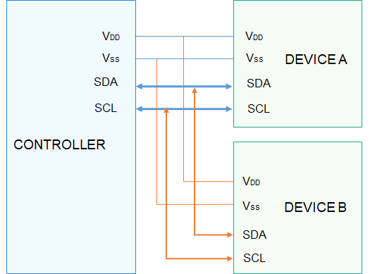

# I2C概述

## 简介

-   I2C\(Inter Integrated Circuit\)总线是由Philips公司开发的一种简单、双向二线制同步串行总线。
-   I2C以主从方式工作，通常有一个主设备和一个或者多个从设备，主从设备通过SDA\(SerialData\)串行数据线以及SCL\(SerialClock\)串行时钟线两根线相连，如[图1 ](#fig1135561232714)所示。

-   I2C数据的传输必须以一个起始信号作为开始条件，以一个结束信号作为传输的停止条件。数据传输以字节为单位，高位在前，逐个bit进行传输。
-   I2C总线上的每一个设备都可以作为主设备或者从设备，而且每一个设备都会对应一个唯一的地址，当主设备需要和某一个从设备通信时，通过广播的方式，将从设备地址写到总线上，如果某个从设备符合此地址，将会发出应答信号，建立传输。

-   I2C接口定义了完成I2C传输的通用方法集合，包括：

    -   I2C控制器管理:  打开或关闭I2C控制器
    -   I2C消息传输：通过消息传输结构体数组进行自定义传输

    **图 1**  I2C物理连线示意图  
    

## 接口说明

**表 1**  I2C驱动API接口功能介绍

<table><thead align="left"><tr id="row4419501537"><th class="cellrowborder" valign="top" width="18.63%" id="mcps1.2.4.1.1">
功能分类

</th>
<th class="cellrowborder" valign="top" width="28.03%" id="mcps1.2.4.1.2">
接口名

</th>
<th class="cellrowborder" valign="top" width="53.339999999999996%" id="mcps1.2.4.1.3">
描述

</th>
</tr>
</thead>
<tbody><tr id="row34145016535"><td class="cellrowborder" rowspan="2" valign="top" width="18.63%" headers="mcps1.2.4.1.1 ">
I2C控制器管理接口

</td>
<td class="cellrowborder" valign="top" width="28.03%" headers="mcps1.2.4.1.2 ">
I2cOpen

</td>
<td class="cellrowborder" valign="top" width="53.339999999999996%" headers="mcps1.2.4.1.3 ">
打开I2C控制器

</td>
</tr>
<tr id="row5632152611414"><td class="cellrowborder" valign="top" headers="mcps1.2.4.1.1 ">
I2cClose

</td>
<td class="cellrowborder" valign="top" headers="mcps1.2.4.1.2 ">
关闭I2C控制器

</td>
</tr>
<tr id="row15108165391412"><td class="cellrowborder" valign="top" width="18.63%" headers="mcps1.2.4.1.1 ">
I2c消息传输接口

</td>
<td class="cellrowborder" valign="top" width="28.03%" headers="mcps1.2.4.1.2 ">
I2cTransfer

</td>
<td class="cellrowborder" valign="top" width="53.339999999999996%" headers="mcps1.2.4.1.3 ">
自定义传输

</td>
</tr>
</tbody>
</table>

> **说明：** 
>本文涉及的所有接口，仅限内核态使用，不支持在用户态使用。

