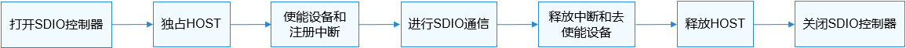

# SDIO使用指导<a name="ZH-CN_TOPIC_0000001052218016"></a>

## 使用流程<a name="section1962415610383"></a>

使用SDIO的一般流程如[图1](SPI使用指导.md#fig23885455594)所示。

**图 1**  SDIO使用流程图<a name="fig112731977522"></a>  




## 打开SDIO控制器<a name="section814751015461"></a>

在使用SDIO进行通信前，首先要调用SdioOpen获取SDIO控制器的设备句柄，该函数会返回指定总线号的SDIO控制器的设备句柄。

struct DevHandle \*SdioOpen\(int16\_t busNum\);

**表 1**  SdioOpen函数的参数和返回值描述

<a name="table511305944514"></a>
<table><thead align="left"><tr id="row1011212598452"><th class="cellrowborder" valign="top" width="50%" id="mcps1.2.3.1.1"><p id="p141124595457"><a name="p141124595457"></a><a name="p141124595457"></a>参数</p>
</th>
<th class="cellrowborder" valign="top" width="50%" id="mcps1.2.3.1.2"><p id="p1111214593455"><a name="p1111214593455"></a><a name="p1111214593455"></a>参数描述</p>
</th>
</tr>
</thead>
<tbody><tr id="row19112195918454"><td class="cellrowborder" valign="top" width="50%" headers="mcps1.2.3.1.1 "><p id="p11121759124515"><a name="p11121759124515"></a><a name="p11121759124515"></a>busNum</p>
</td>
<td class="cellrowborder" valign="top" width="50%" headers="mcps1.2.3.1.2 "><p id="p111121459194519"><a name="p111121459194519"></a><a name="p111121459194519"></a>SDIO的总线号</p>
</td>
</tr>
<tr id="row6112659184518"><td class="cellrowborder" valign="top" width="50%" headers="mcps1.2.3.1.1 "><p id="p1112105919453"><a name="p1112105919453"></a><a name="p1112105919453"></a><strong id="b611215594453"><a name="b611215594453"></a><a name="b611215594453"></a>返回值</strong></p>
</td>
<td class="cellrowborder" valign="top" width="50%" headers="mcps1.2.3.1.2 "><p id="p6112659114518"><a name="p6112659114518"></a><a name="p6112659114518"></a><strong id="b911295984510"><a name="b911295984510"></a><a name="b911295984510"></a>返回值描述</strong></p>
</td>
</tr>
<tr id="row3113559164519"><td class="cellrowborder" valign="top" width="50%" headers="mcps1.2.3.1.1 "><p id="p51121159104517"><a name="p51121159104517"></a><a name="p51121159104517"></a>NULL</p>
</td>
<td class="cellrowborder" valign="top" width="50%" headers="mcps1.2.3.1.2 "><p id="p1811313597458"><a name="p1811313597458"></a><a name="p1811313597458"></a>获取SDIO控制器的设备句柄失败</p>
</td>
</tr>
<tr id="row201131059194512"><td class="cellrowborder" valign="top" width="50%" headers="mcps1.2.3.1.1 "><p id="p1311375919456"><a name="p1311375919456"></a><a name="p1311375919456"></a>设备句柄</p>
</td>
<td class="cellrowborder" valign="top" width="50%" headers="mcps1.2.3.1.2 "><p id="p1911312599450"><a name="p1911312599450"></a><a name="p1911312599450"></a>SDIO控制器的设备句柄</p>
</td>
</tr>
</tbody>
</table>

打开SDIO控制器的示例如下：

```
struct DevHandle *handle = NULL;
int16_t busNum = 1;
/* 打开总线号为1的SDIO控制器 */
handle = SdioOpen(busNum);
if (handle == NULL) {
    HDF_LOGE("SdioOpen: failed!\n");
}
```

## 独占HOST<a name="section49274582455"></a>

获取到SDIO控制器的设备句柄之后，需要先独占HOST才能进行SDIO后续的一系列操作，独占HOST函数如下所示：

void SdioClaimHost\(struct DevHandle \*handle\);

**表 2**  SdioClaimHost函数的参数描述

<a name="table14114175994514"></a>
<table><thead align="left"><tr id="row1211325914459"><th class="cellrowborder" valign="top" width="50%" id="mcps1.2.3.1.1"><p id="p611365954517"><a name="p611365954517"></a><a name="p611365954517"></a>参数</p>
</th>
<th class="cellrowborder" valign="top" width="50%" id="mcps1.2.3.1.2"><p id="p1711365954510"><a name="p1711365954510"></a><a name="p1711365954510"></a>参数描述</p>
</th>
</tr>
</thead>
<tbody><tr id="row3114205920451"><td class="cellrowborder" valign="top" width="50%" headers="mcps1.2.3.1.1 "><p id="p181141592457"><a name="p181141592457"></a><a name="p181141592457"></a>handle</p>
</td>
<td class="cellrowborder" valign="top" width="50%" headers="mcps1.2.3.1.2 "><p id="p41144595458"><a name="p41144595458"></a><a name="p41144595458"></a>SDIO控制器的设备句柄</p>
</td>
</tr>
</tbody>
</table>

独占HOST示例如下：

```
SdioClaimHost(handle); /* 独占HOST */
```

## 使能SDIO设备<a name="section1431520410489"></a>

在访问寄存器之前，需要先使能SDIO设备，使能SDIO设备的函数如下所示：

int32\_t SdioEnableFunc\(struct DevHandle \*handle\);

**表 3**  SdioEnableFunc函数的参数和返回值描述

<a name="table144881047485"></a>
<table><thead align="left"><tr id="row8487204184815"><th class="cellrowborder" valign="top" width="50%" id="mcps1.2.3.1.1"><p id="p1648611415486"><a name="p1648611415486"></a><a name="p1648611415486"></a>参数</p>
</th>
<th class="cellrowborder" valign="top" width="50%" id="mcps1.2.3.1.2"><p id="p19487134124820"><a name="p19487134124820"></a><a name="p19487134124820"></a>参数描述</p>
</th>
</tr>
</thead>
<tbody><tr id="row16487044480"><td class="cellrowborder" valign="top" width="50%" headers="mcps1.2.3.1.1 "><p id="p74878414810"><a name="p74878414810"></a><a name="p74878414810"></a>handle</p>
</td>
<td class="cellrowborder" valign="top" width="50%" headers="mcps1.2.3.1.2 "><p id="p17487184194819"><a name="p17487184194819"></a><a name="p17487184194819"></a>SDIO控制器的设备句柄</p>
</td>
</tr>
<tr id="row13487748487"><td class="cellrowborder" valign="top" width="50%" headers="mcps1.2.3.1.1 "><p id="p24873424811"><a name="p24873424811"></a><a name="p24873424811"></a><strong id="b348754124819"><a name="b348754124819"></a><a name="b348754124819"></a>返回值</strong></p>
</td>
<td class="cellrowborder" valign="top" width="50%" headers="mcps1.2.3.1.2 "><p id="p4487174134813"><a name="p4487174134813"></a><a name="p4487174134813"></a><strong id="b134877434810"><a name="b134877434810"></a><a name="b134877434810"></a>返回值描述</strong></p>
</td>
</tr>
<tr id="row1748814494812"><td class="cellrowborder" valign="top" width="50%" headers="mcps1.2.3.1.1 "><p id="p84878410488"><a name="p84878410488"></a><a name="p84878410488"></a>0</p>
</td>
<td class="cellrowborder" valign="top" width="50%" headers="mcps1.2.3.1.2 "><p id="p948715410483"><a name="p948715410483"></a><a name="p948715410483"></a>SDIO使能成功</p>
</td>
</tr>
<tr id="row54881416482"><td class="cellrowborder" valign="top" width="50%" headers="mcps1.2.3.1.1 "><p id="p24881645489"><a name="p24881645489"></a><a name="p24881645489"></a>负数</p>
</td>
<td class="cellrowborder" valign="top" width="50%" headers="mcps1.2.3.1.2 "><p id="p10488247487"><a name="p10488247487"></a><a name="p10488247487"></a>SDIO使能失败</p>
</td>
</tr>
</tbody>
</table>

使能SDIO设备的示例如下：

```
int32_t ret;
/* 使能SDIO设备 */
ret = SdioEnableFunc(handle);
if (ret != 0) {
    HDF_LOGE("SdioEnableFunc: failed, ret %d\n", ret);
}
```

## 注册SDIO中断<a name="section3662781537"></a>

在通信之前，还需要注册SDIO中断，注册SDIO中断函数如下图所示：

int32\_t SdioClaimIrq\(struct DevHandle \*handle, SdioIrqHandler \*handler\);

**表 4**  SdioClaimIrq函数的参数和返回值描述

<a name="table1149014114815"></a>
<table><thead align="left"><tr id="row114891042488"><th class="cellrowborder" valign="top" width="49.980000000000004%" id="mcps1.2.3.1.1"><p id="p1348864164811"><a name="p1348864164811"></a><a name="p1348864164811"></a>参数</p>
</th>
<th class="cellrowborder" valign="top" width="50.019999999999996%" id="mcps1.2.3.1.2"><p id="p14885410486"><a name="p14885410486"></a><a name="p14885410486"></a>参数描述</p>
</th>
</tr>
</thead>
<tbody><tr id="row048911404820"><td class="cellrowborder" valign="top" width="49.980000000000004%" headers="mcps1.2.3.1.1 "><p id="p248974174814"><a name="p248974174814"></a><a name="p248974174814"></a>handle</p>
</td>
<td class="cellrowborder" valign="top" width="50.019999999999996%" headers="mcps1.2.3.1.2 "><p id="p1848915494813"><a name="p1848915494813"></a><a name="p1848915494813"></a>SDIO控制器的设备句柄</p>
</td>
</tr>
<tr id="row204894454813"><td class="cellrowborder" valign="top" width="49.980000000000004%" headers="mcps1.2.3.1.1 "><p id="p17489944488"><a name="p17489944488"></a><a name="p17489944488"></a>handler</p>
</td>
<td class="cellrowborder" valign="top" width="50.019999999999996%" headers="mcps1.2.3.1.2 "><p id="p1548984174813"><a name="p1548984174813"></a><a name="p1548984174813"></a>中断服务函数指针</p>
</td>
</tr>
<tr id="row44898413488"><td class="cellrowborder" valign="top" width="49.980000000000004%" headers="mcps1.2.3.1.1 "><p id="p1548934124815"><a name="p1548934124815"></a><a name="p1548934124815"></a><strong id="b1448911410486"><a name="b1448911410486"></a><a name="b1448911410486"></a>返回值</strong></p>
</td>
<td class="cellrowborder" valign="top" width="50.019999999999996%" headers="mcps1.2.3.1.2 "><p id="p54891444485"><a name="p54891444485"></a><a name="p54891444485"></a><strong id="b13489104164810"><a name="b13489104164810"></a><a name="b13489104164810"></a>返回值描述</strong></p>
</td>
</tr>
<tr id="row748994144811"><td class="cellrowborder" valign="top" width="49.980000000000004%" headers="mcps1.2.3.1.1 "><p id="p448918415484"><a name="p448918415484"></a><a name="p448918415484"></a>0</p>
</td>
<td class="cellrowborder" valign="top" width="50.019999999999996%" headers="mcps1.2.3.1.2 "><p id="p174892412489"><a name="p174892412489"></a><a name="p174892412489"></a>注册中断成功</p>
</td>
</tr>
<tr id="row448914420489"><td class="cellrowborder" valign="top" width="49.980000000000004%" headers="mcps1.2.3.1.1 "><p id="p248912464817"><a name="p248912464817"></a><a name="p248912464817"></a>负数</p>
</td>
<td class="cellrowborder" valign="top" width="50.019999999999996%" headers="mcps1.2.3.1.2 "><p id="p34891645485"><a name="p34891645485"></a><a name="p34891645485"></a>注册中断失败</p>
</td>
</tr>
</tbody>
</table>

注册SDIO中的示例如下：

```
/* 中断服务函数需要根据各自平台的情况去实现 */
static void SdioIrqFunc(void *data)
{
    if (data == NULL) {
        HDF_LOGE("SdioIrqFunc: data is NULL.\n");
        return;
    }
    /* 需要开发者自行添加具体实现 */
}

int32_t ret;
/* 注册SDIO中断 */
ret = SdioClaimIrq(handle, SdioIrqFunc);
if (ret != 0) {
    HDF_LOGE("SdioClaimIrq: failed, ret %d\n", ret);
}
```

## 进行SDIO通信<a name="section391941913484"></a>

-   向SDIO设备增量写入指定长度的数据

对应的接口函数如下所示：

int32\_t SdioWriteBytes\(struct DevHandle \*handle, uint8\_t \*data, uint32\_t addr, uint32\_t size, uint32\_t timeOut\);

**表 5**  SdioWriteBytes函数的参数和返回值描述

<a name="table6887174174111"></a>
<table><thead align="left"><tr id="row10887144111419"><th class="cellrowborder" valign="top" width="50%" id="mcps1.2.3.1.1"><p id="p181381751164113"><a name="p181381751164113"></a><a name="p181381751164113"></a>参数</p>
</th>
<th class="cellrowborder" valign="top" width="50%" id="mcps1.2.3.1.2"><p id="p19138115184116"><a name="p19138115184116"></a><a name="p19138115184116"></a>参数描述</p>
</th>
</tr>
</thead>
<tbody><tr id="row4887341174114"><td class="cellrowborder" valign="top" width="50%" headers="mcps1.2.3.1.1 "><p id="p1534612017427"><a name="p1534612017427"></a><a name="p1534612017427"></a>handle</p>
</td>
<td class="cellrowborder" valign="top" width="50%" headers="mcps1.2.3.1.2 "><p id="p8179347434"><a name="p8179347434"></a><a name="p8179347434"></a>SDIO控制器的设备句柄</p>
</td>
</tr>
<tr id="row18881041144120"><td class="cellrowborder" valign="top" width="50%" headers="mcps1.2.3.1.1 "><p id="p10888154118412"><a name="p10888154118412"></a><a name="p10888154118412"></a>data</p>
</td>
<td class="cellrowborder" valign="top" width="50%" headers="mcps1.2.3.1.2 "><p id="p1288854115413"><a name="p1288854115413"></a><a name="p1288854115413"></a>待写入数据的指针</p>
</td>
</tr>
<tr id="row191054911432"><td class="cellrowborder" valign="top" width="50%" headers="mcps1.2.3.1.1 "><p id="p91054994311"><a name="p91054994311"></a><a name="p91054994311"></a>addr</p>
</td>
<td class="cellrowborder" valign="top" width="50%" headers="mcps1.2.3.1.2 "><p id="p111024915432"><a name="p111024915432"></a><a name="p111024915432"></a>待写入数据的起始地址</p>
</td>
</tr>
<tr id="row14888144124119"><td class="cellrowborder" valign="top" width="50%" headers="mcps1.2.3.1.1 "><p id="p1588814413412"><a name="p1588814413412"></a><a name="p1588814413412"></a>size</p>
</td>
<td class="cellrowborder" valign="top" width="50%" headers="mcps1.2.3.1.2 "><p id="p1288813411413"><a name="p1288813411413"></a><a name="p1288813411413"></a>待写入数据的长度</p>
</td>
</tr>
<tr id="row188213710445"><td class="cellrowborder" valign="top" width="50%" headers="mcps1.2.3.1.1 "><p id="p08227154415"><a name="p08227154415"></a><a name="p08227154415"></a>timeOut</p>
</td>
<td class="cellrowborder" valign="top" width="50%" headers="mcps1.2.3.1.2 "><p id="p6821875446"><a name="p6821875446"></a><a name="p6821875446"></a>写入数据的最大时间限制，单位毫秒。如果该字段为0，则使用平台对应的默认值。</p>
</td>
</tr>
<tr id="row18247654163519"><td class="cellrowborder" valign="top" width="50%" headers="mcps1.2.3.1.1 "><p id="p486155173610"><a name="p486155173610"></a><a name="p486155173610"></a><strong id="b169231220183618"><a name="b169231220183618"></a><a name="b169231220183618"></a>返回值</strong></p>
</td>
<td class="cellrowborder" valign="top" width="50%" headers="mcps1.2.3.1.2 "><p id="p1686155113620"><a name="p1686155113620"></a><a name="p1686155113620"></a><strong id="b9924152013365"><a name="b9924152013365"></a><a name="b9924152013365"></a>返回值描述</strong></p>
</td>
</tr>
<tr id="row10574165663512"><td class="cellrowborder" valign="top" width="50%" headers="mcps1.2.3.1.1 "><p id="p912141012364"><a name="p912141012364"></a><a name="p912141012364"></a>0</p>
</td>
<td class="cellrowborder" valign="top" width="50%" headers="mcps1.2.3.1.2 "><p id="p51219107363"><a name="p51219107363"></a><a name="p51219107363"></a>SDIO写数据成功</p>
</td>
</tr>
<tr id="row1490635883519"><td class="cellrowborder" valign="top" width="50%" headers="mcps1.2.3.1.1 "><p id="p10121510133617"><a name="p10121510133617"></a><a name="p10121510133617"></a>负数</p>
</td>
<td class="cellrowborder" valign="top" width="50%" headers="mcps1.2.3.1.2 "><p id="p131212106365"><a name="p131212106365"></a><a name="p131212106365"></a>SDIO写数据失败</p>
</td>
</tr>
</tbody>
</table>

向SDIO设备增量写入指定长度的数据的示例如下：

```
int32_t ret;
uint8_t wbuff[] = {1,2,3,4,5};
uint32_t addr = 0x100 + 0x09;
/* 向SDIO设备起始地址0x109，增量写入5个字节的数据 */
ret = SdioWriteBytes(handle, wbuff, addr, sizeof(wbuff) / sizeof(wbuff[0]), 0);
if (ret != 0) {
    HDF_LOGE("SdioWriteBytes: failed, ret %d\n", ret);
}
```

-   从SDIO设备增量读取指定长度的数据

对应的接口函数如下所示：

int32\_t SdioReadBytes\(struct DevHandle \*handle, uint8\_t \*data, uint32\_t addr, uint32\_t size, uint32\_t timeOut\);

**表 6**  SdioReadBytes函数的参数和返回值描述

<a name="table5783755152110"></a>
<table><thead align="left"><tr id="row19783355162116"><th class="cellrowborder" valign="top" width="50%" id="mcps1.2.3.1.1"><p id="p635754142212"><a name="p635754142212"></a><a name="p635754142212"></a>参数</p>
</th>
<th class="cellrowborder" valign="top" width="50%" id="mcps1.2.3.1.2"><p id="p1035774182215"><a name="p1035774182215"></a><a name="p1035774182215"></a>参数描述</p>
</th>
</tr>
</thead>
<tbody><tr id="row137831055192118"><td class="cellrowborder" valign="top" width="50%" headers="mcps1.2.3.1.1 "><p id="p14783155192114"><a name="p14783155192114"></a><a name="p14783155192114"></a>handle</p>
</td>
<td class="cellrowborder" valign="top" width="50%" headers="mcps1.2.3.1.2 "><p id="p9676437202218"><a name="p9676437202218"></a><a name="p9676437202218"></a>SDIO控制器的设备句柄</p>
</td>
</tr>
<tr id="row4784155102111"><td class="cellrowborder" valign="top" width="50%" headers="mcps1.2.3.1.1 "><p id="p1978455510217"><a name="p1978455510217"></a><a name="p1978455510217"></a>data</p>
</td>
<td class="cellrowborder" valign="top" width="50%" headers="mcps1.2.3.1.2 "><p id="p767683714223"><a name="p767683714223"></a><a name="p767683714223"></a>接收读取数据的指针</p>
</td>
</tr>
<tr id="row63651118499"><td class="cellrowborder" valign="top" width="50%" headers="mcps1.2.3.1.1 "><p id="p73669113496"><a name="p73669113496"></a><a name="p73669113496"></a>addr</p>
</td>
<td class="cellrowborder" valign="top" width="50%" headers="mcps1.2.3.1.2 "><p id="p53661144916"><a name="p53661144916"></a><a name="p53661144916"></a>待读取数据的起始地址</p>
</td>
</tr>
<tr id="row7784145510218"><td class="cellrowborder" valign="top" width="50%" headers="mcps1.2.3.1.1 "><p id="p1078413554219"><a name="p1078413554219"></a><a name="p1078413554219"></a>size</p>
</td>
<td class="cellrowborder" valign="top" width="50%" headers="mcps1.2.3.1.2 "><p id="p14676163782210"><a name="p14676163782210"></a><a name="p14676163782210"></a>待读取数据的长度</p>
</td>
</tr>
<tr id="row1823311517494"><td class="cellrowborder" valign="top" width="50%" headers="mcps1.2.3.1.1 "><p id="p723314152499"><a name="p723314152499"></a><a name="p723314152499"></a>timeOut</p>
</td>
<td class="cellrowborder" valign="top" width="50%" headers="mcps1.2.3.1.2 "><p id="p1323351515493"><a name="p1323351515493"></a><a name="p1323351515493"></a>读取数据的最大时间限制，单位毫秒。如果该字段为0，则使用平台对应的默认值。</p>
</td>
</tr>
<tr id="row964182643610"><td class="cellrowborder" valign="top" width="50%" headers="mcps1.2.3.1.1 "><p id="p7833639163612"><a name="p7833639163612"></a><a name="p7833639163612"></a><strong id="b122757566365"><a name="b122757566365"></a><a name="b122757566365"></a>返回值</strong></p>
</td>
<td class="cellrowborder" valign="top" width="50%" headers="mcps1.2.3.1.2 "><p id="p3833939113619"><a name="p3833939113619"></a><a name="p3833939113619"></a><strong id="b15276185619361"><a name="b15276185619361"></a><a name="b15276185619361"></a>返回值描述</strong></p>
</td>
</tr>
<tr id="row199479312363"><td class="cellrowborder" valign="top" width="50%" headers="mcps1.2.3.1.1 "><p id="p567424413611"><a name="p567424413611"></a><a name="p567424413611"></a>0</p>
</td>
<td class="cellrowborder" valign="top" width="50%" headers="mcps1.2.3.1.2 "><p id="p166741544113615"><a name="p166741544113615"></a><a name="p166741544113615"></a>SDIO读数据成功</p>
</td>
</tr>
<tr id="row5166203418361"><td class="cellrowborder" valign="top" width="50%" headers="mcps1.2.3.1.1 "><p id="p1167416448361"><a name="p1167416448361"></a><a name="p1167416448361"></a>负数</p>
</td>
<td class="cellrowborder" valign="top" width="50%" headers="mcps1.2.3.1.2 "><p id="p9674114410364"><a name="p9674114410364"></a><a name="p9674114410364"></a>SDIO读数据失败</p>
</td>
</tr>
</tbody>
</table>

从SDIO设备增量读取指定长度的数据的示例如下：

```
int32_t ret;
uint8_t rbuff[5] = {0};
uint32_t addr = 0x100 + 0x09;
/* 从SDIO设备起始地址0x109，增量读取5个字节的数据 */
ret = SdioReadBytes(handle, rbuff, addr, 5, 0);
if (ret != 0) {
    HDF_LOGE("SdioReadBytes: failed, ret %d\n", ret);
}
```

-   向SDIO设备的固定地址写入指定长度的数据

    对应的接口函数如下所示：

    int32\_t SdioWriteBytesToFixedAddr\(struct DevHandle \*handle, uint8\_t \*data, uint32\_t addr, uint32\_t size, uint32\_t timeOut\)

    **表 7**  SdioWriteBytesToFixedAddr函数的参数和返回值描述

    <a name="table1982918113010"></a>
    <table><thead align="left"><tr id="row1582911114010"><th class="cellrowborder" valign="top" width="48.43%" id="mcps1.2.3.1.1"><p id="p28301411903"><a name="p28301411903"></a><a name="p28301411903"></a>参数</p>
    </th>
    <th class="cellrowborder" valign="top" width="51.57000000000001%" id="mcps1.2.3.1.2"><p id="p1883019111018"><a name="p1883019111018"></a><a name="p1883019111018"></a>参数描述</p>
    </th>
    </tr>
    </thead>
    <tbody><tr id="row10830141111014"><td class="cellrowborder" valign="top" width="48.43%" headers="mcps1.2.3.1.1 "><p id="p470818551018"><a name="p470818551018"></a><a name="p470818551018"></a>handle</p>
    </td>
    <td class="cellrowborder" valign="top" width="51.57000000000001%" headers="mcps1.2.3.1.2 "><p id="p18578510518"><a name="p18578510518"></a><a name="p18578510518"></a>SDIO控制器的设备句柄</p>
    </td>
    </tr>
    <tr id="row48303111304"><td class="cellrowborder" valign="top" width="48.43%" headers="mcps1.2.3.1.1 "><p id="p127081955502"><a name="p127081955502"></a><a name="p127081955502"></a>data</p>
    </td>
    <td class="cellrowborder" valign="top" width="51.57000000000001%" headers="mcps1.2.3.1.2 "><p id="p1857841013110"><a name="p1857841013110"></a><a name="p1857841013110"></a>待写入数据的指针</p>
    </td>
    </tr>
    <tr id="row9830111119019"><td class="cellrowborder" valign="top" width="48.43%" headers="mcps1.2.3.1.1 "><p id="p187085555011"><a name="p187085555011"></a><a name="p187085555011"></a>addr</p>
    </td>
    <td class="cellrowborder" valign="top" width="51.57000000000001%" headers="mcps1.2.3.1.2 "><p id="p257831016115"><a name="p257831016115"></a><a name="p257831016115"></a>待写入数据的固定地址</p>
    </td>
    </tr>
    <tr id="row683091120012"><td class="cellrowborder" valign="top" width="48.43%" headers="mcps1.2.3.1.1 "><p id="p370819555013"><a name="p370819555013"></a><a name="p370819555013"></a>size</p>
    </td>
    <td class="cellrowborder" valign="top" width="51.57000000000001%" headers="mcps1.2.3.1.2 "><p id="p7578181015113"><a name="p7578181015113"></a><a name="p7578181015113"></a>待写入数据的长度</p>
    </td>
    </tr>
    <tr id="row58301911309"><td class="cellrowborder" valign="top" width="48.43%" headers="mcps1.2.3.1.1 "><p id="p570810551107"><a name="p570810551107"></a><a name="p570810551107"></a>timeOut</p>
    </td>
    <td class="cellrowborder" valign="top" width="51.57000000000001%" headers="mcps1.2.3.1.2 "><p id="p17579910915"><a name="p17579910915"></a><a name="p17579910915"></a>写入数据的最大时间限制，单位毫秒。如果该字段为0，则使用平台对应的默认值。</p>
    </td>
    </tr>
    <tr id="row18215162810212"><td class="cellrowborder" valign="top" width="48.43%" headers="mcps1.2.3.1.1 "><p id="p1521319452211"><a name="p1521319452211"></a><a name="p1521319452211"></a><strong id="b621312451720"><a name="b621312451720"></a><a name="b621312451720"></a>返回值</strong></p>
    </td>
    <td class="cellrowborder" valign="top" width="51.57000000000001%" headers="mcps1.2.3.1.2 "><p id="p162138457217"><a name="p162138457217"></a><a name="p162138457217"></a><strong id="b221311451226"><a name="b221311451226"></a><a name="b221311451226"></a>返回值描述</strong></p>
    </td>
    </tr>
    <tr id="row2197123118210"><td class="cellrowborder" valign="top" width="48.43%" headers="mcps1.2.3.1.1 "><p id="p1921413451212"><a name="p1921413451212"></a><a name="p1921413451212"></a>0</p>
    </td>
    <td class="cellrowborder" valign="top" width="51.57000000000001%" headers="mcps1.2.3.1.2 "><p id="p32146451624"><a name="p32146451624"></a><a name="p32146451624"></a>SDIO写数据成功</p>
    </td>
    </tr>
    <tr id="row18629103314218"><td class="cellrowborder" valign="top" width="48.43%" headers="mcps1.2.3.1.1 "><p id="p132141245622"><a name="p132141245622"></a><a name="p132141245622"></a>负数</p>
    </td>
    <td class="cellrowborder" valign="top" width="51.57000000000001%" headers="mcps1.2.3.1.2 "><p id="p17214345328"><a name="p17214345328"></a><a name="p17214345328"></a>SDIO写数据失败</p>
    </td>
    </tr>
    </tbody>
    </table>

    向SDIO设备的固定地址写入指定长度的数据的示例如下：

    ```
    int32_t ret;
    uint8_t wbuff[] = {1，2，3，4，5};
    uint32_t addr = 0x100 + 0x09;
    /* 向SDIO设备固定地址0x109写入5个字节的数据 */
    ret = SdioWriteBytesToFixedAddr(handle, wbuff, addr, sizeof(wbuff) / sizeof(wbuff[0]), 0);
    if (ret != 0) {
        HDF_LOGE("SdioWriteBytesToFixedAddr: failed, ret %d\n", ret);
    }
    ```

-   从SDIO设备的固定地址读取指定长度的数据

    对应的接口函数如下所示：

    int32\_t SdioReadBytesFromFixedAddr\(struct DevHandle \*handle, uint8\_t \*data, uint32\_t addr, uint32\_t size, uint32\_t timeOut\)

    **表 8**  SdioReadBytesFromFixedAddr函数的参数和返回值描述

    <a name="table2724132220115"></a>
    <table><thead align="left"><tr id="row8724142214115"><th class="cellrowborder" valign="top" width="48.699999999999996%" id="mcps1.2.3.1.1"><p id="p16752055131112"><a name="p16752055131112"></a><a name="p16752055131112"></a>参数</p>
    </th>
    <th class="cellrowborder" valign="top" width="51.300000000000004%" id="mcps1.2.3.1.2"><p id="p914434191218"><a name="p914434191218"></a><a name="p914434191218"></a>参数描述</p>
    </th>
    </tr>
    </thead>
    <tbody><tr id="row1372462214119"><td class="cellrowborder" valign="top" width="48.699999999999996%" headers="mcps1.2.3.1.1 "><p id="p2752175516113"><a name="p2752175516113"></a><a name="p2752175516113"></a>handle</p>
    </td>
    <td class="cellrowborder" valign="top" width="51.300000000000004%" headers="mcps1.2.3.1.2 "><p id="p1353155020125"><a name="p1353155020125"></a><a name="p1353155020125"></a>SDIO控制器的设备句柄</p>
    </td>
    </tr>
    <tr id="row197244220117"><td class="cellrowborder" valign="top" width="48.699999999999996%" headers="mcps1.2.3.1.1 "><p id="p12752165581117"><a name="p12752165581117"></a><a name="p12752165581117"></a>data</p>
    </td>
    <td class="cellrowborder" valign="top" width="51.300000000000004%" headers="mcps1.2.3.1.2 "><p id="p9540508121"><a name="p9540508121"></a><a name="p9540508121"></a>接收读取数据的指针</p>
    </td>
    </tr>
    <tr id="row172519228116"><td class="cellrowborder" valign="top" width="48.699999999999996%" headers="mcps1.2.3.1.1 "><p id="p1675315521120"><a name="p1675315521120"></a><a name="p1675315521120"></a>addr</p>
    </td>
    <td class="cellrowborder" valign="top" width="51.300000000000004%" headers="mcps1.2.3.1.2 "><p id="p05415501125"><a name="p05415501125"></a><a name="p05415501125"></a>待读取数据的起始地址</p>
    </td>
    </tr>
    <tr id="row137251922131117"><td class="cellrowborder" valign="top" width="48.699999999999996%" headers="mcps1.2.3.1.1 "><p id="p47531355111111"><a name="p47531355111111"></a><a name="p47531355111111"></a>size</p>
    </td>
    <td class="cellrowborder" valign="top" width="51.300000000000004%" headers="mcps1.2.3.1.2 "><p id="p1954165031214"><a name="p1954165031214"></a><a name="p1954165031214"></a>待读取数据的长度</p>
    </td>
    </tr>
    <tr id="row972552281111"><td class="cellrowborder" valign="top" width="48.699999999999996%" headers="mcps1.2.3.1.1 "><p id="p2753755161114"><a name="p2753755161114"></a><a name="p2753755161114"></a>timeOut</p>
    </td>
    <td class="cellrowborder" valign="top" width="51.300000000000004%" headers="mcps1.2.3.1.2 "><p id="p3541350111218"><a name="p3541350111218"></a><a name="p3541350111218"></a>读取数据的最大时间限制，单位毫秒。如果该字段为0，则使用平台对应的默认值。</p>
    </td>
    </tr>
    <tr id="row15725162210117"><td class="cellrowborder" valign="top" width="48.699999999999996%" headers="mcps1.2.3.1.1 "><p id="p681073451314"><a name="p681073451314"></a><a name="p681073451314"></a><strong id="b118106344137"><a name="b118106344137"></a><a name="b118106344137"></a>返回值</strong></p>
    </td>
    <td class="cellrowborder" valign="top" width="51.300000000000004%" headers="mcps1.2.3.1.2 "><p id="p17810134121316"><a name="p17810134121316"></a><a name="p17810134121316"></a><strong id="b281014341134"><a name="b281014341134"></a><a name="b281014341134"></a>返回值描述</strong></p>
    </td>
    </tr>
    <tr id="row1772511227119"><td class="cellrowborder" valign="top" width="48.699999999999996%" headers="mcps1.2.3.1.1 "><p id="p78105346133"><a name="p78105346133"></a><a name="p78105346133"></a>0</p>
    </td>
    <td class="cellrowborder" valign="top" width="51.300000000000004%" headers="mcps1.2.3.1.2 "><p id="p18810173411312"><a name="p18810173411312"></a><a name="p18810173411312"></a>SDIO读数据成功</p>
    </td>
    </tr>
    <tr id="row191829161138"><td class="cellrowborder" valign="top" width="48.699999999999996%" headers="mcps1.2.3.1.1 "><p id="p1581012340131"><a name="p1581012340131"></a><a name="p1581012340131"></a>负数</p>
    </td>
    <td class="cellrowborder" valign="top" width="51.300000000000004%" headers="mcps1.2.3.1.2 "><p id="p28101834161317"><a name="p28101834161317"></a><a name="p28101834161317"></a>SDIO读数据失败</p>
    </td>
    </tr>
    </tbody>
    </table>

    从SDIO设备的固定地址读取指定长度的数据的示例如下：

    ```
    int32_t ret;
    uint8_t rbuff[5] = {0};
    uint32_t addr = 0x100 + 0x09;
    /* 从SDIO设备固定地址0x109中读取5个字节的数据 */
    ret = SdioReadBytesFromFixedAddr(handle, rbuff, addr, 5, 0);
    if (ret != 0) {
        HDF_LOGE("SdioReadBytesFromFixedAddr: failed, ret %d\n", ret);
    }
    ```


-   向SDIO function 0的指定地址空间写入指定长度的数据

当前只支持写入一个字节的数据，对应的接口函数如下所示：

int32\_t SdioWriteBytesToFunc0\(struct DevHandle \*handle, uint8\_t \*data, uint32\_t addr, uint32\_t size, uint32\_t timeOut\);

**表 9**  SdioWriteBytesToFunc0函数的参数和返回值描述

<a name="table5339151811112"></a>
<table><thead align="left"><tr id="row2033991881120"><th class="cellrowborder" valign="top" width="49.94%" id="mcps1.2.3.1.1"><p id="p1116916499117"><a name="p1116916499117"></a><a name="p1116916499117"></a>参数</p>
</th>
<th class="cellrowborder" valign="top" width="50.06%" id="mcps1.2.3.1.2"><p id="p13169174971115"><a name="p13169174971115"></a><a name="p13169174971115"></a>参数描述</p>
</th>
</tr>
</thead>
<tbody><tr id="row9339171871118"><td class="cellrowborder" valign="top" width="49.94%" headers="mcps1.2.3.1.1 "><p id="p16169194914117"><a name="p16169194914117"></a><a name="p16169194914117"></a>handle</p>
</td>
<td class="cellrowborder" valign="top" width="50.06%" headers="mcps1.2.3.1.2 "><p id="p10169114921110"><a name="p10169114921110"></a><a name="p10169114921110"></a>SDIO控制器的设备句柄</p>
</td>
</tr>
<tr id="row93401118171116"><td class="cellrowborder" valign="top" width="49.94%" headers="mcps1.2.3.1.1 "><p id="p216919491118"><a name="p216919491118"></a><a name="p216919491118"></a>data</p>
</td>
<td class="cellrowborder" valign="top" width="50.06%" headers="mcps1.2.3.1.2 "><p id="p5169449121117"><a name="p5169449121117"></a><a name="p5169449121117"></a>待写入数据的指针</p>
</td>
</tr>
<tr id="row534019182114"><td class="cellrowborder" valign="top" width="49.94%" headers="mcps1.2.3.1.1 "><p id="p2016934941114"><a name="p2016934941114"></a><a name="p2016934941114"></a>addr</p>
</td>
<td class="cellrowborder" valign="top" width="50.06%" headers="mcps1.2.3.1.2 "><p id="p8169649101112"><a name="p8169649101112"></a><a name="p8169649101112"></a>待写入数据的起始地址</p>
</td>
</tr>
<tr id="row334011871113"><td class="cellrowborder" valign="top" width="49.94%" headers="mcps1.2.3.1.1 "><p id="p6169194913117"><a name="p6169194913117"></a><a name="p6169194913117"></a>size</p>
</td>
<td class="cellrowborder" valign="top" width="50.06%" headers="mcps1.2.3.1.2 "><p id="p71691449141119"><a name="p71691449141119"></a><a name="p71691449141119"></a>待写入数据的长度</p>
</td>
</tr>
<tr id="row1634015181114"><td class="cellrowborder" valign="top" width="49.94%" headers="mcps1.2.3.1.1 "><p id="p9169049161114"><a name="p9169049161114"></a><a name="p9169049161114"></a>timeOut</p>
</td>
<td class="cellrowborder" valign="top" width="50.06%" headers="mcps1.2.3.1.2 "><p id="p51701849121115"><a name="p51701849121115"></a><a name="p51701849121115"></a>写入数据的最大时间限制，单位毫秒。如果该字段为0，则使用平台对应的默认值。</p>
</td>
</tr>
<tr id="row123407185111"><td class="cellrowborder" valign="top" width="49.94%" headers="mcps1.2.3.1.1 "><p id="p294173071617"><a name="p294173071617"></a><a name="p294173071617"></a><strong id="b1294103061611"><a name="b1294103061611"></a><a name="b1294103061611"></a>返回值</strong></p>
</td>
<td class="cellrowborder" valign="top" width="50.06%" headers="mcps1.2.3.1.2 "><p id="p39421830111616"><a name="p39421830111616"></a><a name="p39421830111616"></a><strong id="b179429301164"><a name="b179429301164"></a><a name="b179429301164"></a>返回值描述</strong></p>
</td>
</tr>
<tr id="row8950101811164"><td class="cellrowborder" valign="top" width="49.94%" headers="mcps1.2.3.1.1 "><p id="p9942730181613"><a name="p9942730181613"></a><a name="p9942730181613"></a>0</p>
</td>
<td class="cellrowborder" valign="top" width="50.06%" headers="mcps1.2.3.1.2 "><p id="p89421130141617"><a name="p89421130141617"></a><a name="p89421130141617"></a>SDIO写数据成功</p>
</td>
</tr>
<tr id="row42485216168"><td class="cellrowborder" valign="top" width="49.94%" headers="mcps1.2.3.1.1 "><p id="p1194223012167"><a name="p1194223012167"></a><a name="p1194223012167"></a>负数</p>
</td>
<td class="cellrowborder" valign="top" width="50.06%" headers="mcps1.2.3.1.2 "><p id="p19942630121617"><a name="p19942630121617"></a><a name="p19942630121617"></a>SDIO写数据失败</p>
</td>
</tr>
</tbody>
</table>

向SDIO function 0的指定地址空间写入指定长度的数据的示例如下：

```
int32_t ret;
uint8_t wbuff = 1;
/* 向SDIO function 0地址0x2中写入1字节的数据 */
ret = SdioWriteBytesToFunc0(handle, &wbuff, 0x2, 1, 0);
if (ret != 0) {
    HDF_LOGE("SdioWriteBytesToFunc0: failed, ret %d\n", ret);
}
```

-   从SDIO function 0的指定地址空间读取指定长度的数据

当前只支持读取一个字节的数据，对应的接口函数如下所示：

int32\_t SdioReadBytesFromFunc0\(struct DevHandle \*handle, uint8\_t \*data, uint32\_t addr, uint32\_t size, uint32\_t timeOut\);

**表 10**  SdioReadBytesFromFunc0函数的参数和返回值描述

<a name="table1071931161814"></a>
<table><thead align="left"><tr id="row771918171819"><th class="cellrowborder" valign="top" width="50%" id="mcps1.2.3.1.1"><p id="p71291418171813"><a name="p71291418171813"></a><a name="p71291418171813"></a>参数</p>
</th>
<th class="cellrowborder" valign="top" width="50%" id="mcps1.2.3.1.2"><p id="p51291818101818"><a name="p51291818101818"></a><a name="p51291818101818"></a>参数描述</p>
</th>
</tr>
</thead>
<tbody><tr id="row9720113186"><td class="cellrowborder" valign="top" width="50%" headers="mcps1.2.3.1.1 "><p id="p121294185189"><a name="p121294185189"></a><a name="p121294185189"></a>handle</p>
</td>
<td class="cellrowborder" valign="top" width="50%" headers="mcps1.2.3.1.2 "><p id="p20129141815184"><a name="p20129141815184"></a><a name="p20129141815184"></a>SDIO控制器的设备句柄</p>
</td>
</tr>
<tr id="row672017114185"><td class="cellrowborder" valign="top" width="50%" headers="mcps1.2.3.1.1 "><p id="p171291186185"><a name="p171291186185"></a><a name="p171291186185"></a>data</p>
</td>
<td class="cellrowborder" valign="top" width="50%" headers="mcps1.2.3.1.2 "><p id="p8129118171820"><a name="p8129118171820"></a><a name="p8129118171820"></a>接收读取数据的指针</p>
</td>
</tr>
<tr id="row5720910188"><td class="cellrowborder" valign="top" width="50%" headers="mcps1.2.3.1.1 "><p id="p8129121816184"><a name="p8129121816184"></a><a name="p8129121816184"></a>addr</p>
</td>
<td class="cellrowborder" valign="top" width="50%" headers="mcps1.2.3.1.2 "><p id="p21296189182"><a name="p21296189182"></a><a name="p21296189182"></a>待读取数据的起始地址</p>
</td>
</tr>
<tr id="row172020115189"><td class="cellrowborder" valign="top" width="50%" headers="mcps1.2.3.1.1 "><p id="p18129418191816"><a name="p18129418191816"></a><a name="p18129418191816"></a>size</p>
</td>
<td class="cellrowborder" valign="top" width="50%" headers="mcps1.2.3.1.2 "><p id="p612921851820"><a name="p612921851820"></a><a name="p612921851820"></a>待读取数据的长度</p>
</td>
</tr>
<tr id="row147201613181"><td class="cellrowborder" valign="top" width="50%" headers="mcps1.2.3.1.1 "><p id="p3130161831815"><a name="p3130161831815"></a><a name="p3130161831815"></a>timeOut</p>
</td>
<td class="cellrowborder" valign="top" width="50%" headers="mcps1.2.3.1.2 "><p id="p1513031831816"><a name="p1513031831816"></a><a name="p1513031831816"></a>读取数据的最大时间限制，单位毫秒。如果该字段为0，则使用平台对应的默认值。</p>
</td>
</tr>
<tr id="row167202113189"><td class="cellrowborder" valign="top" width="50%" headers="mcps1.2.3.1.1 "><p id="p1813001881810"><a name="p1813001881810"></a><a name="p1813001881810"></a><strong id="b1130151841813"><a name="b1130151841813"></a><a name="b1130151841813"></a>返回值</strong></p>
</td>
<td class="cellrowborder" valign="top" width="50%" headers="mcps1.2.3.1.2 "><p id="p1313081817184"><a name="p1313081817184"></a><a name="p1313081817184"></a><strong id="b19130141818183"><a name="b19130141818183"></a><a name="b19130141818183"></a>返回值描述</strong></p>
</td>
</tr>
<tr id="row17720151101818"><td class="cellrowborder" valign="top" width="50%" headers="mcps1.2.3.1.1 "><p id="p131307185182"><a name="p131307185182"></a><a name="p131307185182"></a>0</p>
</td>
<td class="cellrowborder" valign="top" width="50%" headers="mcps1.2.3.1.2 "><p id="p113019187182"><a name="p113019187182"></a><a name="p113019187182"></a>SDIO读数据成功</p>
</td>
</tr>
<tr id="row1972019118189"><td class="cellrowborder" valign="top" width="50%" headers="mcps1.2.3.1.1 "><p id="p18130151815185"><a name="p18130151815185"></a><a name="p18130151815185"></a>负数</p>
</td>
<td class="cellrowborder" valign="top" width="50%" headers="mcps1.2.3.1.2 "><p id="p1013001861815"><a name="p1013001861815"></a><a name="p1013001861815"></a>SDIO读数据失败</p>
</td>
</tr>
</tbody>
</table>

从SDIO function 0的指定地址空间读取指定长度的数据的示例如下：

```
int32_t ret;
uint8_t rbuff;
/* 从SDIO function 0设备地址0x2中读取1字节的数据 */
ret = SdioReadBytesFromFunc0(handle, &rbuff, 0x2, 1, 0);
if (ret != 0) {
    HDF_LOGE("SdioReadBytesFromFunc0: failed, ret %d\n", ret);
}
```

## 释放SDIO中断<a name="section56205204481"></a>

通信完成之后，需要释放SDIO中断，函数如下所示：

int32\_t SdioReleaseIrq\(struct DevHandle \*handle\);

**表 11**  SdioReleaseIrq函数的参数和返回值描述

<a name="table165006412481"></a>
<table><thead align="left"><tr id="row15499849482"><th class="cellrowborder" valign="top" width="50%" id="mcps1.2.3.1.1"><p id="p1549964114814"><a name="p1549964114814"></a><a name="p1549964114814"></a>参数</p>
</th>
<th class="cellrowborder" valign="top" width="50%" id="mcps1.2.3.1.2"><p id="p749915484816"><a name="p749915484816"></a><a name="p749915484816"></a>参数描述</p>
</th>
</tr>
</thead>
<tbody><tr id="row1499194104813"><td class="cellrowborder" valign="top" width="50%" headers="mcps1.2.3.1.1 "><p id="p9499743481"><a name="p9499743481"></a><a name="p9499743481"></a>handle</p>
</td>
<td class="cellrowborder" valign="top" width="50%" headers="mcps1.2.3.1.2 "><p id="p184999434815"><a name="p184999434815"></a><a name="p184999434815"></a>SDIO控制器的设备句柄</p>
</td>
</tr>
<tr id="row3499442485"><td class="cellrowborder" valign="top" width="50%" headers="mcps1.2.3.1.1 "><p id="p649918414812"><a name="p649918414812"></a><a name="p649918414812"></a><strong id="b154993419486"><a name="b154993419486"></a><a name="b154993419486"></a>返回值</strong></p>
</td>
<td class="cellrowborder" valign="top" width="50%" headers="mcps1.2.3.1.2 "><p id="p164991242486"><a name="p164991242486"></a><a name="p164991242486"></a><strong id="b174998413486"><a name="b174998413486"></a><a name="b174998413486"></a>返回值描述</strong></p>
</td>
</tr>
<tr id="row1349919494810"><td class="cellrowborder" valign="top" width="50%" headers="mcps1.2.3.1.1 "><p id="p24994484820"><a name="p24994484820"></a><a name="p24994484820"></a>0</p>
</td>
<td class="cellrowborder" valign="top" width="50%" headers="mcps1.2.3.1.2 "><p id="p1649920414482"><a name="p1649920414482"></a><a name="p1649920414482"></a>释放SDIO中断成功</p>
</td>
</tr>
<tr id="row17500204154810"><td class="cellrowborder" valign="top" width="50%" headers="mcps1.2.3.1.1 "><p id="p194990415489"><a name="p194990415489"></a><a name="p194990415489"></a>负数</p>
</td>
<td class="cellrowborder" valign="top" width="50%" headers="mcps1.2.3.1.2 "><p id="p74997419484"><a name="p74997419484"></a><a name="p74997419484"></a>释放SDIO中断失败</p>
</td>
</tr>
</tbody>
</table>

释放SDIO中断的示例如下：

```
int32_t ret;
/* 释放SDIO中断 */
ret = SdioReleaseIrq(handle);
if (ret != 0) {
    HDF_LOGE("SdioReleaseIrq: failed, ret %d\n", ret);
}
```

## 去使能SDIO设备<a name="section181181621124815"></a>

通信完成之后，还需要去使能SDIO设备，函数如下所示：

int32\_t SdioDisableFunc\(struct DevHandle \*handle\);

**表 12**  SdioDisableFunc函数的参数和返回值描述

<a name="table25012415481"></a>
<table><thead align="left"><tr id="row1050010474810"><th class="cellrowborder" valign="top" width="50%" id="mcps1.2.3.1.1"><p id="p05002419488"><a name="p05002419488"></a><a name="p05002419488"></a>参数</p>
</th>
<th class="cellrowborder" valign="top" width="50%" id="mcps1.2.3.1.2"><p id="p17500114174811"><a name="p17500114174811"></a><a name="p17500114174811"></a>参数描述</p>
</th>
</tr>
</thead>
<tbody><tr id="row65001946482"><td class="cellrowborder" valign="top" width="50%" headers="mcps1.2.3.1.1 "><p id="p1150054104814"><a name="p1150054104814"></a><a name="p1150054104814"></a>handle</p>
</td>
<td class="cellrowborder" valign="top" width="50%" headers="mcps1.2.3.1.2 "><p id="p1850014184812"><a name="p1850014184812"></a><a name="p1850014184812"></a>SDIO控制器的设备句柄</p>
</td>
</tr>
<tr id="row175013494817"><td class="cellrowborder" valign="top" width="50%" headers="mcps1.2.3.1.1 "><p id="p350013434816"><a name="p350013434816"></a><a name="p350013434816"></a><strong id="b15001442488"><a name="b15001442488"></a><a name="b15001442488"></a>返回值</strong></p>
</td>
<td class="cellrowborder" valign="top" width="50%" headers="mcps1.2.3.1.2 "><p id="p1750184104813"><a name="p1750184104813"></a><a name="p1750184104813"></a><strong id="b125007414481"><a name="b125007414481"></a><a name="b125007414481"></a>返回值描述</strong></p>
</td>
</tr>
<tr id="row1850113413481"><td class="cellrowborder" valign="top" width="50%" headers="mcps1.2.3.1.1 "><p id="p11501164114818"><a name="p11501164114818"></a><a name="p11501164114818"></a>0</p>
</td>
<td class="cellrowborder" valign="top" width="50%" headers="mcps1.2.3.1.2 "><p id="p1550116416489"><a name="p1550116416489"></a><a name="p1550116416489"></a>去使能SDIO设备成功</p>
</td>
</tr>
<tr id="row45015444817"><td class="cellrowborder" valign="top" width="50%" headers="mcps1.2.3.1.1 "><p id="p7501184154816"><a name="p7501184154816"></a><a name="p7501184154816"></a>负数</p>
</td>
<td class="cellrowborder" valign="top" width="50%" headers="mcps1.2.3.1.2 "><p id="p35011040484"><a name="p35011040484"></a><a name="p35011040484"></a>去使能SDIO设备失败</p>
</td>
</tr>
</tbody>
</table>

去使能SDIO设备的示例如下：

```
int32_t ret;
/* 去使能SDIO设备 */
ret = SdioDisableFunc(handle);
if (ret != 0) {
    HDF_LOGE("SdioDisableFunc: failed, ret %d\n", ret);
}
```

## 释放HOST<a name="section657117215486"></a>

通信完成之后，还需要释放去HOST，函数如下所示：

void SdioReleaseHost\(struct DevHandle \*handle\);

**表 13**  SdioReleaseHost函数的参数描述

<a name="table1350214164813"></a>
<table><thead align="left"><tr id="row6502134194814"><th class="cellrowborder" valign="top" width="50%" id="mcps1.2.3.1.1"><p id="p18501945486"><a name="p18501945486"></a><a name="p18501945486"></a>参数</p>
</th>
<th class="cellrowborder" valign="top" width="50%" id="mcps1.2.3.1.2"><p id="p45028414817"><a name="p45028414817"></a><a name="p45028414817"></a>参数描述</p>
</th>
</tr>
</thead>
<tbody><tr id="row135027411483"><td class="cellrowborder" valign="top" width="50%" headers="mcps1.2.3.1.1 "><p id="p16502174204816"><a name="p16502174204816"></a><a name="p16502174204816"></a>handle</p>
</td>
<td class="cellrowborder" valign="top" width="50%" headers="mcps1.2.3.1.2 "><p id="p6502164184816"><a name="p6502164184816"></a><a name="p6502164184816"></a>SDIO控制器的设备句柄</p>
</td>
</tr>
</tbody>
</table>

释放HOST的示例如下：

```
SdioReleaseHost(handle); /* 释放HOST */
```

## 关闭SDIO控制器<a name="section1898172114818"></a>

SDIO通信完成之后，最后需要关闭SDIO控制器，函数如下所示：

void SdioClose\(struct DevHandle \*handle\);

该函数会释放掉申请的资源。

**表 14**  SdioClose函数的参数描述

<a name="table950324124815"></a>
<table><thead align="left"><tr id="row1050213424819"><th class="cellrowborder" valign="top" width="50%" id="mcps1.2.3.1.1"><p id="p18502134194818"><a name="p18502134194818"></a><a name="p18502134194818"></a>参数</p>
</th>
<th class="cellrowborder" valign="top" width="50%" id="mcps1.2.3.1.2"><p id="p2502154104813"><a name="p2502154104813"></a><a name="p2502154104813"></a>参数描述</p>
</th>
</tr>
</thead>
<tbody><tr id="row25035434810"><td class="cellrowborder" valign="top" width="50%" headers="mcps1.2.3.1.1 "><p id="p175028434819"><a name="p175028434819"></a><a name="p175028434819"></a>handle</p>
</td>
<td class="cellrowborder" valign="top" width="50%" headers="mcps1.2.3.1.2 "><p id="p2050274194819"><a name="p2050274194819"></a><a name="p2050274194819"></a>SDIO控制器的设备句柄</p>
</td>
</tr>
</tbody>
</table>

关闭SDIO控制器的示例如下：

```
SdioClose(handle); /* 关闭SDIO控制器 */
```

