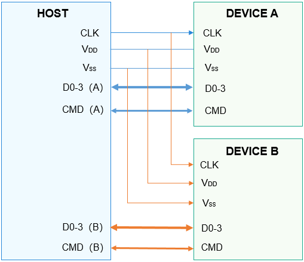

# SDIO概述

## 简介

-   SDIO是安全数字输入输出接口（Secure Digital Input and Output）的缩写，是从SD内存卡接口的基础上演化出来的一种外设接口。SDIO接口兼容以前的SD内存卡，并且可以连接支持SDIO接口的设备。
-   SDIO的应用比较广泛，目前，有许多手机都支持SDIO功能，并且很多SDIO外设也被开发出来，使得手机外接外设更加容易。常见的SDIO外设有WLAN、GPS、CAMERA、蓝牙等。
-   SDIO总线有两端，其中一端是主机端（HOST），另一端是设备端（DEVICE）。所有的通信都是由HOST端发出命令开始的，在DEVICE端只要能解析HOST的命令，就可以同HOST进行通信了。SDIO的HOST可以连接多个DEVICE，如下图所示：

    1.  CLK信号：HOST给DEVICE的时钟信号。
    2.  VDD信号：电源信号。
    3.  VSS信号：Ground信号。
    4.  D0-3信号：4条数据线，其中，DAT1信号线复用为中断线，在1BIT模式下DAT0用来传输数据，在4BIT模式下DAT0-DAT3用来传输数据。
    5.  CMD信号：用于HOST发送命令和DEVICE回复响应。

    **图 1**  SDIO的HOST-DEVICE连接示意图  
    

    

-   SDIO接口定义了操作SDIO的通用方法集合，包括打开/关闭SDIO控制器、独占/释放HOST、使能/去使能设备、申请/释放中断、读写、获取/设置公共信息等。

## 接口说明

**表 1**  SDIO驱动API接口功能介绍

<table><thead align="left"><tr id="row1625342317507"><th class="cellrowborder" valign="top" width="21.07%" id="mcps1.2.4.1.1">
功能分类

</th>
<th class="cellrowborder" valign="top" width="34.04%" id="mcps1.2.4.1.2">
接口名

</th>
<th class="cellrowborder" valign="top" width="44.89%" id="mcps1.2.4.1.3">
描述

</th>
</tr>
</thead>
<tbody><tr id="row1351945135614"><td class="cellrowborder" rowspan="2" valign="top" width="21.07%" headers="mcps1.2.4.1.1 ">
SDIO设备打开/关闭接口

</td>
<td class="cellrowborder" valign="top" width="34.04%" headers="mcps1.2.4.1.2 ">
SdioOpen

</td>
<td class="cellrowborder" valign="top" width="44.89%" headers="mcps1.2.4.1.3 ">
打开指定总线号的SDIO控制器

</td>
</tr>
<tr id="row1062610995616"><td class="cellrowborder" valign="top" headers="mcps1.2.4.1.1 ">
SdioClose

</td>
<td class="cellrowborder" valign="top" headers="mcps1.2.4.1.2 ">
关闭SDIO控制器

</td>
</tr>
<tr id="row337105133315"><td class="cellrowborder" rowspan="6" valign="top" width="21.07%" headers="mcps1.2.4.1.1 ">
SDIO读写接口

</td>
<td class="cellrowborder" valign="top" width="34.04%" headers="mcps1.2.4.1.2 ">
SdioReadBytes

</td>
<td class="cellrowborder" valign="top" width="44.89%" headers="mcps1.2.4.1.3 ">
从指定地址开始，增量读取指定长度的数据

</td>
</tr>
<tr id="row9317134301618"><td class="cellrowborder" valign="top" headers="mcps1.2.4.1.1 ">
SdioWriteBytes

</td>
<td class="cellrowborder" valign="top" headers="mcps1.2.4.1.2 ">
从指定地址开始，增量写入指定长度的数据

</td>
</tr>
<tr id="row131301734171616"><td class="cellrowborder" valign="top" headers="mcps1.2.4.1.1 ">
SdioReadBytesFromFixedAddr

</td>
<td class="cellrowborder" valign="top" headers="mcps1.2.4.1.2 ">
从固定地址读取指定长度的数据

</td>
</tr>
<tr id="row1434434011147"><td class="cellrowborder" valign="top" headers="mcps1.2.4.1.1 ">
SdioWriteBytesToFixedAddr

</td>
<td class="cellrowborder" valign="top" headers="mcps1.2.4.1.2 ">
向固定地址写入指定长度的数据

</td>
</tr>
<tr id="row364393591410"><td class="cellrowborder" valign="top" headers="mcps1.2.4.1.1 ">
SdioReadBytesFromFunc0

</td>
<td class="cellrowborder" valign="top" headers="mcps1.2.4.1.2 ">
从SDIO function 0的指定地址空间读取指定长度的数据

</td>
</tr>
<tr id="row17455333175"><td class="cellrowborder" valign="top" headers="mcps1.2.4.1.1 ">
SdioWriteBytesToFunc0

</td>
<td class="cellrowborder" valign="top" headers="mcps1.2.4.1.2 ">
向SDIO function 0的指定地址空间写入指定长度的数据

</td>
</tr>
<tr id="row34145016535"><td class="cellrowborder" valign="top" width="21.07%" headers="mcps1.2.4.1.1 ">
SDIO设置块大小接口

</td>
<td class="cellrowborder" valign="top" width="34.04%" headers="mcps1.2.4.1.2 ">
SdioSetBlockSize

</td>
<td class="cellrowborder" valign="top" width="44.89%" headers="mcps1.2.4.1.3 ">
设置块的大小

</td>
</tr>
<tr id="row778816813238"><td class="cellrowborder" rowspan="2" valign="top" width="21.07%" headers="mcps1.2.4.1.1 ">
SDIO获取/设置公共信息接口

</td>
<td class="cellrowborder" valign="top" width="34.04%" headers="mcps1.2.4.1.2 ">
SdioGetCommonInfo

</td>
<td class="cellrowborder" valign="top" width="44.89%" headers="mcps1.2.4.1.3 ">
获取公共信息

</td>
</tr>
<tr id="row5667102342417"><td class="cellrowborder" valign="top" headers="mcps1.2.4.1.1 ">
SdioSetCommonInfo

</td>
<td class="cellrowborder" valign="top" headers="mcps1.2.4.1.2 ">
设置公共信息

</td>
</tr>
<tr id="row1165101111256"><td class="cellrowborder" valign="top" width="21.07%" headers="mcps1.2.4.1.1 ">
SDIO刷新数据接口

</td>
<td class="cellrowborder" valign="top" width="34.04%" headers="mcps1.2.4.1.2 ">
SdioFlushData

</td>
<td class="cellrowborder" valign="top" width="44.89%" headers="mcps1.2.4.1.3 ">
刷新数据

</td>
</tr>
<tr id="row17388101522515"><td class="cellrowborder" rowspan="2" valign="top" width="21.07%" headers="mcps1.2.4.1.1 ">
SDIO独占/释放HOST接口

</td>
<td class="cellrowborder" valign="top" width="34.04%" headers="mcps1.2.4.1.2 ">
SdioClaimHost

</td>
<td class="cellrowborder" valign="top" width="44.89%" headers="mcps1.2.4.1.3 ">
独占Host

</td>
</tr>
<tr id="row5352175517251"><td class="cellrowborder" valign="top" headers="mcps1.2.4.1.1 ">
SdioReleaseHost

</td>
<td class="cellrowborder" valign="top" headers="mcps1.2.4.1.2 ">
释放Host

</td>
</tr>
<tr id="row8759125415269"><td class="cellrowborder" rowspan="2" valign="top" width="21.07%" headers="mcps1.2.4.1.1 ">
SDIO使能/去使能功能设备接口

</td>
<td class="cellrowborder" valign="top" width="34.04%" headers="mcps1.2.4.1.2 ">
SdioEnableFunc

</td>
<td class="cellrowborder" valign="top" width="44.89%" headers="mcps1.2.4.1.3 ">
使能SDIO功能设备

</td>
</tr>
<tr id="row1166105762620"><td class="cellrowborder" valign="top" headers="mcps1.2.4.1.1 ">
SdioDisableFunc

</td>
<td class="cellrowborder" valign="top" headers="mcps1.2.4.1.2 ">
去使能SDIO功能设备

</td>
</tr>
<tr id="row12332331113517"><td class="cellrowborder" rowspan="2" valign="top" width="21.07%" headers="mcps1.2.4.1.1 ">
SDIO申请/释放中断接口

</td>
<td class="cellrowborder" valign="top" width="34.04%" headers="mcps1.2.4.1.2 ">
SdioClaimIrq

</td>
<td class="cellrowborder" valign="top" width="44.89%" headers="mcps1.2.4.1.3 ">
申请中断

</td>
</tr>
<tr id="row173103413357"><td class="cellrowborder" valign="top" headers="mcps1.2.4.1.1 ">
SdioReleaseIrq

</td>
<td class="cellrowborder" valign="top" headers="mcps1.2.4.1.2 ">
释放中断

</td>
</tr>
</tbody>
</table>

> **说明：** 
>本文涉及的所有接口，目前只支持在内核态使用，不支持在用户态使用。

