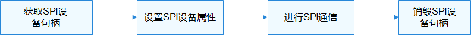

# SPI使用指导<a name="ZH-CN_TOPIC_0000001052857954"></a>

## 使用流程<a name="section691514116412"></a>

使用SPI的一般流程如[图1](#fig23885455594)所示。

**图 1**  SPI使用流程图<a name="fig23885455594"></a>  




## 获取SPI设备句柄<a name="section12372204616215"></a>

在使用SPI进行通信时，首先要调用SpiOpen获取SPI设备句柄，该函数会返回指定总线号和片选号的SPI设备句柄。

struct DevHandle \*SpiOpen\(const struct SpiDevInfo \*info\); 

**表 1**  SpiOpen参数和返回值描述

<a name="table7603619123820"></a>
<table><tbody><tr id="row1060351914386"><td class="cellrowborder" valign="top" width="50%"><p id="p14603181917382"><a name="p14603181917382"></a><a name="p14603181917382"></a><strong id="b743851872411"><a name="b743851872411"></a><a name="b743851872411"></a>参数</strong></p>
</td>
<td class="cellrowborder" valign="top" width="50%"><p id="p36031519183819"><a name="p36031519183819"></a><a name="p36031519183819"></a><strong id="b545016183242"><a name="b545016183242"></a><a name="b545016183242"></a>参数描述</strong></p>
</td>
</tr>
<tr id="row1960431983813"><td class="cellrowborder" valign="top" width="50%"><p id="p3604719123817"><a name="p3604719123817"></a><a name="p3604719123817"></a>info</p>
</td>
<td class="cellrowborder" valign="top" width="50%"><p id="p1560441923818"><a name="p1560441923818"></a><a name="p1560441923818"></a>SPI设备描述符</p>
</td>
</tr>
<tr id="row380484160"><td class="cellrowborder" valign="top" width="50%"><p id="p460381915385"><a name="p460381915385"></a><a name="p460381915385"></a><strong id="b209091422131617"><a name="b209091422131617"></a><a name="b209091422131617"></a>返回值</strong></p>
</td>
<td class="cellrowborder" valign="top" width="50%"><p id="p96031619153812"><a name="p96031619153812"></a><a name="p96031619153812"></a><strong id="b126401632121619"><a name="b126401632121619"></a><a name="b126401632121619"></a>返回值描述</strong></p>
</td>
</tr>
<tr id="row5793818161"><td class="cellrowborder" valign="top" width="50%"><p id="p1060418195389"><a name="p1060418195389"></a><a name="p1060418195389"></a>NULL</p>
</td>
<td class="cellrowborder" valign="top" width="50%"><p id="p760471912388"><a name="p760471912388"></a><a name="p760471912388"></a>获取SPI设备句柄失败</p>
</td>
</tr>
<tr id="row187914871618"><td class="cellrowborder" valign="top" width="50%"><p id="p5604719133811"><a name="p5604719133811"></a><a name="p5604719133811"></a>设备句柄</p>
</td>
<td class="cellrowborder" valign="top" width="50%"><p id="p3604181933818"><a name="p3604181933818"></a><a name="p3604181933818"></a>对应的SPI设备句柄</p>
</td>
</tr>
</tbody>
</table>

假设系统中的SPI设备总线号为0，片选号为0，获取该SPI设备句柄的示例如下：

```
struct SpiDevInfo spiDevinfo;       /* SPI设备描述符 */
struct DevHandle *spiHandle = NULL; /* SPI设备句柄*/
spiDevinfo.busNum = 0;              /* SPI设备总线号 */
spiDevinfo.csNum = 0;               /* SPI设备片选号 */

/* 获取SPI设备句柄 */
spiHandle = SpiOpen(&spiDevinfo);
if (spiHandle == NULL) {
    HDF_LOGE("SpiOpen: failed\n");
    return;
}
```

## 获取SPI设备属性<a name="section17121446171311"></a>

在获取到SPI设备句柄之后，需要配置SPI设备属性。配置SPI设备属性之前，可以先获取SPI设备属性，获取SPI设备属性的函数如下所示：

int32\_t SpiGetCfg\(struct DevHandle \*handle, struct SpiCfg \*cfg\);

**表 2**  SpiGetCfg参数和返回值描述

<a name="table14209152141313"></a>
<table><tbody><tr id="row1420918529133"><td class="cellrowborder" valign="top" width="50%"><p id="p42091852141314"><a name="p42091852141314"></a><a name="p42091852141314"></a><strong id="b2209135217139"><a name="b2209135217139"></a><a name="b2209135217139"></a>参数</strong></p>
</td>
<td class="cellrowborder" valign="top" width="50%"><p id="p202099523137"><a name="p202099523137"></a><a name="p202099523137"></a><strong id="b16209195201319"><a name="b16209195201319"></a><a name="b16209195201319"></a>参数描述</strong></p>
</td>
</tr>
<tr id="row142091352171310"><td class="cellrowborder" valign="top" width="50%"><p id="p1520915529131"><a name="p1520915529131"></a><a name="p1520915529131"></a>handle</p>
</td>
<td class="cellrowborder" valign="top" width="50%"><p id="p720995291310"><a name="p720995291310"></a><a name="p720995291310"></a>SPI设备句柄</p>
</td>
</tr>
<tr id="row6209152161314"><td class="cellrowborder" valign="top" width="50%"><p id="p720916522139"><a name="p720916522139"></a><a name="p720916522139"></a>cfg</p>
</td>
<td class="cellrowborder" valign="top" width="50%"><p id="p172091452131319"><a name="p172091452131319"></a><a name="p172091452131319"></a>SPI设备配置参数</p>
</td>
</tr>
<tr id="row12092522139"><td class="cellrowborder" valign="top" width="50%"><p id="p18209125211134"><a name="p18209125211134"></a><a name="p18209125211134"></a><strong id="b2209155219132"><a name="b2209155219132"></a><a name="b2209155219132"></a>返回值</strong></p>
</td>
<td class="cellrowborder" valign="top" width="50%"><p id="p420975231318"><a name="p420975231318"></a><a name="p420975231318"></a><strong id="b4209165210132"><a name="b4209165210132"></a><a name="b4209165210132"></a>返回值描述</strong></p>
</td>
</tr>
<tr id="row8209155251310"><td class="cellrowborder" valign="top" width="50%"><p id="p13210145291312"><a name="p13210145291312"></a><a name="p13210145291312"></a>0</p>
</td>
<td class="cellrowborder" valign="top" width="50%"><p id="p152101952141315"><a name="p152101952141315"></a><a name="p152101952141315"></a>获取配置成功</p>
</td>
</tr>
<tr id="row102101452121320"><td class="cellrowborder" valign="top" width="50%"><p id="p10210175219134"><a name="p10210175219134"></a><a name="p10210175219134"></a>负数</p>
</td>
<td class="cellrowborder" valign="top" width="50%"><p id="p72101252101312"><a name="p72101252101312"></a><a name="p72101252101312"></a>获取配置失败</p>
</td>
</tr>
</tbody>
</table>

```
int32_t ret;
struct SpiCfg cfg = {0};                /* SPI配置信息*/
ret = SpiGetCfg(spiHandle, &cfg);       /* 配置SPI设备属性 */
if (ret != 0) {
    HDF_LOGE("SpiGetCfg: failed, ret %d\n", ret);
}
```

## 配置SPI设备属性<a name="section97691946634"></a>

在获取到SPI设备句柄之后，需要配置SPI设备属性，配置SPI设备属性的函数如下所示：

int32\_t SpiSetCfg\(struct DevHandle \*handle, struct SpiCfg \*cfg\);

**表 3**  SpiSetCfg参数和返回值描述

<a name="table219052945210"></a>
<table><tbody><tr id="row14191192918522"><td class="cellrowborder" valign="top" width="50%"><p id="p17424155016529"><a name="p17424155016529"></a><a name="p17424155016529"></a><strong id="b13808393249"><a name="b13808393249"></a><a name="b13808393249"></a>参数</strong></p>
</td>
<td class="cellrowborder" valign="top" width="50%"><p id="p942512508520"><a name="p942512508520"></a><a name="p942512508520"></a><strong id="b78202962416"><a name="b78202962416"></a><a name="b78202962416"></a>参数描述</strong></p>
</td>
</tr>
<tr id="row219152915524"><td class="cellrowborder" valign="top" width="50%"><p id="p2191122985218"><a name="p2191122985218"></a><a name="p2191122985218"></a>handle</p>
</td>
<td class="cellrowborder" valign="top" width="50%"><p id="p1519162913524"><a name="p1519162913524"></a><a name="p1519162913524"></a>SPI设备句柄</p>
</td>
</tr>
<tr id="row1719110297526"><td class="cellrowborder" valign="top" width="50%"><p id="p181911292523"><a name="p181911292523"></a><a name="p181911292523"></a>cfg</p>
</td>
<td class="cellrowborder" valign="top" width="50%"><p id="p91911729155216"><a name="p91911729155216"></a><a name="p91911729155216"></a>SPI设备配置参数</p>
</td>
</tr>
<tr id="row036524131716"><td class="cellrowborder" valign="top" width="50%"><p id="p6425165035214"><a name="p6425165035214"></a><a name="p6425165035214"></a><strong id="b61219451173"><a name="b61219451173"></a><a name="b61219451173"></a>返回值</strong></p>
</td>
<td class="cellrowborder" valign="top" width="50%"><p id="p18425650165215"><a name="p18425650165215"></a><a name="p18425650165215"></a><strong id="b826124514172"><a name="b826124514172"></a><a name="b826124514172"></a>返回值描述</strong></p>
</td>
</tr>
<tr id="row43653411178"><td class="cellrowborder" valign="top" width="50%"><p id="p1319132918520"><a name="p1319132918520"></a><a name="p1319132918520"></a>0</p>
</td>
<td class="cellrowborder" valign="top" width="50%"><p id="p1719117292522"><a name="p1719117292522"></a><a name="p1719117292522"></a>配置成功</p>
</td>
</tr>
<tr id="row536594171715"><td class="cellrowborder" valign="top" width="50%"><p id="p719119296522"><a name="p719119296522"></a><a name="p719119296522"></a>负数</p>
</td>
<td class="cellrowborder" valign="top" width="50%"><p id="p20191192925212"><a name="p20191192925212"></a><a name="p20191192925212"></a>配置失败</p>
</td>
</tr>
</tbody>
</table>

```
int32_t ret;
struct SpiCfg cfg = {0};                     /* SPI配置信息*/
cfg.mode = SPI_MODE_LOOP;                    /* 以回环模式进行通信 */
cfg.transferMode = PAL_SPI_POLLING_TRANSFER; /* 以轮询的方式进行通信 */
cfg.maxSpeedHz = 115200;                     /* 最大传输频率 */ 
cfg.bitsPerWord = 8;                         /* 读写位宽为8个比特 */
ret = SpiSetCfg(spiHandle, &cfg);            /* 配置SPI设备属性 */
if (ret != 0) {
    HDF_LOGE("SpiSetCfg: failed, ret %d\n", ret);
}
```

## 进行SPI通信<a name="section197116254416"></a>

-   向SPI设备写入指定长度的数据

如果只向SPI设备写一次数据，则可以通过以下函数完成：

int32\_t SpiWrite\(struct DevHandle \*handle, uint8\_t \*buf, uint32\_t len\);

**表 4**  SpiWrite参数和返回值描述

<a name="table1018490043"></a>
<table><tbody><tr id="row31848013417"><td class="cellrowborder" valign="top" width="50%"><p id="p1415816132411"><a name="p1415816132411"></a><a name="p1415816132411"></a><strong id="b011110449230"><a name="b011110449230"></a><a name="b011110449230"></a>参数</strong></p>
</td>
<td class="cellrowborder" valign="top" width="50%"><p id="p11158111316410"><a name="p11158111316410"></a><a name="p11158111316410"></a><strong id="b18123204410230"><a name="b18123204410230"></a><a name="b18123204410230"></a>参数描述</strong></p>
</td>
</tr>
<tr id="row10184701945"><td class="cellrowborder" valign="top" width="50%"><p id="p104891871157"><a name="p104891871157"></a><a name="p104891871157"></a>handle</p>
</td>
<td class="cellrowborder" valign="top" width="50%"><p id="p204891671156"><a name="p204891671156"></a><a name="p204891671156"></a>SPI设备句柄</p>
</td>
</tr>
<tr id="row928111518418"><td class="cellrowborder" valign="top" width="50%"><p id="p4282955412"><a name="p4282955412"></a><a name="p4282955412"></a>buf</p>
</td>
<td class="cellrowborder" valign="top" width="50%"><p id="p7282752412"><a name="p7282752412"></a><a name="p7282752412"></a>待写入数据的指针</p>
</td>
</tr>
<tr id="row149041113651"><td class="cellrowborder" valign="top" width="50%"><p id="p139051213357"><a name="p139051213357"></a><a name="p139051213357"></a>len</p>
</td>
<td class="cellrowborder" valign="top" width="50%"><p id="p16905313854"><a name="p16905313854"></a><a name="p16905313854"></a>待写入的数据长度</p>
</td>
</tr>
<tr id="row1148818622017"><td class="cellrowborder" valign="top" width="50%"><p id="p8158313248"><a name="p8158313248"></a><a name="p8158313248"></a><strong id="b1197324122018"><a name="b1197324122018"></a><a name="b1197324122018"></a>返回值</strong></p>
</td>
<td class="cellrowborder" valign="top" width="50%"><p id="p161591413741"><a name="p161591413741"></a><a name="p161591413741"></a><strong id="b15219182419209"><a name="b15219182419209"></a><a name="b15219182419209"></a>返回值描述</strong></p>
</td>
</tr>
<tr id="row14488762202"><td class="cellrowborder" valign="top" width="50%"><p id="p103191916578"><a name="p103191916578"></a><a name="p103191916578"></a>0</p>
</td>
<td class="cellrowborder" valign="top" width="50%"><p id="p1231981611712"><a name="p1231981611712"></a><a name="p1231981611712"></a>写入成功</p>
</td>
</tr>
<tr id="row164881464201"><td class="cellrowborder" valign="top" width="50%"><p id="p531916166716"><a name="p531916166716"></a><a name="p531916166716"></a>负数</p>
</td>
<td class="cellrowborder" valign="top" width="50%"><p id="p93191161174"><a name="p93191161174"></a><a name="p93191161174"></a>写入失败</p>
</td>
</tr>
</tbody>
</table>

```
int32_t ret;
uint8_t wbuff[4] = {0x12, 0x34, 0x56, 0x78};
/* 向SPI设备写入指定长度的数据 */
ret = SpiWrite(spiHandle, wbuff, 4);
if (ret != 0) {
    HDF_LOGE("SpiWrite: failed, ret %d\n", ret);
}
```

-   从SPI设备读取指定长度的数据

如果只读取一次数据，则可以通过以下函数完成：

int32\_t SpiRead\(struct DevHandle \*handle, uint8\_t \*buf, uint32\_t len\); 

**表 5**  SpiRead参数和返回值描述

<a name="table0265191412124"></a>
<table><tbody><tr id="row42651914141213"><td class="cellrowborder" valign="top" width="50%"><p id="p1483184123"><a name="p1483184123"></a><a name="p1483184123"></a><strong id="b81201431172318"><a name="b81201431172318"></a><a name="b81201431172318"></a>参数</strong></p>
</td>
<td class="cellrowborder" valign="top" width="50%"><p id="p9831871216"><a name="p9831871216"></a><a name="p9831871216"></a><strong id="b31321731122316"><a name="b31321731122316"></a><a name="b31321731122316"></a>参数描述</strong></p>
</td>
</tr>
<tr id="row1926651415123"><td class="cellrowborder" valign="top" width="50%"><p id="p389183129"><a name="p389183129"></a><a name="p389183129"></a>handle</p>
</td>
<td class="cellrowborder" valign="top" width="50%"><p id="p168151817124"><a name="p168151817124"></a><a name="p168151817124"></a>SPI设备句柄</p>
</td>
</tr>
<tr id="row202661414201220"><td class="cellrowborder" valign="top" width="50%"><p id="p158161821210"><a name="p158161821210"></a><a name="p158161821210"></a>buf</p>
</td>
<td class="cellrowborder" valign="top" width="50%"><p id="p98131811126"><a name="p98131811126"></a><a name="p98131811126"></a>待读取数据的指针</p>
</td>
</tr>
<tr id="row1926621451212"><td class="cellrowborder" valign="top" width="50%"><p id="p2918182124"><a name="p2918182124"></a><a name="p2918182124"></a>len</p>
</td>
<td class="cellrowborder" valign="top" width="50%"><p id="p169718191220"><a name="p169718191220"></a><a name="p169718191220"></a>待读取的数据长度</p>
</td>
</tr>
<tr id="row05841310206"><td class="cellrowborder" valign="top" width="50%"><p id="p38171818128"><a name="p38171818128"></a><a name="p38171818128"></a><strong id="b33485467201"><a name="b33485467201"></a><a name="b33485467201"></a>返回值</strong></p>
</td>
<td class="cellrowborder" valign="top" width="50%"><p id="p881918161220"><a name="p881918161220"></a><a name="p881918161220"></a><strong id="b13361846112013"><a name="b13361846112013"></a><a name="b13361846112013"></a>返回值描述</strong></p>
</td>
</tr>
<tr id="row15584173192016"><td class="cellrowborder" valign="top" width="50%"><p id="p14871820128"><a name="p14871820128"></a><a name="p14871820128"></a>0</p>
</td>
<td class="cellrowborder" valign="top" width="50%"><p id="p88118101211"><a name="p88118101211"></a><a name="p88118101211"></a>读取成功</p>
</td>
</tr>
<tr id="row1058418317204"><td class="cellrowborder" valign="top" width="50%"><p id="p10841817125"><a name="p10841817125"></a><a name="p10841817125"></a>负数</p>
</td>
<td class="cellrowborder" valign="top" width="50%"><p id="p986183127"><a name="p986183127"></a><a name="p986183127"></a>读取失败</p>
</td>
</tr>
</tbody>
</table>

```
int32_t ret;
uint8_t rbuff[4] = {0};
/* 从SPI设备读取指定长度的数据 */
ret = SpiRead(spiHandle, rbuff, 4);
if (ret != 0) {
    HDF_LOGE("SpiRead: failed, ret %d\n", ret);
}
```

-   自定义传输

如果需要发起一次自定义传输，则可以通过以下函数完成：

int32\_t SpiTransfer\(struct DevHandle \*handle, struct SpiMsg \*msgs, uint32\_t count\);

**表 6**  SpiTransfer参数和返回值描述

<a name="table1934414174212"></a>
<table><tbody><tr id="row1134415176216"><td class="cellrowborder" valign="top" width="50%"><p id="p13295152320217"><a name="p13295152320217"></a><a name="p13295152320217"></a><strong id="b14726194114224"><a name="b14726194114224"></a><a name="b14726194114224"></a>参数</strong></p>
</td>
<td class="cellrowborder" valign="top" width="50%"><p id="p1295112352115"><a name="p1295112352115"></a><a name="p1295112352115"></a><strong id="b6744541162218"><a name="b6744541162218"></a><a name="b6744541162218"></a>参数描述</strong></p>
</td>
</tr>
<tr id="row5344101702113"><td class="cellrowborder" valign="top" width="50%"><p id="p19295132382111"><a name="p19295132382111"></a><a name="p19295132382111"></a>handle</p>
</td>
<td class="cellrowborder" valign="top" width="50%"><p id="p829510232213"><a name="p829510232213"></a><a name="p829510232213"></a>SPI设备句柄</p>
</td>
</tr>
<tr id="row17344171722117"><td class="cellrowborder" valign="top" width="50%"><p id="p9295122332113"><a name="p9295122332113"></a><a name="p9295122332113"></a>msgs</p>
</td>
<td class="cellrowborder" valign="top" width="50%"><p id="p202951238218"><a name="p202951238218"></a><a name="p202951238218"></a>待传输数据的数组</p>
</td>
</tr>
<tr id="row45812466213"><td class="cellrowborder" valign="top" width="50%"><p id="p1659246112117"><a name="p1659246112117"></a><a name="p1659246112117"></a>count</p>
</td>
<td class="cellrowborder" valign="top" width="50%"><p id="p259124622119"><a name="p259124622119"></a><a name="p259124622119"></a>msgs数组长度</p>
</td>
</tr>
<tr id="row45187318214"><td class="cellrowborder" valign="top" width="50%"><p id="p17295142322113"><a name="p17295142322113"></a><a name="p17295142322113"></a><strong id="b6754144472117"><a name="b6754144472117"></a><a name="b6754144472117"></a>返回值</strong></p>
</td>
<td class="cellrowborder" valign="top" width="50%"><p id="p142959232211"><a name="p142959232211"></a><a name="p142959232211"></a><strong id="b107682446216"><a name="b107682446216"></a><a name="b107682446216"></a>返回值描述</strong></p>
</td>
</tr>
<tr id="row175186313217"><td class="cellrowborder" valign="top" width="50%"><p id="p929532313211"><a name="p929532313211"></a><a name="p929532313211"></a>0</p>
</td>
<td class="cellrowborder" valign="top" width="50%"><p id="p829512237217"><a name="p829512237217"></a><a name="p829512237217"></a>执行成功</p>
</td>
</tr>
<tr id="row1451803152114"><td class="cellrowborder" valign="top" width="50%"><p id="p12958234217"><a name="p12958234217"></a><a name="p12958234217"></a>负数</p>
</td>
<td class="cellrowborder" valign="top" width="50%"><p id="p1295192312112"><a name="p1295192312112"></a><a name="p1295192312112"></a>执行失败</p>
</td>
</tr>
</tbody>
</table>

```
int32_t ret;
uint8_t wbuff[1] = {0x12};
uint8_t rbuff[1] = {0};
struct SpiMsg msg;        /* 自定义传输的消息*/
msg.wbuf = wbuff;         /* 写入的数据 */
msg.rbuf = rbuff;         /* 读取的数据 */
msg.len = 1;              /* 读取、写入数据的长度都是1 */
msg.csChange = 1;         /* 进行下一次传输前关闭片选 */
msg.delayUs = 0;          /* 进行下一次传输前不进行延时 */
msg.speed = 115200;       /* 本次传输的速度 */
/* 进行一次自定义传输，传输的msg个数为1 */
ret = SpiTransfer(spiHandle, &msg, 1);
if (ret != 0) {
    HDF_LOGE("SpiTransfer: failed, ret %d\n", ret);
}
```

## 销毁SPI设备句柄<a name="section117661819108"></a>

SPI通信完成之后，需要销毁SPI设备句柄，销毁SPI设备句柄的函数如下所示：

void SpiClose\(struct DevHandle \*handle\);

该函数会释放掉申请的资源。

**表 7**  SpiClose参数描述

<a name="table72517953115"></a>
<table><tbody><tr id="row1525793312"><td class="cellrowborder" valign="top" width="50%"><p id="p115402031153111"><a name="p115402031153111"></a><a name="p115402031153111"></a><strong id="b691142582513"><a name="b691142582513"></a><a name="b691142582513"></a>参数</strong></p>
</td>
<td class="cellrowborder" valign="top" width="50%"><p id="p65406313319"><a name="p65406313319"></a><a name="p65406313319"></a><strong id="b1892414252254"><a name="b1892414252254"></a><a name="b1892414252254"></a>参数描述</strong></p>
</td>
</tr>
<tr id="row1926109193116"><td class="cellrowborder" valign="top" width="50%"><p id="p105419317318"><a name="p105419317318"></a><a name="p105419317318"></a>handle</p>
</td>
<td class="cellrowborder" valign="top" width="50%"><p id="p16541153110317"><a name="p16541153110317"></a><a name="p16541153110317"></a>SPI设备句柄</p>
</td>
</tr>
</tbody>
</table>

```
SpiClose(spiHandle); /* 销毁SPI设备句柄 */
```

