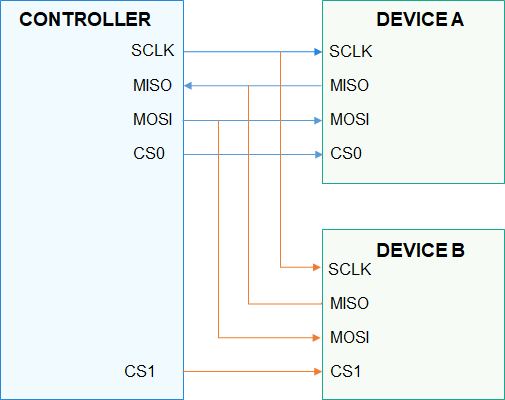

# SPI概述

## 简介

-   SPI是串行外设接口（Serial Peripheral Interface）的缩写，是一种高速的，全双工，同步的通信总线。
-   SPI是由Motorola公司开发，用于在主设备和从设备之间进行通信，常用于与闪存、实时时钟、传感器以及模数转换器等进行通信。
-   SPI以主从方式工作，通常有一个主设备和一个或者多个从设备。主设备和从设备之间一般用4根线相连，它们分别是：
    -   SCLK – 时钟信号，由主设备产生；
    -   MOSI – 主设备数据输出，从设备数据输入；
    -   MISO – 主设备数据输入，从设备数据输出；
    -   CS – 片选，从设备使能信号，由主设备控制。

-   一个主设备和两个从设备的连接示意图如[图1](#fig15227181812587)所示，Device A和Device B共享主设备的SCLK、MISO和MOSI三根引脚，Device A的片选CS0连接主设备的CS0，Device B的片选CS1连接主设备的CS1。

**图 1**  SPI主从设备连接示意图。  

-   SPI通信通常由主设备发起，通过以下步骤完成一次通信：

1.  通过CS选中要通信的从设备，在任意时刻，一个主设备上最多只能有一个从设备被选中。
2.  通过SCLK给选中的从设备提供时钟信号。
3.  基于SCLK时钟信号，主设备数据通过MOSI发送给从设备，同时通过MISO接收从设备发送的数据，完成通信。

-   根据SCLK时钟信号的CPOL（Clock Polarity，时钟极性）和CPHA（Clock Phase，时钟相位）的不同组合，SPI有以下四种工作模式：
    -   CPOL=0，CPHA=0 时钟信号idle状态为低电平，第一个时钟边沿采样数据。
    -   CPOL=0，CPHA=1 时钟信号idle状态为低电平，第二个时钟边沿采样数据。
    -   CPOL=1，CPHA=0 时钟信号idle状态为高电平，第一个时钟边沿采样数据。
    -   CPOL=1，CPHA=1 时钟信号idle状态为高电平，第二个时钟边沿采样数据。

-   SPI接口定义了操作SPI设备的通用方法集合，包括：
    -   SPI设备句柄获取和释放。
    -   SPI读写:  从SPI设备读取或写入指定长度数据。
    -   SPI自定义传输：通过消息传输结构体执行任意读写组合过程。
    -   SPI设备配置：获取和设置SPI设备属性。

> **说明：** 
>当前只支持主机模式，不支持从机模式。

## 接口说明

**表 1**  SPI驱动API接口功能介绍

<table><thead align="left"><tr id="row4419501537"><th class="cellrowborder" align="left" valign="top" width="20.857914208579142%" id="mcps1.2.4.1.1">
功能分类

</th>
<th class="cellrowborder" align="left" valign="top" width="23.36766323367663%" id="mcps1.2.4.1.2">
接口名

</th>
<th class="cellrowborder" align="left" valign="top" width="55.77442255774422%" id="mcps1.2.4.1.3">
描述

</th>
</tr>
</thead>
<tbody><tr id="row1651292212306"><td class="cellrowborder" rowspan="2" valign="top" width="20.857914208579142%" headers="mcps1.2.4.1.1 ">
SPI设备句柄获取释放接口

</td>
<td class="cellrowborder" valign="top" width="23.36766323367663%" headers="mcps1.2.4.1.2 ">
SpiOpen

</td>
<td class="cellrowborder" valign="top" width="55.77442255774422%" headers="mcps1.2.4.1.3 ">
获取SPI设备句柄

</td>
</tr>
<tr id="row1429083612305"><td class="cellrowborder" valign="top" headers="mcps1.2.4.1.1 ">
SpiClose

</td>
<td class="cellrowborder" valign="top" headers="mcps1.2.4.1.2 ">
释放SPI设备句柄

</td>
</tr>
<tr id="row34145016535"><td class="cellrowborder" rowspan="3" valign="top" width="20.857914208579142%" headers="mcps1.2.4.1.1 ">
SPI读写接口

</td>
<td class="cellrowborder" valign="top" width="23.36766323367663%" headers="mcps1.2.4.1.2 ">
SpiRead

</td>
<td class="cellrowborder" valign="top" width="55.77442255774422%" headers="mcps1.2.4.1.3 ">
读取指定长度的数据

</td>
</tr>
<tr id="row5632152611414"><td class="cellrowborder" valign="top" headers="mcps1.2.4.1.1 ">
SpiWrite

</td>
<td class="cellrowborder" valign="top" headers="mcps1.2.4.1.2 ">
写入指定长度的数据

</td>
</tr>
<tr id="row1766145611414"><td class="cellrowborder" valign="top" headers="mcps1.2.4.1.1 ">
SpiTransfer

</td>
<td class="cellrowborder" valign="top" headers="mcps1.2.4.1.2 ">
SPI数据传输接口

</td>
</tr>
<tr id="row1020919129159"><td class="cellrowborder" rowspan="2" valign="top" width="20.857914208579142%" headers="mcps1.2.4.1.1 ">
SPI设备配置接口

</td>
<td class="cellrowborder" valign="top" width="23.36766323367663%" headers="mcps1.2.4.1.2 ">
SpiSetCfg

</td>
<td class="cellrowborder" valign="top" width="55.77442255774422%" headers="mcps1.2.4.1.3 ">
根据指定参数，配置SPI设备

</td>
</tr>
<tr id="row379443710118"><td class="cellrowborder" valign="top" headers="mcps1.2.4.1.1 ">
SpiGetCfg

</td>
<td class="cellrowborder" valign="top" headers="mcps1.2.4.1.2 ">
获取SPI设备配置参数

</td>
</tr>
</tbody>
</table>

> **说明：** 
>本文涉及的所有接口，仅限内核态使用，不支持在用户态使用。

