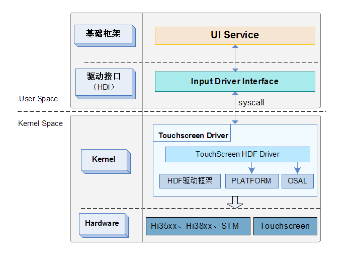
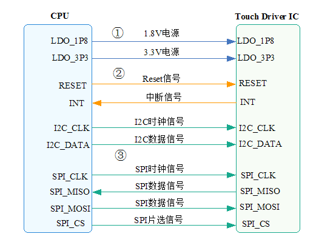

# Touchscreen开发概述

## 简介

-   **Touchscreen驱动主要任务**

    Touchscreen驱动用于驱动触摸屏使其正常工作，该驱动主要完成如下工作：对Touchscreen Driver IC进行上电、配置硬件管脚并初始化其状态、注册中断、配置通信接口（I2C或SPI）、设定input相关配置、下载及更新固件等，从而保证Touchscreen Driver IC驱动触摸屏正常工作。

-   **Touchscreen驱动层次说明**

    本节主要介绍基于HDF驱动框架开发Touchscreen器件驱动，其整体的框架模型如下。

    Touchscreen驱动向下基于HDF驱动框架、PLATFORM接口、OSAL接口开发，向上对接规范化的驱动接口HDI（OpenHarmony Driver Interface）层，通过HDI层对外提供硬件能力，即上层Service可以通过HDI接口层获取相应的驱动能力，进而操作控制Touchscreen器件。

**图 1**  Touchscreen驱动软件层次  

-   **基于HDF驱动框架开发器件驱动的优势**

    在HDF（OpenHarmony Driver Foundation）[驱动管理框架](驱动开发.md)的基础上，器件驱动调用OSAL和PLATFORM基础接口实现开发，包括bus通信接口、操作系统原生接口（memory、lock、thread、timer等）。由于OSAL和PLATFORM接口屏蔽了芯片平台差异，所以Touchscreen HDF Driver可以进行跨平台、跨OS执行，以便逐步实现驱动的一次开发，多端部署。

## 接口说明

Touchscreen器件的硬件接口相对简单，根据PIN脚的属性，可以简单分为三类：

-   电源接口
-   IO控制接口
-   通信接口

**图 2**  Touchscreen器件常用管脚  

如上图所示的三类接口，分别做简要说明如下：

1.  **电源接口**
    -   LDO\_1P8：1.8v数字电路
    -   LDO\_3P3：3.3v模拟电路

        通常情况下，Touchscreen Driver IC和LCD的Driver IC是相互分离的，这种情况下，Touchscreen Driver IC一般同时需要1.8v和3.3v两路供电。随着芯片演进，行业内已有Touchscreen Driver IC和LCD Driver IC 集成在一颗IC中的芯片案例，对Touchscreen而言，只需要关注1.8v供电即可，其内部需要的3.3v电源，会在Driver Chip IC内部从LCD的VSP电源（典型值5.5V）中分出来。

2.  **IO控制接口**
    -   Reset：reset管脚，用于在系统休眠、唤醒时，由主机侧对Driver IC进行复位操作。
    -   INT：中断管脚，需要在驱动初始化时，配置为输入上拉状态。在Driver IC检测到外部触摸信号后，通过操作中断管脚来通知Driver，Driver一般会在中断处理函数中，进行报点数据读取等操作。

3.  **通信接口**
    -   I2C：由于Touchscreen的报点数据量相对较少，所以一般选用I2C方式传输数据。I2C的具体协议及对应操作接口，可以参考PLATFORM的[“I2C”使用指南](I2C使用指导.md)。
    -   SPI：部分厂商，由于需要传递的数据不止报点坐标，而是需要获取基础容值，数据量较大，所以会选用SPI通信方式。SPI的具体协议及对应操作接口，可以参考PLATFORM的[“SPI” 使用指南](SPI使用指导.md)。

