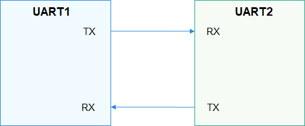

# UART概述

## 简介

-   UART是通用异步收发传输器（Universal Asynchronous Receiver/Transmitter）的缩写，是通用串行数据总线，用于异步通信。该总线双向通信，可以实现全双工传输。
-   UART应用比较广泛，常用于输出打印信息，也可以外接各种模块，如GPS、蓝牙等。
-   两个UART设备的连接示意图如下，UART与其他模块一般用2线（图1）或4线（图2）相连，它们分别是：
    1.  TX：发送数据端，和对端的RX相连；
    2.  RX：接收数据端，和对端的TX相连；
    3.  RTS：发送请求信号，用于指示本设备是否准备好，可接受数据，和对端CTS相连；
    4.  CTS：允许发送信号，用于判断是否可以向对端发送数据，和对端RTS相连；

        **图 1**  2线UART设备连接示意图  
        

        

        **图 2**  4线UART设备连接示意图  
        

        

-   UART通信之前，收发双方需要约定好一些参数：波特率、数据格式（起始位、数据位、校验位、停止位）等。通信过程中，UART通过TX发送给对端数据，通过RX接收对端发送的数据。当UART接收缓存达到预定的门限值时，RTS变为不可发送数据，对端的CTS检测到不可发送数据，则停止发送数据。
-   UART接口定义了操作UART端口的通用方法集合，包括获取、释放设备句柄、读写数据、获取和设置波特率、获取和设置设备属性。

## 接口说明

**表 1**  UART驱动API接口功能介绍

<table><thead align="left"><tr id="row1223152681611"><th class="cellrowborder" valign="top" width="26.619999999999997%" id="mcps1.2.4.1.1">
功能分类

</th>
<th class="cellrowborder" valign="top" width="31.369999999999997%" id="mcps1.2.4.1.2">
接口名

</th>
<th class="cellrowborder" valign="top" width="42.01%" id="mcps1.2.4.1.3">
描述

</th>
</tr>
</thead>
<tbody><tr id="row1638573613415"><td class="cellrowborder" rowspan="2" valign="top" width="26.619999999999997%" headers="mcps1.2.4.1.1 ">
UART获取/释放设备句柄

</td>
<td class="cellrowborder" valign="top" width="31.369999999999997%" headers="mcps1.2.4.1.2 ">
UartOpen

</td>
<td class="cellrowborder" valign="top" width="42.01%" headers="mcps1.2.4.1.3 ">
UART获取设备句柄

</td>
</tr>
<tr id="row5950143316415"><td class="cellrowborder" valign="top" headers="mcps1.2.4.1.1 ">
UartClose

</td>
<td class="cellrowborder" valign="top" headers="mcps1.2.4.1.2 ">
UART释放设备句柄

</td>
</tr>
<tr id="row34145016535"><td class="cellrowborder" rowspan="2" valign="top" width="26.619999999999997%" headers="mcps1.2.4.1.1 ">
UART读写接口

</td>
<td class="cellrowborder" valign="top" width="31.369999999999997%" headers="mcps1.2.4.1.2 ">
UartRead

</td>
<td class="cellrowborder" valign="top" width="42.01%" headers="mcps1.2.4.1.3 ">
从UART设备中读取指定长度的数据

</td>
</tr>
<tr id="row11585016539"><td class="cellrowborder" valign="top" headers="mcps1.2.4.1.1 ">
UartWrite

</td>
<td class="cellrowborder" valign="top" headers="mcps1.2.4.1.2 ">
向UART设备中写入指定长度的数据

</td>
</tr>
<tr id="row8687115843715"><td class="cellrowborder" rowspan="2" valign="top" width="26.619999999999997%" headers="mcps1.2.4.1.1 ">
UART获取/设置波特率接口

</td>
<td class="cellrowborder" valign="top" width="31.369999999999997%" headers="mcps1.2.4.1.2 ">
UartGetBaud

</td>
<td class="cellrowborder" valign="top" width="42.01%" headers="mcps1.2.4.1.3 ">
UART获取波特率

</td>
</tr>
<tr id="row18987529382"><td class="cellrowborder" valign="top" headers="mcps1.2.4.1.1 ">
UartSetBaud

</td>
<td class="cellrowborder" valign="top" headers="mcps1.2.4.1.2 ">
UART设置波特率

</td>
</tr>
<tr id="row1551850115317"><td class="cellrowborder" rowspan="2" valign="top" width="26.619999999999997%" headers="mcps1.2.4.1.1 ">
UART获取/设置设备属性

</td>
<td class="cellrowborder" valign="top" width="31.369999999999997%" headers="mcps1.2.4.1.2 ">
UartGetAttribute

</td>
<td class="cellrowborder" valign="top" width="42.01%" headers="mcps1.2.4.1.3 ">
UART获取设备属性

</td>
</tr>
<tr id="row7545065311"><td class="cellrowborder" valign="top" headers="mcps1.2.4.1.1 ">
UartSetAttribute

</td>
<td class="cellrowborder" valign="top" headers="mcps1.2.4.1.2 ">
UART设置设备属性

</td>
</tr>
<tr id="row14614115403"><td class="cellrowborder" valign="top" width="26.619999999999997%" headers="mcps1.2.4.1.1 ">
UART设置传输模式

</td>
<td class="cellrowborder" valign="top" width="31.369999999999997%" headers="mcps1.2.4.1.2 ">
UartSetTransMode

</td>
<td class="cellrowborder" valign="top" width="42.01%" headers="mcps1.2.4.1.3 ">
UART设置传输模式

</td>
</tr>
</tbody>
</table>

> **说明：** 
>本文涉及的所有接口，仅限内核态使用，不支持在用户态使用。

