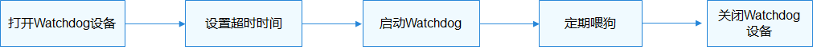

# Watchdog使用指导<a name="ZH-CN_TOPIC_0000001052777641"></a>

## 使用流程<a name="section0719414187"></a>

使用watchdog的一般流程如[图1](#fig19134125410189)所示。

**图 1**  watchdog使用流程图<a name="fig19134125410189"></a>  




## 打开Watchdog设备<a name="section198171379261"></a>

在操作Watchdog之前，需要使用WatchdogOpen打开一个Watchdog设备，一个系统可能有多个Watchdog，通过ID号来打开指定的Watchdog设备：

int32\_t WatchdogOpen\(int16\_t wdtId\);

**表 1**  WatchdogOpen参数和返回值描述

<a name="table1413702552814"></a>
<table><thead align="left"><tr id="row131371325142819"><th class="cellrowborder" valign="top" width="44.99%" id="mcps1.2.3.1.1"><p id="p191372254283"><a name="p191372254283"></a><a name="p191372254283"></a><strong id="b1913716253285"><a name="b1913716253285"></a><a name="b1913716253285"></a>参数</strong></p>
</th>
<th class="cellrowborder" valign="top" width="55.010000000000005%" id="mcps1.2.3.1.2"><p id="p113819255284"><a name="p113819255284"></a><a name="p113819255284"></a><strong id="b151381725172812"><a name="b151381725172812"></a><a name="b151381725172812"></a>参数描述</strong></p>
</th>
</tr>
</thead>
<tbody><tr id="row813812259282"><td class="cellrowborder" valign="top" width="44.99%" headers="mcps1.2.3.1.1 "><p id="p101381625162813"><a name="p101381625162813"></a><a name="p101381625162813"></a>wdtId</p>
</td>
<td class="cellrowborder" valign="top" width="55.010000000000005%" headers="mcps1.2.3.1.2 "><p id="p191381425142813"><a name="p191381425142813"></a><a name="p191381425142813"></a>Watchdog设备号</p>
</td>
</tr>
<tr id="row2138202515281"><td class="cellrowborder" valign="top" width="44.99%" headers="mcps1.2.3.1.1 "><p id="p141387252287"><a name="p141387252287"></a><a name="p141387252287"></a><strong id="b11381325172810"><a name="b11381325172810"></a><a name="b11381325172810"></a>返回值</strong></p>
</td>
<td class="cellrowborder" valign="top" width="55.010000000000005%" headers="mcps1.2.3.1.2 "><p id="p12138192512281"><a name="p12138192512281"></a><a name="p12138192512281"></a><strong id="b81380254286"><a name="b81380254286"></a><a name="b81380254286"></a>返回值描述</strong></p>
</td>
</tr>
<tr id="row9138182519287"><td class="cellrowborder" valign="top" width="44.99%" headers="mcps1.2.3.1.1 "><p id="p5138102532814"><a name="p5138102532814"></a><a name="p5138102532814"></a>NULL</p>
</td>
<td class="cellrowborder" valign="top" width="55.010000000000005%" headers="mcps1.2.3.1.2 "><p id="p3138192512815"><a name="p3138192512815"></a><a name="p3138192512815"></a>打开失败</p>
</td>
</tr>
<tr id="row15138192518283"><td class="cellrowborder" valign="top" width="44.99%" headers="mcps1.2.3.1.1 "><p id="p1850115512916"><a name="p1850115512916"></a><a name="p1850115512916"></a>struct DevHandle类型指针</p>
</td>
<td class="cellrowborder" valign="top" width="55.010000000000005%" headers="mcps1.2.3.1.2 "><p id="p16138122512817"><a name="p16138122512817"></a><a name="p16138122512817"></a>Watchdog设备句柄</p>
</td>
</tr>
</tbody>
</table>

```
struct DevHandle *handle = NULL;
handle = WatchdogOpen(0);  /* 打开0号看门狗设备 */
if (handle == NULL) {
    HDF_LOGE("WatchdogOpen: failed, ret %d\n", ret);
    return;
}
```

## 获取Watchdog状态<a name="section206592910275"></a>

int32\_t WatchdogGetStatus\(struct DevHandle \*handle, int32\_t \*status\); 

**表 2**  WatchdogGetStatus参数和返回值描述

<a name="table1018490043"></a>
<table><thead align="left"><tr id="row31848013417"><th class="cellrowborder" valign="top" width="44.99%" id="mcps1.2.3.1.1"><p id="p1415816132411"><a name="p1415816132411"></a><a name="p1415816132411"></a><strong id="b129796117337"><a name="b129796117337"></a><a name="b129796117337"></a>参数</strong></p>
</th>
<th class="cellrowborder" valign="top" width="55.010000000000005%" id="mcps1.2.3.1.2"><p id="p11158111316410"><a name="p11158111316410"></a><a name="p11158111316410"></a><strong id="b1699118123314"><a name="b1699118123314"></a><a name="b1699118123314"></a>参数描述</strong></p>
</th>
</tr>
</thead>
<tbody><tr id="row3264122711222"><td class="cellrowborder" valign="top" width="44.99%" headers="mcps1.2.3.1.1 "><p id="p15264727182211"><a name="p15264727182211"></a><a name="p15264727182211"></a>handle</p>
</td>
<td class="cellrowborder" valign="top" width="55.010000000000005%" headers="mcps1.2.3.1.2 "><p id="p2026452772210"><a name="p2026452772210"></a><a name="p2026452772210"></a>看门狗设备句柄</p>
</td>
</tr>
<tr id="row928111518418"><td class="cellrowborder" valign="top" width="44.99%" headers="mcps1.2.3.1.1 "><p id="p4282955412"><a name="p4282955412"></a><a name="p4282955412"></a>status</p>
</td>
<td class="cellrowborder" valign="top" width="55.010000000000005%" headers="mcps1.2.3.1.2 "><p id="p7282752412"><a name="p7282752412"></a><a name="p7282752412"></a>获取到的启动状态指针</p>
</td>
</tr>
<tr id="row17393154515328"><td class="cellrowborder" valign="top" width="44.99%" headers="mcps1.2.3.1.1 "><p id="p8158313248"><a name="p8158313248"></a><a name="p8158313248"></a><strong id="b18542051332"><a name="b18542051332"></a><a name="b18542051332"></a>返回值</strong></p>
</td>
<td class="cellrowborder" valign="top" width="55.010000000000005%" headers="mcps1.2.3.1.2 "><p id="p161591413741"><a name="p161591413741"></a><a name="p161591413741"></a><strong id="b45520523313"><a name="b45520523313"></a><a name="b45520523313"></a>返回值描述</strong></p>
</td>
</tr>
<tr id="row339324593215"><td class="cellrowborder" valign="top" width="44.99%" headers="mcps1.2.3.1.1 "><p id="p103191916578"><a name="p103191916578"></a><a name="p103191916578"></a>0</p>
</td>
<td class="cellrowborder" valign="top" width="55.010000000000005%" headers="mcps1.2.3.1.2 "><p id="p1231981611712"><a name="p1231981611712"></a><a name="p1231981611712"></a>获取成功</p>
</td>
</tr>
<tr id="row15393184519323"><td class="cellrowborder" valign="top" width="44.99%" headers="mcps1.2.3.1.1 "><p id="p531916166716"><a name="p531916166716"></a><a name="p531916166716"></a>负数</p>
</td>
<td class="cellrowborder" valign="top" width="55.010000000000005%" headers="mcps1.2.3.1.2 "><p id="p93191161174"><a name="p93191161174"></a><a name="p93191161174"></a>获取失败</p>
</td>
</tr>
</tbody>
</table>

```
int32_t ret;
int32_t status;
/* 获取Watchdog启动状态 */
ret = WatchdogGetStatus(handle, &status);
if (ret != 0) {
    HDF_LOGE("WatchdogGetStatus: failed, ret %d\n", ret);
    return;
}
```

## 设置超时时间<a name="section19605128182714"></a>

int32\_t WatchdogSetTimeout\(PalHandle \*handle, uint32\_t seconds\); 

**表 3**  WatchdogSetTimeout参数和返回值描述

<a name="table9159112182210"></a>
<table><thead align="left"><tr id="row1216012212212"><th class="cellrowborder" valign="top" width="44.99%" id="mcps1.2.3.1.1"><p id="p1416017262215"><a name="p1416017262215"></a><a name="p1416017262215"></a><strong id="b181604212216"><a name="b181604212216"></a><a name="b181604212216"></a>参数</strong></p>
</th>
<th class="cellrowborder" valign="top" width="55.010000000000005%" id="mcps1.2.3.1.2"><p id="p16160182192213"><a name="p16160182192213"></a><a name="p16160182192213"></a><strong id="b16160142162216"><a name="b16160142162216"></a><a name="b16160142162216"></a>参数描述</strong></p>
</th>
</tr>
</thead>
<tbody><tr id="row199536232314"><td class="cellrowborder" valign="top" width="44.99%" headers="mcps1.2.3.1.1 "><p id="p17685481236"><a name="p17685481236"></a><a name="p17685481236"></a>handle</p>
</td>
<td class="cellrowborder" valign="top" width="55.010000000000005%" headers="mcps1.2.3.1.2 "><p id="p196852811232"><a name="p196852811232"></a><a name="p196852811232"></a>看门狗设备句柄</p>
</td>
</tr>
<tr id="row141601729228"><td class="cellrowborder" valign="top" width="44.99%" headers="mcps1.2.3.1.1 "><p id="p191601126226"><a name="p191601126226"></a><a name="p191601126226"></a>seconds</p>
</td>
<td class="cellrowborder" valign="top" width="55.010000000000005%" headers="mcps1.2.3.1.2 "><p id="p5160172182214"><a name="p5160172182214"></a><a name="p5160172182214"></a>超时时间，单位为秒</p>
</td>
</tr>
<tr id="row18160192172212"><td class="cellrowborder" valign="top" width="44.99%" headers="mcps1.2.3.1.1 "><p id="p101601123222"><a name="p101601123222"></a><a name="p101601123222"></a><strong id="b516062172215"><a name="b516062172215"></a><a name="b516062172215"></a>返回值</strong></p>
</td>
<td class="cellrowborder" valign="top" width="55.010000000000005%" headers="mcps1.2.3.1.2 "><p id="p17160192182212"><a name="p17160192182212"></a><a name="p17160192182212"></a><strong id="b141601022227"><a name="b141601022227"></a><a name="b141601022227"></a>返回值描述</strong></p>
</td>
</tr>
<tr id="row171600202220"><td class="cellrowborder" valign="top" width="44.99%" headers="mcps1.2.3.1.1 "><p id="p121601226224"><a name="p121601226224"></a><a name="p121601226224"></a>0</p>
</td>
<td class="cellrowborder" valign="top" width="55.010000000000005%" headers="mcps1.2.3.1.2 "><p id="p151607218222"><a name="p151607218222"></a><a name="p151607218222"></a>设置成功</p>
</td>
</tr>
<tr id="row916012252211"><td class="cellrowborder" valign="top" width="44.99%" headers="mcps1.2.3.1.1 "><p id="p19160026224"><a name="p19160026224"></a><a name="p19160026224"></a>负数</p>
</td>
<td class="cellrowborder" valign="top" width="55.010000000000005%" headers="mcps1.2.3.1.2 "><p id="p816092142210"><a name="p816092142210"></a><a name="p816092142210"></a>设置失败</p>
</td>
</tr>
</tbody>
</table>

```
int32_t ret;
uint32_t timeOut = 60;
/* 设置超时时间，单位：秒 */
ret = WatchdogSetTimeout(handle, timeOut);
if (ret != 0) {
    HDF_LOGE("WatchdogSetTimeout: failed, ret %d\n", ret);
    return;
}
```

## 获取超时时间<a name="section11111516208"></a>

int32\_t WatchdogGetTimeout\(PalHandle \*handle, uint32\_t \*seconds\);

**表 4**  WatchdogGetTimeout参数和返回值描述

<a name="table10147164819233"></a>
<table><thead align="left"><tr id="row14147848142313"><th class="cellrowborder" valign="top" width="44.99%" id="mcps1.2.3.1.1"><p id="p4147124892316"><a name="p4147124892316"></a><a name="p4147124892316"></a><strong id="b214784813238"><a name="b214784813238"></a><a name="b214784813238"></a>参数</strong></p>
</th>
<th class="cellrowborder" valign="top" width="55.010000000000005%" id="mcps1.2.3.1.2"><p id="p12147144817232"><a name="p12147144817232"></a><a name="p12147144817232"></a><strong id="b51476482234"><a name="b51476482234"></a><a name="b51476482234"></a>参数描述</strong></p>
</th>
</tr>
</thead>
<tbody><tr id="row8147124819230"><td class="cellrowborder" valign="top" width="44.99%" headers="mcps1.2.3.1.1 "><p id="p21471248142313"><a name="p21471248142313"></a><a name="p21471248142313"></a>handle</p>
</td>
<td class="cellrowborder" valign="top" width="55.010000000000005%" headers="mcps1.2.3.1.2 "><p id="p12147134815233"><a name="p12147134815233"></a><a name="p12147134815233"></a>看门狗设备句柄</p>
</td>
</tr>
<tr id="row514754818232"><td class="cellrowborder" valign="top" width="44.99%" headers="mcps1.2.3.1.1 "><p id="p1614713484235"><a name="p1614713484235"></a><a name="p1614713484235"></a>seconds</p>
</td>
<td class="cellrowborder" valign="top" width="55.010000000000005%" headers="mcps1.2.3.1.2 "><p id="p71478484238"><a name="p71478484238"></a><a name="p71478484238"></a>接收超时时间的指针，单位为秒</p>
</td>
</tr>
<tr id="row214784814239"><td class="cellrowborder" valign="top" width="44.99%" headers="mcps1.2.3.1.1 "><p id="p5147848152314"><a name="p5147848152314"></a><a name="p5147848152314"></a><strong id="b17147124822310"><a name="b17147124822310"></a><a name="b17147124822310"></a>返回值</strong></p>
</td>
<td class="cellrowborder" valign="top" width="55.010000000000005%" headers="mcps1.2.3.1.2 "><p id="p914724811236"><a name="p914724811236"></a><a name="p914724811236"></a><strong id="b614704813231"><a name="b614704813231"></a><a name="b614704813231"></a>返回值描述</strong></p>
</td>
</tr>
<tr id="row714744892312"><td class="cellrowborder" valign="top" width="44.99%" headers="mcps1.2.3.1.1 "><p id="p1014764832315"><a name="p1014764832315"></a><a name="p1014764832315"></a>0</p>
</td>
<td class="cellrowborder" valign="top" width="55.010000000000005%" headers="mcps1.2.3.1.2 "><p id="p1314824872310"><a name="p1314824872310"></a><a name="p1314824872310"></a>获取成功</p>
</td>
</tr>
<tr id="row1514884815230"><td class="cellrowborder" valign="top" width="44.99%" headers="mcps1.2.3.1.1 "><p id="p10148114822319"><a name="p10148114822319"></a><a name="p10148114822319"></a>负数</p>
</td>
<td class="cellrowborder" valign="top" width="55.010000000000005%" headers="mcps1.2.3.1.2 "><p id="p1314864822311"><a name="p1314864822311"></a><a name="p1314864822311"></a>获取失败</p>
</td>
</tr>
</tbody>
</table>

```
int32_t ret;
uint32_t timeOut;
/* 获取超时时间，单位：秒 */
ret = WatchdogGetTimeout(handle, &timeOut);
if (ret != 0) {
    HDF_LOGE("WatchdogGetTimeout: failed, ret %d\n", ret);
    return;
}
```

## 启动Watchdog<a name="section141174192814"></a>

int32\_t WatchdogStart\(struct DevHandle \*handle\);

**表 5**  WatchdogStart参数和返回值描述

<a name="table529165182515"></a>
<table><thead align="left"><tr id="row92915122513"><th class="cellrowborder" valign="top" width="44.99%" id="mcps1.2.3.1.1"><p id="p5292582517"><a name="p5292582517"></a><a name="p5292582517"></a><strong id="b12293510259"><a name="b12293510259"></a><a name="b12293510259"></a>参数</strong></p>
</th>
<th class="cellrowborder" valign="top" width="55.010000000000005%" id="mcps1.2.3.1.2"><p id="p929554258"><a name="p929554258"></a><a name="p929554258"></a><strong id="b82913542514"><a name="b82913542514"></a><a name="b82913542514"></a>参数描述</strong></p>
</th>
</tr>
</thead>
<tbody><tr id="row629852250"><td class="cellrowborder" valign="top" width="44.99%" headers="mcps1.2.3.1.1 "><p id="p22975122515"><a name="p22975122515"></a><a name="p22975122515"></a>handle</p>
</td>
<td class="cellrowborder" valign="top" width="55.010000000000005%" headers="mcps1.2.3.1.2 "><p id="p7290515256"><a name="p7290515256"></a><a name="p7290515256"></a>看门狗设备句柄</p>
</td>
</tr>
<tr id="row183035162514"><td class="cellrowborder" valign="top" width="44.99%" headers="mcps1.2.3.1.1 "><p id="p8302511255"><a name="p8302511255"></a><a name="p8302511255"></a><strong id="b183018513251"><a name="b183018513251"></a><a name="b183018513251"></a>返回值</strong></p>
</td>
<td class="cellrowborder" valign="top" width="55.010000000000005%" headers="mcps1.2.3.1.2 "><p id="p16307522515"><a name="p16307522515"></a><a name="p16307522515"></a><strong id="b23010542510"><a name="b23010542510"></a><a name="b23010542510"></a>返回值描述</strong></p>
</td>
</tr>
<tr id="row12305552510"><td class="cellrowborder" valign="top" width="44.99%" headers="mcps1.2.3.1.1 "><p id="p1730175132513"><a name="p1730175132513"></a><a name="p1730175132513"></a>0</p>
</td>
<td class="cellrowborder" valign="top" width="55.010000000000005%" headers="mcps1.2.3.1.2 "><p id="p630754259"><a name="p630754259"></a><a name="p630754259"></a>启动成功</p>
</td>
</tr>
<tr id="row4306516252"><td class="cellrowborder" valign="top" width="44.99%" headers="mcps1.2.3.1.1 "><p id="p15304502515"><a name="p15304502515"></a><a name="p15304502515"></a>负数</p>
</td>
<td class="cellrowborder" valign="top" width="55.010000000000005%" headers="mcps1.2.3.1.2 "><p id="p0301559254"><a name="p0301559254"></a><a name="p0301559254"></a>启动失败</p>
</td>
</tr>
</tbody>
</table>

```
int32_t ret;
/* 启动看门狗 */
ret = WatchdogStart(handle);
if (ret != 0) {
    HDF_LOGE("WatchdogStart: failed, ret %d\n", ret);
    return;
}
```

## 喂狗<a name="section179101435113910"></a>

int32\_t WatchdogFeed\(struct DevHandle \*handle\);

**表 6**  WatchdogFeed参数和返回值描述

<a name="table091163515394"></a>
<table><thead align="left"><tr id="row891133515393"><th class="cellrowborder" valign="top" width="44.99%" id="mcps1.2.3.1.1"><p id="p1911143513918"><a name="p1911143513918"></a><a name="p1911143513918"></a><strong id="b1791193553911"><a name="b1791193553911"></a><a name="b1791193553911"></a>参数</strong></p>
</th>
<th class="cellrowborder" valign="top" width="55.010000000000005%" id="mcps1.2.3.1.2"><p id="p1191173553917"><a name="p1191173553917"></a><a name="p1191173553917"></a><strong id="b4911835183910"><a name="b4911835183910"></a><a name="b4911835183910"></a>参数描述</strong></p>
</th>
</tr>
</thead>
<tbody><tr id="row189111635143918"><td class="cellrowborder" valign="top" width="44.99%" headers="mcps1.2.3.1.1 "><p id="p189111435173917"><a name="p189111435173917"></a><a name="p189111435173917"></a>handle</p>
</td>
<td class="cellrowborder" valign="top" width="55.010000000000005%" headers="mcps1.2.3.1.2 "><p id="p11911143511397"><a name="p11911143511397"></a><a name="p11911143511397"></a>看门狗设备句柄</p>
</td>
</tr>
<tr id="row15911835173916"><td class="cellrowborder" valign="top" width="44.99%" headers="mcps1.2.3.1.1 "><p id="p7911123516396"><a name="p7911123516396"></a><a name="p7911123516396"></a><strong id="b59112352394"><a name="b59112352394"></a><a name="b59112352394"></a>返回值</strong></p>
</td>
<td class="cellrowborder" valign="top" width="55.010000000000005%" headers="mcps1.2.3.1.2 "><p id="p169118356399"><a name="p169118356399"></a><a name="p169118356399"></a><strong id="b1091193593910"><a name="b1091193593910"></a><a name="b1091193593910"></a>返回值描述</strong></p>
</td>
</tr>
<tr id="row189119352393"><td class="cellrowborder" valign="top" width="44.99%" headers="mcps1.2.3.1.1 "><p id="p1391113513917"><a name="p1391113513917"></a><a name="p1391113513917"></a>0</p>
</td>
<td class="cellrowborder" valign="top" width="55.010000000000005%" headers="mcps1.2.3.1.2 "><p id="p149111435143911"><a name="p149111435143911"></a><a name="p149111435143911"></a>喂狗成功</p>
</td>
</tr>
<tr id="row5911123520392"><td class="cellrowborder" valign="top" width="44.99%" headers="mcps1.2.3.1.1 "><p id="p49111335143920"><a name="p49111335143920"></a><a name="p49111335143920"></a>负数</p>
</td>
<td class="cellrowborder" valign="top" width="55.010000000000005%" headers="mcps1.2.3.1.2 "><p id="p1891216356391"><a name="p1891216356391"></a><a name="p1891216356391"></a>喂狗失败</p>
</td>
</tr>
</tbody>
</table>

```
int32_t ret;
/* 喂狗 */
ret = WatchdogFeed(handle);
if (ret != 0) {
    HDF_LOGE("WatchdogFeed: failed, ret %d\n", ret);
    return;
}
```

## 停止Watchdog<a name="section15282123192816"></a>

int32\_t WatchdogStop\(struct DevHandle \*handle\);

**表 7**  WatchdogStop参数和返回值描述

<a name="table1286810515254"></a>
<table><thead align="left"><tr id="row28687517259"><th class="cellrowborder" valign="top" width="44.99%" id="mcps1.2.3.1.1"><p id="p6868185120254"><a name="p6868185120254"></a><a name="p6868185120254"></a><strong id="b986815142510"><a name="b986815142510"></a><a name="b986815142510"></a>参数</strong></p>
</th>
<th class="cellrowborder" valign="top" width="55.010000000000005%" id="mcps1.2.3.1.2"><p id="p15868185114252"><a name="p15868185114252"></a><a name="p15868185114252"></a><strong id="b148681451142517"><a name="b148681451142517"></a><a name="b148681451142517"></a>参数描述</strong></p>
</th>
</tr>
</thead>
<tbody><tr id="row1868165114256"><td class="cellrowborder" valign="top" width="44.99%" headers="mcps1.2.3.1.1 "><p id="p6869105115256"><a name="p6869105115256"></a><a name="p6869105115256"></a>handle</p>
</td>
<td class="cellrowborder" valign="top" width="55.010000000000005%" headers="mcps1.2.3.1.2 "><p id="p19869951202513"><a name="p19869951202513"></a><a name="p19869951202513"></a>看门狗设备句柄</p>
</td>
</tr>
<tr id="row68696510259"><td class="cellrowborder" valign="top" width="44.99%" headers="mcps1.2.3.1.1 "><p id="p2869165114256"><a name="p2869165114256"></a><a name="p2869165114256"></a><strong id="b386935117258"><a name="b386935117258"></a><a name="b386935117258"></a>返回值</strong></p>
</td>
<td class="cellrowborder" valign="top" width="55.010000000000005%" headers="mcps1.2.3.1.2 "><p id="p158691551142517"><a name="p158691551142517"></a><a name="p158691551142517"></a><strong id="b78691751152513"><a name="b78691751152513"></a><a name="b78691751152513"></a>返回值描述</strong></p>
</td>
</tr>
<tr id="row9869851192516"><td class="cellrowborder" valign="top" width="44.99%" headers="mcps1.2.3.1.1 "><p id="p686916516252"><a name="p686916516252"></a><a name="p686916516252"></a>0</p>
</td>
<td class="cellrowborder" valign="top" width="55.010000000000005%" headers="mcps1.2.3.1.2 "><p id="p7869115192510"><a name="p7869115192510"></a><a name="p7869115192510"></a>停止成功</p>
</td>
</tr>
<tr id="row15869951122519"><td class="cellrowborder" valign="top" width="44.99%" headers="mcps1.2.3.1.1 "><p id="p486925112518"><a name="p486925112518"></a><a name="p486925112518"></a>负数</p>
</td>
<td class="cellrowborder" valign="top" width="55.010000000000005%" headers="mcps1.2.3.1.2 "><p id="p086945172518"><a name="p086945172518"></a><a name="p086945172518"></a>停止失败</p>
</td>
</tr>
</tbody>
</table>

```
int32_t ret;
/* 停止看门狗 */
ret = WatchdogStop(handle);
if (ret != 0) {
    HDF_LOGE("WatchdogStop: failed, ret %d\n", ret);
    return;
}

```

## 关闭Watchdog设备<a name="section7857850173411"></a>

当操作完毕时，使用WatchdogClose关闭打开的设备句柄：

void WatchdogClose\(struct DevHandle \*handle\);

**表 8**  WatchdogClose参数和返回值描述

<a name="table1017315185320"></a>
<table><thead align="left"><tr id="row417314182327"><th class="cellrowborder" valign="top" width="44.99%" id="mcps1.2.3.1.1"><p id="p117310184320"><a name="p117310184320"></a><a name="p117310184320"></a><strong id="b141734185327"><a name="b141734185327"></a><a name="b141734185327"></a>参数</strong></p>
</th>
<th class="cellrowborder" valign="top" width="55.010000000000005%" id="mcps1.2.3.1.2"><p id="p7173191812324"><a name="p7173191812324"></a><a name="p7173191812324"></a><strong id="b2017318188327"><a name="b2017318188327"></a><a name="b2017318188327"></a>参数描述</strong></p>
</th>
</tr>
</thead>
<tbody><tr id="row1617331823211"><td class="cellrowborder" valign="top" width="44.99%" headers="mcps1.2.3.1.1 "><p id="p17173191811326"><a name="p17173191811326"></a><a name="p17173191811326"></a>handle</p>
</td>
<td class="cellrowborder" valign="top" width="55.010000000000005%" headers="mcps1.2.3.1.2 "><p id="p538814308323"><a name="p538814308323"></a><a name="p538814308323"></a>看门狗设备句柄</p>
</td>
</tr>
</tbody>
</table>

```
/* 关闭看门狗 */
ret = WatchdogClose(handle);
```

