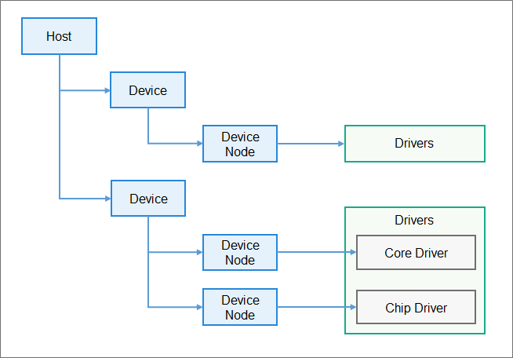

# 驱动开发<a name="ZH-CN_TOPIC_0000001051930361"></a>

## 驱动模型介绍<a name="section157425168112"></a>

HDF框架以组件化的驱动模型作为核心设计思路，为开发者提供更精细化的驱动管理，让驱动开发和部署更加规范。HDF框架将一类设备驱动放在同一个host里面，驱动内部实现开发者也可以将驱动功能分层独立开发和部署，支持一个驱动多个node，HDF框架管理驱动模型如下图所示：

**图 1**  HDF框架管理驱动模型<a name="fig5487113011526"></a>  




## 驱动开发步骤<a name="section1969312275533"></a>

基于HDF框架进行驱动的开发主要分为两个部分，驱动实现和驱动配置，详细开发流程如下所示：

1.  <a name="li35182436435"></a>驱动实现

    驱动实现包含驱动业务代码和驱动入口注册，具体写法如下：

    -   驱动业务代码

        ```
        #include "hdf_device_desc.h"  // HDF框架对驱动开放相关能力接口的头文件
        #include "hdf_log.h"          // HDF 框架提供的日志接口头文件
        
        #define HDF_LOG_TAG sample_driver   // 打印日志所包含的标签，如果不定义则用默认定义的HDF_TAG标签
        
        //驱动对外提供的服务能力，将相关的服务接口绑定到HDF框架
        int32_t HdfSampleDriverBind(struct HdfDeviceObject *deviceObject)
        {
            HDF_LOGD("Sample driver bind success");
            return 0;
        }
        
        // 驱动自身业务初始的接口
        int32_t HdfSampleDriverInit(struct HdfDeviceObject *deviceObject)
        {
            HDF_LOGD("Sample driver Init success");
            return 0;
        }
        
        // 驱动资源释放的接口
        void HdfSampleDriverRelease(struct HdfDeviceObject *deviceObject)
        {
            HDF_LOGD("Sample driver release success");
            return;
        }
        ```

    -   驱动入口注册到HDF框架

        ```
        // 定义驱动入口的对象，必须为HdfDriverEntry（在hdf_device_desc.h中定义）类型的全局变量
        struct HdfDriverEntry g_sampleDriverEntry = {
            .moduleVersion = 1,
            .moduleName = "sample_driver",
            .Bind = HdfSampleDriverBind,
            .Init = HdfSampleDriverInit,
            .Release = HdfSampleDriverRelease,
        };
        
        // 调用HDF_INIT将驱动入口注册到HDF框架中，在加载驱动时HDF框架会先调用Bind函数,再调用Init函数加载该驱动，当Init调用异常时，HDF框架会调用Release释放驱动资源并退出。
        HDF_INIT(g_sampleDriverEntry);
        ```


2.  驱动编译
    -   驱动代码的编译必须要使用HDF框架提供的Makefile模板进行编译

        ```
        include $(LITEOSTOPDIR)/../../drivers/hdf/lite/lite.mk #导入hdf预定义内容，必需
        MODULE_NAME :=    #生成的结果文件
        LOCAL_INCLUDE :=  #本驱动的头文件目录
        LOCAL_SRCS :=     #本驱动的源代码文件
        LOCAL_CFLAGS ：=  #自定义的编译选项
        include $(HDF_DRIVER) #导入模板makefile完成编译
        ```

    -   编译结果文件链接到内核镜像，添加到vendor目录下的hdf\_vendor.mk里面，示例如下

        ```
        LITEOS_BASELIB +=  -lxxx  #链接生成的静态库
        LIB_SUBDIRS    +=         #驱动代码Makefile的目录
        ```


3.  驱动配置

    HDF使用HCS作为配置描述源码，HCS详细介绍参考[配置管理](配置管理.md)介绍。

    驱动配置包含两部分，HDF框架定义的驱动设备描述和驱动的私有配置信息，具体写法如下：

    -   驱动设备描述（必选）

        HDF框架加载驱动所需要的信息来源于HDF框架定义的驱动设备描述，因此基于HDF框架开发的驱动必须要在HDF框架定义的device\_info.hcs配置文件中添加对应的设备描述，驱动的设备描述填写如下所示

        ```
        root {
            device_info {
                match_attr = "hdf_manager";
                template host {       // host模板，继承该模板的节点（如下sample_host）如果使用模板中的默认值，则节点字段可以缺省
                    hostName = "";
                    priority = 100;
                    template device {
                        template deviceNode {
                            policy = 0;
                            priority = 100;
                            preload = 0;
                            permission = 0664;
                            moduleName = "";
                            serviceName = "";
                            deviceMatchAttr = "";
                        }
                    }
                }
                sample_host :: host{
                    hostName = "host0";    // host名称，host节点是用来存放某一类驱动的容器
                    priority = 100;        // host启动优先级（0-200），值越大优先级越低，建议默认配100，优先级相同则不保证host的加载顺序
                    device_sample :: device {        // sample设备节点
                        device0 :: deviceNode {      // sample驱动的DeviceNode节点
                            policy = 1;              // policy字段是驱动服务发布的策略，在驱动服务管理章节有详细介绍
                            priority = 100;          // 驱动启动优先级（0-200），值越大优先级越低，建议默认配100，优先级相同则不保证device的加载顺序
                            preload = 0;             // 驱动按需加载字段，在本章节最后的说明有详细介绍
                            permission = 0664;       // 驱动创建设备节点权限
                            moduleName = "sample_driver";   // 驱动名称，该字段的值必须和驱动入口结构的moduleName值一致
                            serviceName = "sample_service";    // 驱动对外发布服务的名称，必须唯一
                            deviceMatchAttr = "sample_config"; // 驱动私有数据匹配的关键字，必须和驱动私有数据配置表中的match_attr值相等
                        }
                    }
                }
            }
        }
        ```

    -   驱动私有配置信息（可选）

        如果驱动有私有配置，则可以添加一个驱动的配置文件，用来填写一些驱动的默认配置信息，HDF框架在加载驱动的时候，会将对应的配置信息获取并保存在HdfDeviceObject 中的property里面，通过Bind和Init（参考[驱动开发](#li35182436435)）传递给驱动，驱动的配置信息示例如下：

        ```
        root {
            SampleDriverConfig {
                sample_version = 1;
                sample_bus = "I2C_0";
                match_attr = "sample_config";   //该字段的值必须和device_info.hcs中的deviceMatchAttr值一致
            }
        }
        ```

        配置信息定义之后，需要将该配置文件添加到板级配置入口文件hdf.hcs（这一块可以通过OpenHarmony驱动子系统在DevEco集成驱动开发套件工具一键式配置，具体使用方法参考驱动开发套件中的介绍），示例如下：

        ```
        #include "device_info/device_info.hcs"
        #include "sample/sample_config.hcs"
        ```


> **说明：** 
>驱动加载方式支持按需加载和按序加载两种方式，具体使用方法如下：
>-   按需加载
>    ```
>    typedef enum {
>        DEVICE_PRELOAD_ENABLE = 0,
>        DEVICE_PRELOAD_DISABLE,
>        DEVICE_PRELOAD_INVALID
>    } DevicePreload;
>    ```
>    配置文件中preload 字段配成 0 （DEVICE\_PRELOAD\_ENABLE ），则系统启动过程中默认加载；配成1（DEVICE\_PRELOAD\_DISABLE），则系统启动过程中默认不加载，支持后续动态加载，当用户态获取驱动服务（参考[消息机制](驱动消息机制管理.md)）时，如果驱动服务不存在时，HDF框架会尝试动态加载该驱动。
>-   按序加载（需要驱动为默认加载）
>    配置文件中的priority（取值范围为整数0到200）是用来表示host和驱动的优先级，不同的host内的驱动，host的priority值越小，驱动加载优先级越高；同一个host内驱动的priority值越小，加载优先级越高。

