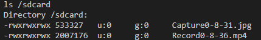
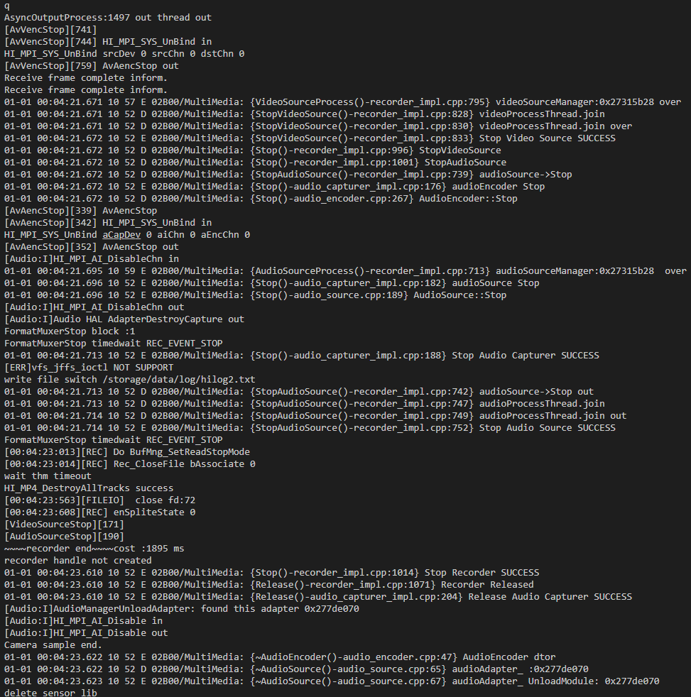

# 应用实例

-   开发板介绍及编译烧录、运行镜像基本流程参考对应开发板快速入门手册：[Hi3516快速入门](../quick-start/Hi3516开发板介绍.md)，编译结果包含camera\_sample示例。
-   相机示例代码为applications/sample/camera/media/camera\_sample.cpp。

    > **须知：** 
    >实例运行拍照和录像功能需要插入TF卡\(最大容量支持128GB\)，系统启动后时自动将TF卡挂载至/sdcard目录，如果在启动后插入则需要手动挂载。查看拍照和录像内容可将TF卡中内容复制到电脑中进行查看，预览功能无需TF卡。

1.  启动camera\_sample

    **图 1**  启动示例  
    

    运行后的控制命令如串口打印所示，按s键停止当前操作（包括录像和预览），按q键退出示例程序。

2.  按1进行拍照，拍照的文件格式为jpg，存储在/sdcard，文件名Capture\*

    **图 2**  输入拍照指令后串口打印日志  
    

    若想查看保存文件，可在退出程序后进入文件系统查看，退出后重新进入请回到步骤1。

    **图 3**  查看文件图  
    

3.  按2进行录像，录像的文件格式为mp4，存储在/sdcard，文件名Record\*，按s键停止

    **图 4**  输入录像指令后串口打印日志  
    

4.  按3进行预览，预览图像直接送至显示屏，按s键停止。

    **图 5**  输入预览指令后串口打印日志  
    

    预览效果如下

    **图 6**  预览效果  
    

5.  按q键退出

    **图 7**  输出退出指令后串口打印日志  
    

