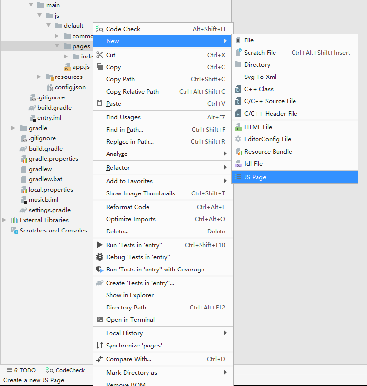

# 添加页面

## 创建首页面（创建工程）

空气质量监测App包含三个界面，工程创建完成后自带一个Page，工程目录如下图所示：

**图 1**  工程目录  

## 创建详情和历史页

创建工程后，另外两个Page的创建步骤见下：

1.  pages目录右键 ，弹出的菜单中选择New、JS Page。

    **图 2**  添加页面  
    

2.  输入Page名称。

    **图 3**  输入页面名称  
    

3.  确认创建结果。

    详情页和历史页创建完成后应用工程目录如下图所示，每个Page包括三个文件：布局文件hml、样式文件css、业务逻辑代码js。

    **图 4**  完整工程目录  
    

