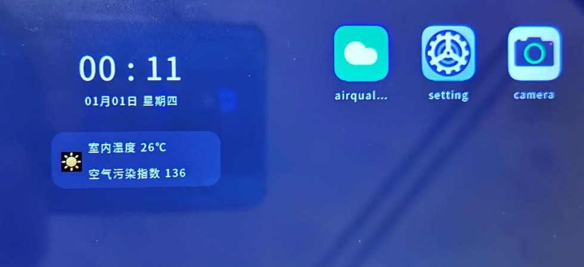

# 真机运行

开发板介绍及编译烧录、运行镜像基本流程参考对应开发板快速入门手册：[Hi3516快速入门](../quick-start/Hi3516开发板介绍.md)，执行完镜像运行步骤，系统正常启动后，执行如下步骤。

1.  安装三方应用（仅供debug版本调试使用）

    将应用安装包（带debug签名）和安装工具（镜像文件生成目录中的dev\_tools）放在sdcard中，安装过程如下：

    1.  执行./sdcard/dev\_tools/bin/bm set -d enable命令开启签名调试模式；
    2.  执行./sdcard/dev\_tools/bin/bm install -p /sdcard/airquality.hap 命令安装应用。其中dev\_tools目录中是安装工具，airquality.hap为应用安装包；
    3.  应用安装完成后，点击桌面应用图标启动应用；

    **图 1**  桌面  
    

2.  卸载应用

    长按桌面应用图标，在弹出的菜单中点击卸载按钮即可卸载应用；

