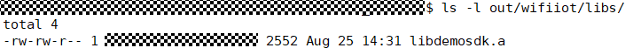

# 集成三方SDK<a name="ZH-CN_TOPIC_0000001054412155"></a>

OpenHarmony致力于打造一套更加开放完善的IoT生态系统，为此OpenHarmony规划了一组目录，用于将各厂商的SDK集成到OpenHarmony中。本文档基于Hi3861开发板，向平台开发者介绍将SDK集成到OpenHarmony的方法。

## 规划目录结构<a name="zh-cn_topic_0000001051612018_section1736472718351"></a>

三方SDK通常由静态库和适配代码构成。SDK的业务逻辑通过硬件模组工具链编译得到静态库libs，每款模组都有其对应的libs。SDK的南向API与OpenHarmony API的存在使用差异，该差异可通过adapter适配代码屏蔽，不同模组可共用一套adapter。

基于以上特征，在OpenHarmony目录结构中，可以对三方SDK目录做如下划分。

-   适配代码adapter，放置到./domains/iot/link/ 目录下，与模组解耦。
-   业务库libs，放置到./vendor/hisi/hi3861/hi3861/3rd\_sdk/ 目录下，与模组绑定。

平台开发者在适配前，务必先依次完成以下步骤，下面以demolink SDK举例，进行介绍。

1.  创建厂商目录，./domains/iot/link/demolink/、./vendor/hisi/hi3861/hi3861/3rd\_sdk/demolink/ ，用于厂商隔离。
2.  创建./domains/iot/link/demolink/BUILD.gn ，用于构建适配代码。
3.  创建./vendor/hisi/hi3861/hi3861/3rd\_sdk/demolink/libs/ 目录，用于存放业务库libs。

```
.
├── domains
│   └── iot
│       └── link
│           ├── demolink
│           │   └── BUILD.gn
│           ├── libbuild
│           │   └── BUILD.gn
│           └── BUILD.gn
└── vendor
     └── hisi
         └── hi3861
             └── hi3861
                 └── 3rd_sdk
                     └── demolink
                         └── libs
```

## 构建业务libs<a name="zh-cn_topic_0000001051612018_section442815485351"></a>

平台SDK业务一般以静态库的形式提供，平台厂商在获取到OpenHarmony代码后，需要根据对应的硬件模组vendor，进行编译业务libs，并将编译结果放置在./vendor/hisi/hi3861/hi3861/3rd\_sdk/demolink/libs/ 目录下。下面介绍业务libs的构建方法。

OpenHarmony已规划用于编译业务libs的目录./domains/iot/link/libbuild/ ，该目录中包含./domains/iot/link/libbuild/BUILD.gn和./domains/iot/link/BUILD.gn文件，目录结构如下。

```
.
└── domains
    └── iot
        └── link
            ├── demolink
            │   └── BUILD.gn
            ├── libbuild
            │   └── BUILD.gn
            └── BUILD.gn
```

平台开发者在构建libs前，务必先完成如下步骤。

1.  在./domains/iot/link/libbuild/ 目录下放置业务源码文件，包括.c和.h文件。编译完成后清空目录下源码文件。

    ```
    .
    └── domains
        └── iot
            └── link
                ├── demolink
                │   ├── demosdk_adapter.c
                │   ├── demosdk_adapter.h
                │   └── BUILD.gn
                ├── libbuild
                │   ├── demosdk.c
                │   ├── demosdk.h
                │   └── BUILD.gn
                └── BUILD.gn
    ```

2.  适配./domains/iot/link/libbuild/BUILD.gn，在编译完成后还原该文件。

    在BUILD.gn中，sources为需要参与构建的源文件，include\_dirs为依赖的头文件路径，构建的目标结果是生成静态库libdemosdk.a。

    ```
    static_library("demosdk") {
        sources = [
            "demosdk.c"
        ]
        include_dirs = [
            "//domains/iot/link/libbuild",
            "//domains/iot/link/demolink"
        ]
    }
    ```

3.  适配./domains/iot/link/BUILD.gn，在编译完成后还原该文件。

    此BUILD.gn文件用于指定构建条目，需要在features中填入所有需参与编译的静态库条目，使./domains/iot/link/libbuild/BUILD.gn参与到构建中来。

    ```
    import("//build/lite/config/subsystem/lite_subsystem.gni")
    import("//build/lite/config/component/lite_component.gni")
    lite_subsystem("iot") {
        subsystem_components = [
            ":link"
        ]
    }
    lite_component("link") {
        version = "1.0.0"
        dependences = []
        features = [
            "libbuild:demosdk"
        ]
    }
    ```


完成以上3点后，需在代码根目录下执行命令python build.py wifiiot --target //domains/iot/link:iot，等待执行完成，检查./out/wifiiot/libs目录下是否生成了目标库文件。



将库文件拷贝到./vendor/hisi/hi3861/hi3861/3rd\_sdk/demolink/libs/ 目录下，并将./domains/iot/link/libbuild/ 目录中的.c和.h文件清除。

## 编写适配代码<a name="zh-cn_topic_0000001051612018_section3984721113613"></a>

## 代码编写<a name="zh-cn_topic_0000001051612018_section830417531286"></a>

平台SDK中使用的API通常与OpenHarmony API存在差异，无法直接使用，需要一层适配代码adapter进行中间转换。本节以./domains/iot/link/demolink/demosdk\_adapter.c中的任务创建接口DemoSdkCreateTask举例，向开发者演示如何在OpenHarmony上编写适配代码。

1.  查看待适配接口DemoSdkCreateTask的描述、参数、返回值。

    ```
    struct TaskPara {
        char *name;
        void *(*func)(char* arg);
        void *arg;
        unsigned char prio;
        unsigned int size;
    };
    
    /*
     * IoT OS 创建线程接口
     * 返回值: 返回0 成功, 其他 失败
     */
    int DemoSdkCreateTask(unsigned int *handle, const struct TaskPara *para);
    ```

2.  查看OpenHarmony API接口文档，选取一个功能类似的接口，并比对参数及用法上的差异。例如本文选取osThreadNew ，通过和DemoSdkCreateTask接口比对，可以发现两接口依赖的参数基本一致，只是参数所归属的结构体不同。

    ```
    typedef struct {
        const char                   *name;   ///< name of the thread
        uint32_t                 attr_bits;   ///< attribute bits
        void                      *cb_mem;    ///< memory for control block
        uint32_t                   cb_size;   ///< size of provided memory for control block
        void                   *stack_mem;    ///< memory for stack
        uint32_t                stack_size;   ///< size of stack
        osPriority_t              priority;   ///< initial thread priority (default: osPriorityNormal)
        TZ_ModuleId_t            tz_module;   ///< TrustZone module identifier
        uint32_t                  reserved;   ///< reserved (must be 0)
    } osThreadAttr_t;
    
    /// Create a thread and add it to Active Threads.
    /// \param[in]     func          thread function.
    /// \param[in]     argument      pointer that is passed to the thread function as start argument.
    /// \param[in]     attr          thread attributes; NULL: default values.
    /// \return thread ID for reference by other functions or NULL in case of error.
    osThreadId_t osThreadNew (osThreadFunc_t func, void *argument, const osThreadAttr_t *attr);
    ```

3.  完成代码差异转换。

    ```
    int DemoSdkCreateTask(unsigned int *handle, const struct TaskPara *para)
    {
        osThreadAttr_t attr = {0};
        osThreadId_t threadId;
        if (handle == 0 || para == 0) {
            return DEMOSDK_ERR;
        }
        if (para->func == 0) {
            return DEMOSDK_ERR;
        }
        if (para->name == 0) {
            return DEMOSDK_ERR;
        }
        attr.name = para->name;
        attr.priority = para->prio;
        attr.stack_size = para->size;
        threadId = osThreadNew((osThreadFunc_t)para->func, para->arg, &attr);
        if (threadId == 0) {
            printf("osThreadNew fail\n");
            return DEMOSDK_ERR;
        }
        *(unsigned int *)handle = (unsigned int)threadId;
        return DEMOSDK_OK;
    }
    ```


## 脚本编写<a name="zh-cn_topic_0000001051612018_section13500201173710"></a>

开发者在完成代码适配后，还需要在adapter同级目录下新建BUILD.gn文件。该文件可在整包构建时，将适配代码编译成静态库，并链接到bin包中去。在./domains/iot/link/demolink/BUILD.gn中，sources中为需要参与构建的源文件，include\_dirs中为依赖的头文件路径，构建目标结果是生产静态库libdemolinkadapter.a。

```
import("//build/lite/config/component/lite_component.gni")
static_library("demolinkadapter") {
    sources = [
        "demosdk_adapter.c"
    ]
    include_dirs = [
        "//kernel/liteos-m/components/kal/include",
        "//kernel/liteos-m/components/cmsis/2.0",
        "//domains/iot/link/demolink"
    ]
}
```

修改./domains/iot/link/BUILD.gn文件，使./domain/iot/hilink/BUILD.gn参与到构建系统中。

```
import("//build/lite/config/subsystem/lite_subsystem.gni")
import("//build/lite/config/component/lite_component.gni")
lite_subsystem("iot") {
    subsystem_components = [
        ":link"
    ]
}
lite_component("link") {
    version = "1.0.0"
    dependences = []
    features = [
        "demolink:demolinkadapter"
    ]
}
```

## 编写业务代码<a name="zh-cn_topic_0000001051612018_section8754114803918"></a>

业务libs库和适配代码准备就绪后，还需要编写业务入口函数，调起三方SDK的业务入口。

下面以demolink举例，介绍如何在./applications/sample/wifi-iot/app/路径下编写代码，调起demosdk的入口函数。

1.  目录创建

    开发者编写业务时，务必先在./applications/sample/wifi-iot/app/ 路径下新建一个目录（或一套目录结构），用于存放业务源码文件。

    例如：在app下新增业务目录demolink，并在其中创建业务入口代码helloworld.c和编译构建文件BUILD.gn，如下。

    ```
    .
    └── applications
        └── sample
            └── wifi-iot
                └── app
                    │── demolink
                    │    │── helloworld.c
                    │    └── BUILD.gn
                    └── BUILD.gn
    ```

2.  编写业务代码。

    在helloworld.c文件中编写业务入口函数DemoSdkMain，并调起demolink的业务DemoSdkEntry，最后通过SYS\_RUN\(\)调用入口函数完成业务启动。

    ```
    #include "hos_init.h"
    #include "demosdk.h"
    
    void DemoSdkMain(void)
    {
        DemoSdkEntry();
    }
    
    SYS_RUN(DemoSdkMain);
    ```

3.  编写构建脚本

    新增./applications/sample/wifi-iot/app/demolink/BUILD.gn文件，指定源码和头文件路径，编译输出静态库文件libexample\_demolink.a。

    ```
    static_library("example_demolink") {
        sources = [
            "helloworld.c"
        ]
    
        include_dirs = [
            "//utils/native/liteos/include",
            "//vendor/hisi/wifi-iot/hi3861/3rd_sdk/demolink"
        ]
    }
    ```

    修改./applications/sample/wifi-iot/app/BUILD.gn，使demolink参与编译。

    ```
    import("//build/lite/config/component/lite_component.gni")
    lite_component("app") {
        features = [
            "demolink:example_demolink"
        ]
    }
    ```


## 运行<a name="zh-cn_topic_0000001051612018_section7737749184012"></a>

在代码根目录下，执行命令“python build.py wifiiot”编译输出版本包。最后启动运行，运行结果如图所示，与demolink预期相符。

```
ready to OS start
sdk ver:Hi3861V100R001C00SPC024 2020-08-05 16:30:00
formatting spiffs...
FileSystem mount ok.
wifi init success!
it is demosdk entry.
it is demo biz: hello world.
it is demo biz: hello world.
```

## 结束<a name="zh-cn_topic_0000001051612018_section153301392411"></a>

至此，三方SDK集成已介绍完毕。

