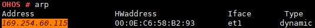

# arp

## 命令功能

在以太网中，主机之间的通信是直接使用MAC地址（非IP地址）来通信的，所以，对于使用IP通信的协议，必须能够将IP地址转换成MAC地址，才能在局域网（以太网）内通信。解决这个问题的方法就是主机存储一张IP和MAC地址对应的表，即ARP缓存，主机要往一个局域网内的目的IP地址发送IP包时，就可以从ARP缓存表中查询到目的MAC地址。ARP缓存是由TCP/IP协议栈维护的，用户可通过ARP命令查看和修改ARP表。

## 命令格式

arp

arp \[_-i IF_\] -s  _IPADDR HWADDR_

arp \[_-i IF_\] -d  _IPADDR_

## 参数说明

**表 1**  参数说明

<table><thead align="left"><tr id="row1851mcpsimp"><th class="cellrowborder" valign="top" width="21%" id="mcps1.2.4.1.1">
参数

</th>
<th class="cellrowborder" valign="top" width="52%" id="mcps1.2.4.1.2">
参数说明

</th>
<th class="cellrowborder" valign="top" width="27%" id="mcps1.2.4.1.3">
取值范围

</th>
</tr>
</thead>
<tbody><tr id="row1858mcpsimp"><td class="cellrowborder" valign="top" width="21%" headers="mcps1.2.4.1.1 ">
无

</td>
<td class="cellrowborder" valign="top" width="52%" headers="mcps1.2.4.1.2 ">
打印整个ARP缓存的内容。

</td>
<td class="cellrowborder" valign="top" width="27%" headers="mcps1.2.4.1.3 ">
N/A

</td>
</tr>
<tr id="row1865mcpsimp"><td class="cellrowborder" valign="top" width="21%" headers="mcps1.2.4.1.1 ">
-i IF

</td>
<td class="cellrowborder" valign="top" width="52%" headers="mcps1.2.4.1.2 ">
指定的网络接口（可选参数）。

</td>
<td class="cellrowborder" valign="top" width="27%" headers="mcps1.2.4.1.3 ">
N/A

</td>
</tr>
<tr id="row1872mcpsimp"><td class="cellrowborder" valign="top" width="21%" headers="mcps1.2.4.1.1 ">
-s IPADDR

HWADDR

</td>
<td class="cellrowborder" valign="top" width="52%" headers="mcps1.2.4.1.2 ">
增加一条ARP表项，后面的参数是局域网中另一台主机的IP地址及其对应的MAC地址。

</td>
<td class="cellrowborder" valign="top" width="27%" headers="mcps1.2.4.1.3 ">
N/A

</td>
</tr>
<tr id="row1880mcpsimp"><td class="cellrowborder" valign="top" width="21%" headers="mcps1.2.4.1.1 ">
-d IPADDR

</td>
<td class="cellrowborder" valign="top" width="52%" headers="mcps1.2.4.1.2 ">
删除一条ARP表项。

</td>
<td class="cellrowborder" valign="top" width="27%" headers="mcps1.2.4.1.3 ">
N/A

</td>
</tr>
</tbody>
</table>

## 使用指南

-   arp命令用来查询和修改TCP/IP协议栈的ARP缓存表，增加非同一子网内的IP地址的ARP表项是没有意义的，协议栈会返回失败。
-   命令需要启动TCP/IP协议栈后才能使用。

## 使用实例

举例：

1.  输入arp

    **图 1**  打印整个 ARP 缓存表  
    

    **表 2**  参数说明

    
    <table><thead align="left"><tr id="row1906mcpsimp"><th class="cellrowborder" valign="top" width="50%" id="mcps1.2.3.1.1">
参数

    </th>
    <th class="cellrowborder" valign="top" width="50%" id="mcps1.2.3.1.2">
说明

    </th>
    </tr>
    </thead>
    <tbody><tr id="row1911mcpsimp"><td class="cellrowborder" valign="top" width="50%" headers="mcps1.2.3.1.1 ">
Address

    </td>
    <td class="cellrowborder" valign="top" width="50%" headers="mcps1.2.3.1.2 ">
表示网络设备的IPv4地址。

    </td>
    </tr>
    <tr id="row1916mcpsimp"><td class="cellrowborder" valign="top" width="50%" headers="mcps1.2.3.1.1 ">
HWaddress

    </td>
    <td class="cellrowborder" valign="top" width="50%" headers="mcps1.2.3.1.2 ">
表示网络设备的MAC地址。

    </td>
    </tr>
    <tr id="row1921mcpsimp"><td class="cellrowborder" valign="top" width="50%" headers="mcps1.2.3.1.1 ">
Iface

    </td>
    <td class="cellrowborder" valign="top" width="50%" headers="mcps1.2.3.1.2 ">
表示该ARP表项使用的接口名。

    </td>
    </tr>
    <tr id="row1926mcpsimp"><td class="cellrowborder" valign="top" width="50%" headers="mcps1.2.3.1.1 ">
Type

    </td>
    <td class="cellrowborder" valign="top" width="50%" headers="mcps1.2.3.1.2 ">
表示该ARP表项是动态的还是静态的，动态是指ARP表项由协议栈自动创建，静态是指ARP表项是由用户增加的。

    </td>
    </tr>
    </tbody>
    </table>

