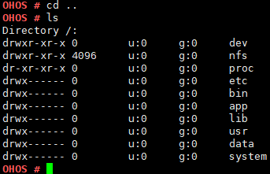

# cd

## 命令功能

cd命令用来改变当前目录。

## 命令格式

cd \[_path_\]

## 参数说明

**表 1**  参数说明

<table><thead align="left"><tr id="row1093mcpsimp"><th class="cellrowborder" valign="top" width="21%" id="mcps1.2.4.1.1">
参数

</th>
<th class="cellrowborder" valign="top" width="52%" id="mcps1.2.4.1.2">
参数说明

</th>
<th class="cellrowborder" valign="top" width="27%" id="mcps1.2.4.1.3">
取值范围

</th>
</tr>
</thead>
<tbody><tr id="row1100mcpsimp"><td class="cellrowborder" valign="top" width="21%" headers="mcps1.2.4.1.1 ">
path

</td>
<td class="cellrowborder" valign="top" width="52%" headers="mcps1.2.4.1.2 ">
文件路径。

</td>
<td class="cellrowborder" valign="top" width="27%" headers="mcps1.2.4.1.3 ">
用户必须具有指定目录中的执行（搜索）许可权。

</td>
</tr>
</tbody>
</table>

## 使用指南

-   未指定目录参数时，会跳转至根目录。
-   cd后加路径名时，跳转至该路径。
-   路径名以 /（斜杠）开头时，表示根目录。
-   .（点）表示当前目录。
-   ..（点点）表示父目录。

## 使用实例

举例：cd ..

## 输出说明

**图 1**  显示结果如下  

