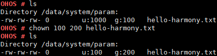

# chown

## 命令功能

chmod用于将指定文件的拥有者改为指定的用户或组。

## 命令格式

chown \[_owner_\] \[_group_\] \[_pathname_\]

## 参数说明

**表 1**  参数说明

<table><thead align="left"><tr id="row1055mcpsimp"><th class="cellrowborder" valign="top" width="21%" id="mcps1.2.4.1.1">
参数

</th>
<th class="cellrowborder" valign="top" width="52%" id="mcps1.2.4.1.2">
参数说明

</th>
<th class="cellrowborder" valign="top" width="27%" id="mcps1.2.4.1.3">
取值范围

</th>
</tr>
</thead>
<tbody><tr id="row1062mcpsimp"><td class="cellrowborder" valign="top" width="21%" headers="mcps1.2.4.1.1 ">
owner

</td>
<td class="cellrowborder" valign="top" width="52%" headers="mcps1.2.4.1.2 ">
文件拥有者。

</td>
<td class="cellrowborder" valign="top" width="27%" headers="mcps1.2.4.1.3 ">
[0,0xFFFFFFFF]

</td>
</tr>
<tr id="row172161126124218"><td class="cellrowborder" valign="top" width="21%" headers="mcps1.2.4.1.1 ">
group

</td>
<td class="cellrowborder" valign="top" width="52%" headers="mcps1.2.4.1.2 ">
文件群组。

</td>
<td class="cellrowborder" valign="top" width="27%" headers="mcps1.2.4.1.3 ">
1、为空。

2、[0,0xFFFFFFFF]

</td>
</tr>
<tr id="row10616101153510"><td class="cellrowborder" valign="top" width="21%" headers="mcps1.2.4.1.1 ">
pathname

</td>
<td class="cellrowborder" valign="top" width="52%" headers="mcps1.2.4.1.2 ">
文件路径。

</td>
<td class="cellrowborder" valign="top" width="27%" headers="mcps1.2.4.1.3 ">
已存在的文件。

</td>
</tr>
</tbody>
</table>

## 使用指南

-   在需要修改的文件名前加上文件拥有者和文件群组就可以分别修改该文件的拥有者和群组。
-   当owner或group值为-1时则表示对应的owner或group不修改。
-   group参数可以为空。

## 使用实例

举例：chown 100 200 hello-harmony.txt

## 输出说明

**图 1**  修改 hello-harmony.txt 文件的uid为100，gid为200  

