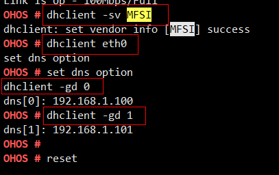

# dhclient

## 命令功能

设置和查看dhclient的参数。

## 命令格式

dhclient <_netif name_\>

dhclient -x <_netif name_\>

dhclient -gb <_netif name_\>

dhclient -sv <_vendor_\>

dhclient -gv

dhclient -gd <_index_\>

dhclient -sd <_dns\_ip_\>

## 参数说明

**表 1**  参数说明

<table><thead align="left"><tr id="row444mcpsimp"><th class="cellrowborder" valign="top" width="21%" id="mcps1.2.4.1.1">
参数

</th>
<th class="cellrowborder" valign="top" width="52%" id="mcps1.2.4.1.2">
参数说明

</th>
<th class="cellrowborder" valign="top" width="27%" id="mcps1.2.4.1.3">
取值范围

</th>
</tr>
</thead>
<tbody><tr id="row451mcpsimp"><td class="cellrowborder" valign="top" width="21%" headers="mcps1.2.4.1.1 ">
&lt;netif name&gt;

</td>
<td class="cellrowborder" valign="top" width="52%" headers="mcps1.2.4.1.2 ">
启动对应网卡的dhcp请求。

</td>
<td class="cellrowborder" valign="top" width="27%" headers="mcps1.2.4.1.3 ">
网卡名字，eth0。

</td>
</tr>
<tr id="row1110416513817"><td class="cellrowborder" valign="top" width="21%" headers="mcps1.2.4.1.1 ">
-x &lt;netif name&gt;

</td>
<td class="cellrowborder" valign="top" width="52%" headers="mcps1.2.4.1.2 ">
关闭对应网卡的dhcp功能。

</td>
<td class="cellrowborder" valign="top" width="27%" headers="mcps1.2.4.1.3 ">
网卡名字，eth0。

</td>
</tr>
<tr id="row8809123074012"><td class="cellrowborder" valign="top" width="21%" headers="mcps1.2.4.1.1 ">
-gb &lt;netif name&gt;

</td>
<td class="cellrowborder" valign="top" width="52%" headers="mcps1.2.4.1.2 ">
查看对应网卡的dhcp请求是否完成。

</td>
<td class="cellrowborder" valign="top" width="27%" headers="mcps1.2.4.1.3 ">
网卡名字，eth0。

</td>
</tr>
<tr id="row46581611174117"><td class="cellrowborder" valign="top" width="21%" headers="mcps1.2.4.1.1 ">
-sv &lt;vendor&gt;

</td>
<td class="cellrowborder" valign="top" width="52%" headers="mcps1.2.4.1.2 ">
设置dhcp请求的厂商信息。

</td>
<td class="cellrowborder" valign="top" width="27%" headers="mcps1.2.4.1.3 ">
厂商信息，长度是32个字符。

</td>
</tr>
<tr id="row14729211134217"><td class="cellrowborder" valign="top" width="21%" headers="mcps1.2.4.1.1 ">
-gv

</td>
<td class="cellrowborder" valign="top" width="52%" headers="mcps1.2.4.1.2 ">
查看dhcp请求的厂商信息。

</td>
<td class="cellrowborder" valign="top" width="27%" headers="mcps1.2.4.1.3 ">
N/A

</td>
</tr>
<tr id="row4940853114219"><td class="cellrowborder" valign="top" width="21%" headers="mcps1.2.4.1.1 ">
-gd &lt;index&gt;

</td>
<td class="cellrowborder" valign="top" width="52%" headers="mcps1.2.4.1.2 ">
获取第index个dns server的信息。

</td>
<td class="cellrowborder" valign="top" width="27%" headers="mcps1.2.4.1.3 ">
index，0或者1。

</td>
</tr>
<tr id="row196815382432"><td class="cellrowborder" valign="top" width="21%" headers="mcps1.2.4.1.1 ">
-sd &lt;dns_ip&gt;

</td>
<td class="cellrowborder" valign="top" width="52%" headers="mcps1.2.4.1.2 ">
设置主dns server的ip。

</td>
<td class="cellrowborder" valign="top" width="27%" headers="mcps1.2.4.1.3 ">
dns的ip地址。

</td>
</tr>
</tbody>
</table>

## 使用指南

dhclient eth0

dhclient -x eth0

dhclient -gb eth0

dhclient -sv MFSI

dhclient -gv

dhclient -gd 0

dhclient -sd 8.8.8.8

## 使用实例

## 输出说明

**表 2**  输出说明

<table><thead align="left"><tr id="row492mcpsimp"><th class="cellrowborder" valign="top" width="50%" id="mcps1.2.3.1.1">
输出

</th>
<th class="cellrowborder" valign="top" width="50%" id="mcps1.2.3.1.2">
说明

</th>
</tr>
</thead>
<tbody><tr id="row502mcpsimp"><td class="cellrowborder" valign="top" width="50%" headers="mcps1.2.3.1.1 ">
dhclient: set vendor info [MFSI] success

</td>
<td class="cellrowborder" valign="top" width="50%" headers="mcps1.2.3.1.2 ">
设置厂商信息MFSI信息成功。

</td>
</tr>
<tr id="row1990234224612"><td class="cellrowborder" valign="top" width="50%" headers="mcps1.2.3.1.1 ">
dns[0]: 192.168.1.100

</td>
<td class="cellrowborder" valign="top" width="50%" headers="mcps1.2.3.1.2 ">
dns server ip地址为192.168.1.100。

</td>
</tr>
</tbody>
</table>

