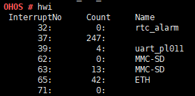
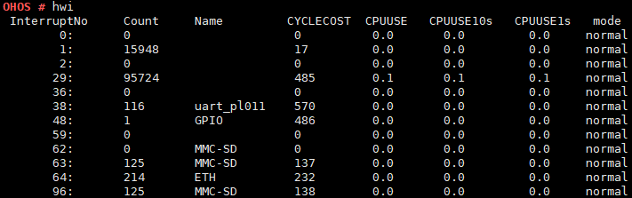

# hwi

## 命令功能

hwi命令查询当前中断信息

## 命令格式

hwi

## 参数说明

无。

## 使用指南

-   输入hwi即显示当前中断号、中断次数及注册中断名称。
-   若开关LOSCFG\_CPUP\_INCLUDE\_IRQ打开，则还会显示各个中断的处理时间（cycles）、CPU占用率以及中断类型。

## 使用实例

举例：输入hwi

## 输出说明

1.  显示中断信息（LOSCFG\_CPUP\_INCLUDE\_IRQ关闭）

    

2.  显示中断信息（LOSCFG\_CPUP\_INCLUDE\_IRQ打开）

    

    **表 1**  输出说明

    
    <table><thead align="left"><tr id="row814mcpsimp"><th class="cellrowborder" valign="top" width="50%" id="mcps1.2.3.1.1">
输出

    </th>
    <th class="cellrowborder" valign="top" width="50%" id="mcps1.2.3.1.2">
说明

    </th>
    </tr>
    </thead>
    <tbody><tr id="row20360171311398"><td class="cellrowborder" valign="top" width="50%" headers="mcps1.2.3.1.1 ">
InterruptNo

    </td>
    <td class="cellrowborder" valign="top" width="50%" headers="mcps1.2.3.1.2 ">
中断号。

    </td>
    </tr>
    <tr id="row262535153913"><td class="cellrowborder" valign="top" width="50%" headers="mcps1.2.3.1.1 ">
Count

    </td>
    <td class="cellrowborder" valign="top" width="50%" headers="mcps1.2.3.1.2 ">
中断次数。

    </td>
    </tr>
    <tr id="row9683953153916"><td class="cellrowborder" valign="top" width="50%" headers="mcps1.2.3.1.1 ">
Name

    </td>
    <td class="cellrowborder" valign="top" width="50%" headers="mcps1.2.3.1.2 ">
注册中断名称。

    </td>
    </tr>
    <tr id="row85721136402"><td class="cellrowborder" valign="top" width="50%" headers="mcps1.2.3.1.1 ">
CYCLECOST

    </td>
    <td class="cellrowborder" valign="top" width="50%" headers="mcps1.2.3.1.2 ">
中断的处理时间（cycles）。

    </td>
    </tr>
    <tr id="row19180126151415"><td class="cellrowborder" valign="top" width="50%" headers="mcps1.2.3.1.1 ">
CPUUSE

    </td>
    <td class="cellrowborder" valign="top" width="50%" headers="mcps1.2.3.1.2 ">
CPU占用率。

    </td>
    </tr>
    <tr id="row511517331702"><td class="cellrowborder" valign="top" width="50%" headers="mcps1.2.3.1.1 ">
CPUUSE10s

    </td>
    <td class="cellrowborder" valign="top" width="50%" headers="mcps1.2.3.1.2 ">
最近10s CPU占用率。

    </td>
    </tr>
    <tr id="row1868124415413"><td class="cellrowborder" valign="top" width="50%" headers="mcps1.2.3.1.1 ">
CPUUSE1s

    </td>
    <td class="cellrowborder" valign="top" width="50%" headers="mcps1.2.3.1.2 ">
最近1s CPU占用率。

    </td>
    </tr>
    <tr id="row7681164454112"><td class="cellrowborder" valign="top" width="50%" headers="mcps1.2.3.1.1 ">
mode

    </td>
    <td class="cellrowborder" valign="top" width="50%" headers="mcps1.2.3.1.2 ">
中断类型:

    <ul id="ul682912412419"><li>normal:  非共享中断。</li><li>shared:  共享中断。</li></ul>
    </td>
    </tr>
    </tbody>
    </table>

