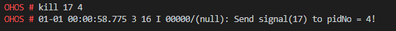

# kill

## 命令功能

命令用于发送特定信号给指定进程。

## 命令格式

kill \[_signo_  |  _-signo_\] \[_pid_\]

## 参数说明

**表 1**  参数说明

<table><thead align="left"><tr id="row444mcpsimp"><th class="cellrowborder" valign="top" width="21%" id="mcps1.2.4.1.1">
参数

</th>
<th class="cellrowborder" valign="top" width="51.92%" id="mcps1.2.4.1.2">
参数说明

</th>
<th class="cellrowborder" valign="top" width="27.08%" id="mcps1.2.4.1.3">
取值范围

</th>
</tr>
</thead>
<tbody><tr id="row451mcpsimp"><td class="cellrowborder" valign="top" width="21%" headers="mcps1.2.4.1.1 ">
signo

</td>
<td class="cellrowborder" valign="top" width="51.92%" headers="mcps1.2.4.1.2 ">
信号ID。

</td>
<td class="cellrowborder" valign="top" width="27.08%" headers="mcps1.2.4.1.3 ">
[1,30]

</td>
</tr>
<tr id="row113001232165611"><td class="cellrowborder" valign="top" width="21%" headers="mcps1.2.4.1.1 ">
pid

</td>
<td class="cellrowborder" valign="top" width="51.92%" headers="mcps1.2.4.1.2 ">
进程ID。

</td>
<td class="cellrowborder" valign="top" width="27.08%" headers="mcps1.2.4.1.3 ">
[1,MAX_INT]

</td>
</tr>
</tbody>
</table>

> **须知：** 
>signo有效范围为\[0,64\]，建议取值范围为\[1,30\]，其余为保留内容。

## 使用指南

必须指定发送的信号编号及进程号。

进程编号取值范围根据系统配置变化，例如系统最大支持pid为256，则取值范围缩小为\[1-256\]。

## 使用实例

1.  查看当前进程列表，查看需要杀死的进程PID（7）。

**图 1**  查看进程PID  

2. 发送信号14（SIGALRM默认行为为进程终止）给7号进程**helloworld\_d**（用户态进程）：**kill 14 7**（kill -14 7效果相同），并查看当前进程列表，7号进程已终止。

**图 2**  信号发送结果图  

## 输出说明

发送成功或失败输出结果如下。

**图 3**  发送信号给指定进程  

信号发送会显示发送记录，未报错表示信号发送成功。

**图 4**  信号发送失败  

信号发送失败，上图所示原因为信号发送命令参数无效，请排查信号编号及进程编号是否无效。

