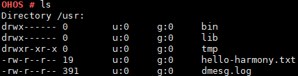

# ls

## 命令功能

ls命令用来显示当前目录的内容。

## 命令格式

ls \[_path_\]

## 参数说明

**表 1**  参数说明

<table><thead align="left"><tr id="row1250mcpsimp"><th class="cellrowborder" valign="top" width="21%" id="mcps1.2.4.1.1">
参数

</th>
<th class="cellrowborder" valign="top" width="52%" id="mcps1.2.4.1.2">
参数说明

</th>
<th class="cellrowborder" valign="top" width="27%" id="mcps1.2.4.1.3">
取值范围

</th>
</tr>
</thead>
<tbody><tr id="row1257mcpsimp"><td class="cellrowborder" valign="top" width="21%" headers="mcps1.2.4.1.1 ">
path

</td>
<td class="cellrowborder" valign="top" width="52%" headers="mcps1.2.4.1.2 ">
path为空时，显示当前目录的内容。

path为无效文件名时，显示失败，提示：

ls error: No such directory。

path为有效目录路径时，会显示对应目录下的内容。

</td>
<td class="cellrowborder" valign="top" width="27%" headers="mcps1.2.4.1.3 ">
1.为空。

2.有效的目录路径。

</td>
</tr>
</tbody>
</table>

## 使用指南

-   ls命令显示当前目录的内容。
-   ls可以显示文件的大小。
-   proc下ls无法统计文件大小，显示为0。

## 使用实例

举例：输入ls

## 输出说明

**图 1**  查看当前系统路径下的目录，显示的内容如下  

