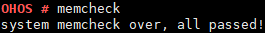

# memcheck

## 命令功能

检查动态申请的内存块是否完整，是否存在内存越界造成节点损坏。

## 命令格式

memcheck

## 参数说明

无。

## 使用指南

-   当内存池所有节点完整时，输出"system memcheck over, all passed!"。
-   当内存池存在节点不完整时，输出被损坏节点的内存块信息。

## 使用实例

举例：输入memcheck

## 输出说明

**图 1**  当前没有内存越界  

**图 2**  出现内存越界  

