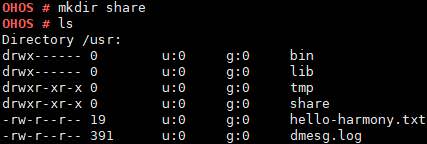

# mkdir

## 命令功能

mkdir命令用来创建一个目录。

## 命令格式

mkdir \[_directory_\]

## 参数说明

**表 1**  参数说明

<table><thead align="left"><tr id="row1305mcpsimp"><th class="cellrowborder" valign="top" width="21%" id="mcps1.2.4.1.1">
参数

</th>
<th class="cellrowborder" valign="top" width="52%" id="mcps1.2.4.1.2">
参数说明

</th>
<th class="cellrowborder" valign="top" width="27%" id="mcps1.2.4.1.3">
取值范围

</th>
</tr>
</thead>
<tbody><tr id="row1312mcpsimp"><td class="cellrowborder" valign="top" width="21%" headers="mcps1.2.4.1.1 ">
directory

</td>
<td class="cellrowborder" valign="top" width="52%" headers="mcps1.2.4.1.2 ">
需要创建的目录。

</td>
<td class="cellrowborder" valign="top" width="27%" headers="mcps1.2.4.1.3 ">
N/A

</td>
</tr>
</tbody>
</table>

## 使用指南

-   mkdir后加所需要创建的目录名会在当前目录下创建目录。
-   mkdir后加路径，再加上需要创建的目录名，即在指定目录下创建目录。

## 使用实例

举例：mkdir share

## 输出说明

**图 1**  创建 share 目录  

