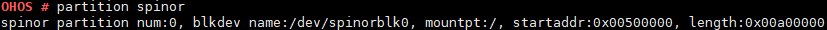

# partition

## 命令功能

partition命令用来查看flash分区信息。

## 命令格式

partition \[_nand / spinor_\]

## 参数说明

**表 1**  参数说明

<table><thead align="left"><tr id="row1431mcpsimp"><th class="cellrowborder" valign="top" width="21%" id="mcps1.2.4.1.1">
参数

</th>
<th class="cellrowborder" valign="top" width="52%" id="mcps1.2.4.1.2">
参数说明

</th>
<th class="cellrowborder" valign="top" width="27%" id="mcps1.2.4.1.3">
取值范围

</th>
</tr>
</thead>
<tbody><tr id="row1438mcpsimp"><td class="cellrowborder" valign="top" width="21%" headers="mcps1.2.4.1.1 ">
nand

</td>
<td class="cellrowborder" valign="top" width="52%" headers="mcps1.2.4.1.2 ">
显示nand flash分区信息。

</td>
<td class="cellrowborder" valign="top" width="27%" headers="mcps1.2.4.1.3 ">
N/A

</td>
</tr>
<tr id="row1445mcpsimp"><td class="cellrowborder" valign="top" width="21%" headers="mcps1.2.4.1.1 ">
spinor

</td>
<td class="cellrowborder" valign="top" width="52%" headers="mcps1.2.4.1.2 ">
显示spinor flash分区信息。

</td>
<td class="cellrowborder" valign="top" width="27%" headers="mcps1.2.4.1.3 ">
N/A

</td>
</tr>
</tbody>
</table>

## 使用指南

-   partition命令用来查看flash分区信息。
-   仅当使能yaffs文件系统时才可以查看nand flash分区信息，使能jffs或romfs文件系统时可以查看spinor flash分区信息。

## 使用实例

举例：partition spinor

## 输出说明

查看spinor flash分区信息

