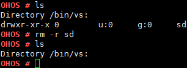

# rm

## 命令功能

rm命令用来删除文件或文件夹。

## 命令格式

rm \[_-r_\] \[_dirname / filename_\]

## 参数说明

**表 1**  参数说明

<table><thead align="left"><tr id="row1513mcpsimp"><th class="cellrowborder" valign="top" width="22.220000000000002%" id="mcps1.2.4.1.1">
参数

</th>
<th class="cellrowborder" valign="top" width="51.519999999999996%" id="mcps1.2.4.1.2">
参数说明

</th>
<th class="cellrowborder" valign="top" width="26.26%" id="mcps1.2.4.1.3">
取值范围

</th>
</tr>
</thead>
<tbody><tr id="row1520mcpsimp"><td class="cellrowborder" valign="top" width="22.220000000000002%" headers="mcps1.2.4.1.1 ">
-r

</td>
<td class="cellrowborder" valign="top" width="51.519999999999996%" headers="mcps1.2.4.1.2 ">
可选参数，若是删除目录则需要该参数。

</td>
<td class="cellrowborder" valign="top" width="26.26%" headers="mcps1.2.4.1.3 ">
N/A

</td>
</tr>
<tr id="row1527mcpsimp"><td class="cellrowborder" valign="top" width="22.220000000000002%" headers="mcps1.2.4.1.1 ">
dirname/filename

</td>
<td class="cellrowborder" valign="top" width="51.519999999999996%" headers="mcps1.2.4.1.2 ">
要删除文件或文件夹的名称，支持输入路径。

</td>
<td class="cellrowborder" valign="top" width="26.26%" headers="mcps1.2.4.1.3 ">
N/A

</td>
</tr>
</tbody>
</table>

## 使用指南

-   rm命令一次只能删除一个文件或文件夹。
-   rm -r命令可以删除非空目录。

## 使用实例

举例：

1.  输入rm log1.txt
2.  输入rm -r sd

## 输出说明

**图 1**  用 rm 命令删除文件 log1.txt  

**图 2**  用 rm -r 删除目录 sd  

