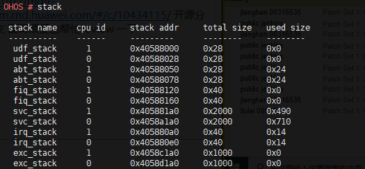

# stack

## 命令功能

查看系统各堆栈使用情况。

## 命令格式

stack

## 参数说明

无。

## 使用指南

无。

## 使用实例

输入：stack

## 输出说明

**图 1**  系统堆栈使用情况  

**表 1**  输出说明

<table><thead align="left"><tr id="row638mcpsimp"><th class="cellrowborder" valign="top" width="50%" id="mcps1.2.3.1.1">
输出

</th>
<th class="cellrowborder" valign="top" width="50%" id="mcps1.2.3.1.2">
说明

</th>
</tr>
</thead>
<tbody><tr id="row643mcpsimp"><td class="cellrowborder" valign="top" width="50%" headers="mcps1.2.3.1.1 ">
stack name

</td>
<td class="cellrowborder" valign="top" width="50%" headers="mcps1.2.3.1.2 ">
系统堆栈名

</td>
</tr>
<tr id="row648mcpsimp"><td class="cellrowborder" valign="top" width="50%" headers="mcps1.2.3.1.1 ">
cpu id

</td>
<td class="cellrowborder" valign="top" width="50%" headers="mcps1.2.3.1.2 ">
cpu 号

</td>
</tr>
<tr id="row653mcpsimp"><td class="cellrowborder" valign="top" width="50%" headers="mcps1.2.3.1.1 ">
stack addr

</td>
<td class="cellrowborder" valign="top" width="50%" headers="mcps1.2.3.1.2 ">
栈地址

</td>
</tr>
<tr id="row658mcpsimp"><td class="cellrowborder" valign="top" width="50%" headers="mcps1.2.3.1.1 ">
total size

</td>
<td class="cellrowborder" valign="top" width="50%" headers="mcps1.2.3.1.2 ">
堆栈大小

</td>
</tr>
<tr id="row10101624938"><td class="cellrowborder" valign="top" width="50%" headers="mcps1.2.3.1.1 ">
used size

</td>
<td class="cellrowborder" valign="top" width="50%" headers="mcps1.2.3.1.2 ">
堆栈实际使用大小

</td>
</tr>
</tbody>
</table>

