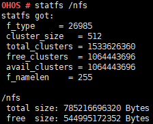

# statfs

## 命令功能

statfs命令用来打印文件系统的信息，如该文件系统类型、总大小、可用大小等信息。

## 命令格式

statfs \[_directory_\]

## 参数说明

**表 1**  参数说明

<table><thead align="left"><tr id="row1603mcpsimp"><th class="cellrowborder" valign="top" width="33.33333333333333%" id="mcps1.2.4.1.1">
参数

</th>
<th class="cellrowborder" valign="top" width="33.33333333333333%" id="mcps1.2.4.1.2">
参数说明

</th>
<th class="cellrowborder" valign="top" width="33.33333333333333%" id="mcps1.2.4.1.3">
取值范围

</th>
</tr>
</thead>
<tbody><tr id="row1610mcpsimp"><td class="cellrowborder" valign="top" width="33.33333333333333%" headers="mcps1.2.4.1.1 ">
directory

</td>
<td class="cellrowborder" valign="top" width="33.33333333333333%" headers="mcps1.2.4.1.2 ">
文件系统的路径。

</td>
<td class="cellrowborder" valign="top" width="33.33333333333333%" headers="mcps1.2.4.1.3 ">
必须是存在的文件系统，并且其支持statfs命令，当前支持的文件系统有：JFFS2，FAT，NFS。

</td>
</tr>
</tbody>
</table>

## 使用指南

打印信息因文件系统而异。

## 使用实例

以nfs文件系统为例：

statfs /nfs

**图 1**  statfs输出说明  

