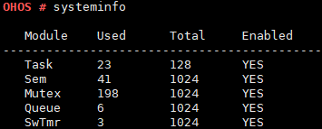

# systeminfo

## 命令功能

systeminfo命令用于显示当前操作系统内资源使用情况，包括任务、信号量、互斥量、队列、定时器等。

## 命令格式

systeminfo

## 参数说明

无。

## 使用指南

无。

## 使用实例

举例：输入systeminfo

## 输出说明

**图 1**  查看系统资源使用情况  

**表 1**  输出说明

<table><thead align="left"><tr id="row638mcpsimp"><th class="cellrowborder" valign="top" width="50%" id="mcps1.2.3.1.1">
输出

</th>
<th class="cellrowborder" valign="top" width="50%" id="mcps1.2.3.1.2">
说明

</th>
</tr>
</thead>
<tbody><tr id="row643mcpsimp"><td class="cellrowborder" valign="top" width="50%" headers="mcps1.2.3.1.1 ">
Module

</td>
<td class="cellrowborder" valign="top" width="50%" headers="mcps1.2.3.1.2 ">
模块名称。

</td>
</tr>
<tr id="row648mcpsimp"><td class="cellrowborder" valign="top" width="50%" headers="mcps1.2.3.1.1 ">
Used

</td>
<td class="cellrowborder" valign="top" width="50%" headers="mcps1.2.3.1.2 ">
当前使用量。

</td>
</tr>
<tr id="row653mcpsimp"><td class="cellrowborder" valign="top" width="50%" headers="mcps1.2.3.1.1 ">
Total

</td>
<td class="cellrowborder" valign="top" width="50%" headers="mcps1.2.3.1.2 ">
最大可用量。

</td>
</tr>
<tr id="row658mcpsimp"><td class="cellrowborder" valign="top" width="50%" headers="mcps1.2.3.1.1 ">
Enabled

</td>
<td class="cellrowborder" valign="top" width="50%" headers="mcps1.2.3.1.2 ">
模块是否开启。

</td>
</tr>
<tr id="row10101624938"><td class="cellrowborder" valign="top" width="50%" headers="mcps1.2.3.1.1 ">
Task

</td>
<td class="cellrowborder" valign="top" width="50%" headers="mcps1.2.3.1.2 ">
任务。

</td>
</tr>
<tr id="row207288271839"><td class="cellrowborder" valign="top" width="50%" headers="mcps1.2.3.1.1 ">
Sem

</td>
<td class="cellrowborder" valign="top" width="50%" headers="mcps1.2.3.1.2 ">
信号量。

</td>
</tr>
<tr id="row1774316321731"><td class="cellrowborder" valign="top" width="50%" headers="mcps1.2.3.1.1 ">
Mutex

</td>
<td class="cellrowborder" valign="top" width="50%" headers="mcps1.2.3.1.2 ">
互斥量。

</td>
</tr>
<tr id="row121618371536"><td class="cellrowborder" valign="top" width="50%" headers="mcps1.2.3.1.1 ">
Queue

</td>
<td class="cellrowborder" valign="top" width="50%" headers="mcps1.2.3.1.2 ">
队列。

</td>
</tr>
<tr id="row4935152211518"><td class="cellrowborder" valign="top" width="50%" headers="mcps1.2.3.1.1 ">
SwTmr

</td>
<td class="cellrowborder" valign="top" width="50%" headers="mcps1.2.3.1.2 ">
定时器。

</td>
</tr>
</tbody>
</table>

