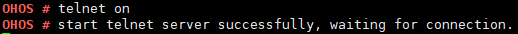

# telnet

## 命令功能

本命令用于启动或关闭telnet server服务。

## 命令格式

telnet \[_on | off_\]

## 参数说明

**表 1**  参数说明

<table><thead align="left"><tr id="row2850mcpsimp"><th class="cellrowborder" valign="top" width="21%" id="mcps1.2.4.1.1">
参数

</th>
<th class="cellrowborder" valign="top" width="52%" id="mcps1.2.4.1.2">
参数说明

</th>
<th class="cellrowborder" valign="top" width="27%" id="mcps1.2.4.1.3">
取值范围

</th>
</tr>
</thead>
<tbody><tr id="row2857mcpsimp"><td class="cellrowborder" valign="top" width="21%" headers="mcps1.2.4.1.1 ">
on

</td>
<td class="cellrowborder" valign="top" width="52%" headers="mcps1.2.4.1.2 ">
启动telnet server服务。

</td>
<td class="cellrowborder" valign="top" width="27%" headers="mcps1.2.4.1.3 ">
N/A

</td>
</tr>
<tr id="row2864mcpsimp"><td class="cellrowborder" valign="top" width="21%" headers="mcps1.2.4.1.1 ">
off

</td>
<td class="cellrowborder" valign="top" width="52%" headers="mcps1.2.4.1.2 ">
关闭telnet server服务。

</td>
<td class="cellrowborder" valign="top" width="27%" headers="mcps1.2.4.1.3 ">
N/A

</td>
</tr>
</tbody>
</table>

## 使用指南

-   telnet启动要确保网络驱动及网络协议栈已经初始化完成，且板子的网卡是link up状态。
-   暂时无法支持多个客户端（telnet + IP）同时连接开发板。

    > **须知：** 
    >telnet属于调测功能，默认配置为关闭，正式产品中禁止使用该功能。

## 使用实例

举例：输入telnet on

## 输出说明

**图 1**  输入 telnet on  

