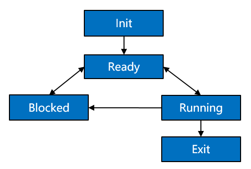

# 线程

## 基本概念

从系统的角度看，线程是竞争系统资源的最小运行单元。线程可以使用或等待CPU、使用内存空间等系统资源，并独立于其它线程运行。

OpenHarmony内核每个进程内的线程独立运行、独立调度，当前进程内线程的调度不受其它进程内线程的影响。

OpenHarmony内核中的线程采用抢占式调度机制，同时支持时间片轮转调度和FIFO调度方式。

OpenHarmony内核的线程一共有32个优先级\(0-31\)，最高优先级为0，最低优先级为31。

当前进程内高优先级的线程可抢占当前进程内低优先级线程，当前进程内低优先级线程必须在当前进程内高优先级线程阻塞或结束后才能得到调度。

**线程状态说明：**

-   初始化（Init）：该线程正在被创建。

-   就绪（Ready）：该线程在就绪列表中，等待CPU调度。

-   运行（Running）：该线程正在运行。

-   阻塞（Blocked）：该线程被阻塞挂起。Blocked状态包括：pend\(因为锁、事件、信号量等阻塞\)、suspend（主动pend）、delay\(延时阻塞\)、pendtime\(因为锁、事件、信号量时间等超时等待\)。

-   退出（Exit）：该线程运行结束，等待父线程回收其控制块资源。

**图 1**  线程状态迁移示意图  

**线程状态迁移说明：**

-   Init→Ready：

    线程创建拿到控制块后为Init状态，处于线程初始化阶段，当线程初始化完成将线程插入调度队列，此时线程进入就绪状态。

-   Ready→Running：

    线程创建后进入就绪态，发生线程切换时，就绪列表中最高优先级的线程被执行，从而进入运行态，但此刻该线程会从就绪列表中删除。

-   Running→Blocked：

    正在运行的线程发生阻塞（挂起、延时、读信号量等）时，该线程会从就绪列表中删除，线程状态由运行态变成阻塞态，然后发生线程切换，运行就绪列表中剩余最高优先级线程。

-   Blocked→Ready / Blocked→Running：

    阻塞的线程被恢复后（线程恢复、延时时间超时、读信号量超时或读到信号量等），此时被恢复的线程会被加入就绪列表，从而由阻塞态变成就绪态；此时如果被恢复线程的优先级高于正在运行线程的优先级，则会发生线程切换，将该线程由就绪态变成运行态。

-   Ready→Blocked：

    线程也有可能在就绪态时被阻塞（挂起），此时线程状态会由就绪态转变为阻塞态，该线程从就绪列表中删除，不会参与线程调度，直到该线程被恢复。

-   Running→Ready：

    有更高优先级线程创建或者恢复后，会发生线程调度，此刻就绪列表中最高优先级线程变为运行态，那么原先运行的线程由运行态变为就绪态，并加入就绪列表中。

-   Running→Exit：

    运行中的线程运行结束，线程状态由运行态变为退出态。若未设置分离属性（PTHREAD\_CREATE\_DETACHED）的线程，运行结束后对外呈现的是Exit状态，即退出态。

-   Blocked→Exit：

    阻塞的线程调用删除接口，线程状态由阻塞态变为退出态。

## 使用场景

线程创建后，用户态可以执行线程调度、挂起、恢复、延时等操作，同时也可以设置线程优先级和调度策略，获取线程优先级和调度策略。

## 功能

OpenHarmony内核系统中的线程管理模块，线程间通信为用户提供下面几种功能：

**表 1**  线程管理模块功能

<table><thead align="left"><tr id="row16880122144619"><th class="cellrowborder" valign="top" width="14.299999999999999%" id="mcps1.2.5.1.1">
头文件

</th>
<th class="cellrowborder" valign="top" width="28.599999999999998%" id="mcps1.2.5.1.2">
名称

</th>
<th class="cellrowborder" valign="top" width="22.38%" id="mcps1.2.5.1.3">
说明

</th>
<th class="cellrowborder" valign="top" width="34.72%" id="mcps1.2.5.1.4">
备注

</th>
</tr>
</thead>
<tbody><tr id="row1188092104619"><td class="cellrowborder" valign="top" width="14.299999999999999%" headers="mcps1.2.5.1.1 ">
pthread.h

</td>
<td class="cellrowborder" valign="top" width="28.599999999999998%" headers="mcps1.2.5.1.2 ">
pthread_attr_destroy

</td>
<td class="cellrowborder" valign="top" width="22.38%" headers="mcps1.2.5.1.3 ">
销毁线程属性对象。

</td>
<td class="cellrowborder" valign="top" width="34.72%" headers="mcps1.2.5.1.4 ">
-

</td>
</tr>
<tr id="row28802274616"><td class="cellrowborder" valign="top" width="14.299999999999999%" headers="mcps1.2.5.1.1 ">
pthread.h

</td>
<td class="cellrowborder" valign="top" width="28.599999999999998%" headers="mcps1.2.5.1.2 ">
pthread_attr_getinheritsched

</td>
<td class="cellrowborder" valign="top" width="22.38%" headers="mcps1.2.5.1.3 ">
获取线程属性对象的调度属性。

</td>
<td class="cellrowborder" valign="top" width="34.72%" headers="mcps1.2.5.1.4 ">
-

</td>
</tr>
<tr id="row1888132164611"><td class="cellrowborder" valign="top" width="14.299999999999999%" headers="mcps1.2.5.1.1 ">
pthread.h

</td>
<td class="cellrowborder" valign="top" width="28.599999999999998%" headers="mcps1.2.5.1.2 ">
pthread_attr_getschedparam

</td>
<td class="cellrowborder" valign="top" width="22.38%" headers="mcps1.2.5.1.3 ">
获取线程属性对象的调度参数属性。

</td>
<td class="cellrowborder" valign="top" width="34.72%" headers="mcps1.2.5.1.4 ">
-

</td>
</tr>
<tr id="row788102134613"><td class="cellrowborder" valign="top" width="14.299999999999999%" headers="mcps1.2.5.1.1 ">
pthread.h

</td>
<td class="cellrowborder" valign="top" width="28.599999999999998%" headers="mcps1.2.5.1.2 ">
pthread_attr_getschedpolicy

</td>
<td class="cellrowborder" valign="top" width="22.38%" headers="mcps1.2.5.1.3 ">
获取线程属性对象的调度策略属性。

</td>
<td class="cellrowborder" valign="top" width="34.72%" headers="mcps1.2.5.1.4 ">
OpenHarmony：支持SCHED_FIFO 、SCHED_RR调度策略。

</td>
</tr>
<tr id="row14881423468"><td class="cellrowborder" valign="top" width="14.299999999999999%" headers="mcps1.2.5.1.1 ">
pthread.h

</td>
<td class="cellrowborder" valign="top" width="28.599999999999998%" headers="mcps1.2.5.1.2 ">
pthread_attr_getstacksize

</td>
<td class="cellrowborder" valign="top" width="22.38%" headers="mcps1.2.5.1.3 ">
获取线程属性对象的堆栈大小。

</td>
<td class="cellrowborder" valign="top" width="34.72%" headers="mcps1.2.5.1.4 ">
-

</td>
</tr>
<tr id="row088212144619"><td class="cellrowborder" valign="top" width="14.299999999999999%" headers="mcps1.2.5.1.1 ">
pthread.h

</td>
<td class="cellrowborder" valign="top" width="28.599999999999998%" headers="mcps1.2.5.1.2 ">
pthread_attr_init

</td>
<td class="cellrowborder" valign="top" width="22.38%" headers="mcps1.2.5.1.3 ">
初始化线程属性对象。

</td>
<td class="cellrowborder" valign="top" width="34.72%" headers="mcps1.2.5.1.4 ">
-

</td>
</tr>
<tr id="row1788214210462"><td class="cellrowborder" valign="top" width="14.299999999999999%" headers="mcps1.2.5.1.1 ">
pthread.h

</td>
<td class="cellrowborder" valign="top" width="28.599999999999998%" headers="mcps1.2.5.1.2 ">
pthread_attr_setdetachstate

</td>
<td class="cellrowborder" valign="top" width="22.38%" headers="mcps1.2.5.1.3 ">
设置线程属性对象的分离状态。

</td>
<td class="cellrowborder" valign="top" width="34.72%" headers="mcps1.2.5.1.4 ">
-

</td>
</tr>
<tr id="row188829211469"><td class="cellrowborder" valign="top" width="14.299999999999999%" headers="mcps1.2.5.1.1 ">
pthread.h

</td>
<td class="cellrowborder" valign="top" width="28.599999999999998%" headers="mcps1.2.5.1.2 ">
pthread_attr_setinheritsched

</td>
<td class="cellrowborder" valign="top" width="22.38%" headers="mcps1.2.5.1.3 ">
设置线程属性对象的继承调度属性。

</td>
<td class="cellrowborder" valign="top" width="34.72%" headers="mcps1.2.5.1.4 ">
-

</td>
</tr>
<tr id="row1588310244610"><td class="cellrowborder" valign="top" width="14.299999999999999%" headers="mcps1.2.5.1.1 ">
pthread.h

</td>
<td class="cellrowborder" valign="top" width="28.599999999999998%" headers="mcps1.2.5.1.2 ">
pthread_attr_setschedparam

</td>
<td class="cellrowborder" valign="top" width="22.38%" headers="mcps1.2.5.1.3 ">
设置线程属性对象的调度参数属性。

</td>
<td class="cellrowborder" valign="top" width="34.72%" headers="mcps1.2.5.1.4 ">
OpenHarmony：设置线程优先级的参数值越小，线程在系统中的优先级越高；设置参数值越大，优先级越低。

注意：需要将pthread_attr_t线程属性的inheritsched字段设置为PTHREAD_EXPLICIT_SCHED，否则设置的线程调度优先级将不会生效，系统默认设置为PTHREAD_INHERIT_SCHED。

</td>
</tr>
<tr id="row118831264610"><td class="cellrowborder" valign="top" width="14.299999999999999%" headers="mcps1.2.5.1.1 ">
pthread.h

</td>
<td class="cellrowborder" valign="top" width="28.599999999999998%" headers="mcps1.2.5.1.2 ">
pthread_attr_setschedpolicy

</td>
<td class="cellrowborder" valign="top" width="22.38%" headers="mcps1.2.5.1.3 ">
设置线程属性对象的调度策略属性。

</td>
<td class="cellrowborder" valign="top" width="34.72%" headers="mcps1.2.5.1.4 ">
OpenHarmony：支持SCHED_FIFO 、SCHED_RR调度策略。

</td>
</tr>
<tr id="row888320244618"><td class="cellrowborder" valign="top" width="14.299999999999999%" headers="mcps1.2.5.1.1 ">
pthread.h

</td>
<td class="cellrowborder" valign="top" width="28.599999999999998%" headers="mcps1.2.5.1.2 ">
pthread_attr_setstacksize

</td>
<td class="cellrowborder" valign="top" width="22.38%" headers="mcps1.2.5.1.3 ">
设置线程属性对象的堆栈大小。

</td>
<td class="cellrowborder" valign="top" width="34.72%" headers="mcps1.2.5.1.4 ">
-

</td>
</tr>
<tr id="row168841629468"><td class="cellrowborder" valign="top" width="14.299999999999999%" headers="mcps1.2.5.1.1 ">
pthread.h

</td>
<td class="cellrowborder" valign="top" width="28.599999999999998%" headers="mcps1.2.5.1.2 ">
pthread_getattr_np

</td>
<td class="cellrowborder" valign="top" width="22.38%" headers="mcps1.2.5.1.3 ">
获取已创建线程的属性。

</td>
<td class="cellrowborder" valign="top" width="34.72%" headers="mcps1.2.5.1.4 ">
-

</td>
</tr>
<tr id="row28842029469"><td class="cellrowborder" valign="top" width="14.299999999999999%" headers="mcps1.2.5.1.1 ">
pthread.h

</td>
<td class="cellrowborder" valign="top" width="28.599999999999998%" headers="mcps1.2.5.1.2 ">
pthread_cancel

</td>
<td class="cellrowborder" valign="top" width="22.38%" headers="mcps1.2.5.1.3 ">
向线程发送取消请求。

</td>
<td class="cellrowborder" valign="top" width="34.72%" headers="mcps1.2.5.1.4 ">
-

</td>
</tr>
<tr id="row788418214464"><td class="cellrowborder" valign="top" width="14.299999999999999%" headers="mcps1.2.5.1.1 ">
pthread.h

</td>
<td class="cellrowborder" valign="top" width="28.599999999999998%" headers="mcps1.2.5.1.2 ">
pthread_testcancel

</td>
<td class="cellrowborder" valign="top" width="22.38%" headers="mcps1.2.5.1.3 ">
请求交付任何未决的取请求。

</td>
<td class="cellrowborder" valign="top" width="34.72%" headers="mcps1.2.5.1.4 ">
-

</td>
</tr>
<tr id="row98857211461"><td class="cellrowborder" valign="top" width="14.299999999999999%" headers="mcps1.2.5.1.1 ">
pthread.h

</td>
<td class="cellrowborder" valign="top" width="28.599999999999998%" headers="mcps1.2.5.1.2 ">
pthread_setcanceltype

</td>
<td class="cellrowborder" valign="top" width="22.38%" headers="mcps1.2.5.1.3 ">
设置线程可取消类型。

</td>
<td class="cellrowborder" valign="top" width="34.72%" headers="mcps1.2.5.1.4 ">
-

</td>
</tr>
<tr id="row1988516211466"><td class="cellrowborder" valign="top" width="14.299999999999999%" headers="mcps1.2.5.1.1 ">
pthread.h

</td>
<td class="cellrowborder" valign="top" width="28.599999999999998%" headers="mcps1.2.5.1.2 ">
pthread_setcancelstate

</td>
<td class="cellrowborder" valign="top" width="22.38%" headers="mcps1.2.5.1.3 ">
设置线程可取消状态。

</td>
<td class="cellrowborder" valign="top" width="34.72%" headers="mcps1.2.5.1.4 ">
-

</td>
</tr>
<tr id="row1288520284619"><td class="cellrowborder" valign="top" width="14.299999999999999%" headers="mcps1.2.5.1.1 ">
pthread.h

</td>
<td class="cellrowborder" valign="top" width="28.599999999999998%" headers="mcps1.2.5.1.2 ">
pthread_create

</td>
<td class="cellrowborder" valign="top" width="22.38%" headers="mcps1.2.5.1.3 ">
创建一个新的线程。

</td>
<td class="cellrowborder" valign="top" width="34.72%" headers="mcps1.2.5.1.4 ">
-

</td>
</tr>
<tr id="row1288614204611"><td class="cellrowborder" valign="top" width="14.299999999999999%" headers="mcps1.2.5.1.1 ">
pthread.h

</td>
<td class="cellrowborder" valign="top" width="28.599999999999998%" headers="mcps1.2.5.1.2 ">
pthread_detach

</td>
<td class="cellrowborder" valign="top" width="22.38%" headers="mcps1.2.5.1.3 ">
分离一个线程。

</td>
<td class="cellrowborder" valign="top" width="34.72%" headers="mcps1.2.5.1.4 ">
-

</td>
</tr>
<tr id="row188614213467"><td class="cellrowborder" valign="top" width="14.299999999999999%" headers="mcps1.2.5.1.1 ">
pthread.h

</td>
<td class="cellrowborder" valign="top" width="28.599999999999998%" headers="mcps1.2.5.1.2 ">
pthread_equal

</td>
<td class="cellrowborder" valign="top" width="22.38%" headers="mcps1.2.5.1.3 ">
比较两个线程ID是否相等。

</td>
<td class="cellrowborder" valign="top" width="34.72%" headers="mcps1.2.5.1.4 ">
-

</td>
</tr>
<tr id="row1488619294613"><td class="cellrowborder" valign="top" width="14.299999999999999%" headers="mcps1.2.5.1.1 ">
pthread.h

</td>
<td class="cellrowborder" valign="top" width="28.599999999999998%" headers="mcps1.2.5.1.2 ">
pthread_exit

</td>
<td class="cellrowborder" valign="top" width="22.38%" headers="mcps1.2.5.1.3 ">
终止正在调用的线程。

</td>
<td class="cellrowborder" valign="top" width="34.72%" headers="mcps1.2.5.1.4 ">
-

</td>
</tr>
<tr id="row88871220467"><td class="cellrowborder" valign="top" width="14.299999999999999%" headers="mcps1.2.5.1.1 ">
pthread.h

</td>
<td class="cellrowborder" valign="top" width="28.599999999999998%" headers="mcps1.2.5.1.2 ">
pthread_getschedparam

</td>
<td class="cellrowborder" valign="top" width="22.38%" headers="mcps1.2.5.1.3 ">
获取线程的调度策略和参数。

</td>
<td class="cellrowborder" valign="top" width="34.72%" headers="mcps1.2.5.1.4 ">
OpenHarmony：支持SCHED_FIFO 、SCHED_RR调度策略。

</td>
</tr>
<tr id="row198871527462"><td class="cellrowborder" valign="top" width="14.299999999999999%" headers="mcps1.2.5.1.1 ">
pthread.h

</td>
<td class="cellrowborder" valign="top" width="28.599999999999998%" headers="mcps1.2.5.1.2 ">
pthread_join

</td>
<td class="cellrowborder" valign="top" width="22.38%" headers="mcps1.2.5.1.3 ">
等待指定的线程结束。

</td>
<td class="cellrowborder" valign="top" width="34.72%" headers="mcps1.2.5.1.4 ">
-

</td>
</tr>
<tr id="row13888142184617"><td class="cellrowborder" valign="top" width="14.299999999999999%" headers="mcps1.2.5.1.1 ">
pthread.h

</td>
<td class="cellrowborder" valign="top" width="28.599999999999998%" headers="mcps1.2.5.1.2 ">
pthread_self

</td>
<td class="cellrowborder" valign="top" width="22.38%" headers="mcps1.2.5.1.3 ">
获取当前线程的ID。

</td>
<td class="cellrowborder" valign="top" width="34.72%" headers="mcps1.2.5.1.4 ">
-

</td>
</tr>
<tr id="row15888132124614"><td class="cellrowborder" valign="top" width="14.299999999999999%" headers="mcps1.2.5.1.1 ">
pthread.h

</td>
<td class="cellrowborder" valign="top" width="28.599999999999998%" headers="mcps1.2.5.1.2 ">
pthread_setschedprio

</td>
<td class="cellrowborder" valign="top" width="22.38%" headers="mcps1.2.5.1.3 ">
设置线程的调度静态优先级。

</td>
<td class="cellrowborder" valign="top" width="34.72%" headers="mcps1.2.5.1.4 ">
-

</td>
</tr>
<tr id="row12889142194616"><td class="cellrowborder" valign="top" width="14.299999999999999%" headers="mcps1.2.5.1.1 ">
pthread.h

</td>
<td class="cellrowborder" valign="top" width="28.599999999999998%" headers="mcps1.2.5.1.2 ">
pthread_kill

</td>
<td class="cellrowborder" valign="top" width="22.38%" headers="mcps1.2.5.1.3 ">
向线程发送信号。

</td>
<td class="cellrowborder" valign="top" width="34.72%" headers="mcps1.2.5.1.4 ">
-

</td>
</tr>
<tr id="row19889624465"><td class="cellrowborder" valign="top" width="14.299999999999999%" headers="mcps1.2.5.1.1 ">
pthread.h

</td>
<td class="cellrowborder" valign="top" width="28.599999999999998%" headers="mcps1.2.5.1.2 ">
pthread_once

</td>
<td class="cellrowborder" valign="top" width="22.38%" headers="mcps1.2.5.1.3 ">
使函数调用只能执行一次。

</td>
<td class="cellrowborder" valign="top" width="34.72%" headers="mcps1.2.5.1.4 ">
-

</td>
</tr>
<tr id="row288917219462"><td class="cellrowborder" valign="top" width="14.299999999999999%" headers="mcps1.2.5.1.1 ">
pthread.h

</td>
<td class="cellrowborder" valign="top" width="28.599999999999998%" headers="mcps1.2.5.1.2 ">
pthread_atfork

</td>
<td class="cellrowborder" valign="top" width="22.38%" headers="mcps1.2.5.1.3 ">
注册fork的处理程序。

</td>
<td class="cellrowborder" valign="top" width="34.72%" headers="mcps1.2.5.1.4 ">
-

</td>
</tr>
<tr id="row988922114611"><td class="cellrowborder" valign="top" width="14.299999999999999%" headers="mcps1.2.5.1.1 ">
pthread.h

</td>
<td class="cellrowborder" valign="top" width="28.599999999999998%" headers="mcps1.2.5.1.2 ">
pthread_cleanup_pop

</td>
<td class="cellrowborder" valign="top" width="22.38%" headers="mcps1.2.5.1.3 ">
删除位于清理处理程序堆栈顶部的例程。

</td>
<td class="cellrowborder" valign="top" width="34.72%" headers="mcps1.2.5.1.4 ">
-

</td>
</tr>
<tr id="row188906284610"><td class="cellrowborder" valign="top" width="14.299999999999999%" headers="mcps1.2.5.1.1 ">
pthread.h

</td>
<td class="cellrowborder" valign="top" width="28.599999999999998%" headers="mcps1.2.5.1.2 ">
pthread_cleanup_push

</td>
<td class="cellrowborder" valign="top" width="22.38%" headers="mcps1.2.5.1.3 ">
将例程推送到清理处理程序堆栈的顶部。

</td>
<td class="cellrowborder" valign="top" width="34.72%" headers="mcps1.2.5.1.4 ">
-

</td>
</tr>
<tr id="row189012284618"><td class="cellrowborder" valign="top" width="14.299999999999999%" headers="mcps1.2.5.1.1 ">
pthread.h

</td>
<td class="cellrowborder" valign="top" width="28.599999999999998%" headers="mcps1.2.5.1.2 ">
pthread_barrier_destroy

</td>
<td class="cellrowborder" valign="top" width="22.38%" headers="mcps1.2.5.1.3 ">
销毁屏障对象（高级实时线程）

</td>
<td class="cellrowborder" valign="top" width="34.72%" headers="mcps1.2.5.1.4 ">
-

</td>
</tr>
<tr id="row089015218467"><td class="cellrowborder" valign="top" width="14.299999999999999%" headers="mcps1.2.5.1.1 ">
pthread.h

</td>
<td class="cellrowborder" valign="top" width="28.599999999999998%" headers="mcps1.2.5.1.2 ">
pthread_barrier_init

</td>
<td class="cellrowborder" valign="top" width="22.38%" headers="mcps1.2.5.1.3 ">
初始化屏障对象（高级实时线程）

</td>
<td class="cellrowborder" valign="top" width="34.72%" headers="mcps1.2.5.1.4 ">
-

</td>
</tr>
<tr id="row8890182114615"><td class="cellrowborder" valign="top" width="14.299999999999999%" headers="mcps1.2.5.1.1 ">
pthread.h

</td>
<td class="cellrowborder" valign="top" width="28.599999999999998%" headers="mcps1.2.5.1.2 ">
pthread_barrier_wait

</td>
<td class="cellrowborder" valign="top" width="22.38%" headers="mcps1.2.5.1.3 ">
屏障同步（高级实时线程）

</td>
<td class="cellrowborder" valign="top" width="34.72%" headers="mcps1.2.5.1.4 ">
-

</td>
</tr>
<tr id="row589110216461"><td class="cellrowborder" valign="top" width="14.299999999999999%" headers="mcps1.2.5.1.1 ">
pthread.h

</td>
<td class="cellrowborder" valign="top" width="28.599999999999998%" headers="mcps1.2.5.1.2 ">
pthread_barrierattr_destroy

</td>
<td class="cellrowborder" valign="top" width="22.38%" headers="mcps1.2.5.1.3 ">
销毁屏障属性对象。

</td>
<td class="cellrowborder" valign="top" width="34.72%" headers="mcps1.2.5.1.4 ">
-

</td>
</tr>
<tr id="row9891624468"><td class="cellrowborder" valign="top" width="14.299999999999999%" headers="mcps1.2.5.1.1 ">
pthread.h

</td>
<td class="cellrowborder" valign="top" width="28.599999999999998%" headers="mcps1.2.5.1.2 ">
pthread_barrierattr_init

</td>
<td class="cellrowborder" valign="top" width="22.38%" headers="mcps1.2.5.1.3 ">
初始化屏障属性对象。

</td>
<td class="cellrowborder" valign="top" width="34.72%" headers="mcps1.2.5.1.4 ">
-

</td>
</tr>
<tr id="row118914214464"><td class="cellrowborder" valign="top" width="14.299999999999999%" headers="mcps1.2.5.1.1 ">
pthread.h

</td>
<td class="cellrowborder" valign="top" width="28.599999999999998%" headers="mcps1.2.5.1.2 ">
pthread_mutex_destroy

</td>
<td class="cellrowborder" valign="top" width="22.38%" headers="mcps1.2.5.1.3 ">
销毁互斥锁。

</td>
<td class="cellrowborder" valign="top" width="34.72%" headers="mcps1.2.5.1.4 ">
-

</td>
</tr>
<tr id="row18891326468"><td class="cellrowborder" valign="top" width="14.299999999999999%" headers="mcps1.2.5.1.1 ">
pthread.h

</td>
<td class="cellrowborder" valign="top" width="28.599999999999998%" headers="mcps1.2.5.1.2 ">
pthread_mutex_init

</td>
<td class="cellrowborder" valign="top" width="22.38%" headers="mcps1.2.5.1.3 ">
初始化互斥锁。

</td>
<td class="cellrowborder" valign="top" width="34.72%" headers="mcps1.2.5.1.4 ">
-

</td>
</tr>
<tr id="row1689213216461"><td class="cellrowborder" valign="top" width="14.299999999999999%" headers="mcps1.2.5.1.1 ">
pthread.h

</td>
<td class="cellrowborder" valign="top" width="28.599999999999998%" headers="mcps1.2.5.1.2 ">
pthread_mutex_lock

</td>
<td class="cellrowborder" valign="top" width="22.38%" headers="mcps1.2.5.1.3 ">
互斥锁加锁操作。

</td>
<td class="cellrowborder" valign="top" width="34.72%" headers="mcps1.2.5.1.4 ">
-

</td>
</tr>
<tr id="row989214284614"><td class="cellrowborder" valign="top" width="14.299999999999999%" headers="mcps1.2.5.1.1 ">
pthread.h

</td>
<td class="cellrowborder" valign="top" width="28.599999999999998%" headers="mcps1.2.5.1.2 ">
pthread_mutex_trylock

</td>
<td class="cellrowborder" valign="top" width="22.38%" headers="mcps1.2.5.1.3 ">
互斥锁尝试加锁操作。

</td>
<td class="cellrowborder" valign="top" width="34.72%" headers="mcps1.2.5.1.4 ">
-

</td>
</tr>
<tr id="row1989218264610"><td class="cellrowborder" valign="top" width="14.299999999999999%" headers="mcps1.2.5.1.1 ">
pthread.h

</td>
<td class="cellrowborder" valign="top" width="28.599999999999998%" headers="mcps1.2.5.1.2 ">
pthread_mutex_unlock

</td>
<td class="cellrowborder" valign="top" width="22.38%" headers="mcps1.2.5.1.3 ">
互斥锁解锁操作。

</td>
<td class="cellrowborder" valign="top" width="34.72%" headers="mcps1.2.5.1.4 ">
-

</td>
</tr>
<tr id="row10893192194614"><td class="cellrowborder" valign="top" width="14.299999999999999%" headers="mcps1.2.5.1.1 ">
pthread.h

</td>
<td class="cellrowborder" valign="top" width="28.599999999999998%" headers="mcps1.2.5.1.2 ">
pthread_mutexattr_destroy

</td>
<td class="cellrowborder" valign="top" width="22.38%" headers="mcps1.2.5.1.3 ">
销毁互斥锁属性对象。

</td>
<td class="cellrowborder" valign="top" width="34.72%" headers="mcps1.2.5.1.4 ">
-

</td>
</tr>
<tr id="row7893523465"><td class="cellrowborder" valign="top" width="14.299999999999999%" headers="mcps1.2.5.1.1 ">
pthread.h

</td>
<td class="cellrowborder" valign="top" width="28.599999999999998%" headers="mcps1.2.5.1.2 ">
pthread_mutexattr_gettype

</td>
<td class="cellrowborder" valign="top" width="22.38%" headers="mcps1.2.5.1.3 ">
获取互斥锁类型属性。

</td>
<td class="cellrowborder" valign="top" width="34.72%" headers="mcps1.2.5.1.4 ">
-

</td>
</tr>
<tr id="row15893526464"><td class="cellrowborder" valign="top" width="14.299999999999999%" headers="mcps1.2.5.1.1 ">
pthread.h

</td>
<td class="cellrowborder" valign="top" width="28.599999999999998%" headers="mcps1.2.5.1.2 ">
pthread_mutexattr_init

</td>
<td class="cellrowborder" valign="top" width="22.38%" headers="mcps1.2.5.1.3 ">
初始化互斥锁属性对象。

</td>
<td class="cellrowborder" valign="top" width="34.72%" headers="mcps1.2.5.1.4 ">
-

</td>
</tr>
<tr id="row1894102194616"><td class="cellrowborder" valign="top" width="14.299999999999999%" headers="mcps1.2.5.1.1 ">
pthread.h

</td>
<td class="cellrowborder" valign="top" width="28.599999999999998%" headers="mcps1.2.5.1.2 ">
pthread_mutexattr_settype

</td>
<td class="cellrowborder" valign="top" width="22.38%" headers="mcps1.2.5.1.3 ">
设置互斥锁类型属性。

</td>
<td class="cellrowborder" valign="top" width="34.72%" headers="mcps1.2.5.1.4 ">
-

</td>
</tr>
<tr id="row48942215466"><td class="cellrowborder" valign="top" width="14.299999999999999%" headers="mcps1.2.5.1.1 ">
pthread.h

</td>
<td class="cellrowborder" valign="top" width="28.599999999999998%" headers="mcps1.2.5.1.2 ">
pthread_mutex_timedlock

</td>
<td class="cellrowborder" valign="top" width="22.38%" headers="mcps1.2.5.1.3 ">
使用超时锁定互斥锁。

</td>
<td class="cellrowborder" valign="top" width="34.72%" headers="mcps1.2.5.1.4 ">
-

</td>
</tr>
<tr id="row1894122134612"><td class="cellrowborder" valign="top" width="14.299999999999999%" headers="mcps1.2.5.1.1 ">
pthread.h

</td>
<td class="cellrowborder" valign="top" width="28.599999999999998%" headers="mcps1.2.5.1.2 ">
pthread_rwlock_destroy

</td>
<td class="cellrowborder" valign="top" width="22.38%" headers="mcps1.2.5.1.3 ">
销毁读写锁。

</td>
<td class="cellrowborder" valign="top" width="34.72%" headers="mcps1.2.5.1.4 ">
-

</td>
</tr>
<tr id="row989562144613"><td class="cellrowborder" valign="top" width="14.299999999999999%" headers="mcps1.2.5.1.1 ">
pthread.h

</td>
<td class="cellrowborder" valign="top" width="28.599999999999998%" headers="mcps1.2.5.1.2 ">
pthread_rwlock_init

</td>
<td class="cellrowborder" valign="top" width="22.38%" headers="mcps1.2.5.1.3 ">
初始化读写锁。

</td>
<td class="cellrowborder" valign="top" width="34.72%" headers="mcps1.2.5.1.4 ">
-

</td>
</tr>
<tr id="row118953217461"><td class="cellrowborder" valign="top" width="14.299999999999999%" headers="mcps1.2.5.1.1 ">
pthread.h

</td>
<td class="cellrowborder" valign="top" width="28.599999999999998%" headers="mcps1.2.5.1.2 ">
pthread_rwlock_rdlock

</td>
<td class="cellrowborder" valign="top" width="22.38%" headers="mcps1.2.5.1.3 ">
获取读写锁读锁操作。

</td>
<td class="cellrowborder" valign="top" width="34.72%" headers="mcps1.2.5.1.4 ">
-

</td>
</tr>
<tr id="row689515218467"><td class="cellrowborder" valign="top" width="14.299999999999999%" headers="mcps1.2.5.1.1 ">
pthread.h

</td>
<td class="cellrowborder" valign="top" width="28.599999999999998%" headers="mcps1.2.5.1.2 ">
pthread_rwlock_timedrdlock

</td>
<td class="cellrowborder" valign="top" width="22.38%" headers="mcps1.2.5.1.3 ">
使用超时锁定读写锁读锁。

</td>
<td class="cellrowborder" valign="top" width="34.72%" headers="mcps1.2.5.1.4 ">
-

</td>
</tr>
<tr id="row789615254618"><td class="cellrowborder" valign="top" width="14.299999999999999%" headers="mcps1.2.5.1.1 ">
pthread.h

</td>
<td class="cellrowborder" valign="top" width="28.599999999999998%" headers="mcps1.2.5.1.2 ">
pthread_rwlock_timedwrlock

</td>
<td class="cellrowborder" valign="top" width="22.38%" headers="mcps1.2.5.1.3 ">
使用超时锁定读写锁写锁。

</td>
<td class="cellrowborder" valign="top" width="34.72%" headers="mcps1.2.5.1.4 ">
-

</td>
</tr>
<tr id="row38966284617"><td class="cellrowborder" valign="top" width="14.299999999999999%" headers="mcps1.2.5.1.1 ">
pthread.h

</td>
<td class="cellrowborder" valign="top" width="28.599999999999998%" headers="mcps1.2.5.1.2 ">
pthread_rwlock_tryrdlock

</td>
<td class="cellrowborder" valign="top" width="22.38%" headers="mcps1.2.5.1.3 ">
尝试获取读写锁读锁操作。

</td>
<td class="cellrowborder" valign="top" width="34.72%" headers="mcps1.2.5.1.4 ">
-

</td>
</tr>
<tr id="row20896142154616"><td class="cellrowborder" valign="top" width="14.299999999999999%" headers="mcps1.2.5.1.1 ">
pthread.h

</td>
<td class="cellrowborder" valign="top" width="28.599999999999998%" headers="mcps1.2.5.1.2 ">
pthread_rwlock_trywrlock

</td>
<td class="cellrowborder" valign="top" width="22.38%" headers="mcps1.2.5.1.3 ">
尝试获取读写锁写锁操作。

</td>
<td class="cellrowborder" valign="top" width="34.72%" headers="mcps1.2.5.1.4 ">
-

</td>
</tr>
<tr id="row489815210461"><td class="cellrowborder" valign="top" width="14.299999999999999%" headers="mcps1.2.5.1.1 ">
pthread.h

</td>
<td class="cellrowborder" valign="top" width="28.599999999999998%" headers="mcps1.2.5.1.2 ">
pthread_rwlock_unlock

</td>
<td class="cellrowborder" valign="top" width="22.38%" headers="mcps1.2.5.1.3 ">
读写锁解锁操作。

</td>
<td class="cellrowborder" valign="top" width="34.72%" headers="mcps1.2.5.1.4 ">
-

</td>
</tr>
<tr id="row1890032124612"><td class="cellrowborder" valign="top" width="14.299999999999999%" headers="mcps1.2.5.1.1 ">
pthread.h

</td>
<td class="cellrowborder" valign="top" width="28.599999999999998%" headers="mcps1.2.5.1.2 ">
pthread_rwlock_wrlock

</td>
<td class="cellrowborder" valign="top" width="22.38%" headers="mcps1.2.5.1.3 ">
获取读写锁写锁操作。

</td>
<td class="cellrowborder" valign="top" width="34.72%" headers="mcps1.2.5.1.4 ">
-

</td>
</tr>
<tr id="row590032124613"><td class="cellrowborder" valign="top" width="14.299999999999999%" headers="mcps1.2.5.1.1 ">
pthread.h

</td>
<td class="cellrowborder" valign="top" width="28.599999999999998%" headers="mcps1.2.5.1.2 ">
pthread_rwlockattr_destroy

</td>
<td class="cellrowborder" valign="top" width="22.38%" headers="mcps1.2.5.1.3 ">
销毁读写锁属性对象。

</td>
<td class="cellrowborder" valign="top" width="34.72%" headers="mcps1.2.5.1.4 ">
-

</td>
</tr>
<tr id="row190042174617"><td class="cellrowborder" valign="top" width="14.299999999999999%" headers="mcps1.2.5.1.1 ">
pthread.h

</td>
<td class="cellrowborder" valign="top" width="28.599999999999998%" headers="mcps1.2.5.1.2 ">
pthread_rwlockattr_init

</td>
<td class="cellrowborder" valign="top" width="22.38%" headers="mcps1.2.5.1.3 ">
初始化读写锁属性对象。

</td>
<td class="cellrowborder" valign="top" width="34.72%" headers="mcps1.2.5.1.4 ">
-

</td>
</tr>
<tr id="row10900320461"><td class="cellrowborder" valign="top" width="14.299999999999999%" headers="mcps1.2.5.1.1 ">
pthread.h

</td>
<td class="cellrowborder" valign="top" width="28.599999999999998%" headers="mcps1.2.5.1.2 ">
pthread_cond_broadcast

</td>
<td class="cellrowborder" valign="top" width="22.38%" headers="mcps1.2.5.1.3 ">
解除若干已被等待条件阻塞的线程。

</td>
<td class="cellrowborder" valign="top" width="34.72%" headers="mcps1.2.5.1.4 ">
-

</td>
</tr>
<tr id="row590115234620"><td class="cellrowborder" valign="top" width="14.299999999999999%" headers="mcps1.2.5.1.1 ">
pthread.h

</td>
<td class="cellrowborder" valign="top" width="28.599999999999998%" headers="mcps1.2.5.1.2 ">
pthread_cond_destroy

</td>
<td class="cellrowborder" valign="top" width="22.38%" headers="mcps1.2.5.1.3 ">
销毁条件变量。

</td>
<td class="cellrowborder" valign="top" width="34.72%" headers="mcps1.2.5.1.4 ">
-

</td>
</tr>
<tr id="row1890192164611"><td class="cellrowborder" valign="top" width="14.299999999999999%" headers="mcps1.2.5.1.1 ">
pthread.h

</td>
<td class="cellrowborder" valign="top" width="28.599999999999998%" headers="mcps1.2.5.1.2 ">
pthread_cond_init

</td>
<td class="cellrowborder" valign="top" width="22.38%" headers="mcps1.2.5.1.3 ">
初始化条件变量。

</td>
<td class="cellrowborder" valign="top" width="34.72%" headers="mcps1.2.5.1.4 ">
-

</td>
</tr>
<tr id="row129011214615"><td class="cellrowborder" valign="top" width="14.299999999999999%" headers="mcps1.2.5.1.1 ">
pthread.h

</td>
<td class="cellrowborder" valign="top" width="28.599999999999998%" headers="mcps1.2.5.1.2 ">
pthread_cond_signal

</td>
<td class="cellrowborder" valign="top" width="22.38%" headers="mcps1.2.5.1.3 ">
解除被阻塞的线程。

</td>
<td class="cellrowborder" valign="top" width="34.72%" headers="mcps1.2.5.1.4 ">
-

</td>
</tr>
<tr id="row13902423461"><td class="cellrowborder" valign="top" width="14.299999999999999%" headers="mcps1.2.5.1.1 ">
pthread.h

</td>
<td class="cellrowborder" valign="top" width="28.599999999999998%" headers="mcps1.2.5.1.2 ">
pthread_cond_timedwait

</td>
<td class="cellrowborder" valign="top" width="22.38%" headers="mcps1.2.5.1.3 ">
定时等待条件。

</td>
<td class="cellrowborder" valign="top" width="34.72%" headers="mcps1.2.5.1.4 ">
-

</td>
</tr>
<tr id="row189022218464"><td class="cellrowborder" valign="top" width="14.299999999999999%" headers="mcps1.2.5.1.1 ">
pthread.h

</td>
<td class="cellrowborder" valign="top" width="28.599999999999998%" headers="mcps1.2.5.1.2 ">
pthread_cond_wait

</td>
<td class="cellrowborder" valign="top" width="22.38%" headers="mcps1.2.5.1.3 ">
等待条件。

</td>
<td class="cellrowborder" valign="top" width="34.72%" headers="mcps1.2.5.1.4 ">
-

</td>
</tr>
<tr id="row159027218467"><td class="cellrowborder" valign="top" width="14.299999999999999%" headers="mcps1.2.5.1.1 ">
semaphore.h

</td>
<td class="cellrowborder" valign="top" width="28.599999999999998%" headers="mcps1.2.5.1.2 ">
sem_destroy

</td>
<td class="cellrowborder" valign="top" width="22.38%" headers="mcps1.2.5.1.3 ">
销毁指定的无名信号量。

</td>
<td class="cellrowborder" valign="top" width="34.72%" headers="mcps1.2.5.1.4 ">
-

</td>
</tr>
<tr id="row1690342194611"><td class="cellrowborder" valign="top" width="14.299999999999999%" headers="mcps1.2.5.1.1 ">
semaphore.h

</td>
<td class="cellrowborder" valign="top" width="28.599999999999998%" headers="mcps1.2.5.1.2 ">
sem_getvalue

</td>
<td class="cellrowborder" valign="top" width="22.38%" headers="mcps1.2.5.1.3 ">
获得指定信号量计数值。

</td>
<td class="cellrowborder" valign="top" width="34.72%" headers="mcps1.2.5.1.4 ">
-

</td>
</tr>
<tr id="row1490312214464"><td class="cellrowborder" valign="top" width="14.299999999999999%" headers="mcps1.2.5.1.1 ">
semaphore.h

</td>
<td class="cellrowborder" valign="top" width="28.599999999999998%" headers="mcps1.2.5.1.2 ">
sem_init

</td>
<td class="cellrowborder" valign="top" width="22.38%" headers="mcps1.2.5.1.3 ">
创建并初始化一个无名信号量。

</td>
<td class="cellrowborder" valign="top" width="34.72%" headers="mcps1.2.5.1.4 ">
-

</td>
</tr>
<tr id="row1490416211462"><td class="cellrowborder" valign="top" width="14.299999999999999%" headers="mcps1.2.5.1.1 ">
semaphore.h

</td>
<td class="cellrowborder" valign="top" width="28.599999999999998%" headers="mcps1.2.5.1.2 ">
sem_post

</td>
<td class="cellrowborder" valign="top" width="22.38%" headers="mcps1.2.5.1.3 ">
增加信号量计数。

</td>
<td class="cellrowborder" valign="top" width="34.72%" headers="mcps1.2.5.1.4 ">
-

</td>
</tr>
<tr id="row14904162164618"><td class="cellrowborder" valign="top" width="14.299999999999999%" headers="mcps1.2.5.1.1 ">
semaphore.h

</td>
<td class="cellrowborder" valign="top" width="28.599999999999998%" headers="mcps1.2.5.1.2 ">
sem_timedwait

</td>
<td class="cellrowborder" valign="top" width="22.38%" headers="mcps1.2.5.1.3 ">
获取信号量，且有超时返回功能。

</td>
<td class="cellrowborder" valign="top" width="34.72%" headers="mcps1.2.5.1.4 ">
-

</td>
</tr>
<tr id="row390411211468"><td class="cellrowborder" valign="top" width="14.299999999999999%" headers="mcps1.2.5.1.1 ">
semaphore.h

</td>
<td class="cellrowborder" valign="top" width="28.599999999999998%" headers="mcps1.2.5.1.2 ">
sem_trywait

</td>
<td class="cellrowborder" valign="top" width="22.38%" headers="mcps1.2.5.1.3 ">
尝试获取信号量。

</td>
<td class="cellrowborder" valign="top" width="34.72%" headers="mcps1.2.5.1.4 ">
-

</td>
</tr>
<tr id="row3905152174616"><td class="cellrowborder" valign="top" width="14.299999999999999%" headers="mcps1.2.5.1.1 ">
semaphore.h

</td>
<td class="cellrowborder" valign="top" width="28.599999999999998%" headers="mcps1.2.5.1.2 ">
sem_wait

</td>
<td class="cellrowborder" valign="top" width="22.38%" headers="mcps1.2.5.1.3 ">
获取信号量。

</td>
<td class="cellrowborder" valign="top" width="34.72%" headers="mcps1.2.5.1.4 ">
-

</td>
</tr>
</tbody>
</table>

