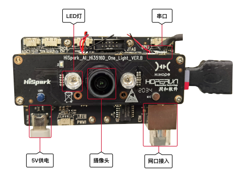

# Hi3516开发板介绍

## 开发板简介

Hi3516DV300作为新一代行业专用Smart HD IP摄像机SOC，集成新一代ISP、业界最新的H.265视频压缩编码器，同时集成高性能NNIE引擎，使得Hi3516DV300在低码率、高画质、智能处理和分析、低功耗等方面引领行业水平。

**图 1**  Hi3516单板正面外观图  

## 开发板规格

**表 1**  Hi3516开发板规格清单

<table><thead align="left"><tr id="row10171198194310"><th class="cellrowborder" valign="top" width="14.77%" id="mcps1.2.3.1.1">
规格类型

</th>
<th class="cellrowborder" valign="top" width="85.22999999999999%" id="mcps1.2.3.1.2">
规格清单

</th>
</tr>
</thead>
<tbody><tr id="row0171168114311"><td class="cellrowborder" valign="top" width="14.77%" headers="mcps1.2.3.1.1 ">
<strong id="b127621861200">处理器及内部存储</strong>

</td>
<td class="cellrowborder" valign="top" width="85.22999999999999%" headers="mcps1.2.3.1.2 "><ul id="ul1147113537186"><li>Hi3516DV300芯片</li><li>DDR3 1GB</li><li>eMMC4.5，8GB容量</li></ul>
</td>
</tr>
<tr id="row21721687435"><td class="cellrowborder" valign="top" width="14.77%" headers="mcps1.2.3.1.1 ">
<strong id="b1172016266246">外部器件</strong>

</td>
<td class="cellrowborder" valign="top" width="85.22999999999999%" headers="mcps1.2.3.1.2 "><ul id="ul179543016208"><li>以太网口</li><li>音频视频<ul id="ul5941311869"><li>1路语音输入</li><li>1路单声道(AC_L)输出，接3W功放(LM4871)</li><li>MicroHDMI（1路HDMI 1.4）</li></ul>
</li><li>摄像头<ul id="ul924263620"><li>传感器IMX335</li><li>镜头M12，焦距4mm，光圈1.8</li></ul>
</li><li>显示屏<ul id="ul101471711667"><li>LCD连接器（2.35寸）</li><li>LCD连接器（5.5寸）</li></ul>
</li><li>外部器件及接口<ul id="ul089255556"><li>SD卡接口</li><li>JTAG/I2S 接口</li><li>ADC接口</li><li>舵机接口</li><li>Grove连接器</li><li>USB2.0(Type C)</li><li>功能按键3个，2个用户自定义按键，1个升级按键</li><li>LED指示灯，绿灯，红灯</li></ul>
</li></ul>
</td>
</tr>
</tbody>
</table>

