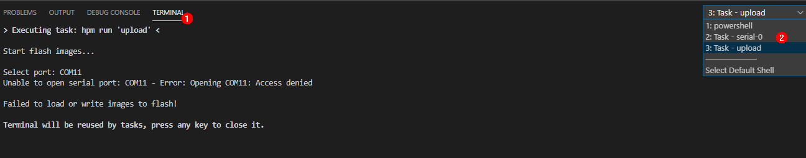
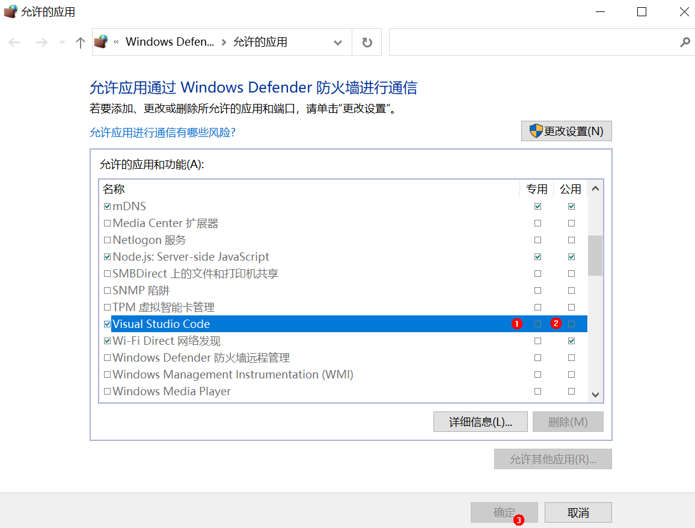

# 常见问题<a name="ZH-CN_TOPIC_0000001053466255"></a>

**问题 1：烧写选择串口后提示失败。**

-   **现象描述**

    点击烧写并选择串口后，出现Error: Opening COMxx: Access denied。

    **图 1**  打开串口失败图<a name="fig066333283916"></a>  
    

-   **可能原因**

    串口已经被占用。

-   **解决办法**

1.  按图依次选择下拉框，查找带有serial-xx的终端

    **图 2**  查找是否存在占用串口的终端<a name="fig165994164420"></a>  
    

2.  点击标号中的垃圾桶图标，关闭串口。

    **图 3**  关闭串口终端<a name="fig7911282453"></a>  
    

3.  重新点击烧写，选择串口并开始烧写程序

    **图 4**  重新启动烧写任务<a name="fig1138624316485"></a>  
    


**问题 2：Windows电脑与单板网络连接失败。**

-   **现象描述**

    点击烧写并选择串口后，无法获取文件。

    **图 5**  网络不通，单板无法获取文件图<a name="fig5218920223"></a>  
    

-   **可能原因**

    单板网络与Windows电脑不联通。

    Windows电脑防火墙未允许Visual Studio Code联网。

-   **解决方法**

1.  检查网线是否连接。
2.  点击Windows防火墙。

    **图 6**  网络防火墙设置图<a name="fig62141417794"></a>  
    

3.  点击“允许应用通过防火墙”。

    **图 7**  防火墙和网络保护界面图<a name="fig20703151111116"></a>  
    

4.  查找Visual Studio Code应用。

    **图 8**  查找Visual Studio Code应用图<a name="fig462316612165"></a>  
    

5.  勾选Visual Studio Code的专用和公用网络的访问权限。

    **图 9**  允许Visual Studio Code应用访问网络<a name="fig132725269184"></a>  
    


**问题 3：烧写失败**

-   **现象描述**

    点击烧写并选择串口后，出现无法烧写的情况。

-   **可能原因**

    安装IDE插件DevEco后未重启。

-   **解决方法**

    重启IDE。


**问题 4：编译构建过程中，提示找不到“pyhton”。**

-   **现象描述**

    


-   **可能原因**1

    没有装python。

-   **解决办法**

    请按照[安装Python环境](搭建环境-0.md#section16270312203916)安装python。

-   **可能原因2**

    

-   **解决办法**

    usr/bin目录下没有python软链接，请运行以下命令：

    ```
    # cd /usr/bin/
    # which python3
    # ln -s /usr/local/bin/python3 python
    # python --version
    ```

    例：

    


