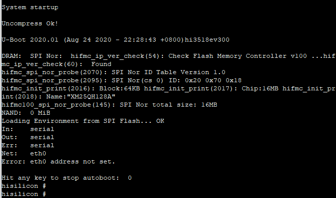
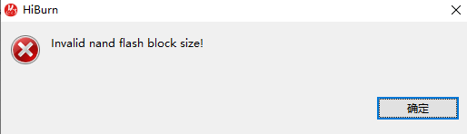
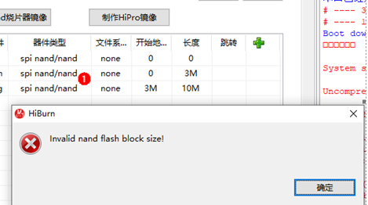

# 常见问题<a name="ZH-CN_TOPIC_0000001053942318"></a>

**问题 1：串口无回显。**

-   **现象描述**

    串口显示已连接，重启单板后，回车无任何回显。

-   **可能原因**
    -   串口连接错误。
    -   单板U-boot被损坏。

-   **解决办法**

    请查看设备管理器，确认连接单板的串口与终端中连接串口是否一致，若不一致，请按步骤修改串口号。

    **图 1**  修改串口号图示<a name="fig16441825145717"></a>  
    


1.  断开当前串口。
2.  点击设置按钮。
3.  在弹框中修改串口号并点击OK。
4.  连接后在对话框中输入回车查看是否存在回显。

若上述步骤依旧无法连接串口，可能由于单板U-boot损坏，按下述步骤烧写U-Boot。

1.  获取引导文件U-boot。

    > **须知：** 
    >单板的U-boot文件请在开源包中获取，路径为vendor\\hisi\\hi35xx\\hi3518ev300\\uboot\\out\\boot\\u-boot-hi3518ev300.bin

2.  使用HiTool工具按照标号选择U-boot烧写选项，点击烧写按钮。

    **图 2**  HiTool工具U-boot烧写步骤图<a name="fig1353321514128"></a>  
    

    1.  选择单板串口COM7。
    2.  选择Transfer Mode为Serial。
    3.  选择Burn Fastboot标签。
    4.  选择Flash Type为spi nor。
    5.  选择Browse，找到对应U-Boot文件。
    6.  点击Burn开始烧写。

3.  提示下电并给单板重新上电，烧写完成后，连接串口，如下图所示。

    **图 3**  HiTool工具U-boot烧写完成串口显示<a name="fig155914681910"></a>  
    


**问题 2：HiTool工具烧写时上报如下错误。**

-   **现象描述**

    **图 4**  烧写上报错误图例<a name="fig466354874016"></a>  
    

    

-   **可能原因**

    HiTool工具选择FLASH器件类型错误。

-   **解决方法**

    请在图中红色标号1处切换器件类型。

    **图 5**  FLASH器件类型错误图例<a name="fig64931910194212"></a>  
    

    


**问题 3：编译构建过程中，提示找不到“pyhton”。**

-   **现象描述**

    


-   **可能原因**1

    没有装python。

-   **解决办法**

    请按照[安装Python环境](搭建环境-2.md#section918195118487)安装python。

-   **可能原因2**

    

-   **解决办法**

    usr/bin目录下没有python软链接，请运行以下命令：

    ```
    # cd /usr/bin/
    # which python3
    # ln -s /usr/local/bin/python3 python
    # python --version
    ```

    例：

    


