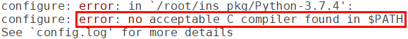
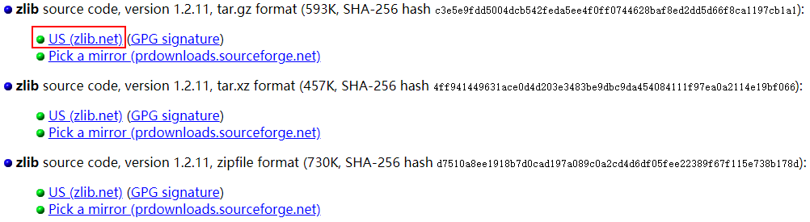
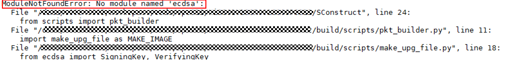

# 常见问题<a name="ZH-CN_TOPIC_0000001053143860"></a>

**问题 1：安装python3过程中，提示“configure: error: no acceptable C compiler found in $PATH”。**

-   **现象描述**

    

-   **可能原因**

    环境中未安装“gcc”。

-   **解决办法**

    1、通过命令“apt-get install gcc”在线安装。

    2、完成后，重新安装python3。


**问题 2：安装python3过程中，提示“-bash: make: command not found”。**

-   **现象描述**

    

-   **可能原因**

    环境中未安装“make”。

-   **解决办法**

    1、通过命令“apt-get install make”在线安装。

    2、完成后，重新安装python3。


**问题 3：安装python3过程中，提示“zlib not available”。**

-   **现象描述**

    

-   **可能原因**

    环境中未安装“zlib”。

-   **解决办法**

    方法1：通过命令“apt-get install zlib”在线安装。

    方法2：如果软件源中没有该软件，请从“www.zlib.net”下载版本代码，并离线安装。

    

    安装命令

    tar xvf zlib-1.2.11.tar.gz

    cd zlib-1.2.11

    ./configure

    make && make install

    3、完成后，重新安装python3


**问题 4：安装python3过程中，提示“No module named '\_ctypes'”。**

-   **现象描述**

    


-   **可能原因**

    环境中未安装“libffi”和“libffi-devel”。


-   **解决办法**

    1、通过命令“apt-get install libffi\* -y”，在线安装。

    2、完成后，重新安装python3。


**问题 5：编译构建过程中，提示“No module named 'Crypto'”。**

-   **现象描述**

    


-   **可能原因**

    环境中未安装“Crypto”。


-   **解决办法**

    方法1：通过命令“pip3 install Crypto”，在线安装。

    方法2：离线安装

    通过网页[https://pypi.org/project/pycrypto/\#files](https://pypi.org/project/pycrypto/#files)，下载源码。

    

    将源码放置在Linux服务器中，解压，并安装“python3 setup.py install”。

    完成上述安装后，重新构建。


**问题 6：编译构建过程中，提示“No module named 'ecdsa'”。**

-   **现象描述**

    


-   **可能原因**

    环境中未安装“ecdsa”。


-   **解决办法**

    方法1：通过命令“pip3 install ecdsa”，在线安装。

    方法2：离线安装

    通过网页[https://pypi.org/project/ecdsa/\#files](https://pypi.org/project/ecdsa/#files)，下载安装包。

    

    将安装包放置Linux服务器中，并安装“pip3 install ecdsa-0.15-py2.py3-none-any.whl”。

    完成上述安装后，重新构建。


**问题 7：编译构建过程中，提示“Could not find a version that satisfies the requirement six\>=1.9.0”。**

-   **现象描述**

    


-   **可能原因**

    环境中未安装合适的“six”。


-   **解决办法**

    方法1：通过命令“pip3 install six”，在线安装。

    方法2：离线安装

    通过网页[https://pypi.org/project/six/\#files](https://pypi.org/project/six/#files)，下载安装包。

    

    将源码放置在Linux服务器中，并安装“pip3 install six-1.14.0-py2.py3-none-any.whl”。

    完成上述安装后，重新构建。


**问题 8：编译构建过程中，提示找不到“-lgcc”。**

-   **现象描述**

    


-   **可能原因**

    交叉编译器gcc\_riscv32的PATH添加错误，如图。多添加了一个“/”，应该删除。

    


-   **解决办法**

    重新修改gcc\_riscv32的PATH，将多余的“/”删除。

    


**问题 9：编译构建过程中，提示找不到“pyhton”。**

-   **现象描述**

    


-   **可能原因**1

    没有装python。

-   **解决办法**

    请按照[安装Python环境](搭建环境.md#section126831816258)安装python。

-   **可能原因2**

    

-   **解决办法**

    usr/bin目录下没有python软链接，请运行以下命令：

    ```
    # cd /usr/bin/
    # which python3
    # ln -s /usr/local/bin/python3 python
    # python --version
    ```

    例：

    


