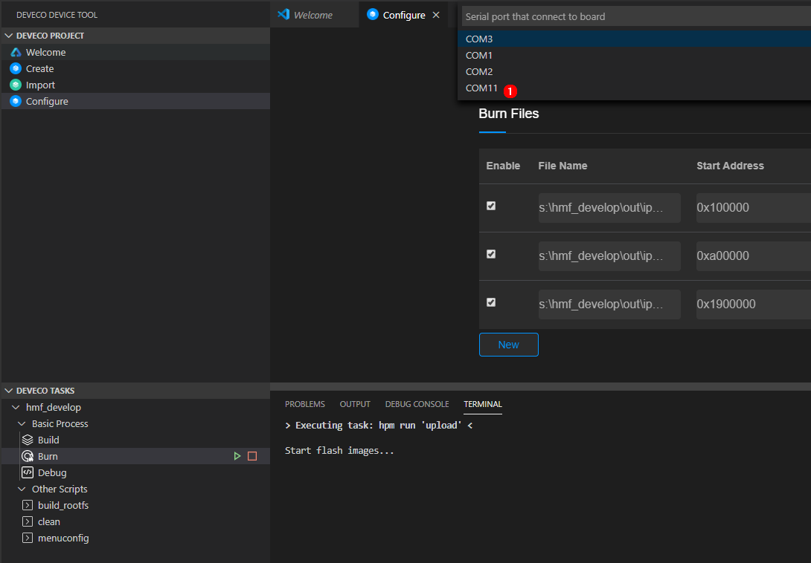

# 开发Hi3516第一个应用程序示例<a name="ZH-CN_TOPIC_0000001052906247"></a>

本节指导开发者在单板上运行第一个应用程序，其中包括修改应用程序、编译、烧写、运行等步骤，最终输出“Hello OHOS！”。

## 获取源码<a name="section215953714245"></a>

开发者需要在Linux服务器上下载一套源代码，获取Hi3516源码（[站点1](http://tools.harmonyos.com/mirrors/os/1.0/ipcamera_hi3516dv300-1.0.tar.gz)、[站点2](https://mirrors.huaweicloud.com/harmonyos/1.0/ipcamera_hi3516dv300-1.0.tar.gz)）。更多源码获取方式，请见[源码获取](../get-code/源码获取.md)。

## 修改应用程序<a name="s8efc1952ebfe4d1ea717182e108c29bb"></a>

源码目录applications/sample/camera/app/src内**helloworld.c**代码如下所示，用户可以自定义修改打印内容（例如：修改OHOS为World）。当前应用程序可支持标准C及C++的代码开发。

```
#include <stdio.h>
#include "los_sample.h"

int main(int argc, char **argv)
{
    printf("\n************************************************\n");
    printf("\n\t\tHello OHOS!\n");
    printf("\n************************************************\n\n");

    LOS_Sample(g_num);

    return 0;
}
```

## 编译<a name="section1077671315253"></a>

在linux服务器上，进入源码包根目录，目录内存放有build.py编译脚本，执行如下脚本编译源码包。结果文件生成在out/ipcamera\_hi3516dv300目录下。

```
python build.py ipcamera_hi3516dv300 -b debug
```

## 镜像烧写<a name="section18061240152520"></a>

该方法只适合支持网口的单板（例如Hi3516DV300），且PC主机必须与单板用网线连接并配置在于同一网络中。

> **须知：** 
>由于Visual Studio Code软件与单板间存在网络通信，若单板无法与电脑网络连接，请检查防火墙设置，详细设置请参考常见问题2。

1.  安装USB转串口驱动，并获取串口号。

    **图 1**  驱动安装成功图<a name="fig18537418237"></a>  
    

    1.  为单板上电，并将单板串口线连接Windows工作台。
    2.  安装驱动，驱动[获取链接](http://www.hihope.org/download)。
    3.  打开电脑的设备管理器，查看并记录“Prolific USB-to-Serial Comm Port”串口号，此处为COM11。

        驱动安装成功后，若设备图标存在警示图标，请右键点击设备并卸载驱动后，重新安装驱动，并按提示重启电脑。


2.  Windows工作台为单板互联网口增加192.168.1.3的IP地址，增加方法如下。

    **图 2**  Windows主机IP增加图例<a name="fig1438112431779"></a>  
    

    1.  控制面板-\>网络和Internet-\>网络连接中找到与单板连接的网卡，右键打开属性。
    2.  选择Internet协议版本4（TCP/IPv4），右键打开属性。
    3.  按图配置IP地址和网关。
    4.  点击“确定”完成配置保存。

3.  单板列表增加hi3516dv300，依次选择**Board Configure，enable**单板**，**自动新增单板配置表。

    **图 3**  增加hi3516dv300单板<a name="fig152451448203711"></a>  
    

4.  打开IDE工具，按下图标号顺序配置网络烧写内容。

    **图 4**  IDE工具网络配置图例<a name="fig79672366813"></a>  
    

    

    1.  单板类型选择Hi3516单板。
    2.  单击"Burn"。
    3.  "Burning Mode"选择为"network"。
    4.  "Host IP Address"点击刷新后，在下拉框中选择步骤2中配置的IP地址"192.168.1.3"。

5.  选择需要烧写的FLASH芯片存储类型及烧写地址。

    **图 5**  烧写文件参数配置图<a name="fig11902195416418"></a>  
    

    

    1.  "Memery Type"选择"emmc"。
    2.  点击"New"，新增至三个文件，并在文件路径中**依次**填入OHOS\_Image.bin、rootfs.img、userfs.img文件，起始地址及文件长度按图填写，文件从out/ipcamera\_hi3516dv300目录下获取。
    3.  点击"Save"保存。
    4.  点击左侧"Burn"开始烧写。

6.  上方输入框弹出下拉框后，选择串口号，例如COM11。

    **图 6**  选择与单板连接的串口<a name="fig73452316549"></a>  
    

7.  烧录开始，若出现提示，需要手动重启单板\(下电再上电\)。

    **图 7**  提示下电并重新为单板上电<a name="fig3421920185520"></a>  
    

    

8.  烧写完成。

    **图 8**  烧写成功图<a name="fig88368374585"></a>  
    


## 镜像运行<a name="section380511712615"></a>

1.  连接串口。

    **图 9**  连接串口图<a name="fig056645018495"></a>  
    

    

    1.  单击**Serial port**打开串口。
    2.  输入"com11"串口编号并连续输入回车直到串口显示"hisillicon"。
    3.  单板初次启动或修改启动参数，请进入步骤2，否则进入步骤3。

2.  （单板初次启动必选）修改U-boot的bootcmd及bootargs内容：该步骤为固化操作，若不修改参数只需执行一次。每次复位单板均会自动进入系统。

    > **须知：** 
    >U-boot引导程序默认会有2秒的等待时间，用户可使用回车打断等待并显示"hisillicon"，通过**reset**命令可再次启动系统。

    **表 1**  U-boot启动参数

    <a name="table432481061214"></a>
    <table><tbody><tr id="row532461021219"><th class="firstcol" valign="top" width="8.39%" id="mcps1.2.3.1.1"><p id="p1238114718129"><a name="p1238114718129"></a><a name="p1238114718129"></a>执行命令</p>
    </th>
    <td class="cellrowborder" valign="top" width="91.61%" headers="mcps1.2.3.1.1 "><p id="p93816470127"><a name="p93816470127"></a><a name="p93816470127"></a><strong id="b143728351609"><a name="b143728351609"></a><a name="b143728351609"></a>setenv bootcmd "sf probe 0;mmc read 0x0 0x80000000 0x800 0x4800; go 0x80000000";</strong></p>
    <p id="p83904761218"><a name="p83904761218"></a><a name="p83904761218"></a><strong id="b14389193520014"><a name="b14389193520014"></a><a name="b14389193520014"></a>setenv bootargs "console=ttyAMA0,115200n8 root=emmc fstype=vfat rootaddr=10M rootsize=15M rw";</strong></p>
    <p id="p7399470123"><a name="p7399470123"></a><a name="p7399470123"></a><strong id="b1041015359012"><a name="b1041015359012"></a><a name="b1041015359012"></a>saveenv</strong></p>
    <p id="p14391747131219"><a name="p14391747131219"></a><a name="p14391747131219"></a><strong id="b84127351701"><a name="b84127351701"></a><a name="b84127351701"></a>reset</strong></p>
    </td>
    </tr>
    <tr id="row6324410171216"><th class="firstcol" valign="top" width="8.39%" id="mcps1.2.3.2.1"><p id="p203915473129"><a name="p203915473129"></a><a name="p203915473129"></a>命令解释</p>
    </th>
    <td class="cellrowborder" valign="top" width="91.61%" headers="mcps1.2.3.2.1 "><p id="p439134715129"><a name="p439134715129"></a><a name="p439134715129"></a><strong id="b14391847171211"><a name="b14391847171211"></a><a name="b14391847171211"></a>setenv bootcmd "mmc read 0x0 0x80000000 0x800 0x4800;go 0x80000000";</strong></p>
    <p id="p1439184741218"><a name="p1439184741218"></a><a name="p1439184741218"></a>表示选择FLASH器件0，读取FLASH起始地址为0x800（单位为512B，即1MB），大小为0x4800（单位为512B，即9MB）的内容到0x80000000的内存地址。</p>
    <p id="p7391347101215"><a name="p7391347101215"></a><a name="p7391347101215"></a><strong id="b0397473129"><a name="b0397473129"></a><a name="b0397473129"></a>setenv bootargs "console=ttyAMA0,115200n8 root=emmc fstype=vfat rootaddr=10M rootsize=15M rw";</strong></p>
    <p id="p939547151215"><a name="p939547151215"></a><a name="p939547151215"></a><strong id="b93984781214"><a name="b93984781214"></a><a name="b93984781214"></a></strong>表示设置启动参数，输出模式为串口输出，波特率为115200，数据位8，rootfs挂载于emmc器件，文件系统类型为vfat，</p>
    <p id="p8402475121"><a name="p8402475121"></a><a name="p8402475121"></a><strong id="b140947121219"><a name="b140947121219"></a><a name="b140947121219"></a>“rootaddr=10M rootsize=15M rw”</strong>处对应填入rootfs.img的烧写起始位置与长度，此处与IDE中新增rootfs.img文件时所填大小<strong id="b124004714129"><a name="b124004714129"></a><a name="b124004714129"></a>必须相同</strong>。</p>
    <p id="p54034712120"><a name="p54034712120"></a><a name="p54034712120"></a><strong id="b1740247111219"><a name="b1740247111219"></a><a name="b1740247111219"></a>saveenv</strong>;表示保存当前配置。</p>
    <p id="p2401247131212"><a name="p2401247131212"></a><a name="p2401247131212"></a><strong id="b1040144710122"><a name="b1040144710122"></a><a name="b1040144710122"></a>reset;</strong>表示复位单板</p>
    <p id="p1440164791213"><a name="p1440164791213"></a><a name="p1440164791213"></a><strong id="b840447121214"><a name="b840447121214"></a><a name="b840447121214"></a>[可选]“go 0x80000000”</strong>默认配置已将指令固化在启动参数中，单板复位后可自动启动。若想切换为手动启动，可在U-boot启动倒数阶段使用"回车"打断自动启动。</p>
    </td>
    </tr>
    </tbody>
    </table>

3.  输入**“reset”**指令并回车，重启单板，启动成功如下图，输入回车串口显示OHOS字样。

    **图 10**  系统启动图<a name="fig10181006376"></a>  
    

    


## 执行应用程序<a name="section5276734182615"></a>

根目录下，在命令行输入指令“**./bin/camera\_app**”执行写入的demo程序，显示成功结果如下图所示。

**图 11**  应用程序启动图<a name="fig36537913815"></a>  


