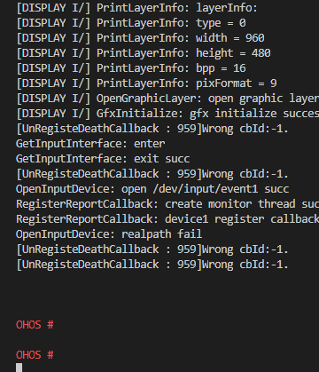

# 开发Hi3516第一个驱动程序示例<a name="ZH-CN_TOPIC_0000001054448621"></a>

本节指导开发者在单板上运行第一个驱动程序，其中包括驱动程序介绍、编译、烧写、运行等步骤。

## 获取源码<a name="section0598122434810"></a>

参考“[开发Hi3516第一个应用程序示例](开发Hi3516第一个应用程序示例.md#section215953714245)”获取源码。

## 驱动程序介绍<a name="s8efc1952ebfe4d1ea717182e108c29bb"></a>

下面基于HDF框架，提供一个简单的UART（Universal Asynchronous Receiver/Transmitter）平台驱动开发样例，包含配置文件的添加，驱动代码的实现以及用户态程序和驱动交互的流程。驱动程序源码位于vendor/huawei/hdf/sample目录。

1.  添加配置。

    在HDF框架的驱动配置文件（例如vendor/hisi/hi35xx/hi3516dv300/config/uart/uart\_config.hcs）中添加该驱动的配置信息，如下所示：

    ```
    root {
        platform {
            uart_sample {
                num = 5;            // UART设备编号
                base = 0x120a0000;  // UART 寄存器基地址
                irqNum = 38;
                baudrate = 115200;
                uartClk = 24000000;
                wlen = 0x60;
                parity = 0;
                stopBit = 0;
                match_attr = "sample_uart_5";
            }
        }
    }
    ```

    在HDF框架的设备配置文件（例如vendor/hisi/hi35xx/hi3516dv300/config/device\_info/device\_info.hcs）中添加该驱动的设备节点信息，如下所示：

    ```
    root {
        device_info {
            platform :: host {
                hostName = "platform_host";
                priority = 50;
                device_uart :: device {
                    device5 :: deviceNode {
                        policy = 2;
                        priority = 10;
                        permission = 0660;
                        moduleName = "UART_SAMPLE";
                        serviceName = "HDF_PLATFORM_UART_5";
                        deviceMatchAttr = "sample_uart_5";
                    }
                }
            }
        }
    }
    ```

    > **说明：** 
    >配置文件与UART驱动示例的源码在同一个路径，需要手动添加到Hi3516DV300单板路径下。

2.  注册UART驱动入口。

    基于HDF框架注册UART驱动的入口HdfDriverEntry，代码如下：

    ```
    // 绑定UART驱动接口到HDF框架
    static int32_t HdfUartSampleBind(struct HdfDeviceObject *device)
    {
        if (device == NULL) {
            return HDF_ERR_INVALID_OBJECT;
        }
        HDF_LOGI("Enter %s:", __func__);
        return (UartHostCreate(device) == NULL) ? HDF_FAILURE : HDF_SUCCESS;
    }
     
    // 从UART驱动的HCS中获取配置信息
    static uint32_t UartDeviceGetResource(
        struct UartDevice *device, const struct DeviceResourceNode *resourceNode)
    {
        struct UartResource *resource = &device->resource;
        struct DeviceResourceIface *dri = NULL;
        dri = DeviceResourceGetIfaceInstance(HDF_CONFIG_SOURCE);
        if (dri == NULL || dri->GetUint32 == NULL) {
            HDF_LOGE("DeviceResourceIface is invalid");
            return HDF_FAILURE;
        }
     
        if (dri->GetUint32(resourceNode, "num", &resource->num, 0) != HDF_SUCCESS) {
            HDF_LOGE("uart config read num fail");
            return HDF_FAILURE;
        }
        if (dri->GetUint32(resourceNode, "base", &resource->base, 0) != HDF_SUCCESS) {
            HDF_LOGE("uart config read base fail");
            return HDF_FAILURE;
        }
        resource->physBase = (unsigned long) OsalIoRemap(resource->base, 0x48);
        if (resource->physBase == 0) {
            HDF_LOGE("uart config fail to remap physBase");
            return HDF_FAILURE;
        }
        if (dri->GetUint32(resourceNode, "irqNum", &resource->irqNum, 0) != HDF_SUCCESS) {
            HDF_LOGE("uart config read irqNum fail");
            return HDF_FAILURE;
        }
        if (dri->GetUint32(resourceNode, "baudrate", &resource->baudrate, 0) != HDF_SUCCESS) {
            HDF_LOGE("uart config read baudrate fail");
            return HDF_FAILURE;
        }
        if (dri->GetUint32(resourceNode, "wlen", &resource->wlen, 0) != HDF_SUCCESS) {
            HDF_LOGE("uart config read wlen fail");
            return HDF_FAILURE;
        }
        if (dri->GetUint32(resourceNode, "parity", &resource->parity, 0) != HDF_SUCCESS) {
            HDF_LOGE("uart config read parity fail");
            return HDF_FAILURE;
        }
        if (dri->GetUint32(resourceNode, "stopBit", &resource->stopBit, 0) != HDF_SUCCESS) {
            HDF_LOGE("uart config read stopBit fail");
            return HDF_FAILURE;
        }
        if (dri->GetUint32(resourceNode, "uartClk", &resource->uartClk, 0) != HDF_SUCCESS) {
            HDF_LOGE("uart config read uartClk fail");
            return HDF_FAILURE;
        }
        return HDF_SUCCESS;
    }
     
    // 将UART驱动的配置和接口附加到HDF驱动框架
    static int32_t SampleAttach(struct UartHost *host, struct HdfDeviceObject *device)
    {
        int32_t ret;
        struct UartDevice *uartDevice = NULL;
        if (device->property == NULL) {
            HDF_LOGE("%s: property is NULL", __func__);
            return HDF_FAILURE;
        }
        uartDevice = (struct UartDevice *) OsalMemCalloc(sizeof(struct UartDevice));
        if (uartDevice == NULL) {
            HDF_LOGE("%s: OsalMemCalloc uartDevice error", __func__);
            return HDF_ERR_MALLOC_FAIL;
        }
        ret = UartDeviceGetResource(uartDevice, device->property);
        if (ret != HDF_SUCCESS) {
            (void) OsalMemFree(uartDevice);
            return HDF_FAILURE;
        }
        host->num = uartDevice->resource.num;
        host->priv = uartDevice;
        UartSampleAddDev(host); // 添加用户态UART设备节点，具体实现见源码uart_dev_sample
        return UartDeviceInit(uartDevice); // 初始化UART PL011，具体实现见源码uart_pl011_sample
    }
     
    // 初始化UART驱动
    static int32_t HdfUartSampleInit(struct HdfDeviceObject *device)
    {
        int32_t ret;
        struct UartHost *host = NULL;
     
        if (device == NULL) {
            HDF_LOGE("%s: device is NULL", __func__);
            return HDF_ERR_INVALID_OBJECT;
        }
        HDF_LOGI("Enter %s:", __func__);
        host = UartHostFromDevice(device);
        if (host == NULL) {
            HDF_LOGE("%s: host is NULL", __func__);
            return HDF_FAILURE;
        }
        ret = SampleAttach(host, device);
        if (ret != HDF_SUCCESS) {
            HDF_LOGE("%s: attach error", __func__);
            return HDF_FAILURE;
        }
        host->method = &g_uartSampleHostMethod;
        return ret;
    }
     
    static void UartDeviceDeinit(struct UartDevice *device)
    {
        struct UartRegisterMap *regMap = (struct UartRegisterMap *) device->resource.physBase;
        /* wait for uart enter idle. */
        while (UartPl011IsBusy(regMap));
        UartPl011ResetRegisters(regMap);
        uart_clk_cfg(0, false);
        OsalIoUnmap((void *) device->resource.physBase);
        device->state = UART_DEVICE_UNINITIALIZED;
    }
     
    // 解绑并释放UART驱动
    static void SampleDetach(struct UartHost *host)
    {
        struct UartDevice *uartDevice = NULL;
     
        if (host->priv == NULL) {
            HDF_LOGE("%s: invalid parameter", __func__);
            return;
        }
        uartDevice = host->priv;
        UartDeviceDeinit(uartDevice);
        (void) OsalMemFree(uartDevice);
        host->priv = NULL;
    }
     
    // 释放UART驱动
    static void HdfUartSampleRelease(struct HdfDeviceObject *device)
    {
        struct UartHost *host = NULL;
        HDF_LOGI("Enter %s:", __func__);
     
        if (device == NULL) {
            HDF_LOGE("%s: device is null", __func__);
            return;
        }
        host = UartHostFromDevice(device);
        if (host == NULL) {
            HDF_LOGE("%s: host is null", __func__);
            return;
        }
        if (host->priv != NULL) {
            SampleDetach(host);
        }
        UartHostDestroy(host);
    }
     
    struct HdfDriverEntry g_hdfUartSample = {
        .moduleVersion = 1,
        .moduleName = "UART_SAMPLE",
        .Bind = HdfUartSampleBind,
        .Init = HdfUartSampleInit,
        .Release = HdfUartSampleRelease,
    };
     
    HDF_INIT(g_hdfUartSample);
    ```

3.  注册UART驱动接口。

    HDF框架提供了UART驱动接口的模板方法UartHostMethod，实现UART驱动接口的代码如下：

    ```
    static int32_t SampleInit(struct UartHost *host)
    {
        HDF_LOGI("%s: Enter", __func__);
        if (host == NULL) {
            HDF_LOGE("%s: invalid parameter", __func__);
            return HDF_ERR_INVALID_PARAM;
        }
        return HDF_SUCCESS;
    }
    
    static int32_t SampleDeinit(struct UartHost *host)
    {
        HDF_LOGI("%s: Enter", __func__);
        if (host == NULL) {
            HDF_LOGE("%s: invalid parameter", __func__);
            return HDF_ERR_INVALID_PARAM;
        }
        return HDF_SUCCESS;
    }
    
    // 向UART中写入数据
    static int32_t SampleWrite(struct UartHost *host, uint8_t *data, uint32_t size)
    {
        HDF_LOGI("%s: Enter", __func__);
        uint32_t idx;
        struct UartRegisterMap *regMap = NULL;
        struct UartDevice *device = NULL;
     
        if (host == NULL || data == NULL || size == 0) {
            HDF_LOGE("%s: invalid parameter", __func__);
            return HDF_ERR_INVALID_PARAM;
        }
        device = (struct UartDevice *) host->priv;
        if (device == NULL) {
            HDF_LOGE("%s: device is NULL", __func__);
            return HDF_ERR_INVALID_PARAM;
        }
        regMap = (struct UartRegisterMap *) device->resource.physBase;
        for (idx = 0; idx < size; idx++) {
            while (UartPl011IsBusy(regMap));
            UartPl011Write(regMap, data[idx]);
        }
        return HDF_SUCCESS;
    }
     
    // 设置UART的波特率
    static int32_t SampleSetBaud(struct UartHost *host, uint32_t baudRate)
    {
        HDF_LOGI("%s: Enter", __func__);
        struct UartDevice *device = NULL;
        struct UartRegisterMap *regMap = NULL;
        UartPl011Error err;
     
        if (host == NULL) {
            HDF_LOGE("%s: invalid parameter", __func__);
            return HDF_ERR_INVALID_PARAM;
        }
        device = (struct UartDevice *) host->priv;
        if (device == NULL) {
            HDF_LOGE("%s: device is NULL", __func__);
            return HDF_ERR_INVALID_PARAM;
        }
        regMap = (struct UartRegisterMap *) device->resource.physBase;
        if (device->state != UART_DEVICE_INITIALIZED) {
            return UART_PL011_ERR_NOT_INIT;
        }
        if (baudRate == 0) {
            return UART_PL011_ERR_INVALID_BAUD;
        }
        err = UartPl011SetBaudrate(regMap, device->uartClk, baudRate);
        if (err == UART_PL011_ERR_NONE) {
            device->baudrate = baudRate;
        }
        return err;
    }
     
    // 获取UART的波特率
    static int32_t SampleGetBaud(struct UartHost *host, uint32_t *baudRate)
    {
        HDF_LOGI("%s: Enter", __func__);
        struct UartDevice *device = NULL;
     
        if (host == NULL) {
            HDF_LOGE("%s: invalid parameter", __func__);
            return HDF_ERR_INVALID_PARAM;
        }
        device = (struct UartDevice *) host->priv;
        if (device == NULL) {
            HDF_LOGE("%s: device is NULL", __func__);
            return HDF_ERR_INVALID_PARAM;
        }
        *baudRate = device->baudrate;
        return HDF_SUCCESS;
    }
     
    // 在HdfUartSampleInit方法中绑定
    struct UartHostMethod g_uartSampleHostMethod = {
        .Init = SampleInit,
        .Deinit = SampleDeinit,
        .Read = NULL,
        .Write = SampleWrite,
        .SetBaud = SampleSetBaud,
        .GetBaud = SampleGetBaud,
        .SetAttribute = NULL,
        .GetAttribute = NULL,
        .SetTransMode = NULL,
    };
    ```

    在vendor/huawei/hdf/hdf\_vendor.mk编译脚本中增加示例UART驱动模块，代码如下：

    ```
    LITEOS_BASELIB += -lhdf_uart_sample
    LIB_SUBDIRS    += $(VENDOR_HDF_DRIVERS_ROOT)/sample/platform/uart
    ```

4.  用户程序和驱动交互代码。

    UART驱动成功初始化后，会创建/dev/uartdev-5设备节点，通过设备节点与UART驱动交互的代码如下：

    ```
    #include <stdlib.h>
    #include <unistd.h>
    #include <fcntl.h>
    #include "hdf_log.h"
    
    #define HDF_LOG_TAG "hello_uart"
    #define INFO_SIZE 16
    
    int main(void)
    {
        int ret;
        int fd;
        const char info[INFO_SIZE] = {" HELLO UART! "};
    
        fd = open("/dev/uartdev-5", O_RDWR);
        if (fd < 0) {
            HDF_LOGE("hello_uart uartdev-5 open failed %d", fd);
            return -1;
        }
        ret = write(fd, info, INFO_SIZE);
        if (ret != 0) {
            HDF_LOGE("hello_uart write uartdev-5 ret is %d", ret);
        }
        ret = close(fd);
        if (ret != 0) {
            HDF_LOGE("hello_uart uartdev-5 close failed %d", fd);
            return -1;
        }
        return ret;
    }
    ```

    在build/lite/product/ipcamera\_hi3516dv300.json产品配置的hdf子系统下增加hello\_uart\_sample组件，代码如下：

    ```
    {
      "subsystem": [
        {
          "name": "hdf",
          "component": [
            { "name": "hdf_sample", "dir": "//vendor/huawei/hdf/sample/platform/uart:hello_uart_sample", "features":[] }
          ]
        }
      ]
    }
    ```

    > **说明：** 
    >如上代码均为示例代码，完整代码可以在vendor/huawei/hdf/sample查看。
    >示例代码默认不参与编译，需要手动添加到编译脚本中。


## 编译和烧写<a name="section660016185110"></a>

参考示例1进行编译和烧写：[编译](开发Hi3516第一个应用程序示例.md#section1077671315253)、[烧写](开发Hi3516第一个应用程序示例.md#section18061240152520)。

## 镜像运行<a name="section197971119142915"></a>

1.  连接串口。

    **图 1**  连接串口图<a name="zh-cn_topic_0000001052906247_fig056645018495"></a>  
    

    

    1.  单击**Serial port**打开串口。
    2.  输入"com11"串口编号并连续输入回车直到串口显示"hisillicon"。
    3.  单板初次启动或修改启动参数，请进入步骤2，否则进入步骤3。

2.  （单板初次启动必选）修改U-boot的bootcmd及bootargs内容：该步骤为固化操作，若不修改参数只需执行一次。每次复位单板均会自动进入系统。

    > **须知：** 
    >U-boot引导程序默认会有2秒的等待时间，用户可使用回车打断等待并显示"hisillicon"，通过**reset**命令可再次启动系统。

    **表 1**  U-boot启动参数

    <a name="zh-cn_topic_0000001052906247_table432481061214"></a>
    <table><tbody><tr id="zh-cn_topic_0000001052906247_row532461021219"><th class="firstcol" valign="top" width="8.39%" id="mcps1.2.3.1.1"><p id="zh-cn_topic_0000001052906247_p1238114718129"><a name="zh-cn_topic_0000001052906247_p1238114718129"></a><a name="zh-cn_topic_0000001052906247_p1238114718129"></a>执行命令</p>
    </th>
    <td class="cellrowborder" valign="top" width="91.61%" headers="mcps1.2.3.1.1 "><p id="zh-cn_topic_0000001052906247_p93816470127"><a name="zh-cn_topic_0000001052906247_p93816470127"></a><a name="zh-cn_topic_0000001052906247_p93816470127"></a><strong id="zh-cn_topic_0000001052906247_b143728351609"><a name="zh-cn_topic_0000001052906247_b143728351609"></a><a name="zh-cn_topic_0000001052906247_b143728351609"></a>setenv bootcmd "sf probe 0;mmc read 0x0 0x80000000 0x800 0x4800; go 0x80000000";</strong></p>
    <p id="zh-cn_topic_0000001052906247_p83904761218"><a name="zh-cn_topic_0000001052906247_p83904761218"></a><a name="zh-cn_topic_0000001052906247_p83904761218"></a><strong id="zh-cn_topic_0000001052906247_b14389193520014"><a name="zh-cn_topic_0000001052906247_b14389193520014"></a><a name="zh-cn_topic_0000001052906247_b14389193520014"></a>setenv bootargs "console=ttyAMA0,115200n8 root=emmc fstype=vfat rootaddr=10M rootsize=15M rw";</strong></p>
    <p id="zh-cn_topic_0000001052906247_p7399470123"><a name="zh-cn_topic_0000001052906247_p7399470123"></a><a name="zh-cn_topic_0000001052906247_p7399470123"></a><strong id="zh-cn_topic_0000001052906247_b1041015359012"><a name="zh-cn_topic_0000001052906247_b1041015359012"></a><a name="zh-cn_topic_0000001052906247_b1041015359012"></a>saveenv</strong></p>
    <p id="zh-cn_topic_0000001052906247_p14391747131219"><a name="zh-cn_topic_0000001052906247_p14391747131219"></a><a name="zh-cn_topic_0000001052906247_p14391747131219"></a><strong id="zh-cn_topic_0000001052906247_b84127351701"><a name="zh-cn_topic_0000001052906247_b84127351701"></a><a name="zh-cn_topic_0000001052906247_b84127351701"></a>reset</strong></p>
    </td>
    </tr>
    <tr id="zh-cn_topic_0000001052906247_row6324410171216"><th class="firstcol" valign="top" width="8.39%" id="mcps1.2.3.2.1"><p id="zh-cn_topic_0000001052906247_p203915473129"><a name="zh-cn_topic_0000001052906247_p203915473129"></a><a name="zh-cn_topic_0000001052906247_p203915473129"></a>命令解释</p>
    </th>
    <td class="cellrowborder" valign="top" width="91.61%" headers="mcps1.2.3.2.1 "><p id="zh-cn_topic_0000001052906247_p439134715129"><a name="zh-cn_topic_0000001052906247_p439134715129"></a><a name="zh-cn_topic_0000001052906247_p439134715129"></a><strong id="zh-cn_topic_0000001052906247_b14391847171211"><a name="zh-cn_topic_0000001052906247_b14391847171211"></a><a name="zh-cn_topic_0000001052906247_b14391847171211"></a>setenv bootcmd "mmc read 0x0 0x80000000 0x800 0x4800;go 0x80000000";</strong></p>
    <p id="zh-cn_topic_0000001052906247_p1439184741218"><a name="zh-cn_topic_0000001052906247_p1439184741218"></a><a name="zh-cn_topic_0000001052906247_p1439184741218"></a>表示选择FLASH器件0，读取FLASH起始地址为0x800（单位为512B，即1MB），大小为0x4800（单位为512B，即9MB）的内容到0x80000000的内存地址。</p>
    <p id="zh-cn_topic_0000001052906247_p7391347101215"><a name="zh-cn_topic_0000001052906247_p7391347101215"></a><a name="zh-cn_topic_0000001052906247_p7391347101215"></a><strong id="zh-cn_topic_0000001052906247_b0397473129"><a name="zh-cn_topic_0000001052906247_b0397473129"></a><a name="zh-cn_topic_0000001052906247_b0397473129"></a>setenv bootargs "console=ttyAMA0,115200n8 root=emmc fstype=vfat rootaddr=10M rootsize=15M rw";</strong></p>
    <p id="zh-cn_topic_0000001052906247_p939547151215"><a name="zh-cn_topic_0000001052906247_p939547151215"></a><a name="zh-cn_topic_0000001052906247_p939547151215"></a><strong id="zh-cn_topic_0000001052906247_b93984781214"><a name="zh-cn_topic_0000001052906247_b93984781214"></a><a name="zh-cn_topic_0000001052906247_b93984781214"></a></strong>表示设置启动参数，输出模式为串口输出，波特率为115200，数据位8，rootfs挂载于emmc器件，文件系统类型为vfat，</p>
    <p id="zh-cn_topic_0000001052906247_p8402475121"><a name="zh-cn_topic_0000001052906247_p8402475121"></a><a name="zh-cn_topic_0000001052906247_p8402475121"></a><strong id="zh-cn_topic_0000001052906247_b140947121219"><a name="zh-cn_topic_0000001052906247_b140947121219"></a><a name="zh-cn_topic_0000001052906247_b140947121219"></a>“rootaddr=10M rootsize=15M rw”</strong>处对应填入rootfs.img的烧写起始位置与长度，此处与IDE中新增rootfs.img文件时所填大小<strong id="zh-cn_topic_0000001052906247_b124004714129"><a name="zh-cn_topic_0000001052906247_b124004714129"></a><a name="zh-cn_topic_0000001052906247_b124004714129"></a>必须相同</strong>。</p>
    <p id="zh-cn_topic_0000001052906247_p54034712120"><a name="zh-cn_topic_0000001052906247_p54034712120"></a><a name="zh-cn_topic_0000001052906247_p54034712120"></a><strong id="zh-cn_topic_0000001052906247_b1740247111219"><a name="zh-cn_topic_0000001052906247_b1740247111219"></a><a name="zh-cn_topic_0000001052906247_b1740247111219"></a>saveenv</strong>;表示保存当前配置。</p>
    <p id="zh-cn_topic_0000001052906247_p2401247131212"><a name="zh-cn_topic_0000001052906247_p2401247131212"></a><a name="zh-cn_topic_0000001052906247_p2401247131212"></a><strong id="zh-cn_topic_0000001052906247_b1040144710122"><a name="zh-cn_topic_0000001052906247_b1040144710122"></a><a name="zh-cn_topic_0000001052906247_b1040144710122"></a>reset;</strong>表示复位单板</p>
    <p id="zh-cn_topic_0000001052906247_p1440164791213"><a name="zh-cn_topic_0000001052906247_p1440164791213"></a><a name="zh-cn_topic_0000001052906247_p1440164791213"></a><strong id="zh-cn_topic_0000001052906247_b840447121214"><a name="zh-cn_topic_0000001052906247_b840447121214"></a><a name="zh-cn_topic_0000001052906247_b840447121214"></a>[可选]“go 0x80000000”</strong>默认配置已将指令固化在启动参数中，单板复位后可自动启动。若想切换为手动启动，可在U-boot启动倒数阶段使用"回车"打断自动启动。</p>
    </td>
    </tr>
    </tbody>
    </table>

3.  输入**“reset”**指令并回车，重启单板，启动成功如下图，输入回车串口显示OHOS字样。

    **图 2**  系统启动图<a name="zh-cn_topic_0000001052906247_fig10181006376"></a>  
    

    

4.  根目录下，在命令行输入指令“**./bin/hello\_uart**”执行写入的demo程序，显示成功结果如下图所示。

    ```
    OHOS # ./bin/hello_uart
    OHOS #  HELLO UART!
    ```


## 下一步学习<a name="section9712145420182"></a>

恭喜，您已完成Hi3516 快速上手！建议您下一步进入[带屏摄像头产品开发](../guide/屏幕和摄像头控制.md)的学习 。

