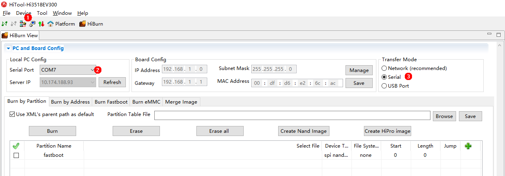
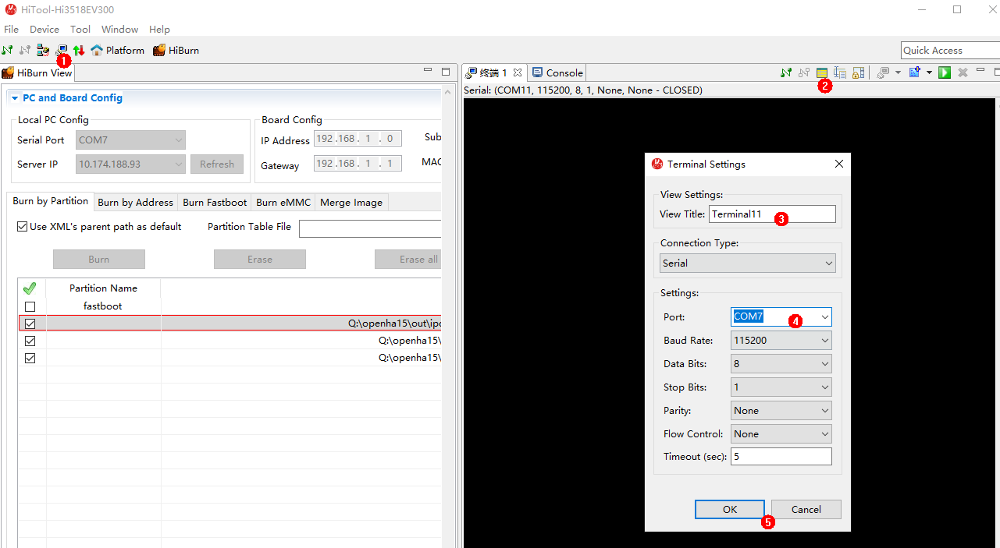

# 开发Hi3518第一个示例程序<a name="ZH-CN_TOPIC_0000001053422339"></a>

本节指导开发者在单板上运行第一个应用程序，其中包括修改应用程序、编译、烧写、运行等步骤，最终输出“Hello OHOS！”

## 获取源码<a name="section1726092873119"></a>

开发者需要在Linux服务器上下载一套源代码，获取Hi3518源码（[站点1](http://tools.harmonyos.com/mirrors/os/1.0/ipcamera_hi3518ev300-1.0.tar.gz)、[站点2](https://mirrors.huaweicloud.com/harmonyos/1.0/ipcamera_hi3518ev300-1.0.tar.gz)）。更多源码获取方式，请见[源码获取](../get-code/源码获取.md)。

## 修改应用程序<a name="s8efc1952ebfe4d1ea717182e108c29bb"></a>

源码applications/sample/camera/app/src目录内helloworld.c代码如下所示，用户可以自定义修改打印内容（例如：修改OHOS为World）。当前应用程序可支持ISO C及C++的代码开发。

```
#include <stdio.h>
#include "los_sample.h"

int main(int argc, char **argv)
{
    printf("\n************************************************\n");
    printf("\n\t\tHello OHOS!\n");
    printf("\n************************************************\n\n");

    LOS_Sample(g_num);

    return 0;
}
```

## 编译<a name="section234175193114"></a>

在linux服务器上，进入源码包根目录，执行如下脚本编译源码包。结果文件生成在out/ipcamera\_hi3518ev300目录下。

Hi3518EV300

```
python build.py ipcamera_hi3518ev300 -b debug
```

## 镜像烧写<a name="section13453727165513"></a>

Hi3518EV300单板请使用串口烧写。

1.  单板串口线（USB接口）与Winodws主机连接，打开电脑的设备管理器，查看串口号，此处为"COM7"。

    > **须知：** 
    >串口转USB驱动，可在设备管理器，右键单击设备，并选择更新驱动程序-\>自动选择更新的驱动程序软件。

    **图 1**  驱动安装成功图<a name="fig44731317340"></a>  
    

2.  打开HiTool工具，按照标号顺序选择芯片类型"Hi3518EV300"，“本地PC配置”内选择“COM7”，“传输方式”内选择“串口”。

    **图 2**  HiTool工具串口配置步骤图<a name="fig39175210590"></a>  
    

3.  烧写：新增编译生成的OHOS\_Image.bin文件与rootfs.img，userfs.img文件，请仔细确认烧入文件的文件路径、器件类型、开始地址及长度。请按文件实际大小（向上取整，最小单位为MB），修改相关参数。

    **图 3**  HiTool工具烧写步骤图<a name="fig86613431218"></a>  
    

4.  点击烧写按钮，并按提示上电单板（已上电状态需要重新下电后再上电）

    **图 4** <a name="fig25501252753"></a>  
    

5.  烧写完成，点击OK。

    **图 5**  烧写完成示意图<a name="fig1527452663210"></a>  
    


## 镜像运行<a name="section62131033183710"></a>

1.  连接串口：烧入成功后，按图示步骤打开终端，点击设置，修改终端名称为“Terminal11”，端口号为COM7，点击OK后打开串口，串口将显示**"hisilicon \#"**字样，表示进入单板U-boot程序。

    **图 6**  串口连接图<a name="fig197461744191012"></a>  
    

2.  （初次烧写必选）修改U-boot的bootcmd及bootargs内容：该步骤为固化操作，可保存执行结果，但U-boot重新烧入，则需要再次执行下述步骤。

    **表 1**  Hi3518EV300 U-boot修改参数解释

    <a name="table1671622991613"></a>
    <table><tbody><tr id="row1371652914168"><th class="firstcol" valign="top" width="8.38%" id="mcps1.2.3.1.1"><p id="p1598685321618"><a name="p1598685321618"></a><a name="p1598685321618"></a>执行命令</p>
    </th>
    <td class="cellrowborder" valign="top" width="91.62%" headers="mcps1.2.3.1.1 "><p id="p1598616535166"><a name="p1598616535166"></a><a name="p1598616535166"></a>setenv bootcmd "sf probe 0;sf read 0x40000000 0x100000 0x600000;go 0x40000000";</p>
    <p id="p183481352181718"><a name="p183481352181718"></a><a name="p183481352181718"></a>setenv bootargs "console=ttyAMA0,115200n8 root=flash fstype=jffs2 rw rootaddr=7M rootsize=8M"; saveenv;</p>
    <p id="p1784612265186"><a name="p1784612265186"></a><a name="p1784612265186"></a>reset</p>
    </td>
    </tr>
    <tr id="row9716152914161"><th class="firstcol" valign="top" width="8.38%" id="mcps1.2.3.2.1"><p id="p998695361611"><a name="p998695361611"></a><a name="p998695361611"></a>命令解释</p>
    </th>
    <td class="cellrowborder" valign="top" width="91.62%" headers="mcps1.2.3.2.1 "><p id="p1198615316165"><a name="p1198615316165"></a><a name="p1198615316165"></a><strong id="b11610792311"><a name="b11610792311"></a><a name="b11610792311"></a>setenv bootcmd "sf probe 0;sf read 0x40000000 0x100000 0x600000;go 0x40000000";</strong></p>
    <p id="p2986125310164"><a name="p2986125310164"></a><a name="p2986125310164"></a>设置bootcmd内容，选择FLASH器件0，读取FLASH起始地址为0x100000，大小为0x600000的内容到0x40000000的内存地址。</p>
    <p id="p5759815112613"><a name="p5759815112613"></a><a name="p5759815112613"></a><strong id="b12987155371614"><a name="b12987155371614"></a><a name="b12987155371614"></a>（可选）“go 0x40000000”</strong>默认配置已将指令固化在启动参数中，单板复位后可自动启动。若想切换为手动启动，可在U-boot启动倒数阶段使用"回车"打断自动启动。</p>
    <p id="p340215818235"><a name="p340215818235"></a><a name="p340215818235"></a><strong id="b119855142415"><a name="b119855142415"></a><a name="b119855142415"></a>setenv bootargs "console=ttyAMA0,115200n8 root=flash fstype=jffs2 rw rootaddr=7M rootsize=8M";</strong></p>
    <p id="p8987115381613"><a name="p8987115381613"></a><a name="p8987115381613"></a><strong id="b1798715321615"><a name="b1798715321615"></a><a name="b1798715321615"></a></strong>表示设置bootargs参数为串口输出，波特率为115200，数据位8，rootfs挂载于FLASH上，文件系统类型为jffs2 rw，以支持可读写JFFS2文件系统。</p>
    <p id="p1888191482518"><a name="p1888191482518"></a><a name="p1888191482518"></a><strong id="b1288117149250"><a name="b1288117149250"></a><a name="b1288117149250"></a>“rootaddr=7M rootsize=8M”</strong>处对应填入实际rootfs.img的烧写起始位置与长度，此处应与HiTool新增文件时所填大小相同。</p>
    <p id="p1198755319162"><a name="p1198755319162"></a><a name="p1198755319162"></a><strong id="b5987135314164"><a name="b5987135314164"></a><a name="b5987135314164"></a>saveenv</strong>;表示保存当前配置。</p>
    <p id="p0987125371614"><a name="p0987125371614"></a><a name="p0987125371614"></a><strong id="b1298711531161"><a name="b1298711531161"></a><a name="b1298711531161"></a>reset;</strong>表示复位单板。</p>
    <p id="p094912253363"><a name="p094912253363"></a><a name="p094912253363"></a><strong id="b558324812366"><a name="b558324812366"></a><a name="b558324812366"></a>pri</strong>表示查看显示参数。</p>
    </td>
    </tr>
    </tbody>
    </table>

    **图 7**  启动参数设置图<a name="fig11101652163517"></a>  
    

3.  若启动时显示**"hisilicon \#**字样，请输入**“reset”**指令，等待系统自启动进入系统，系统启动后，显示**“OHOS”**字样，输入**”./bin/camera\_app”**并回车，显示成功结果如下图所示。

    **图 8**  启动成功并执行应用程序图<a name="fig11838403383"></a>  
    


## 下一步学习<a name="section9712145420182"></a>

恭喜您，已完成Hi3518的快速上手！建议您下一步进入[无屏摄像头产品开发](../guide/摄像头控制.md)的学习 。

