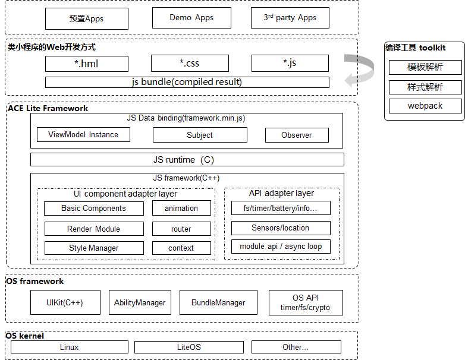

# ACE开发框架<a name="ZH-CN_TOPIC_0000001052342972"></a>

## 简介<a name="section11660541593"></a>

ACE（Ability Cross-platform Environment）开发框架，作为ACE框架的轻量实现，提供了一套跨平台的类web应用开发框架，通过Toolkit将开发者编写的HML、CSS和JS 文件编译打包成JS Bundle，然后再将JS Bundle解析运行成C++ UIKit的View 组件进行渲染。通过支持三方开发者使用声明式的API进行应用开发，以数据驱动视图变化，避免了大量的视图操作，大大降低了应用开发难度，提升开发者开发体验。ACE 框架模块组成如下图所示：



## 目录<a name="section1464106163817"></a>

轻量ACE 框架源代码在/foundation/ace下，目录结构如下图所示：

```
/foundation/ace
├── frameworks #框架代码
│   └── lite
│       ├── examples #示例代码目录
│       ├── include #部分跨子系统但仅部分平台暴露的头文件存放目录
│       ├── packages #JS-Framework存放目录
│       ├── src #源代码存放目录
│       ├── targets #各目标设备配置文件存放目录
│       └── tools #工具代码存放目录
├── interfaces #头文件存放目录
│   └── innerkits #对内部子系统暴露的头文件存放目录
│       └── builtin # ACE对外暴露JS三方module API接口存放目录
```

## 约束<a name="section1718733212019"></a>

-   语言版本
    -   C++11版本或以上
    -   JavaScript ES5.1+


-   框架运行内存通常分为如下组成部分：
    -   1. 运行时引擎的预分配内存，该内存值可调，取决于具体设备应用复杂度，通常建议64K\~512K
    -   2. 框架本身内存，在百K级的内存设备上，通常通过预分配一个内存池进行管理，可以和UIKit共用一个内存池，包含了对象和堆内存统一管理

-   框架针对不同的芯片平台和底层OS能力，规格有所区别
    -   Cortex-M RAM/ROM：
        -   JS引擎内存池: 建议大于48K
        -   RAM：建议大于80K
        -   ROM:  \> 300K （包含ACE，UIKit及引擎等强相关子系统）

    -   Cortex-A RAM/ROM:
        -   JS引擎内存池: 建议大于128K
        -   RAM：建议大于512K
        -   ROM：\> 2M （包含ACE，UIKit及引擎等强相关子系统）


## 使用**targets**<a name="section1460013282612"></a>

ACE框架实现主要包含两部分，native和JavaScript，native部分为C++，为框架的主体实现，JavaScript部分实现提供ACE框架对用户JS文件的运行时支持，并通过向引擎暴露一些全局方法或对象，支撑JS运行时与native框架之间的交互。

ACE框架通过一些特性宏来定制不同平台上参与编译的功能代码，该部分代码位于 foundation/ace/frameworks/lite/targets 目录下，目录结构如下：

```
/foundation/ace/frameworks/lite/targets
├── default/
│   └── acelite_config.h
├── linux/ #linux环境配置文件目录
│   └── acelite_config.h
├── liteos_a/ #LiteOS A核环境配置文件目录
│   └── acelite_config.h
├── liteos_m/ #LiteOS M核环境配置文件目录
│   └── acelite_config.h
├── platform_adapter.cpp
├── platform_adapter.h
└── simulator/ #模拟器环境配置文件目录
    └── win/
        └── acelite_config.h*
```

在编译不同的平台目标时，需要使用对应平台目录下的acelite\_config.h 头文件，这可以通过配置编译时的搜索路径来进行，以下以 ninja和cmake 构建工具为例进行示例：

ninja：

```
  if (hos_kernel_type == "liteos_a" || hos_kernel_type == "liteos_m" ||
      hos_kernel_type == "liteos_riscv") { // 通过目标内核平台选择不同的头文件搜索路径
    include_dirs += [ "targets/liteos-a" ]
  } else if (hos_kernel_type == "linux") {
    include_dirs += [ "targets/linux" ]
  }
```

cmake：

```
......
set(ACE_LITE_CONFIG_PATH "${CMAKE_CURRENT_SOURCE_DIR}/targets/simulator/win")
set(JSFWK_INCLUDE_PATH "${CMAKE_CURRENT_SOURCE_DIR}/include")
set(JSFWK_SOURCE_PATH "${CMAKE_CURRENT_SOURCE_DIR}/src/core")
set(UIKIT_PATH "${CMAKE_CURRENT_SOURCE_DIR}/../ui")
set(THIRTY_PATH "${CMAKE_CURRENT_SOURCE_DIR}/../../../third_party")
set(JSFWK_SIMULATOR_PATH "${CMAKE_CURRENT_SOURCE_DIR}/../tools/simulator")
set(JS_API_PATH "${CMAKE_CURRENT_SOURCE_DIR}/../../api/emui_band/MoltenCore/application/framework/ace/api")
set(JSFWK_SIMULATOR_PATH "${CMAKE_CURRENT_SOURCE_DIR}/../tools/simulator")
set(AAFWK_PATH "${CMAKE_CURRENT_SOURCE_DIR}/../../../aafwk")

# header files
include_directories(
    ${ACE_LITE_CONFIG_PATH}
    ${JSFWK_INCLUDE_PATH}/async
    ${JSFWK_INCLUDE_PATH}/base
    ${JSFWK_INCLUDE_PATH}/context
    ${JSFWK_INCLUDE_PATH}/jsi
    ${JSFWK_SOURCE_PATH}
    ......
```

acelite\_config.h主要用于对应平台的特性宏开关，也可用来进行一些屏蔽平台差异的定义，如不同平台由于使用的文件系统不一致，可能存在一些固定目录路径名不一样的情况，这些有区别的常量可以放在这里进行定义，如下：

liteos-a/acelite\_config.h

```
#define JS_FRAMEWORK_PATH "//system/ace/bin/"
```

simulator/win/acelite\_config.h

```
#define JS_FRAMEWORK_PATH "..\\..\\..\\jsfwk\\packages\\runtime-core\\build"
```

## 使用runtime-core<a name="section1460223932718"></a>

为了实现单向数据绑定机制，轻量ACE 框架使用JavaScript语言实现了一套简单的数据劫持框架，称之为runtime-core，目录结构如下所示：

```
/foundation/ace/frameworks/lite/packages
└── runtime-core
    ├── .babelrc #babel配置文件
    ├── .editorconfig #IDE配置文件
    ├── .eslintignore #ESLint配置文件，可以设置不进行ESLint扫描的目录或文件
    ├── .eslintrc.js #ESLint配置文件，可以配置扫描规则
    ├── .gitignore
    ├── package.json #NPM包管理文件
    ├── package-lock.json #NPM依赖版本锁定文件
    ├── .prettierrc #代码格式化规则配置文件
    ├── scripts #编译脚本目录
    │   ├── build.js #编译脚本
    │   └── configs.js #Rollup配置文件
    ├── .size-snapshot.json
    └── src #源代码
        ├── core #ViewModel核心实现目录
        │   └── index.js
        ├── index.js
        ├── observer #数据劫持部分代码实现目录
        │   ├── index.js
        │   ├── observer.js
        │   ├── subject.js
        │   └── utils.js
        ├── profiler #profiler目录
        │   └── index.js
        └── __test__ #测试用例目录
            └── index.test.js
```

支持的NPM 命令有：

-   npm run build

    ACE 所集成的JS 引擎仅支持ES5.1语法，runtime-core源代码是使用ES6源码书写的。因此选择使用rollup做为打包工具，配合babel实现对JavaScript语法进行降级处理。只要命令行中执行命令npm run build，会在build目录下输出打包结果，输出结果如下所示：

    ```
    build/
    ├── framework-dev.js // 开发环境使用的框架代码（未压缩混淆）
    ├── framework-dev.min.js // 开发环境使用的框架代码（已压缩混淆）
    ├── framework.js // 生产环境使用的框架代码（未压缩混淆）
    └── framework.min.js // 生产环境使用的框架代码（已压缩混淆）
    ```

-   npm run test

    runtime-core使用jest进行单元测试，在命令行中执行npm run test即可触发。


## 涉及仓<a name="section11703194974217"></a>

ace\_lite\_jsfwk

ace\_interfaces\_innerkits\_builtin

