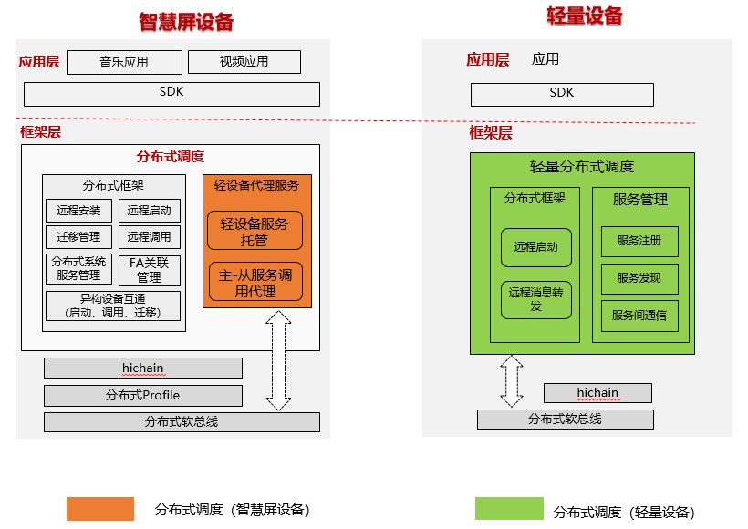

# 分布式任务调度子系统<a name="ZH-CN_TOPIC_0000001051983009"></a>

## 简介<a name="section11660541593"></a>

分布式任务调度模块，通过主（智慧屏设备）从设备（运动手表等小内存设备）服务代理机制，在异构操作系统上建立起分布式服务平台，支持OpenHarmony智慧屏与拉起其它OpenHarmony设备FA的能力。轻量分布式调度模块组成如下图所示：



## 目录<a name="section1464106163817"></a>

分布式任务调度源代码目录结构如下表所示：

**表1 **主要源代码目录结构

<a name="table43531856201716"></a>
<table><thead align="left"><tr id="row20416556201718"><th class="cellrowborder" valign="top" width="50%" id="mcps1.1.3.1.1"><p id="p10416456121716"><a name="p10416456121716"></a><a name="p10416456121716"></a>名称</p>
</th>
<th class="cellrowborder" valign="top" width="50%" id="mcps1.1.3.1.2"><p id="p1841645631717"><a name="p1841645631717"></a><a name="p1841645631717"></a>描述</p>
</th>
</tr>
</thead>
<tbody><tr id="row64161056151718"><td class="cellrowborder" valign="top" width="50%" headers="mcps1.1.3.1.1 "><p id="p9416656181720"><a name="p9416656181720"></a><a name="p9416656181720"></a>dtbschedmgr_lite</p>
</td>
<td class="cellrowborder" valign="top" width="50%" headers="mcps1.1.3.1.2 "><p id="p541645611177"><a name="p541645611177"></a><a name="p541645611177"></a>轻量级分布式任务调度实现。</p>
</td>
</tr>
<tr id="row104169564177"><td class="cellrowborder" valign="top" width="50%" headers="mcps1.1.3.1.1 "><p id="p17416125614179"><a name="p17416125614179"></a><a name="p17416125614179"></a>safwk_lite</p>
</td>
<td class="cellrowborder" valign="top" width="50%" headers="mcps1.1.3.1.2 "><p id="p04163569170"><a name="p04163569170"></a><a name="p04163569170"></a>系统服务进程实现。</p>
</td>
</tr>
<tr id="row04161056121719"><td class="cellrowborder" valign="top" width="50%" headers="mcps1.1.3.1.1 "><p id="p13416165621713"><a name="p13416165621713"></a><a name="p13416165621713"></a>samgr_lite</p>
</td>
<td class="cellrowborder" valign="top" width="50%" headers="mcps1.1.3.1.2 "><p id="p13417125611175"><a name="p13417125611175"></a><a name="p13417125611175"></a>本地服务管理实现。</p>
</td>
</tr>
</tbody>
</table>

其中轻量级分布式任务调度的源代码目录结构如下：

```
├── BUILD.gn
├── include
│  ├── distributed_schedule_service.h        # 分布式调度对外接口文件
│  ├── dmslite_check_remote_permission.h     # 分布式调度权限管理模块
│  ├── dmslite_famgr.h                       # 分布式调度FA管理模块
│  ├── dmslite_inner_common.h                # 分布式调度服务文件
│  ├── dmslite.h                             # 分布式调度实现
│  ├── dmslite_log.h                         # 日志模块
│  ├── dmslite_msg_parser.h                  # 通讯数据反序列化
│  ├── dmslite_tlv_common.h                  # TLV格式数据解析模块
│  └── dmslite_session.h                     # 跨设备通信辅助文件
├── README.md
├── LICENSE
├── source
    ├── distributed_schedule_service.c
    ├── dmslite.c
    ├── dmslite_check_remote_permission.c
    ├── dmslite_famgr.c
    ├── dmslite_msg_parser.c
    ├── dmslite_tlv_common.c
    └── dmslite_session.c
```

## 约束<a name="section1718733212019"></a>

语言限制：C语言。 组网环境：必须确保设备在同一个局域网中。操作系统限制：OpenHarmony操作系统。

**远程启动的约束与限制：**

-   支持远程启动FA，不支持远程启动SA。
-   远程启动前必须确保主设备（智慧屏设备）与从设备间（运动手表等小内存设备）分布式组网成功（需要在同一网段内，可互相ping通），否则无法远程启动。

## 使用<a name="section10729231131110"></a>

**轻量级分布式调度模块编译**

轻量级分布式调度模块通过一些特性宏来定制不同平台上参与编译的功能代码，该部分代码位于build\\lite\\config\\subsystem\\distributedschedule\\目录下，目录结构如下：

```
build/lite/config/subsystem/distributedschedule
├── BUILD.gn
```

在编译不同的平台目标时，需要使用对BUILD.gn进行修改，以下以平台hi3518ev300和hi3516dv300为例：

```
zlite_subsystem("distributedschedule") {
    subsystem_components = [
        "//foundation/distributedschedule/services/samgr_lite:samgr",
    ]
    if (board_name == "hi3518ev300" || board_name == "hi3516dv300") {
        subsystem_components += [
            "//foundation/distributedschedule/services/safwk_lite:safwk_lite",
            "//foundation/distributedschedule/services/dtbschedmgr_lite:dtbschedmgr", // 轻量级分布式调度模块配置
        ]
    }
}
```

**\* 主设备程序开发**（以拉起FA为例）

构造want，首先使用ElementName类表明需要启动的远端设备ID，包名，元能力类名，传入want中，然后设置want中的分布式标志位Want.FLAG\_ABILITYSLICE\_MULTI\_DEVICE表示需要远程启动。

```
// 引入相关头文件
import ohos.aafwk.ability.Ability;
import ohos.aafwk.content.Want;
import ohos.bundle.ElementName;

// 启动远程设备FA
Want want = new Want(); // 封装启动远端FA的Want
ElementName name = new ElementName("remote_device_id", "com.huawei.remote_package_name","remote_class_name");
want.setElement(name); // 将待启动的FA信息添加到Want中
want.setFlags(Want.FLAG_ABILITYSLICE_MULTI_DEVICE); // 设置分布式标记，若不设置将无法使用分布式能力
startAbility(want); // 按照Want启动指定FA,Want参数命名以实际开发平台API为准
```

**\* 预置条件**

**主从设备间组网**：远程启动前必须确保主从设备分布式组网成功（需要在同一网段内，可互相ping通），否则无法远程启

**从设备FA安装：**安装测试或者自开发的FA到从设备

**\* 运行**（以拉起FA为例）

执行主设备（智慧屏）侧的startAbility即可拉起从设备（运动手表等小内存设备）FA

## 涉及仓<a name="section176111311166"></a>

distributedschedule\_interfaces\_kits\_samgr\_lite

distributedschedule\_services\_dtbschedmgr\_lite

distributedschedule\_services\_safwk\_lite

