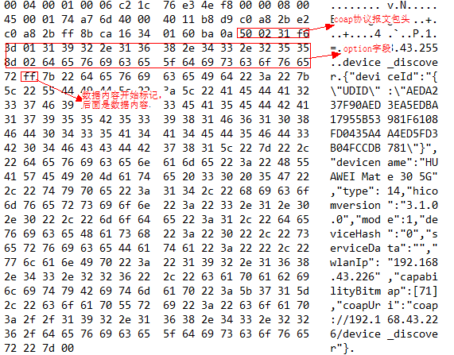

# 分布式通信子系统<a name="ZH-CN_TOPIC_0000001051344287"></a>

## 简介<a name="section11660541593"></a>

设备通信方式多种多样\(USB/WIFI/BT等\)，不同通信方式使用差异很大且繁琐，同时通信链路的融合共享和冲突无法处理，通信安全问题也不好保证。本项目致力于实现近场设备间统一的分布式通信能力管理，提供不区分链路的设备发现和传输接口。目前实现能力包含：

-   服务发布：服务发布后周边的设备可以发现并使用服务。
-   数据传输：根据服务的名称和设备ID建立一个会话，就可以实现服务间的传输功能。
-   安全：提供通信数据的加密能力。

开发者通过使用项目的API实现设备间高速安全的通信，不用关心通信细节管理，进而实现业务开发的跨平台能力。

## 目录<a name="section1464106163817"></a>

softbus\_lite源代码目录结构如下图所示：

**表1 **softbus\_lite源代码目录结构

<a name="table1843451445317"></a>
<table><thead align="left"><tr id="row16552191445314"><th class="cellrowborder" valign="top" width="50%" id="mcps1.1.3.1.1"><p id="p75521114125314"><a name="p75521114125314"></a><a name="p75521114125314"></a>名称</p>
</th>
<th class="cellrowborder" valign="top" width="50%" id="mcps1.1.3.1.2"><p id="p2055231419539"><a name="p2055231419539"></a><a name="p2055231419539"></a>描述</p>
</th>
</tr>
</thead>
<tbody><tr id="row15552151465314"><td class="cellrowborder" valign="top" width="50%" headers="mcps1.1.3.1.1 "><p id="p255221425316"><a name="p255221425316"></a><a name="p255221425316"></a>authmanager</p>
</td>
<td class="cellrowborder" valign="top" width="50%" headers="mcps1.1.3.1.2 "><p id="p11552114135313"><a name="p11552114135313"></a><a name="p11552114135313"></a>提供设备认证机制和设备知识库管理。</p>
</td>
</tr>
<tr id="row1755251416537"><td class="cellrowborder" valign="top" width="50%" headers="mcps1.1.3.1.1 "><p id="p455231495317"><a name="p455231495317"></a><a name="p455231495317"></a>discovery</p>
</td>
<td class="cellrowborder" valign="top" width="50%" headers="mcps1.1.3.1.2 "><p id="p15531214115319"><a name="p15531214115319"></a><a name="p15531214115319"></a>提供基于coap协议的设备发现机制。</p>
</td>
</tr>
<tr id="row155534148533"><td class="cellrowborder" valign="top" width="50%" headers="mcps1.1.3.1.1 "><p id="p1252015524711"><a name="p1252015524711"></a><a name="p1252015524711"></a>trans_service</p>
</td>
<td class="cellrowborder" valign="top" width="50%" headers="mcps1.1.3.1.2 "><p id="p1752055220713"><a name="p1752055220713"></a><a name="p1752055220713"></a>提供认证和传输通道。</p>
</td>
</tr>
</tbody>
</table>

## 约束<a name="section1718733212019"></a>

-   语言限制：C语言。
-   组网环境：必须确保设备在同一个局域网中。

## 使用<a name="section167037358130"></a>

1.  设备发现

用户使用发现功能时，需要保证发现端设备与被发现端设备在同一个局域网内，并且互相能收到对方以下流程的报文。

（1） 发现端设备，发起discover请求后，使用coap协议在局域网内发送广播。报文如下：



（2）被发现端设备使用PublishService接口发布服务，接收端收到广播后，发送coap协议单播给发现端。报文格式如下：


（3）发现端设备收到报文会更新设备信息。

被发现端接口使用示例如下：

```
// 回调函数声明：
void onSuccess(int publishId)
{
    printf("public success,publishId = %d\r\n", publishId);
}
void onFail(int publishId, PublishFailReason reason)
{
    printf("publish failed, publishId = %d, reason = %d\r\n", publishId, reason);
}
// 服务发布接口使用
PublishInfo info = {0};
IPublishCallback cb = {0};
cb.onPublishSuccess = onSuccess;
cb.onPublishFail = onFail;
char a[] = "456";
info.capabilityData = a;
info.capability = "ddmpCapability";
info.dataLen = strlen("456");
info.medium = 2;
info.publishId = 1;
PublishService("cxx", &info, &cb);
```

2. 传输

软总线提供统一的基于Session的传输功能，业务可以通过sessionId收发数据或获取其相关基本属性。当前本项目只实现被动接收Session连接的功能，业务可根据自身需要及Session自身属性判断是否接受此Session，如不接受，可以主动拒绝此连接。本项目暂未提供打开Session的相关能力。

传输主要代码示例如下：

```
// 定义业务自身的业务名称，会话名称及相关回调
const char *g_pkgName = "BUSINESS_NAME";
const char *g_sessionName = "SESSION_NAME";
struct ISessionListener * g_sessionCallback= NULL;

// 回调实现：接收对方通过SendBytes发送的数据，此示例实现是接收到对端发送的数据后回复固定消息
void OnBytesReceivedTest(int sessionId, const void* data, unsigned int dataLen)
{
    printf("OnBytesReceivedTest\n");
    printf("Recv Data: %s\n", (char *)data);
    printf("Recv Data dataLen: %d\n", dataLen);
    char *testSendData = "Hello World, Hello!";
    SendBytes(sessionId, testSendData, strlen(testSendData));
    return;
}

// 回调实现：用于处理会话关闭后的相关业务操作，如释放当前会话相关的业务资源，会话无需业务主动释放
void OnSessionClosedEventTest(int sessionId)
{
    printf("Close session successfully, sessionId=%d\n", sessionId);
}

// 回调实现：用于处理会话打开后的相关业务操作。返回值为0，表示接收；反之，非0表示拒绝。此示例表示只接受其他设备的同名会话连接
int OnSessionOpenedEventTest(int sessionId)
{
    if (strcmp(GetPeerSessionName(sessionId), SESSION_NAME) != 0) {
        printf("Reject the session which name is different from mine, sessionId=%d\n", sessionId);
        return -1;
    }
    printf("Open session successfully, sessionId=%d\n", sessionId);
    return 0;
}

// 向SoftBus注册业务会话服务及其回调
int StartSessionServer()
{
    if (g_sessionCallback != NULL) {
        g_sessionCallback = (struct ISessionListener*)malloc(sizeof(struct ISessionListener));
    }
    if (g_sessionCallback == NULL) {
        printf("Failed to malloc g_sessionCallback!\n");
        return -1;
    }
    g_sessionCallback->onBytesReceived = OnBytesReceivedTest;
    g_sessionCallback->onSessionOpened = OnSessionOpenedEventTest;
    g_sessionCallback->onSessionClosed = OnSessionClosedEventTest;
    int ret = CreateSessionServer(g_pkgName, g_sessionName, g_sessionCallback);
    if (ret < 0) {
        printf("Failed to create session server!\n");
        free(g_sessionCallback);
        g_sessionCallback = NULL;
    }
    return ret;
}

// 从SoftBus中删除业务会话服务及其回调
void StopSessionServer()
{
    int ret = RemoveSessionServer(g_pkgName, g_sessionName);
    if (ret < 0) {
        printf("Failed to remove session server!\n");
        return;
    }
    if (g_sessionCallback != NULL) {
        free(g_sessionCallback);
        g_sessionCallback = NULL;
    }
}
```

## 涉及仓<a name="section4499619123117"></a>

communication\_frameworks\_wifi\_lite

communication\_frameworks\_ipc\_lite

communication\_hals\_wifi\_lite

communication\_interfaces\_kits\_ipc\_lite

communication\_interfaces\_kits\_softbuskit\_lite

communication\_interfaces\_kits\_wifi\_lite

communication\_services\_softbus\_lite

